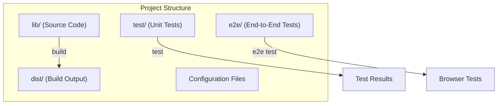
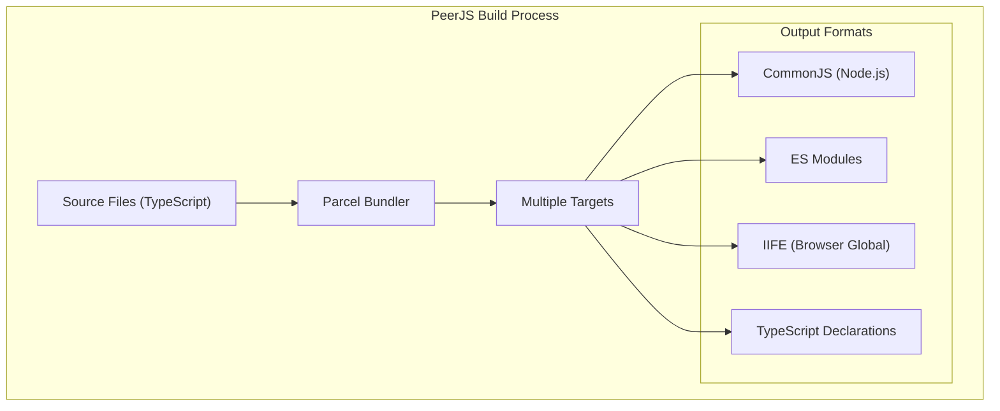
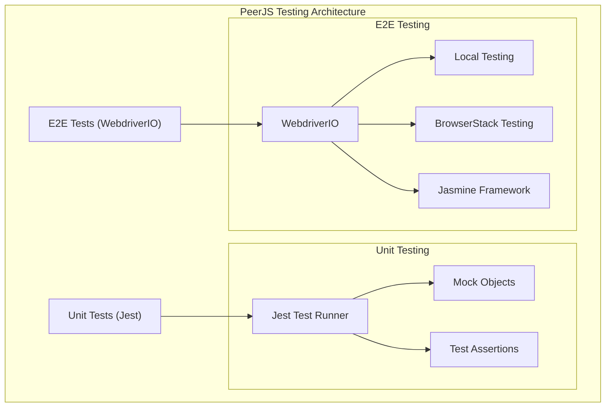
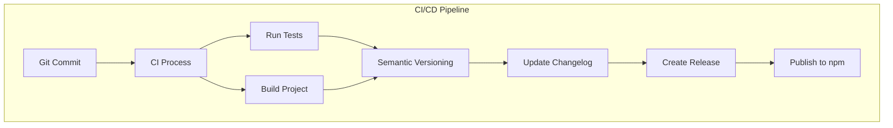
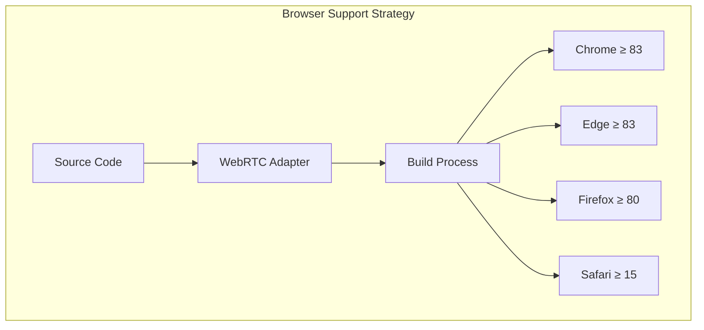

# Development

<details>
<summary>관련 소스 파일</summary>

이 위키 페이지를 생성하는 컨텍스트로 다음 파일들이 사용되었습니다:

- [.gitignore](.gitignore)
- [CHANGELOG.md](CHANGELOG.md)
- [package-lock.json](package-lock.json)
- [package.json](package.json)

</details>


이 페이지는 PeerJS 라이브러리에 기여하거나 이를 기반으로 개발하려는 개발자를 위한 종합 정보를 제공합니다. 개발 환경 설정, 빌드 과정, 테스트 전략, CI/CD 파이프라인을 다룹니다.

애플리케이션에서 PeerJS를 사용하는 방법은 [Installation and Usage](#1.1)를 참고하세요.

## 개발 환경 설정

PeerJS에 기여하려면 로컬 개발 환경을 설정해야 합니다. 이 프로젝트는 Node.js 버전 14 이상이 필요합니다.

### 사전 요구 사항

- Node.js (>= 14)
- npm (Node.js에 포함)
- Git

### 설치 단계

1. 저장소 클론:
   ```bash
   git clone https://github.com/peers/peerjs.git
   cd peerjs
   ```

2. 의존성 설치:
   ```bash
   npm install
   ```

3. 타입 검사를 실행하여 설정이 올바른지 확인:
   ```bash
   npm run check
   ```

Sources: [package.json:112-114](), [package.json:164-177]()

## 프로젝트 구조

PeerJS 프로젝트는 유지보수성과 관심사 분리를 중시하는 구조로 구성되어 있습니다.



### 주요 파일과 디렉터리

| Directory/File | Purpose |
|----------------|---------|
| `lib/` | PeerJS 라이브러리의 소스 코드 |
| `test/` | Jest 단위 테스트 |
| `e2e/` | WebdriverIO를 사용하는 end-to-end 테스트 |
| `dist/` | 생성된 빌드 파일 (버전 관리에는 포함되지 않음) |
| `package.json` | 프로젝트 설정 및 의존성 |
| `.gitignore` | 버전 관리에서 제외되는 파일 |

### 빌드 타깃

PeerJS는 다양한 사용 시나리오를 지원하기 위해 여러 빌드 출력을 생성합니다:

| Target | Purpose | Output File |
|--------|---------|-------------|
| `main` | Node.js용 CommonJS 번들 | `dist/bundler.cjs` |
| `module` | ES module 번들 | `dist/bundler.mjs` |
| `browser-minified` | 브라우저용 최소화 번들 | `dist/peerjs.min.js` |
| `browser-unminified` | 브라우저용 비최소화 번들 (디버깅용) | `dist/peerjs.js` |
| `browser-minified-msgpack` | MsgPack 직렬화기 번들 | `dist/serializer.msgpack.mjs` |
| `types` | TypeScript 선언 파일 | `dist/types.d.ts` |

Sources: [package.json:99-101](), [package.json:106-111](), [package.json:115-161]()

## 프로젝트 빌드

PeerJS는 빌드 도구로 [Parcel](https://parceljs.org/)을 사용합니다. Parcel은 설정이 거의 필요 없는 번들러로, 빌드 과정을 단순화합니다.

### 빌드 명령

- **전체 빌드**: 모든 배포 파일 생성
  ```bash
  npm run build
  ```

- **Watch 모드**: 변경이 감지되면 파일을 다시 빌드
  ```bash
  npm run watch
  ```

### 빌드 과정



빌드 과정은 TypeScript 코드를 트랜스파일하고, 의존성을 번들링하며, 다양한 환경에 맞는 최적화된 출력을 생성합니다. `package.json`의 구성은 Parcel이 적절한 번들을 생성할 수 있도록 여러 타깃 설정을 정의합니다.

Sources: [package.json:164-177](), [package.json:115-161]()

## 테스트

PeerJS는 코드 품질과 기능을 보장하기 위해 단위 테스트와 end-to-end 테스트를 모두 포함한 포괄적인 테스트 전략을 사용합니다.

### Jest를 이용한 단위 테스트

단위 테스트는 Jest로 작성되며, 개별 구성 요소를 격리된 상태에서 테스트하는 데 초점을 맞춥니다.

- **단위 테스트 실행**:
  ```bash
  npm test
  ```

- **단위 테스트 Watch 모드**:
  ```bash
  npm run test:watch
  ```

- **커버리지 리포트 생성**:
  ```bash
  npm run coverage
  ```

### End-to-End 테스트

End-to-end 테스트는 WebdriverIO를 사용해 구현되며, 실제 브라우저 환경에서 라이브러리가 올바르게 동작하는지 검증합니다.

- **로컬 E2E 테스트 실행**:
  ```bash
  npm run e2e
  ```

- **BrowserStack에서 E2E 테스트 실행**:
  ```bash
  npm run e2e:bstack
  ```

### 테스트 아키텍처



Sources: [package.json:169-172](), [package.json:175-176](), [package.json:186-204]()

## 코드 포맷팅과 품질

PeerJS는 포맷팅 도구로 Prettier를 사용해 코드 일관성을 유지합니다.

- **모든 파일 포맷팅**:
  ```bash
  npm run format
  ```

- **변경 없이 포맷 상태만 확인**:
  ```bash
  npm run format:check
  ```

Sources: [package.json:172-173]()

## 지속적 통합과 배포

PeerJS는 자동 테스트, 버전 관리, 릴리스를 위한 CI/CD 파이프라인을 사용합니다.

### 시맨틱 버저닝

이 프로젝트는 semantic-release로 관리되는 [Semantic Versioning](https://semver.org/) 원칙을 따릅니다:

- **Major version (X.0.0)**: 호환되지 않는 API 변경
- **Minor version (0.X.0)**: 하위 호환되는 기능 추가
- **Patch version (0.0.X)**: 하위 호환되는 버그 수정

### 릴리스 과정



릴리스 과정은 semantic-release를 사용해 자동화되며, 커밋 메시지를 기반으로 다음 버전 번호를 결정하고, `CHANGELOG.md` 파일을 업데이트하고, 패키지를 npm에 배포합니다.

Sources: [package.json:174](), [package.json:183-184](), [CHANGELOG.md:1-100]()

## 지원 브라우저와 환경

PeerJS는 WebRTC를 지원하는 최신 브라우저를 대상으로 합니다. 빌드 구성은 최소 브라우저 버전을 다음과 같이 지정합니다:

- Chrome ≥ 83
- Edge ≥ 83
- Firefox ≥ 80 (MsgPack 직렬화는 ≥ 102)
- Safari ≥ 15

이 버전 요구 사항은 라이브러리가 최신 WebRTC API를 사용할 수 있도록 하면서도 폭넓은 호환성을 유지하게 합니다.



라이브러리는 브라우저별 구현 차이에도 일관된 기능을 보장하기 위해 `webrtc-adapter`를 사용해 브라우저 간 WebRTC 동작을 정규화합니다.

Sources: [package.json:138-140](), [package.json:147-149](), [package.json:157-159](), [package.json:206-210]()

## 의존성

PeerJS는 런타임 의존성이 적어 라이브러리를 가볍게 유지할 수 있습니다:

| Dependency | Purpose |
|------------|---------|
| `@msgpack/msgpack` | 효율적인 바이너리 직렬화 형식 |
| `eventemitter3` | 이벤트 처리 구현 |
| `peerjs-js-binarypack` | 데이터 전송을 위한 바이너리 패킹 |
| `webrtc-adapter` | 브라우저 간 WebRTC API 정규화 |

Sources: [package.json:206-210]()

## 기여하기

PeerJS에 기여할 때는 다음 가이드라인을 따르세요:

1. **코드 스타일**: 제출 전에 `npm run format`을 실행해 코드 포맷을 맞추세요.
2. **타입 안정성**: TypeScript 타입 정의를 유지하고 `npm run check`로 검증하세요.
3. **테스트**: 새 기능에는 테스트를 추가하고 `npm test`로 전체 테스트 통과를 확인하세요.
4. **문서화**: 기능을 변경했다면 관련 문서를 함께 업데이트하세요.
5. **커밋 메시지**: 적절한 버전 관리를 위해 semantic commit message 형식을 따르세요.

Sources: [package.json:164-177]()
