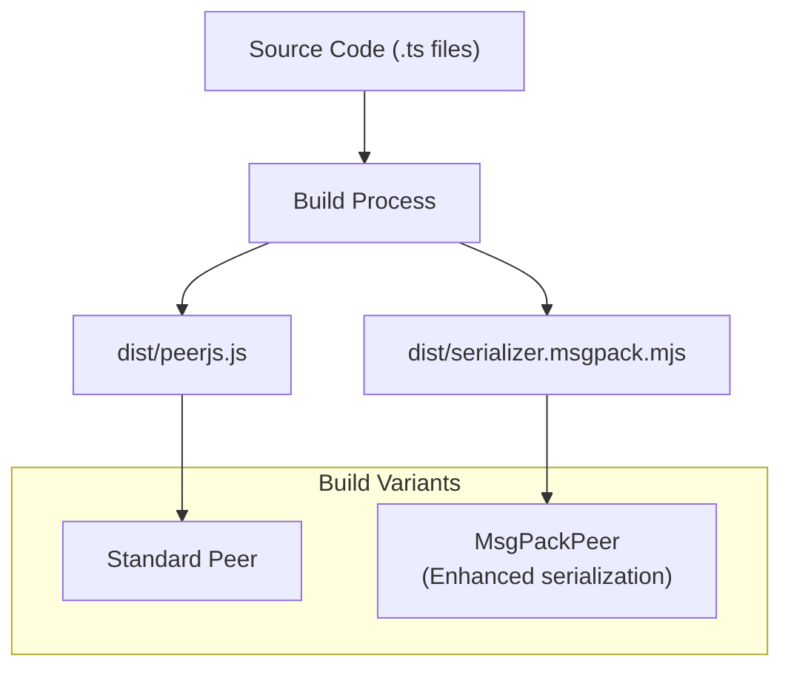
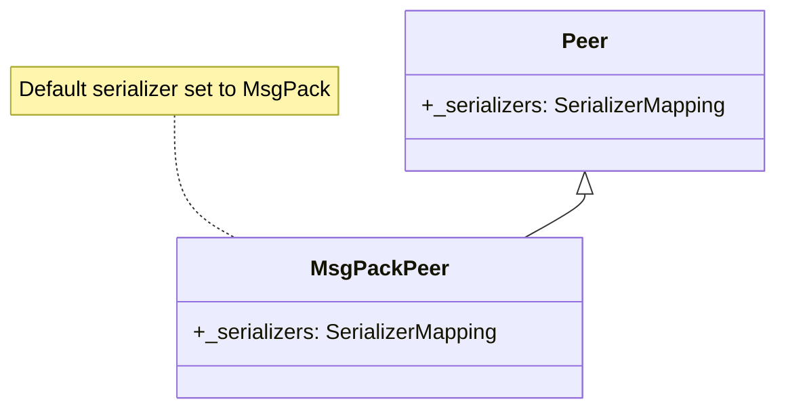
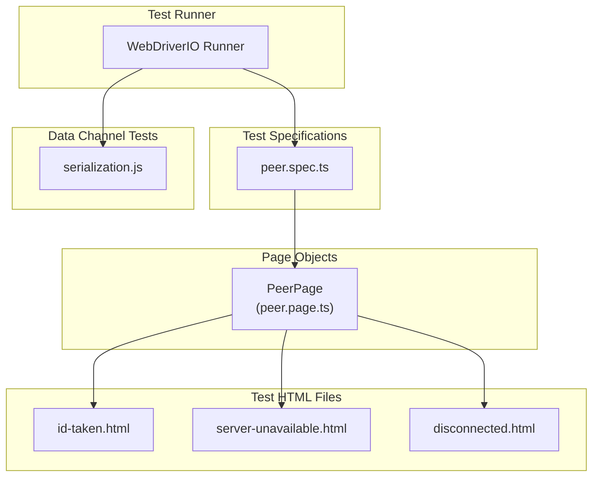
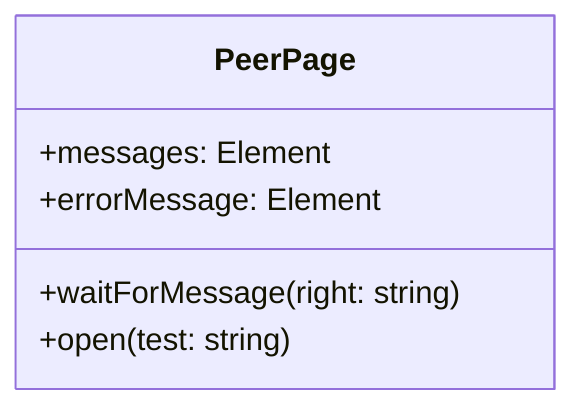
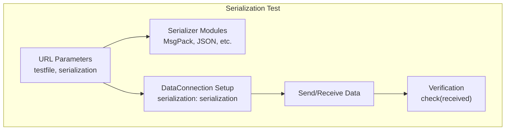
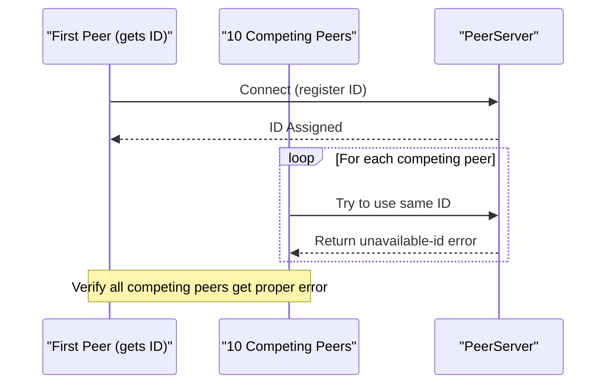

# Building and Testing

<details>
<summary>관련 소스 파일</summary>

이 위키 페이지를 생성하는 컨텍스트로 다음 파일들이 사용되었습니다:

- [e2e/datachannel/serialization.js](e2e/datachannel/serialization.js)
- [e2e/peer/disconnected.html](e2e/peer/disconnected.html)
- [e2e/peer/id-taken.html](e2e/peer/id-taken.html)
- [e2e/peer/peer.page.ts](e2e/peer/peer.page.ts)
- [e2e/peer/peer.spec.ts](e2e/peer/peer.spec.ts)
- [e2e/peer/server-unavailable.html](e2e/peer/server-unavailable.html)
- [lib/msgPackPeer.ts](lib/msgPackPeer.ts)

</details>


이 문서는 PeerJS 라이브러리를 소스 코드에서 빌드하는 방법과 기능 검증을 위해 테스트 스위트를 실행하는 방법을 설명합니다. 개발 환경 설정, 빌드 구성 옵션, 테스트 프레임워크 구현을 다룹니다.

지속적 통합 및 배포 과정에 대한 정보는 [CI/CD Pipeline](#5.2)를 참고하세요.

## 개발 환경

### 사전 요구 사항

PeerJS를 빌드하고 테스트하려면 다음이 필요합니다:

- Node.js 및 npm/yarn
- end-to-end 테스트용 웹 브라우저
- 저장소 클론용 Git

## PeerJS 빌드

PeerJS는 대체 직렬화 방식을 포함한 특수 변형 등 다양한 구성으로 빌드할 수 있습니다.

### 빌드 과정 개요



Sources: [lib/msgPackPeer.ts:1-13]()

### 직렬화 옵션

기본 PeerJS 라이브러리는 다양한 직렬화 방식을 지원합니다. `MsgPackPeer` 클래스에서 볼 수 있듯이, 대체 직렬화 구현을 사용하는 특수 빌드 변형도 제공됩니다:



Sources: [lib/msgPackPeer.ts:1-13]()

## 테스트 프레임워크

PeerJS는 실제 브라우저 환경에서 라이브러리 기능을 검증하는 end-to-end(E2E) 테스트를 위해 WebDriver.IO를 사용합니다.

### 테스트 아키텍처



Sources: [e2e/peer/peer.spec.ts:1-21](), [e2e/peer/peer.page.ts:1-30]()

### 테스트 케이스 구현

테스트는 Page Object Model 패턴을 사용하여 테스트 로직과 브라우저 상호작용 세부 사항을 분리합니다. `PeerPage` 클래스는 테스트 페이지와 상호작용하고 결과를 검증하는 메서드를 제공합니다:



Sources: [e2e/peer/peer.page.ts:5-29]()

### 테스트 시나리오

테스트 프레임워크는 몇 가지 핵심 시나리오를 다룹니다:

| Scenario | Test File | Purpose |
|----------|-----------|---------|
| ID Conflict | id-taken.html | 중복 peer ID 처리 검증 |
| Server Unavailability | server-unavailable.html | 시그널링 서버에 도달할 수 없을 때의 오류 처리 테스트 |
| Disconnection | disconnected.html | 서버 연결이 끊겼을 때의 동작 테스트 |
| Serialization | serialization.js | 서로 다른 직렬화 방식으로 데이터 전송 테스트 |

Sources: [e2e/peer/id-taken.html:1-59](), [e2e/peer/server-unavailable.html:1-32](), [e2e/peer/disconnected.html:1-37](), [e2e/datachannel/serialization.js:1-97]()

## 테스트 실행

### End-to-End 테스트

End-to-end 테스트는 `peer.spec.ts`에 정의되어 있으며, WebDriver.IO를 사용해 브라우저 테스트를 자동화합니다:

```typescript
describe("Peer", () => {
  it("should emit an error, when the ID is already taken", async () => {
    await P.open("id-taken");
    await P.waitForMessage("No ID takeover");
    expect(await P.errorMessage.getText()).toBe("");
  });
  // Additional tests...
});
```

Sources: [e2e/peer/peer.spec.ts:4-20]()

### 테스트 구성

테스트에는 환경 구성이 필요하며, 특히 테스트를 위해 보안 조치를 우회하는 데 사용되는 `BYPASS_WAF` 환경 변수가 필요합니다:

```typescript
const { BYPASS_WAF } = process.env;

class PeerPage {
  // ...
  async open(test: string) {
    await browser.url(`/e2e/peer/${test}.html?key=${BYPASS_WAF}`);
  }
}
```

Sources: [e2e/peer/peer.page.ts:3-26]()

## 직렬화 테스트

PeerJS 라이브러리에는 다양한 직렬화 방식에 대한 포괄적인 테스트가 포함되어 있습니다. 이 테스트는 서로 다른 직렬화 전략을 사용한 peer 연결 간 데이터 무결성을 검증합니다.



Sources: [e2e/datachannel/serialization.js:6-94]()

직렬화 테스트는 serializer 모듈을 동적으로 import하고 다양한 데이터 유형으로 테스트합니다:

```javascript
const { MsgPack } = await import("/dist/serializer.msgpack.mjs");
serializers = {
  MsgPack,
};
```

Sources: [e2e/datachannel/serialization.js:13-16]()

## ID 충돌 테스트

PeerJS 테스트에는 ID 충돌이 올바르게 처리되는지에 대한 검증이 포함되어 있습니다. 이 테스트는 이미 사용 중인 ID를 사용하려는 여러 peer를 생성하고, 적절한 오류를 받는지 검증합니다:



Sources: [e2e/peer/id-taken.html:25-55]()

## 서버 오류 테스트

테스트 프레임워크는 다음 상황에서 적절한 오류 처리를 검증합니다:

1. 서버를 사용할 수 없는 경우
   ```javascript
   new Peer({
     host: "thisserverwillneverexist.example.com",
   }).once(
     "error",
     (error) => void (messages.textContent = JSON.stringify(error)),
   );
   ```
   
2. 연결이 끊어진 경우
   ```javascript
   peer.once("open", (id) => {
     peer.disconnect();
     peer.connect("otherid");
   });
   ```

Sources: [e2e/peer/server-unavailable.html:22-28](), [e2e/peer/disconnected.html:30-33]()

## 테스트 자동화

WebDriver.IO 프레임워크는 테스트 과정을 자동화하여 다양한 브라우저와 시나리오에서 PeerJS 동작을 프로그래밍 방식으로 검증할 수 있게 합니다. 테스트 스위트는 다음과 관련된 문제를 포착하도록 설계되어 있습니다:

1. peer 연결 설정
2. 오류 처리
3. 데이터 전송 및 직렬화
4. 브라우저 호환성

Sources: [e2e/peer/peer.spec.ts:1-21]()
