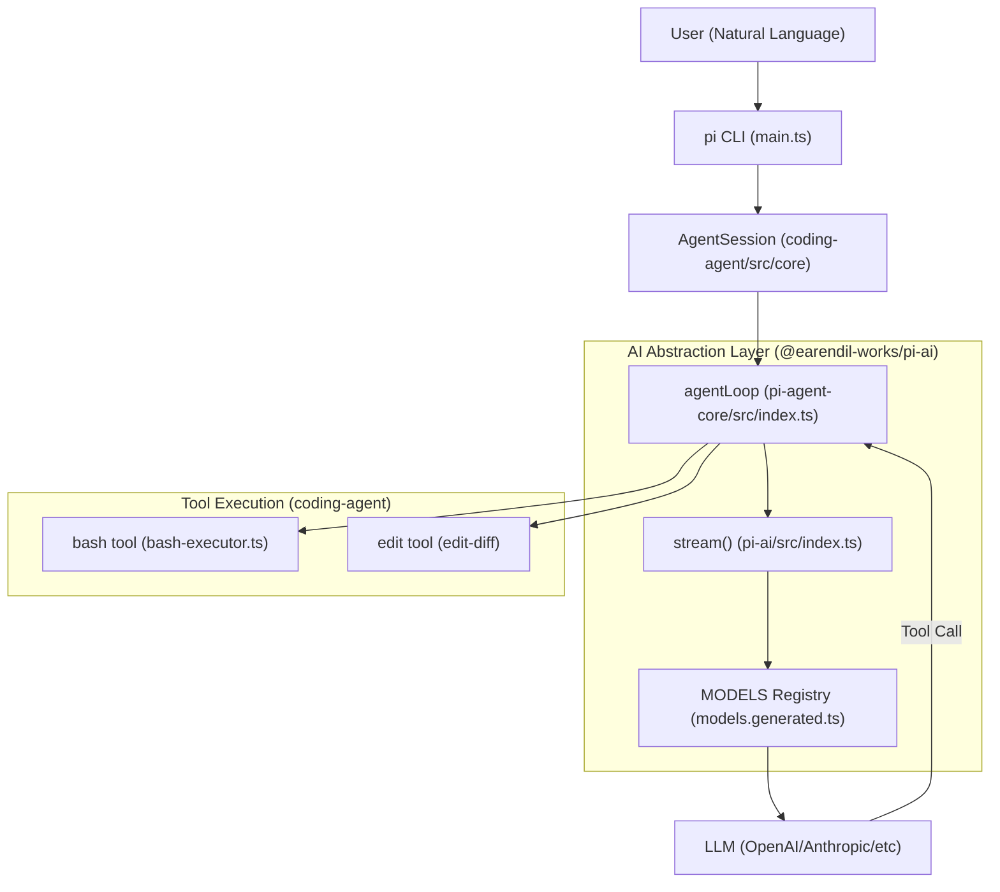
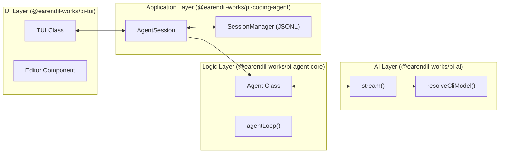

# 개요

관련 소스 파일

다음 파일들은 이 위키 페이지를 생성하기 위한 컨텍스트로 사용되었습니다.

- [AGENTS.md](AGENTS.md)
- [README.md](README.md)
- [package-lock.json](package-lock.json)
- [package.json](package.json)
- [packages/agent/CHANGELOG.md](packages/agent/CHANGELOG.md)
- [packages/agent/package.json](packages/agent/package.json)
- [packages/ai/CHANGELOG.md](packages/ai/CHANGELOG.md)
- [packages/ai/package.json](packages/ai/package.json)
- [packages/coding-agent/CHANGELOG.md](packages/coding-agent/CHANGELOG.md)
- [packages/coding-agent/README.md](packages/coding-agent/README.md)
- [packages/coding-agent/package.json](packages/coding-agent/package.json)
- [packages/coding-agent/src/cli/args.ts](packages/coding-agent/src/cli/args.ts)
- [packages/coding-agent/src/main.ts](packages/coding-agent/src/main.ts)
- [packages/coding-agent/test/args.test.ts](packages/coding-agent/test/args.test.ts)
- [packages/tui/CHANGELOG.md](packages/tui/CHANGELOG.md)
- [packages/tui/package.json](packages/tui/package.json)

`pi` 모노레포는 높은 확장성을 목표로 설계된 최소한의 터미널 코딩 하네스이자 AI 에이전트 프레임워크입니다. 개발자가 로컬 파일 시스템과 상호작용하고 셸 명령을 실행할 수 있는 자율 에이전트를 빌드, 실행, 임베드할 수 있게 합니다 [packages/coding-agent/package.json:4-4]().

이 프로젝트는 모듈식 아키텍처를 따르며, 핵심 에이전트 로직, LLM provider 추상화, 터미널 UI 컴포넌트를 서로 다른 재사용 가능한 패키지로 분리합니다. TypeScript 확장, skills, prompt templates를 통해 특정 워크플로에 맞게 조정할 수 있도록 설계되었습니다 [packages/coding-agent/README.md:20-22]().

### 패키지 아키텍처

이 모노레포는 npm workspaces를 사용해 다섯 개의 주요 패키지로 구성됩니다 [package-lock.json:10-17](). 각 패키지는 시스템의 특정 계층을 담당합니다.

| 패키지 | 목적 | 주요 코드 엔터티 |
|:---|:---|:---|
| `@earendil-works/pi-ai` | 통합 LLM provider 추상화 계층입니다. | `AssistantMessageEventStream`, `MODELS`, `streamSimple` |
| `@earendil-works/pi-agent-core` | 범용 에이전트 루프와 상태 관리입니다. | `Agent`, `agentLoop`, `AgentState` |
| `@earendil-works/pi-tui` | 차등 터미널 렌더링 엔진과 UI 컴포넌트입니다. | `TUI`, `Terminal`, `Editor`, `ProcessTerminal` |
| `@earendil-works/pi-coding-agent` | 메인 CLI 애플리케이션과 코딩 전용 도구입니다. | `AgentSession`, `SessionManager`, `createAgentSession` |
| `@earendil-works/pi-web-ui` | 임베딩을 위한 웹 기반 인터페이스 컴포넌트입니다. | `ChatPanel`, `AgentInterface` |

디렉터리 레이아웃과 빌드 파이프라인을 자세히 보려면 [Monorepo Structure and Build System](#1.2)을 참조하세요.

**출처:** [package-lock.json:10-17](), [packages/coding-agent/package.json:39-41](), [packages/agent/package.json:31-32](), [packages/ai/package.json:2-3](), [packages/tui/package.json:2-4]().

---

### 시스템 개념도

다음 다이어그램은 자연어 요청이 사용자로부터 여러 코드 엔터티를 거쳐 LLM에 도달하고, 최종적으로 로컬 시스템 도구를 실행하는 과정을 보여줍니다.

**요청 흐름: 사용자 입력에서 도구 실행까지**

**출처:** [packages/coding-agent/src/main.ts:1-6](), [packages/agent/package.json:3-4](), [packages/ai/package.json:63-65](), [packages/coding-agent/package.json:39-41]().

---

### 핵심 컴포넌트와 관계

`pi` 생태계는 **Agent Loop**, **Provider Abstraction**, **Terminal UI** 사이의 상호작용을 기반으로 구축됩니다.

#### 1. Agent Loop (`pi-agent-core`)
핵심 로직은 `@earendil-works/pi-agent-core`에 있습니다. 이 패키지는 대화 상태(`AgentState`)를 관리하고, LLM에 메시지를 보내고, 도구 호출을 파싱하며, 해당 도구를 실행하는 "turn" 생명주기를 조율합니다(`beforeToolCall`, `afterToolCall` 같은 hook 지원 포함) [packages/agent/CHANGELOG.md:155-184]().

#### 2. LLM Abstraction (`pi-ai`)
이 패키지는 여러 LLM provider(Anthropic, OpenAI, Google, Bedrock 등)를 위한 통합 인터페이스를 제공합니다. 스트리밍 응답, thinking/reasoning 블록, credential resolution의 복잡성을 처리합니다 [packages/ai/package.json:69-80](). 이를 통해 시스템의 나머지 부분은 provider에 종속되지 않을 수 있습니다.

#### 3. Terminal UI (`pi-tui`)
차등 렌더링을 사용해 터미널을 효율적으로 업데이트하는 커스텀 TUI 라이브러리입니다 [packages/tui/package.json:2-4](). 여러 줄 `Editor`와 `ProcessTerminal` 추상화를 포함해 `pi` CLI에서 볼 수 있는 인터랙티브 경험을 제공합니다 [packages/tui/CHANGELOG.md:130-131]().

#### 4. Coding Agent (`pi-coding-agent`)
이것은 기본 CLI 애플리케이션입니다. 핵심 루프와 함께 `read`, `write`, `edit`, `bash` 같은 코딩 전용 도구를 번들로 제공합니다 [packages/coding-agent/README.md:96-96](). 또한 JSONL 기반 구조를 사용해 영속 세션을 관리하고, branching과 compaction 같은 기능을 제공합니다 [packages/coding-agent/README.md:51-53]().

**시스템 컴포넌트 상호작용**

**출처:** [packages/coding-agent/package.json:39-41](), [packages/agent/CHANGELOG.md:155-184](), [packages/coding-agent/src/main.ts:31-41]().

---

### 주요 기능과 확장성

*   **다중 모드 실행**: Pi는 `interactive` 모드(TUI), `print`/`json` 모드(one-shot), `rpc` 모드(통합용), 그리고 임베딩을 위한 `SDK`로 실행됩니다 [packages/coding-agent/README.md:24-24]().
*   **세션 관리**: 컨텍스트 창 제한을 관리하기 위해 세션의 forking, cloning, 자동 compaction을 지원합니다 [packages/coding-agent/README.md:51-53]().
*   **확장 시스템**: 사용자는 `jiti`로 로드되는 TypeScript 확장을 통해 tools, slash commands, lifecycle hooks를 추가할 수 있습니다 [packages/coding-agent/package.json:50-50]().
*   **리소스 검색**: 에이전트 동작을 형성하기 위해 `AGENTS.md`나 `CLAUDE.md` 같은 컨텍스트 파일을 자동으로 검색합니다 [packages/coding-agent/README.md:55-55]().
*   **프로젝트 신뢰**: Pi에는 project-local settings 또는 packages를 로드하기 전에 확인을 요청하는 보안 계층이 포함되어 있습니다 [packages/coding-agent/CHANGELOG.md:51-53]().

CLI 설치와 첫 세션 실행 방법은 [Getting Started](#1.1)를 참조하세요.

**출처:** [packages/coding-agent/README.md:24-24](), [packages/coding-agent/package.json:50-50](), [AGENTS.md:1-25](), [packages/coding-agent/CHANGELOG.md:51-53]().
