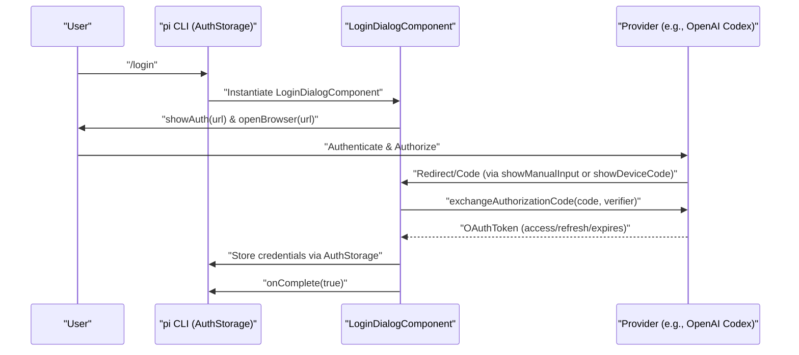
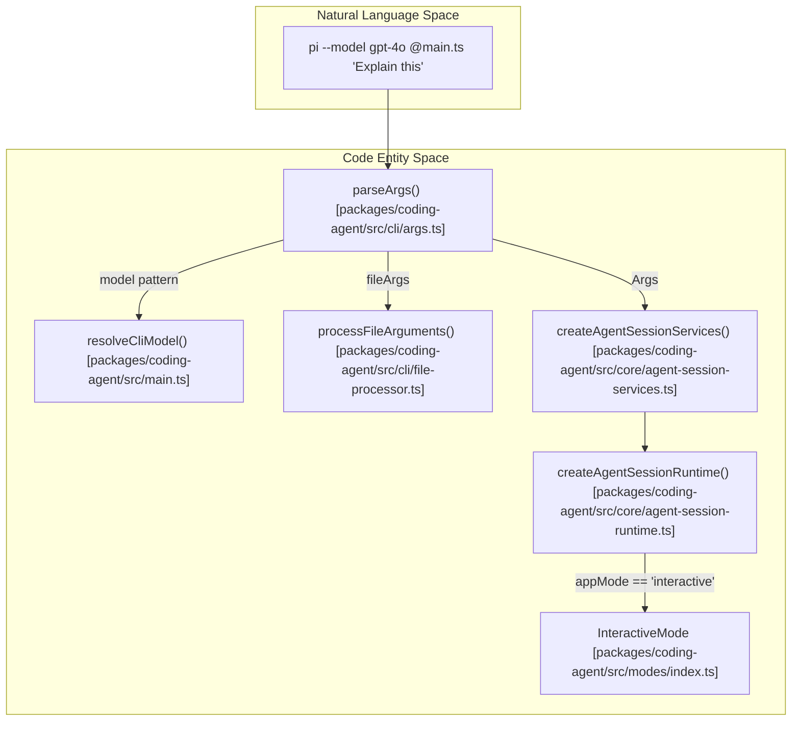

# 시작하기

<details>
<summary>관련 소스 파일</summary>

다음 파일들은 이 위키 페이지를 생성하기 위한 컨텍스트로 사용되었습니다.

- [AGENTS.md](AGENTS.md)
- [README.md](README.md)
- [package.json](package.json)
- [packages/ai/src/cli.ts](packages/ai/src/cli.ts)
- [packages/ai/src/utils/oauth/anthropic.ts](packages/ai/src/utils/oauth/anthropic.ts)
- [packages/ai/src/utils/oauth/device-code.ts](packages/ai/src/utils/oauth/device-code.ts)
- [packages/ai/src/utils/oauth/github-copilot.ts](packages/ai/src/utils/oauth/github-copilot.ts)
- [packages/ai/src/utils/oauth/index.ts](packages/ai/src/utils/oauth/index.ts)
- [packages/ai/src/utils/oauth/openai-codex.ts](packages/ai/src/utils/oauth/openai-codex.ts)
- [packages/ai/src/utils/oauth/types.ts](packages/ai/src/utils/oauth/types.ts)
- [packages/ai/test/github-copilot-oauth.test.ts](packages/ai/test/github-copilot-oauth.test.ts)
- [packages/ai/test/oauth-device-code.test.ts](packages/ai/test/oauth-device-code.test.ts)
- [packages/ai/test/openai-codex-oauth.test.ts](packages/ai/test/openai-codex-oauth.test.ts)
- [packages/coding-agent/README.md](packages/coding-agent/README.md)
- [packages/coding-agent/docs/containerization.md](packages/coding-agent/docs/containerization.md)
- [packages/coding-agent/docs/docs.json](packages/coding-agent/docs/docs.json)
- [packages/coding-agent/docs/index.md](packages/coding-agent/docs/index.md)
- [packages/coding-agent/docs/quickstart.md](packages/coding-agent/docs/quickstart.md)
- [packages/coding-agent/docs/security.md](packages/coding-agent/docs/security.md)
- [packages/coding-agent/docs/session-format.md](packages/coding-agent/docs/session-format.md)
- [packages/coding-agent/docs/sessions.md](packages/coding-agent/docs/sessions.md)
- [packages/coding-agent/docs/termux.md](packages/coding-agent/docs/termux.md)
- [packages/coding-agent/docs/usage.md](packages/coding-agent/docs/usage.md)
- [packages/coding-agent/examples/extensions/gondolin/.gitignore](packages/coding-agent/examples/extensions/gondolin/.gitignore)
- [packages/coding-agent/src/cli/args.ts](packages/coding-agent/src/cli/args.ts)
- [packages/coding-agent/src/cli/project-trust.ts](packages/coding-agent/src/cli/project-trust.ts)
- [packages/coding-agent/src/core/project-trust.ts](packages/coding-agent/src/core/project-trust.ts)
- [packages/coding-agent/src/main.ts](packages/coding-agent/src/main.ts)
- [packages/coding-agent/src/modes/interactive/components/login-dialog.ts](packages/coding-agent/src/modes/interactive/components/login-dialog.ts)
- [packages/coding-agent/src/utils/tools-manager.ts](packages/coding-agent/src/utils/tools-manager.ts)
- [packages/coding-agent/test/args.test.ts](packages/coding-agent/test/args.test.ts)
- [packages/coding-agent/test/startup-session-name.test.ts](packages/coding-agent/test/startup-session-name.test.ts)

</details>


이 페이지는 `pi` coding agent의 설치, 인증, 최초 실행 구성을 다룹니다. credential 관리와 세션 초기화 구현을 포함해, 초기 설정에서 인터랙티브 터미널 환경 실행으로 이어지는 과정을 자세히 설명합니다.

## 설치

`pi` coding agent는 npm 패키지로 배포되며, 전역으로 설치하거나 standalone 스크립트를 통해 설치할 수 있습니다.

```bash
# Standalone installation script
curl -fsSL https://pi.dev/install.sh | sh

# Global installation via npm
npm install -g --ignore-scripts @earendil-works/pi-coding-agent
```
`--ignore-scripts` 플래그는 설치 중 dependency lifecycle scripts를 비활성화하는 데 사용됩니다. `pi`는 일반적인 npm 설치에서 이를 필요로 하지 않기 때문입니다 [packages/coding-agent/README.md:71-74]().

### 플랫폼별 도구
최초 실행 중이거나 필요할 때, `pi`는 `ripgrep`(`rg`)과 `fd`에 최적화된 native binaries를 다운로드하려고 시도할 수 있습니다. `tools-manager.ts`의 `getToolPath` 함수는 `commandExists`를 사용해 시스템 PATH를 확인하는 fallback으로 넘어가기 전에 로컬 `~/.pi/bin` 디렉터리(`getBinDir()`로 가져옴)를 확인합니다 [packages/coding-agent/src/utils/tools-manager.ts:85-104]().

출처: [packages/coding-agent/README.md:68-80](), [packages/coding-agent/src/utils/tools-manager.ts:29-71](), [packages/coding-agent/src/utils/tools-manager.ts:8-10]()

## 인증

Pi는 두 가지 주요 인증 방식을 지원합니다: **API Keys**와 **OAuth Subscriptions**.

### 1. API Keys (Environment Variables)
직접 API 접근을 위해 pi는 표준 환경 변수를 찾습니다. 이미 provider keys가 있다면 가장 빠르게 시작할 수 있는 방법입니다.

```bash
export ANTHROPIC_API_KEY=sk-ant-...
export OPENAI_API_KEY=sk-...
pi
```
키 해석은 `pi-ai` 패키지가 처리하며, 이 패키지는 provider ID를 `GEMINI_API_KEY`나 `DEEPSEEK_API_KEY` 같은 특정 환경 변수에 매핑합니다 [packages/coding-agent/README.md:111-126]().

출처: [packages/coding-agent/README.md:81-87](), [packages/coding-agent/src/main.ts:9-10]()

### 2. Interactive Login (/login)
구독 사용자(Claude Pro/Max, ChatGPT Plus, GitHub Copilot)나 키를 디스크에 저장하기를 선호하는 사용자는 TUI 안에서 `/login` slash command를 통해 인증할 수 있습니다 [packages/coding-agent/README.md:106-109]().

```bash
pi
/login  # Then select provider
```

출처: [packages/coding-agent/README.md:89-94](), [packages/coding-agent/docs/usage.md:38-38]()

### Credential 저장과 해석
Credentials는 `AuthStorage` 클래스를 통해 관리할 수 있습니다 [packages/coding-agent/src/main.ts:26-26](). 

**해석 순서:**
1.  **CLI Flags**: `Args`에서 파싱되는 `--api-key` 같은 명시적 override [packages/coding-agent/src/cli/args.ts:91-92]().
2.  **Auth File**: 에이전트 구성 디렉터리에 저장된 credentials [packages/coding-agent/src/main.ts:18-18]().
3.  **Environment Variables**: 런타임에 확인되는 표준 키 [packages/coding-agent/README.md:81-85]().

### OAuth Flow 아키텍처
Pi는 CLI 환경에서 OAuth를 처리하기 위해 `LoginDialogComponent`를 통해 로컬 callback servers 또는 device code flows를 구현합니다 [packages/coding-agent/src/modes/interactive/components/login-dialog.ts:11-11]().

| Provider | 구현 모듈 | 기본 방식 |
| :--- | :--- | :--- |
| **OpenAI Codex** | `openai-codex.ts` | Browser Callback (`localhost:1455`) |
| **GitHub Copilot**| `github-copilot.ts` | Device Code Flow |

**데이터 흐름: OAuth 인증**

출처: [packages/coding-agent/src/modes/interactive/components/login-dialog.ts:11-43](), [packages/ai/src/utils/oauth/openai-codex.ts:31-40](), [packages/ai/src/utils/oauth/openai-codex.ts:154-174](), [packages/coding-agent/src/main.ts:26-26]()

## 최초 실행과 CLI 사용법

`main.ts` entry point는 CLI 인자 파싱을 처리하고 이를 세션 옵션으로 변환합니다 [packages/coding-agent/src/main.ts:1-6]().

### CLI 인자 구조
`parseArgs` 함수는 flags를 `Args` 객체로 처리합니다 [packages/coding-agent/src/cli/args.ts:63-69]().
*   **App Mode**: `resolveAppMode`에서 해석됩니다. `interactive`(기본값), `print`(`-p`), `json`, 또는 `rpc`가 될 수 있습니다 [packages/coding-agent/src/main.ts:98-109]().
*   **Model Selection**: `--thinking`을 통한 fuzzy matching과 thinking levels를 지원합니다 [packages/coding-agent/src/cli/args.ts:130-139]().
*   **Context**: `fileArgs`의 `@filename` 문법은 파일을 초기 prompt에 첨부합니다 [packages/coding-agent/src/cli/args.ts:186-187]().

### 세션 초기화
시작 시퀀스는 CLI 인자를 `AgentSessionRuntime`에 연결합니다.

**코드 엔터티 매핑: CLI에서 Runtime까지**

출처: [packages/coding-agent/src/main.ts:31-33](), [packages/coding-agent/src/cli/args.ts:63-69](), [packages/coding-agent/src/main.ts:119-138](), [packages/coding-agent/src/core/agent-session-runtime.ts:19-19]()

### 인터랙티브 환경
시작되면 TUI는 구조화된 터미널 인터페이스를 제공합니다.
1.  **Startup Header**: shortcuts, 로드된 `AGENTS.md` 파일, extensions를 보여줍니다 [packages/coding-agent/README.md:155-155]().
2.  **Messages**: `read`, `write`, `edit`, `bash` 도구 실행을 포함한 대화 기록입니다 [packages/coding-agent/README.md:156-156]().
3.  **Editor**: `@` fuzzy-search와 `!` bash 실행을 지원하는 여러 줄 입력입니다 [packages/coding-agent/README.md:162-171]().
4.  **Footer**: working directory, session name, token usage, active model을 표시합니다 [packages/coding-agent/README.md:158-158]().

### Project Trust
Pi는 악성 project-local extensions 또는 settings 실행을 방지하기 위해 project trust 시스템을 구현합니다 [packages/coding-agent/docs/usage.md:113-117]().
*   **Interactive**: 사용자에게 해당 폴더를 신뢰할지 묻습니다 [packages/coding-agent/src/cli/project-trust.ts:15-15]().
*   **Non-interactive**: settings의 `defaultProjectTrust` 또는 `--approve`/`-a` CLI flags로 제어됩니다 [packages/coding-agent/src/cli/args.ts:180-181]().

출처: [packages/coding-agent/README.md:149-180](), [packages/coding-agent/docs/usage.md:32-56](), [packages/coding-agent/docs/usage.md:113-126]()
