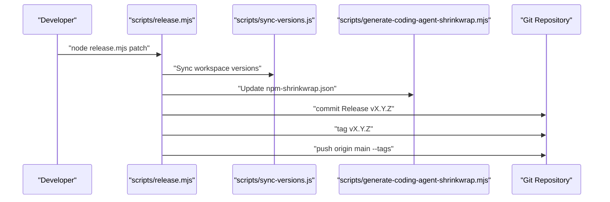

# CI/CD와 바이너리 배포

<details>
<summary>관련 소스 파일</summary>

다음 파일들은 이 위키 페이지를 생성하기 위한 컨텍스트로 사용되었습니다.

- [.github/workflows/build-binaries.yml](.github/workflows/build-binaries.yml)
- [.github/workflows/ci.yml](.github/workflows/ci.yml)
- [.github/workflows/npm-audit.yml](.github/workflows/npm-audit.yml)
- [.husky/pre-commit](.husky/pre-commit)
- [.npmrc](.npmrc)
- [LICENSE](LICENSE)
- [packages/coding-agent/src/utils/changelog.ts](packages/coding-agent/src/utils/changelog.ts)
- [packages/coding-agent/test/changelog.test.ts](packages/coding-agent/test/changelog.test.ts)
- [packages/tui/native/win32/prebuilds/win32-arm64/win32-console-mode.node](packages/tui/native/win32/prebuilds/win32-arm64/win32-console-mode.node)
- [packages/tui/native/win32/prebuilds/win32-x64/win32-console-mode.node](packages/tui/native/win32/prebuilds/win32-x64/win32-console-mode.node)
- [packages/tui/native/win32/src/win32-console-mode.c](packages/tui/native/win32/src/win32-console-mode.c)
- [scripts/build-binaries.sh](scripts/build-binaries.sh)
- [scripts/check-pinned-deps.mjs](scripts/check-pinned-deps.mjs)
- [scripts/check-ts-relative-imports.mjs](scripts/check-ts-relative-imports.mjs)
- [scripts/generate-coding-agent-shrinkwrap.mjs](scripts/generate-coding-agent-shrinkwrap.mjs)
- [scripts/local-release.mjs](scripts/local-release.mjs)
- [scripts/publish.mjs](scripts/publish.mjs)
- [scripts/release-notes.mjs](scripts/release-notes.mjs)
- [scripts/release.mjs](scripts/release.mjs)

</details>


이 페이지는 `pi` CLI 바이너리의 지속적 통합, 지속적 전달, 배포에 사용되는 자동화 인프라와 스크립트를 문서화한다. GitHub Actions workflow(`ci.yml`, `build-binaries.yml`), `bun compile`을 사용하는 크로스 플랫폼 빌드 프로세스, 플랫폼별 릴리스 archive 구조, `scripts/` 디렉터리의 주요 유틸리티 스크립트, lockstep versioning 정책을 자세히 설명한다.

---

## CI/CD Workflow 개요

프로젝트는 품질을 유지하고 production release를 처리하기 위해 두 가지 주요 GitHub Actions workflow를 사용한다.

### 지속적 통합(`ci.yml`)

- **트리거:** `main` 브랜치에 대한 모든 push 또는 pull request에서 실행 [[.github/workflows/ci.yml:3-7]]().
- **동시성:** 리소스를 절약하기 위해 같은 ref에서 진행 중인 run을 자동으로 취소 [[.github/workflows/ci.yml:9-11]]().
- **단계:**
  1. **코드 Checkout:** `actions/checkout@v4` 사용 [[.github/workflows/ci.yml:17-18]]().
  2. **Node.js 설정:** npm dependency 캐싱을 활성화하고 Node.js v22 설치 [[.github/workflows/ci.yml:20-24]]().
  3. **시스템 의존성 설치:** 이미지 처리와 터미널 UI 지원에 필요한 Linux 패키지(`libcairo2-dev`, `libpango1.0-dev`, `libjpeg-dev`, `libgif-dev`, `librsvg2-dev`, `fd-find`, `ripgrep`) 설치 [[.github/workflows/ci.yml:26-30]]().
  4. **NPM 의존성 설치:** 깨끗하고 재현 가능한 환경을 보장하기 위해 `npm ci --ignore-scripts` 실행 [[.github/workflows/ci.yml:33]]().
  5. **빌드 및 검사:** `npm run build`, `npm run check`(linting/types), `npm test` 실행 [[.github/workflows/ci.yml:35-42]]().

### 바이너리 배포(`build-binaries.yml`)

- **트리거:** `v*`와 일치하는 version tag push 또는 수동 `workflow_dispatch` [[.github/workflows/build-binaries.yml:3-16]]().
- **빌드 Job:** 
  - 크로스 플랫폼 컴파일을 실행하기 위해 Bun v1.3.10 사용 [[.github/workflows/build-binaries.yml:35-38]]().
  - executable 생성을 위해 `./scripts/build-binaries.sh` 호출 [[.github/workflows/build-binaries.yml:46-47]]().
  - `scripts/release-notes.mjs`를 사용해 `packages/coding-agent/CHANGELOG.md`에서 version별 release notes 추출 [[.github/workflows/build-binaries.yml:49-55]]().
  - GitHub Release를 생성하고 `.tar.gz`(macOS/Linux) 및 `.zip`(Windows) archive 업로드 [[.github/workflows/build-binaries.yml:56-84]]().
- **Publish NPM Job:** 
  - 빌드 성공 후 실행 [[.github/workflows/build-binaries.yml:86-88]]().
  - `git diff --exit-code`를 확인하여 모든 release artifact(예: 생성된 model)가 commit되었는지 검증 [[.github/workflows/build-binaries.yml:128-129]]().
  - npm registry로 trusted publishing을 수행하기 위해 `node scripts/publish.mjs` 실행 [[.github/workflows/build-binaries.yml:136-137]]().

**Release Workflow 데이터 흐름**

```mermaid
graph TD
    ["Push v* Tag"] --> ["actions/checkout"]
    ["actions/checkout"] --> ["Setup Node.js & Bun"]
    ["Setup Node.js & Bun"] --> ["Run build-binaries.sh"]
    ["Run build-binaries.sh"] --> ["bun build --compile"]
    ["bun build --compile"] --> ["Create .tar.gz / .zip archives"]
    ["Create .tar.gz / .zip archives"] --> ["release-notes.mjs extract"]
    ["release-notes.mjs extract"] --> ["GitHub Release create/upload"]
    ["GitHub Release create/upload"] --> ["node scripts/publish.mjs"]

    subgraph "Binary Creation"
        ["Run build-binaries.sh"]
        ["bun build --compile"]
        ["Create .tar.gz / .zip archives"]
    end
```

출처: [[.github/workflows/ci.yml:1-43]](), [[.github/workflows/build-binaries.yml:1-138]]()

---

## 바이너리 빌드 프로세스와 패키징

### `build-binaries.sh` 스크립트

`scripts/build-binaries.sh` shell script는 `pi` CLI의 로컬 및 CI 크로스 플랫폼 빌드를 조율한다 [[scripts/build-binaries.sh:1-5]]().

#### Native 의존성 관리
`npm ci`는 host platform용 optional dependency만 설치하므로, 이 스크립트는 `--force --ignore-scripts`를 사용해 모든 플랫폼별 `@mariozechner/clipboard` binding 설치를 수동으로 강제한다 [[scripts/build-binaries.sh:91-105]](). 이를 통해 크로스 플랫폼 archive에 패키징하는 데 필요한 모든 native library를 사용할 수 있게 한다.

#### Bun으로 컴파일
이 스크립트는 자체 완결형 executable을 생성하기 위해 `bun build --compile`을 사용한다.
- **Entrypoints:** 메인 CLI entry `./dist/bun/cli.js`와 `./src/utils/image-resize-worker.ts`를 entrypoint로 함께 전달한다. 이는 Bun이 최종 binary 안에 worker script를 임베드하는 데 필요하다 [[scripts/build-binaries.sh:137-140]]().
- **Targets:** `darwin-arm64`, `darwin-x64`, `linux-x64`, `linux-arm64`, `windows-x64`, `windows-arm64`를 대상으로 한다 [[scripts/build-binaries.sh:128]]().

#### Archive 구성
Release archive에는 컴파일된 binary와 임베드할 수 없는 필수 runtime assets가 포함된다.
- **WASM:** 이미지 처리를 위한 `photon_rs_bg.wasm` [[scripts/build-binaries.sh:150]]().
- **TUI Assets:** Theme JSON 파일과 UI assets [[scripts/build-binaries.sh:151-154]]().
- **Native Bindings:** 터미널 modifier(macOS)와 console mode(Windows)를 위한 플랫폼별 `.node` helper [[scripts/build-binaries.sh:183-195]]().
- **Sub-systems:** `export-html` 템플릿과 로직 [[scripts/build-binaries.sh:155]]().

**바이너리와 Runtime 엔티티 맵**

```mermaid
graph LR
    subgraph "Source Space"
        ["dist/bun/cli.js"]
        ["src/utils/image-resize-worker.ts"]
        ["native/win32/src/win32-console-mode.c"]
    end

    subgraph "Build Entity Space"
        ["pi executable (Bun Compiled)"]
        ["@mariozechner/clipboard-win32-x64-msvc"]
        ["win32-console-mode.node"]
        ["photon_rs_bg.wasm"]
    end

    ["dist/bun/cli.js"] & ["src/utils/image-resize-worker.ts"] --> ["pi executable (Bun Compiled)"]
    ["native/win32/src/win32-console-mode.c"] --> ["win32-console-mode.node"]
    ["pi executable (Bun Compiled)"] -.->|loads at runtime| ["photon_rs_bg.wasm"]
    ["pi executable (Bun Compiled)"] -.->|requires| ["@mariozechner/clipboard-win32-x64-msvc"]
    ["pi executable (Bun Compiled)"] -.->|requires| ["win32-console-mode.node"]
```

출처: [[scripts/build-binaries.sh:1-195]]()

---

## Lockstep Versioning과 릴리스 관리

모노레포는 lockstep versioning 정책을 적용한다. publish 가능한 모든 패키지는 정확히 같은 version number를 공유해야 한다.

### `release.mjs`

`scripts/release.mjs` 스크립트는 production release cycle을 자동화한다 [[scripts/release.mjs:1-19]]().
1. **Cleanliness Check:** `git status --porcelain`으로 commit되지 않은 변경이 있으면 중단한다 [[scripts/release.mjs:148-155]]().
2. **Version Bump:** `npm version`을 사용해 모든 workspace의 version을 업데이트하고 `scripts/sync-versions.js`를 실행한다 [[scripts/release.mjs:80-97]]().
3. **Changelog Promotion:** 모든 `CHANGELOG.md` 파일에서 `## [Unreleased]`를 새 version과 현재 날짜로 대체한다 [[scripts/release.mjs:107-126]]().
4. **Artifact Regeneration:** `generate-models`, `generate-image-models`, `shrinkwrap:coding-agent`를 실행한다 [[scripts/release.mjs:168-172]]().
5. **Tagging:** 변경을 commit하고 git tag(예: `v0.78.0`)를 생성한다 [[scripts/release.mjs:180-184]]().
6. **Next Cycle Prep:** `addUnreleasedSection()`을 통해 향후 작업을 위한 새로운 `[Unreleased]` 섹션을 changelog에 추가한다 [[scripts/release.mjs:128-143]]().

### `npm-shrinkwrap.json` 생성

`scripts/generate-coding-agent-shrinkwrap.mjs` 유틸리티는 `pi-coding-agent` 패키지를 위한 production-ready lockfile을 생성한다. 이 유틸리티는 다음을 수행한다.
- development dependency를 필터링한다 [[scripts/generate-coding-agent-shrinkwrap.mjs:79-82]]().
- 내부 workspace dependency(예: `@earendil-works/pi-ai`)를 registry tarball URL로 해석한다 [[scripts/generate-coding-agent-shrinkwrap.mjs:195-202]]().
- `resolved` 필드에 로컬 file/link path가 남아 있지 않은지 검증한다 [[scripts/generate-coding-agent-shrinkwrap.mjs:238-240]]().

### `release-notes.mjs`와 `changelog.ts`

프로젝트에는 배포용 changelog를 파싱하고 정규화하는 유틸리티가 포함되어 있다.
- **`normalizeChangelogLinks`:** 패키지 상대 Markdown link를 tag-pinned GitHub source link로 다시 작성한다 [[packages/coding-agent/src/utils/changelog.ts:100-105]]().
- **`extractChangelogSection`:** `release-notes.mjs`가 `CHANGELOG.md`에서 특정 version의 notes를 분리하는 데 사용한다 [[scripts/release-notes.mjs:134-147]]().

**Versioning과 Release 조율**



출처: [[scripts/release.mjs:1-204]](), [[scripts/generate-coding-agent-shrinkwrap.mjs:1-240]](), [[packages/coding-agent/src/utils/changelog.ts:1-197]](), [[scripts/release-notes.mjs:1-147]]()

---

## 로컬 릴리스 테스트(`local-release.mjs`)

npm에 push하지 않고 배포 프로세스를 검증하기 위해 개발자는 `scripts/local-release.mjs`를 사용한다.

- **격리:** 깨끗한 사용자 환경을 시뮬레이션하기 위해 repository 밖에 임시 디렉터리를 생성한다 [[scripts/local-release.mjs:105-118]]().
- **Tarball 생성:** `packPackage()`를 통해 모든 패키지에서 `npm pack`을 실행해 `.tgz` 파일을 생성한다 [[scripts/local-release.mjs:171-183]]().
- **Binary Simulation:** 현재 플랫폼에 대해 `build-binaries.sh`를 호출하고 로컬 빌드에 대한 `pi` shim 또는 symlink를 설정한다 [[scripts/local-release.mjs:134-169]]().

출처: [[scripts/local-release.mjs:1-209]]()

---

## Pre-commit 인프라

프로젝트는 코드가 commit되기 전에 quality gate를 적용하기 위해 Husky를 사용한다.

- **`check-lockfile-commit.mjs`:** 대응하는 `package.json` 변경 없이 `package-lock.json`이 실수로 commit되는 것을 방지한다 [[.husky/pre-commit:6]]().
- **`npm run check`:** formatting, linting, type checking을 실행한다 [[.husky/pre-commit:13]]().
- **Browser Smoke Check:** `packages/ai` 또는 `packages/web-ui`의 파일이 수정된 경우, `npm run check:browser-smoke`를 통해 browser environment smoke test를 트리거한다 [[.husky/pre-commit:19-36]]().
- **Relative Imports:** `scripts/check-ts-relative-imports.mjs`는 build system과의 호환성을 유지하기 위해 TypeScript relative import에서 `.js` extension을 금지한다 [[scripts/check-ts-relative-imports.mjs:70-74]]().

출처: [[.husky/pre-commit:1-46]](), [[scripts/check-ts-relative-imports.mjs:1-75]]()
