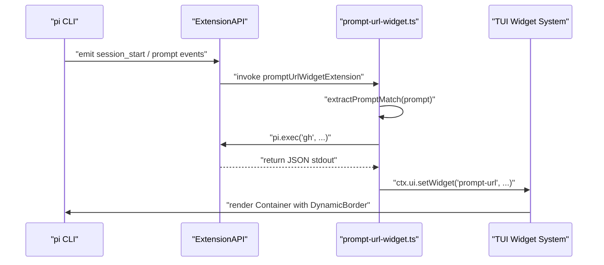

# 테스트 인프라

<details>
<summary>관련 소스 파일</summary>

다음 파일들은 이 위키 페이지를 생성하기 위한 컨텍스트로 사용되었습니다.

- [.pi/extensions/prompt-url-widget.ts](.pi/extensions/prompt-url-widget.ts)
- [packages/ai/test/abort.test.ts](packages/ai/test/abort.test.ts)
- [packages/ai/test/context-overflow.test.ts](packages/ai/test/context-overflow.test.ts)
- [packages/ai/test/empty.test.ts](packages/ai/test/empty.test.ts)
- [packages/ai/test/image-tool-result.test.ts](packages/ai/test/image-tool-result.test.ts)
- [packages/ai/test/stream.test.ts](packages/ai/test/stream.test.ts)
- [packages/ai/test/tokens.test.ts](packages/ai/test/tokens.test.ts)
- [packages/ai/test/tool-call-without-result.test.ts](packages/ai/test/tool-call-without-result.test.ts)
- [packages/ai/test/total-tokens.test.ts](packages/ai/test/total-tokens.test.ts)
- [packages/ai/test/unicode-surrogate.test.ts](packages/ai/test/unicode-surrogate.test.ts)
- [packages/coding-agent/docs/development.md](packages/coding-agent/docs/development.md)
- [packages/coding-agent/docs/images/doom-extension.png](packages/coding-agent/docs/images/doom-extension.png)
- [packages/coding-agent/docs/images/tree-view.png](packages/coding-agent/docs/images/tree-view.png)
- [packages/coding-agent/docs/json.md](packages/coding-agent/docs/json.md)
- [packages/coding-agent/test/agent-session-auto-compaction-queue.test.ts](packages/coding-agent/test/agent-session-auto-compaction-queue.test.ts)
- [packages/coding-agent/test/suite/agent-session-bash-persistence.test.ts](packages/coding-agent/test/suite/agent-session-bash-persistence.test.ts)
- [packages/coding-agent/test/suite/agent-session-compaction.test.ts](packages/coding-agent/test/suite/agent-session-compaction.test.ts)
- [packages/coding-agent/test/suite/agent-session-model-extension.test.ts](packages/coding-agent/test/suite/agent-session-model-extension.test.ts)
- [packages/coding-agent/test/suite/agent-session-prompt.test.ts](packages/coding-agent/test/suite/agent-session-prompt.test.ts)
- [packages/coding-agent/test/suite/agent-session-retry-events.test.ts](packages/coding-agent/test/suite/agent-session-retry-events.test.ts)
- [packages/coding-agent/test/suite/regressions/1717-2113-agent-session-event-settlement.test.ts](packages/coding-agent/test/suite/regressions/1717-2113-agent-session-event-settlement.test.ts)
- [packages/coding-agent/test/suite/regressions/2023-queued-slash-command-followup.test.ts](packages/coding-agent/test/suite/regressions/2023-queued-slash-command-followup.test.ts)
- [pi-test.sh](pi-test.sh)
- [test.sh](test.sh)

</details>


`pi` 모노레포는 모듈형 패키지 전반의 견고성을 보장하도록 설계된 포괄적인 테스트 인프라를 사용한다. 이 인프라는 세밀한 단위 테스트부터 실제 Large Language Model(LLM) provider와 상호작용하는 전체 end-to-end(E2E) 통합 테스트까지 포괄한다. 테스트 프레임워크는 AI 추상화, 에이전트 오케스트레이션, 세션 생명주기, 터미널 UI 동작을 검증하는 계층형 접근을 지원한다.

## 테스트 스위트 구성

### 테스트 Runner와 핵심 스크립트

- **Vitest**는 빠른 실행과 원활한 TypeScript/ESM 지원 때문에 기본 test runner로 사용된다 [packages/ai/test/stream.test.ts:6]().
- **`test.sh`**: 패키지 전반의 전체 테스트 스위트를 실행하는 root-level script. 로컬 `auth.json`을 백업하고 민감한 API 키를 unset하여 테스트가 제어된 환경에서 실행되도록 하는 방식으로 환경 안전성을 처리한다 [test.sh:1-77]().
- **`pi-test.sh`**: `coding-agent` CLI 주변의 wrapper로, 개발자가 `--no-env` 같은 옵션으로 API 키를 비워 offline/local 동작을 강제하면서 테스트를 모방하는 에이전트 run을 호출할 수 있게 한다 [pi-test.sh:7-57]().

### 테스트 유형과 위치

| 범주           | 위치                             | 초점                                                                                      |
|--------------------|------------------------------------|--------------------------------------------------------------------------------------------|
| **Unit Tests**      | `packages/*/src/**/*.test.ts`      | 개별 함수, 클래스, 유틸리티 테스트.                                     |
| **Integration Tests** | `packages/coding-agent/test/suite/` | `AgentSession` 생명주기, 명령 큐잉, 지속성, 압축에 초점을 둔 테스트. |
| **Provider E2E**   | `packages/ai/test/`                 | 통합 AI 추상화 API를 통해 다양한 LLM provider에 대해 수행하는 실제 상호작용 테스트.   |

### Agent Session 테스트 유틸리티

- `packages/coding-agent/test/suite/` 아래에 위치한다.
- 큐잉, bash 지속성, 압축, 이벤트 settlement를 위한 regression test 같은 `AgentSession` 동작을 다룬다.
- **Auto-Compaction Queue**: `AgentSession`이 context overflow 또는 threshold trigger 이후 올바르게 재개하고 재시도하는지, 무한 compaction loop에 빠지지 않는지 구체적으로 테스트한다 [packages/coding-agent/test/agent-session-auto-compaction-queue.test.ts:56-178]().

**다이어그램: 테스트 스위트 구성과 흐름**

```mermaid
graph TD
  "VitestRunner"["Vitest Runner"]
  "RootScripts"["test.sh, pi-test.sh"]

  "VitestRunner" --> "UnitTests"["Unit Tests\n(packages/*/src/**/*.test.ts)"]
  "VitestRunner" --> "IntegrationTests"["Integration Tests\n(packages/coding-agent/test/suite/)"]
  "VitestRunner" --> "ProviderE2ETests"["Provider E2E Tests\n(packages/ai/test/)"]

  "RootScripts" --> "VitestRunner"

  "IntegrationTests" --> "AgentSessionUtils"["AgentSession Test Utilities"]
  "IntegrationTests" --> "AutoCompaction"["AgentSession auto-compaction queue"]
```

출처: [pi-test.sh:1-58](), [test.sh:1-77](), [packages/coding-agent/test/agent-session-auto-compaction-queue.test.ts:56-178](), [packages/ai/test/stream.test.ts:6]()

---

## LLM Provider E2E 테스트

`@mariozechner/pi-ai` 패키지는 여러 실제 LLM provider 전반에서 AI 추상화 계층을 검증하기 위한 광범위한 스위트를 포함한다. 이 테스트들은 통합 streaming API, tool call 처리, prompt transformation, provider 간 상호운용성을 실행해 검증한다.

### 주요 E2E 테스트 파일과 함수

- **`stream.test.ts`**: `basicTextGeneration` [packages/ai/test/stream.test.ts:47-74](), `handleToolCall` [packages/ai/test/stream.test.ts:76-152](), `handleStreaming` [packages/ai/test/stream.test.ts:154-182]()을 포함한 streaming API의 핵심 종합 테스트.
- **`image-tool-result.test.ts`**: 이미지(또는 텍스트/이미지 혼합)를 포함하는 도구 결과가 LLM에 올바르게 전달되고 이해되는지 검증한다 [packages/ai/test/image-tool-result.test.ts:30-109]().
- **`total-tokens.test.ts`**: 보고된 token usage가 provider 전반에서 input, output, cache read/write token의 합과 일치하는지 검증한다 [packages/ai/test/total-tokens.test.ts:96-99]().

### Provider Edge Case 테스트

- **Context Overflow**: 입력 길이가 model의 context window를 초과할 때 provider가 error stop reason과 식별 가능한 message pattern으로 예측 가능하게 응답하는지 보장한다. `isContextOverflow()` helper를 사용해 검증한다 [packages/ai/test/context-overflow.test.ts:1-12]().
- **Abort Signal Behavior**: mid-stream에서 abort하면 generation이 올바르게 종료되고 token usage가 그에 맞게 업데이트되는지 테스트한다 [packages/ai/test/abort.test.ts:15-57](). 일부 provider(Anthropic/Google 등)는 usage를 일찍 보내는 반면, 다른 provider는 최종 chunk에서만 보낸다 [packages/ai/test/tokens.test.ts:52-84]().
- **Empty Messages**: 메시지에 빈 배열, 빈 문자열, 공백만 있는 문자열이 포함될 때 안정성을 검증하여 crash를 방지한다 [packages/ai/test/empty.test.ts:21-145]().
- **Unicode and Surrogate Pair Handling**: 도구 결과에 emoji 또는 Basic Multilingual Plane 밖의 문자가 포함될 때 "no low surrogate in string" 오류를 방지한다 [packages/ai/test/unicode-surrogate.test.ts:25-210]().
- **Tool Calls Without Results**: 도구 호출이 abort되거나 cancel된 시나리오를 시뮬레이션하여 provider 계층이 orphaned call을 필터링하고 API error를 방지하는지 보장한다 [packages/ai/test/tool-call-without-result.test.ts:62-92]().

### Provider E2E 테스트 아키텍처

```mermaid
graph TD
    subgraph "Test_Suite_Vitest"
        "StreamTest"["stream.test.ts"]
        "ContextOverflowTest"["context-overflow.test.ts"]
        "AbortTest"["abort.test.ts"]
        "EmptyMessageTest"["empty.test.ts"]
        "UnicodeTest"["unicode-surrogate.test.ts"]
        "ToolCallWithoutResultTest"["tool-call-without-result.test.ts"]
        "TotalTokensTest"["total-tokens.test.ts"]
        "ImageToolTest"["image-tool-result.test.ts"]
    end

    subgraph "pi_ai_Code_Entities"
        "StreamAPI"["stream() / complete()"]
        "OverflowCheck"["isContextOverflow()"]
        "TokenUsage"["usage.totalTokens"]
    end

    subgraph "External_API_Space"
        "OpenAIAPI"["OpenAI API"]
        "AnthropicAPI"["Anthropic API"]
        "GoogleGeminiAPI"["Google Gemini API"]
    end

    "StreamTest" --> "StreamAPI"
    "ContextOverflowTest" --> "OverflowCheck"
    "AbortTest" --> "StreamAPI"
    "EmptyMessageTest" --> "StreamAPI"
    "UnicodeTest" --> "StreamAPI"
    "ToolCallWithoutResultTest" --> "StreamAPI"
    "TotalTokensTest" --> "TokenUsage"
    "ImageToolTest" --> "StreamAPI"
    "StreamAPI" -.-> "OpenAIAPI"
    "StreamAPI" -.-> "AnthropicAPI"
    "StreamAPI" -.-> "GoogleGeminiAPI"
```

출처: [packages/ai/test/context-overflow.test.ts:1-12](), [packages/ai/test/abort.test.ts:15-57](), [packages/ai/test/empty.test.ts:21-145](), [packages/ai/test/unicode-surrogate.test.ts:25-210](), [packages/ai/test/tool-call-without-result.test.ts:62-92](), [packages/ai/test/total-tokens.test.ts:1-124](), [packages/ai/test/image-tool-result.test.ts:30-109]()

---

## Agent Session 통합 테스트

통합 테스트는 에이전트 컴포넌트의 조율, 세션 생명주기 이벤트, 명령 실행 순서에 중점을 둔다.

### AgentSession 핵심 테스트

- **Command Queuing**: race condition을 피하기 위해 `prompt()`와 `steer()` 호출에서 나온 promise가 올바르게 queue되고 serialize되는지 보장한다.
- **Auto-Compaction Logic**: `_runAutoCompaction`과 `_checkCompaction` 내부 메서드를 테스트하여 세션이 핵심 상태를 잃지 않으면서 context limit 안에 유지되는지 보장한다 [packages/coding-agent/test/agent-session-auto-compaction-queue.test.ts:114-178]().
- **Resumption**: queued message가 있을 때 threshold compaction 이후 에이전트가 올바르게 재개하는지 검증한다 [packages/coding-agent/test/agent-session-auto-compaction-queue.test.ts:100-123]().

---

## .pi/의 개발 확장과 프롬프트

활발한 개발 중 `.pi/` 디렉터리는 테스트와 디버깅 workflow를 보강하는 프로젝트 로컬 확장과 프롬프트 템플릿을 제공한다.

### 로컬 확장: prompt-url-widget.ts

- **목적**: regex pattern을 사용해 사용자 prompt 안의 GitHub Pull Request(PR), Issue, Advisory URL을 감지한다 [\.pi/extensions/prompt-url-widget.ts:7-9]().
- **구현**: 
  - 외부 `gh` CLI를 통해 metadata(title, author)를 가져온다 [\.pi/extensions/prompt-url-widget.ts:122-160]().
  - extension API `ctx.ui.setWidget()`을 사용해 `DynamicBorder`와 `Text` 컴포넌트로 PR 세부 정보를 표시하는 rich TUI widget을 렌더링한다 [\.pi/extensions/prompt-url-widget.ts:173-192]().
  - 가져온 metadata를 기반으로 세션 이름을 자동으로 업데이트한다 [\.pi/extensions/prompt-url-widget.ts:194-209]().

### 로컬 확장 이벤트 처리의 데이터 흐름



출처: [\.pi/extensions/prompt-url-widget.ts:1-215]()

---

## Token Usage와 비용 검증

`total-tokens.test.ts` 스위트는 prompt caching과 usage reporting에 중요한 정확한 token accounting을 검증한다.

- `usage.totalTokens`가 구성 요소 count의 합인 `input + output + cacheRead + cacheWrite`와 같은지 assert한다 [packages/ai/test/total-tokens.test.ts:96-99]().
- `LONG_SYSTEM_PROMPT`로 cache usage를 트리거하고 Anthropic 및 OpenAI 같은 provider가 cache activity를 올바르게 보고하는지 확인한다 [packages/ai/test/total-tokens.test.ts:36-85]().
- **Abort Logic**: 일부 provider(OpenAI, Bedrock 등)는 mid-stream에서 abort될 때 0 token을 보고하는 반면, 다른 provider(Anthropic, Google 등)는 partial usage를 보고하는지 검증한다 [packages/ai/test/tokens.test.ts:52-84]().

### 테스트의 예시 Logging

```ts
function logUsage(label: string, usage: Usage) {
	const computed = usage.input + usage.output + usage.cacheRead + usage.cacheWrite;
	console.log(`  ${label}:`);
	console.log(`    input: ${usage.input}, output: ${usage.output}, cacheRead: ${usage.cacheRead}, cacheWrite: ${usage.cacheWrite}`);
	console.log(`    totalTokens: ${usage.totalTokens}, computed: ${computed}`);
}
```

출처: [packages/ai/test/total-tokens.test.ts:87-94](), [packages/ai/test/tokens.test.ts:21-84]()

---

# 요약

`pi`의 테스트 인프라는 다층 전략을 중심으로 구성되어 있다.

- **Unit tests**는 내부 코드의 정확성을 보장한다.
- **Integration tests**는 `AgentSession` 생명주기와 auto-compaction 복구를 검증한다.
- **Provider E2E tests**는 여러 외부 LLM API 전반의 실제 streaming, tool call, 이미지 처리, token accounting을 검증한다.
- **Local Extensions**는 `.pi/` 안에서 개발 중 개발자 경험을 향상하기 위해 `ExtensionAPI`와 TUI 시스템을 사용하는 방법을 보여준다.

이 견고한 접근은 진화하는 LLM provider API와 복잡한 에이전트 상태 전환에 적응할 수 있다는 신뢰를 제공한다.

출처: [packages/ai/test/context-overflow.test.ts:1-12](), [packages/coding-agent/test/agent-session-auto-compaction-queue.test.ts:56-123](), [\.pi/extensions/prompt-url-widget.ts:173-192]()
