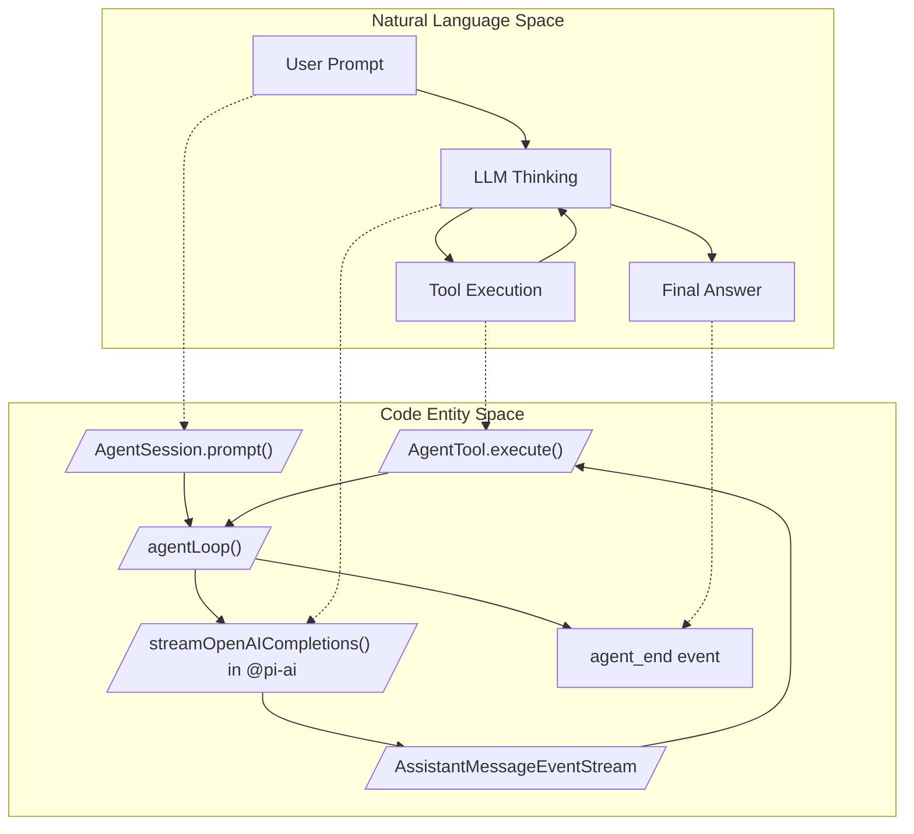
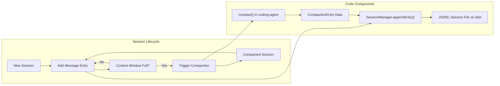

# 용어집

관련 소스 파일

다음 파일들은 이 위키 페이지를 생성하기 위한 컨텍스트로 사용되었습니다.

- [AGENTS.md](AGENTS.md)
- [README.md](README.md)
- [package.json](package.json)
- [packages/agent/CHANGELOG.md](packages/agent/CHANGELOG.md)
- [packages/ai/CHANGELOG.md](packages/ai/CHANGELOG.md)
- [packages/ai/scripts/generate-models.ts](packages/ai/scripts/generate-models.ts)
- [packages/ai/src/env-api-keys.ts](packages/ai/src/env-api-keys.ts)
- [packages/ai/src/models.generated.ts](packages/ai/src/models.generated.ts)
- [packages/coding-agent/CHANGELOG.md](packages/coding-agent/CHANGELOG.md)
- [packages/coding-agent/README.md](packages/coding-agent/README.md)
- [packages/coding-agent/docs/extensions.md](packages/coding-agent/docs/extensions.md)
- [packages/coding-agent/docs/providers.md](packages/coding-agent/docs/providers.md)
- [packages/coding-agent/examples/extensions/README.md](packages/coding-agent/examples/extensions/README.md)
- [packages/coding-agent/src/cli/args.ts](packages/coding-agent/src/cli/args.ts)
- [packages/coding-agent/src/core/extensions/index.ts](packages/coding-agent/src/core/extensions/index.ts)
- [packages/coding-agent/src/core/extensions/loader.ts](packages/coding-agent/src/core/extensions/loader.ts)
- [packages/coding-agent/src/core/extensions/runner.ts](packages/coding-agent/src/core/extensions/runner.ts)
- [packages/coding-agent/src/core/extensions/types.ts](packages/coding-agent/src/core/extensions/types.ts)
- [packages/coding-agent/src/core/model-resolver.ts](packages/coding-agent/src/core/model-resolver.ts)
- [packages/coding-agent/src/index.ts](packages/coding-agent/src/index.ts)
- [packages/coding-agent/src/main.ts](packages/coding-agent/src/main.ts)
- [packages/coding-agent/test/args.test.ts](packages/coding-agent/test/args.test.ts)
- [packages/coding-agent/test/extensions-runner.test.ts](packages/coding-agent/test/extensions-runner.test.ts)
- [packages/coding-agent/test/model-resolver.test.ts](packages/coding-agent/test/model-resolver.test.ts)
- [packages/tui/CHANGELOG.md](packages/tui/CHANGELOG.md)
- [packages/tui/src/components/editor.ts](packages/tui/src/components/editor.ts)
- [packages/tui/src/components/input.ts](packages/tui/src/components/input.ts)
- [packages/tui/src/kill-ring.ts](packages/tui/src/kill-ring.ts)
- [packages/tui/src/undo-stack.ts](packages/tui/src/undo-stack.ts)
- [packages/tui/src/word-navigation.ts](packages/tui/src/word-navigation.ts)
- [packages/tui/test/editor.test.ts](packages/tui/test/editor.test.ts)
- [packages/tui/test/input.test.ts](packages/tui/test/input.test.ts)
- [packages/tui/test/word-navigation.test.ts](packages/tui/test/word-navigation.test.ts)

이 페이지는 `pi` 모노레포 전반에서 사용되는 코드베이스 고유 용어, 약어, 도메인 개념의 정의를 제공한다. 온보딩 엔지니어가 자연어 개념과 코드 구현 사이의 관계를 이해하기 위한 기술 참조 역할을 한다.

---

## 핵심 도메인 개념

### Agent Loop
LLM(Large Language Model)에 응답과 도구 호출을 요청하는 기본 실행 주기이다. 이 loop는 대화 턴을 관리하며, assistant의 thinking과 작업 완료를 위한 외부 도구 호출을 번갈아 수행한다.

- **구현 세부 사항**:  
  `agentLoop` 함수는 대화가 진행됨에 따라 `AgentState` 업데이트를 관리하며 생명주기를 조율한다. 순차 및 병렬 도구 실행 모드를 모두 지원한다. 도구 실행이 완료되면 loop는 결과를 수집하고 새 assistant 메시지 스트리밍을 계속한다.  
- **주요 클래스와 함수**:  
  - `Agent`: LLM 에이전트를 나타내는 핵심 클래스이며, 상태와 실행 로직을 캡슐화한다 [packages/agent/src/agent.ts:1-100]().  
  - `agentLoop`: LLM 및 도구와의 상호작용을 제어하는 주요 비동기 loop [packages/agent/src/agent-loop.ts:1-100]().  
  - `agent_end`, `tool_execution_start`, `tool_execution_end` 같은 이벤트는 여러 생명주기 단계를 신호한다 [packages/agent/src/types.ts:10-50]().  
- **Graceful Exits**:  
  loop 구성은 queued message를 polling하기 전에 우아하게 종료할 수 있도록 `shouldStopAfterTurn`을 지원한다 [packages/agent/CHANGELOG.md:77-79]().

### AgentSession
전체 대화형 세션 생명주기를 관리하는 상위 수준 추상화이다. 저수준 `Agent`를 감싸고 세션 지속성, 도구 집합, extended thinking(reasoning effort), branching, extension binding을 통합한다.

- **역할**:  
  `AgentSession`은 사용자 프롬프트, 에이전트 턴, 도구 호출, JSONL 세션 파일로의 상태 지속성, 대화 크기 제한을 위한 compaction을 조율한다 [packages/coding-agent/src/core/agent-session.ts:1-15](). `prompt()`, `steer()`, `followUp()` 같은 메서드를 노출한다 [packages/coding-agent/src/core/agent-session.ts:157-187]().  
- **주요 기능**:  
  - 세션 트리 구조(messages, branches, parents)를 유지한다 [packages/coding-agent/src/core/session-manager.ts:80-100]().  
  - model과 thinking level 변경을 관리한다 [packages/coding-agent/src/core/agent-session.ts:137-138]().  
  - `executeBash`를 통해 세션 내 bash 명령 실행을 지원한다 [packages/coding-agent/src/core/agent-session.ts:41-41]().  
- **코드 참조**:  
  - 핵심 클래스와 세션 생명주기: [packages/coding-agent/src/core/agent-session.ts:1-185]()  
  - 관련 type과 이벤트 정의: [packages/coding-agent/src/core/agent-session.ts:124-149]()  

### Compaction
LLM의 context window 제약 안에 맞추기 위해 대화 세션의 오래된 부분을 요약하거나 제거하는 프로세스이다.

- **구현**:  
  `AgentSession`은 세션 메시지 히스토리가 너무 커지는 시점을 감지하고 compaction을 트리거한다 [packages/coding-agent/src/core/agent-session.ts:136-146](). 시스템은 중요한 정보를 보존하면서 context 크기를 줄이기 위해 요약과 pruning 전략을 사용한다 [packages/coding-agent/src/core/compaction/index.ts:42-51]().  
- **주요 구성 요소**:  
  - `compact()`는 요약과 compaction 작업을 수행한다 [packages/coding-agent/src/core/compaction/index.ts:46-46]().  
  - `SessionManager`는 compaction entry를 지속화하고 세션 파일 구조를 관리한다 [packages/coding-agent/src/core/session-manager.ts:86-87]().  
- **출처**: [packages/coding-agent/src/core/agent-session.ts:130-155](), [packages/coding-agent/src/core/compaction/index.ts:1-51](), [packages/coding-agent/src/core/session-manager.ts:80-100]()

### Extension System
Extension module은 생명주기 이벤트에 반응하고, 도구와 명령을 등록하며, UI와 상호작용함으로써 사용자 정의 기능을 추가한다.

- **생명주기와 API**:  
  Extension은 `ExtensionAPI`(`pi.on()`)를 통해 이벤트 handler, 도구(`pi.registerTool()`), 명령(`pi.registerCommand()`), UI 컴포넌트를 등록한다 [packages/coding-agent/docs/extensions.md:10-17](). 세션 및 사용자와 상호작용하기 위해 context(`ExtensionContext`, `ExtensionCommandContext`)를 받는다 [packages/coding-agent/docs/extensions.md:45-46]().  
- **로딩과 탐색**:  
  Extension은 전역(`~/.pi/agent/extensions/`), 프로젝트 로컬(`.pi/extensions/`), 또는 settings에 구성된 경로 등 여러 위치에서 탐색된다 [packages/coding-agent/docs/extensions.md:108-134](). 런타임에는 `jiti`를 사용해 로드되며 `/reload` 명령을 통한 hot-reload를 지원한다 [packages/coding-agent/docs/extensions.md:7-7]().  
- **출처**: [packages/coding-agent/src/core/extensions/index.ts:1-100](), [packages/coding-agent/src/core/extensions/runner.ts:1-50](), [packages/coding-agent/docs/extensions.md:1-100]()

### 세션 지속성과 JSONL 형식
세션 히스토리는 JSON Lines(JSONL) 파일에 영구 저장되어 복구와 branching을 가능하게 한다.

- **구조**:  
  각 줄은 entry(message, compaction summary 등)를 나타내는 JSON object이며, `id`, `parentId`, branching과 compaction을 위한 metadata 같은 필드를 포함한다 [packages/coding-agent/src/core/session-manager.ts:80-100]().  
- **SessionManager**:  
  세션 파일을 유지하고, 새 entry를 append하며, 디스크에서 로드하고, compacted session을 처리한다 [packages/coding-agent/src/core/session-manager.ts:1-100]().  
- **출처**: [packages/coding-agent/src/core/session-manager.ts:1-100](), [packages/coding-agent/src/index.ts:198-220]()

### Thinking Level
LLM의 reasoning effort와 출력 reasoning content를 제어하기 위한 추상화이다.

- **수준**:  
  `off`, `minimal`, `low`, `medium`(기본값), `high`, `xhigh` [packages/ai/src/types.ts:79-80]().  
- **Adaptive Thinking**:  
  Claude Opus 4.8 및 Sonnet 4.6 같은 model에서 reasoning effort를 동적으로 조정하는 데 사용된다 [packages/ai/scripts/generate-models.ts:227-238]().  
- **Thinking Level Map**:  
  Model은 의미적 level을 provider별 parameter로 변환하기 위해 map(예: `thinkingLevelMap: {"xhigh":"max"}`)을 정의한다 [packages/ai/src/models.generated.ts:134-134]().  
- **출처**: [packages/ai/src/types.ts:78-85](), [packages/ai/src/models.generated.ts:134-152](), [packages/coding-agent/src/core/agent-session.ts:138-138]()

---

## 기술 약어와 용어

| 용어                    | 정의                                                                                 | 주요 코드 위치                                  |
|-------------------------|--------------------------------------------------------------------------------------------|-------------------------------------------------------|
| **Agent**               | 대화 상태와 도구 통합을 관리하는 핵심 LLM 인터페이스                        | [packages/agent/src/agent.ts:1-100]()                 |
| **AgentSession**        | `Agent` + 지속성 + extension을 감싸는 상위 수준 세션 생명주기 manager          | [packages/coding-agent/src/core/agent-session.ts:1-185]() |
| **TUI**                 | Terminal User Interface. differential update로 대화형 UI 컴포넌트를 렌더링       | [packages/tui/src/tui.ts:1-100]()                      |
| **JSONL**               | 세션 이벤트를 세션 파일에 순차적으로 저장하기 위한 JSON Lines 형식                | [packages/coding-agent/src/core/session-manager.ts:1-100]() |
| **Slash Command**       | `/model`, `/compact`처럼 interactive UI에서 `/` prefix로 시작하는 명령             | [packages/coding-agent/src/core/slash-commands.ts:1-82]() |
| **Thinking Level**      | Model reasoning effort 추상화. LLM 출력의 풍부함과 latency에 영향을 준다               | [packages/ai/src/types.ts:78-85](), [packages/coding-agent/src/core/agent-session.ts:20-50]() |
| **Skill Block**         | on-demand skill을 나타내는 사용자 메시지 안의 XML 유사 block `<skill name="" location="">` | [packages/coding-agent/src/core/agent-session.ts:97-121]() |
| **Project Trust**       | 프로젝트 로컬 settings, resources, packages를 gate하는 보안 메커니즘                  | [packages/coding-agent/src/main.ts:15-50]()            |
| **ExtensionAPI**        | 이벤트 구독, 도구 및 명령 등록을 위해 extension에 노출되는 API surface    | [packages/coding-agent/src/core/extensions/index.ts:1-100]() |
| **CompactionEntry**     | 세션 히스토리의 compaction summary를 나타내는 데이터 구조                       | [packages/coding-agent/src/core/session-manager.ts:86-87]() |
| **BashExecutor**        | `bash` 도구에서 사용하는, shell 명령을 비동기적으로 실행하는 컴포넌트            | [packages/coding-agent/src/core/bash-executor.ts:41-41]() |

---

## 아키텍처 다이어그램

### 개념에서 코드로: Agent Loop
개념적 "Thinking/Acting" 주기를 pi 에이전트 시스템 내의 해당 코드 엔티티로 연결한다.

*출처*: [packages/agent/src/agent.ts:10-200](), [packages/coding-agent/src/core/agent-session.ts:157-185]()

---

### 세션 지속성과 Compaction 흐름
대화형 세션 데이터가 사용자 입력에서 세션 파일 지속성과 compaction으로 흐르는 방식을 보여준다.

*출처*: [packages/coding-agent/src/core/session-manager.ts:20-100](), [packages/coding-agent/src/core/compaction/index.ts:10-60](), [packages/coding-agent/src/core/agent-session.ts:120-165]()

---

## 시스템 심볼 용어집

### `AgentSession`
에이전트 상호작용, 지속성, 도구, extension을 통합하는 중앙 세션 manager이다. 세션 트리, thinking level, 도구 호출 상태를 유지한다.

- **주요 메서드**:  
  - `prompt(input)`: 사용자 입력을 에이전트에 보낸다 [packages/coding-agent/src/core/agent-session.ts:157-187]().  
  - `steer(text)`: mid-stream에서 에이전트 동작에 영향을 주기 위한 steering prompt를 발행한다 [packages/coding-agent/src/core/agent-session.ts:10-10]().  
  - `executeBash(command)`: shell 명령을 비동기적으로 실행한다 [packages/coding-agent/src/core/agent-session.ts:41-41]().  
  - `compact(reason)`: compaction을 수동으로 트리거한다 [packages/coding-agent/src/core/agent-session.ts:46-46]().  

- **코드 참조**: [packages/coding-agent/src/core/agent-session.ts:1-185]()  

---

### `ModelRegistry`
인증 처리와 capabilities를 포함한 metadata와 함께 model identifier를 특정 provider model로 해석한다.

- **역할**:  
  model lookup, provider별 기본 model, API key 해석을 제공한다. `resolveCliModel`을 통해 ID의 정확 및 fuzzy matching을 지원한다 [packages/coding-agent/src/main.ts:31-31]().  
- **코드 참조**:  
  - Registry 구현: [packages/coding-agent/src/core/model-registry.ts:1-50]()  
  - 생성된 model metadata: [packages/ai/src/models.generated.ts:1-50]()

---

### `ResourceLoader`
skill(`SKILL.md`), prompt template, context file 같은 외부 리소스를 탐색하고 로드한다.

- **책임**:  
  - 구성된 디렉터리와 package path를 스캔한다 [packages/coding-agent/src/core/resource-loader.ts:1-80]().  
  - skill과 prompt용 markdown 파일을 로드한다 [packages/coding-agent/src/core/sdk.ts:152-157]().  
- **코드 참조**: [packages/coding-agent/src/core/resource-loader.ts:1-80]()  

---

### `TUI` Class
대화형 시각 경험을 담당하는 Terminal User Interface 클래스이다.

- **기능**:  
  - 변경된 터미널 영역만 업데이트하는 differential rendering [packages/tui/src/tui.ts:1-100]().  
  - keyboard input과 focus management를 지원하는 composable component model.  
  - Kitty 및 iTerm2 protocol을 통한 inline image rendering [packages/tui/CHANGELOG.md:99-101]().  
- **코드 참조**: [packages/tui/src/tui.ts:1-100]()  

---

### `Editor` 및 `Input` Components
텍스트 입력을 위한 대화형 terminal UI 컴포넌트이다.

- **Editor**: undo/redo, kill-ring, word navigation을 지원하는 multi-line text editor [packages/tui/src/components/editor.ts:1-100](). grapheme-aware editing을 위해 `Intl.Segmenter`를 사용하고 atomic "paste markers"를 처리한다 [packages/tui/src/components/editor.ts:39-50]().  
- **Input**: keybinding과 autocomplete를 지원하는 single-line text input [packages/tui/src/components/input.ts:1-100]().  
- **코드 참조**: [packages/tui/src/components/editor.ts:1-100]()  

---

### `ExtensionAPI`
Extension 작성자가 핵심 시스템과 상호작용하기 위해 노출되는 runtime interface이다.

- **Capabilities**:  
  - 도구(`registerTool`)와 명령(`registerCommand`) 등록 [packages/coding-agent/docs/extensions.md:10-14]().  
  - `pi.on()`을 통한 생명주기 이벤트 구독 [packages/coding-agent/docs/extensions.md:65-65]().  
  - `ctx.ui` prompt와 notification을 통한 UI 상호작용 [packages/coding-agent/docs/extensions.md:66-71]().  
- **코드 참조**: [packages/coding-agent/src/core/extensions/index.ts:1-100]()  

---

### `BashExecutor`
`bash` 도구를 위해 bash 또는 shell 명령을 실행하며, 비동기 process execution과 output capture를 처리한다.

- **Capabilities**:  
  - timeout과 cancellation support가 포함된 shell 명령 실행 [packages/coding-agent/src/core/bash-executor.ts:41-41]().  
  - stdout, stderr, exit code 캡처.  
- **코드 참조**: [packages/coding-agent/src/core/bash-executor.ts:1-60]()  

---

**출처**:  
- [packages/agent/src/agent.ts:1-200]()  
- [packages/agent/src/agent-loop.ts:1-120]()  
- [packages/coding-agent/src/core/agent-session.ts:1-185]()  
- [packages/coding-agent/src/core/compaction/index.ts:1-51]()  
- [packages/coding-agent/src/core/session-manager.ts:1-110]()  
- [packages/coding-agent/src/core/extensions/index.ts:1-100]()  
- [packages/coding-agent/docs/extensions.md:1-134]()  
- [packages/ai/src/types.ts:70-90]()  
- [packages/tui/src/tui.ts:1-100]()  
- [packages/coding-agent/src/core/slash-commands.ts:1-82]()  
- [packages/coding-agent/src/core/sdk.ts:1-185]()  
- [packages/coding-agent/src/core/resource-loader.ts:1-80]()  
- [packages/coding-agent/src/core/bash-executor.ts:1-60]()  
- [packages/ai/src/models.generated.ts:1-200]()  
- [packages/ai/scripts/generate-models.ts:227-238]()  
- [packages/tui/src/components/editor.ts:1-100]()  
- [packages/coding-agent/src/main.ts:1-100]()
