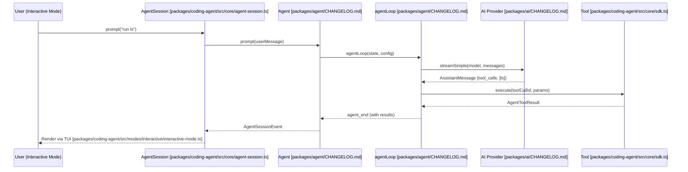

# 핵심 아키텍처

<details>
<summary>관련 소스 파일</summary>

다음 파일들은 이 위키 페이지를 생성하기 위한 컨텍스트로 사용되었습니다.

- [packages/agent/CHANGELOG.md](packages/agent/CHANGELOG.md)
- [packages/ai/CHANGELOG.md](packages/ai/CHANGELOG.md)
- [packages/coding-agent/CHANGELOG.md](packages/coding-agent/CHANGELOG.md)
- [packages/coding-agent/src/core/agent-session.ts](packages/coding-agent/src/core/agent-session.ts)
- [packages/coding-agent/src/core/sdk.ts](packages/coding-agent/src/core/sdk.ts)
- [packages/coding-agent/src/modes/interactive/interactive-mode.ts](packages/coding-agent/src/modes/interactive/interactive-mode.ts)
- [packages/coding-agent/src/modes/print-mode.ts](packages/coding-agent/src/modes/print-mode.ts)
- [packages/coding-agent/src/modes/rpc/rpc-mode.ts](packages/coding-agent/src/modes/rpc/rpc-mode.ts)
- [packages/tui/CHANGELOG.md](packages/tui/CHANGELOG.md)

</details>


`pi` 코드베이스는 저수준 AI provider 통신, 에이전트형 reasoning loops, 세션 상태 관리, 사용자 인터페이스 관심사를 분리하는 계층형 아키텍처를 따릅니다. 이러한 분리는 복잡한 코딩 작업을 위한 견고한 프레임워크를 제공하면서도 시스템이 provider에 종속되지 않도록 해줍니다.

### 계층형 아키텍처 개요

시스템은 여러 개의 구별된 계층으로 구성되며, 각 계층은 이전 계층 위에 구축됩니다.

1.  **AI Abstraction Layer (`pi-ai`)**: 여러 LLM provider(OpenAI, Anthropic, Google 등)를 위한 통합 streaming API를 제공합니다. model registries, credential resolution, cross-provider context normalization을 처리합니다 [packages/ai/CHANGELOG.md:13-33]().
2.  **Agent Core Layer (`pi-agent-core`)**: 기본 `Agent` 클래스와 `agentLoop`를 구현합니다. 이 계층은 "turn"(LLM call + tool execution)의 생명주기를 관리하고 풍부한 이벤트 스트림을 방출합니다 [packages/agent/CHANGELOG.md:155-184]().
3.  **Coding Agent Layer (`pi-coding-agent`)**: 소프트웨어 엔지니어링을 위한 도메인별 로직으로 core agent를 확장합니다. 영속 `AgentSession` 객체를 관리하고, session tree branching을 처리하며, 내장 coding tools 모음을 구현합니다 [packages/coding-agent/src/core/agent-session.ts:1-14]().
4.  **Interface Layer (`pi-tui`, `pi-web-ui`, and RPC)**: 사용자-facing 컴포넌트를 제공합니다. TUI(Terminal UI)는 로컬 개발을 위한 기본 인터페이스이며 [packages/tui/CHANGELOG.md:130-140](), RPC mode는 다른 애플리케이션에서 headless embedding을 가능하게 합니다 [packages/coding-agent/src/modes/rpc/rpc-mode.ts:1-12]().

### 시스템 컴포넌트 다이어그램

다음 다이어그램은 표준 사용자 prompt 중 서로 다른 패키지의 핵심 엔터티가 어떻게 상호작용하는지 보여줍니다.

```mermaid
graph TD
    subgraph "Interface_Space"
        ["InteractiveMode packages/coding-agent/src/modes/interactive/interactive-mode.ts"] -- "delegates to" --> ["AgentSession packages/coding-agent/src/core/agent-session.ts"]
        ["RpcMode packages/coding-agent/src/modes/rpc/rpc-mode.ts"] -- "delegates to" --> ["AgentSession packages/coding-agent/src/core/agent-session.ts"]
        ["PrintMode packages/coding-agent/src/modes/print-mode.ts"] -- "delegates to" --> ["AgentSession packages/coding-agent/src/core/agent-session.ts"]
    end

    subgraph "Coding_Agent_Space_(pi-coding-agent)"
        ["AgentSession packages/coding-agent/src/core/agent-session.ts"]
        ["SessionManager packages/coding-agent/src/core/session-manager.ts"]
        ["ExtensionRunner packages/coding-agent/src/core/extensions/index.ts"]
        ["AgentSessionRuntime packages/coding-agent/src/core/agent-session-runtime.ts"]
        ["ResourceLoader packages/coding-agent/src/core/resource-loader.ts"]
    end

    subgraph "Agent_Core_Space_(pi-agent-core)"
        ["Agent packages/agent/CHANGELOG.md"]
        ["agentLoop packages/agent/CHANGELOG.md"]
    end

    subgraph "AI_Space_(pi-ai)"
        ["streamSimple packages/ai/CHANGELOG.md"]
        ["ModelRegistry packages/coding-agent/src/core/model-registry.ts"]
    end

    ["AgentSession packages/coding-agent/src/core/agent-session.ts"] --> ["SessionManager packages/coding-agent/src/core/session-manager.ts"]
    ["AgentSession packages/coding-agent/src/core/agent-session.ts"] --> ["Agent packages/agent/CHANGELOG.md"]
    ["AgentSession packages/coding-agent/src/core/agent-session.ts"] --> ["ExtensionRunner packages/coding-agent/src/core/extensions/index.ts"]
    ["AgentSession packages/coding-agent/src/core/agent-session.ts"] --> ["ResourceLoader packages/coding-agent/src/core/resource-loader.ts"]
    ["Agent packages/agent/CHANGELOG.md"] --> ["agentLoop packages/agent/CHANGELOG.md"]
    ["agentLoop packages/agent/CHANGELOG.md"] --> ["streamSimple packages/ai/CHANGELOG.md"]
```
**출처:** [packages/coding-agent/src/core/agent-session.ts:157-187](), [packages/coding-agent/src/modes/interactive/interactive-mode.ts:1-4](), [packages/coding-agent/src/modes/rpc/rpc-mode.ts:53-55](), [packages/agent/CHANGELOG.md:155-184]()

---

### 핵심 하위 시스템

#### [Agent Loop (pi-agent-core)](#2.1)
`pi-agent-core` 패키지는 stateful `Agent` 클래스와 `agentLoop`를 정의합니다. 메시지를 LLM 호환 형식으로 변환하는 일을 관리합니다. 병렬 도구 실행을 처리하며, 각 도구가 완료되는 즉시 `tool_execution_end`가 방출되도록 보장합니다 [packages/agent/CHANGELOG.md:113-114]().

자세한 내용은 [Agent Loop (pi-agent-core)](#2.1)를 참조하세요.

#### [AgentSession and Session Lifecycle](#2.2)
`pi-coding-agent`에 위치한 `AgentSession`은 코딩 작업을 위한 고수준 coordinator입니다. agent state access, 자동 persistence가 포함된 event subscription, model/thinking level 관리를 캡슐화합니다 [packages/coding-agent/src/core/agent-session.ts:1-14](). compaction과 auto-retry cycles를 포함한 `AgentSessionEvent` 타입을 통해 생명주기를 관리합니다 [packages/coding-agent/src/core/agent-session.ts:124-148]().

자세한 내용은 [AgentSession and Session Lifecycle](#2.2)을 참조하세요.

#### [Session Management and Compaction](#2.3)
`SessionManager`는 JSONL 형식을 사용해 대화 기록의 persistence를 처리하고 branching/forking을 지원합니다 [packages/coding-agent/src/core/agent-session.ts:86-87](). 컨텍스트 창 overflow를 방지하기 위해 token thresholds를 기준으로 수동 또는 자동으로 트리거될 수 있는 compaction 로직을 구현합니다 [packages/coding-agent/src/core/agent-session.ts:42-51]().

자세한 내용은 [Session Management and Compaction](#2.3)을 참조하세요.

#### [Built-in Tools](#2.4)
coding agent에는 repository manipulation을 위해 설계된 내장 도구 모음이 포함되어 있습니다: `read`, `bash`, `edit`, `write`, `find`, `grep`, `ls`. 이러한 도구들은 core runtime에서 사용할 수 있도록 `AgentTool` 객체로 합성됩니다 [packages/coding-agent/src/core/sdk.ts:20-32]().

자세한 내용은 [Built-in Tools](#2.4)를 참조하세요.

---

### 데이터 흐름: 자연어에서 도구 실행까지

이 다이어그램은 사용자의 요청이 시스템의 코드 엔터티를 통과하는 흐름을 추적하여, 자연어 prompt가 어떻게 구체적인 코드 변경으로 이어지는지 보여줍니다.


**출처:** [packages/coding-agent/src/core/agent-session.ts:1-14](), [packages/coding-agent/src/modes/interactive/interactive-mode.ts:1-4](), [packages/agent/CHANGELOG.md:155-184]()

### 주요 인터페이스와 타입

| 엔터티 | 패키지 | 설명 |
| :--- | :--- | :--- |
| `Agent` | `pi-agent-core` | transcripts와 event emission을 관리하는 stateful wrapper입니다 [packages/agent/CHANGELOG.md:162-184](). |
| `AgentState` | `pi-agent-core` | messages, tools, model info를 포함하는 readonly state interface입니다 [packages/agent/CHANGELOG.md:155-160](). |
| `AgentTool` | `pi-agent-core` | schemas와 함께 실행 가능한 tools를 정의하기 위한 interface입니다 [packages/coding-agent/src/core/agent-session.ts:23](). |
| `AgentSession` | `pi-coding-agent` | coding environment를 위한 고수준 coordinator입니다 [packages/coding-agent/src/core/agent-session.ts:1-14](). |
| `SessionManager` | `pi-coding-agent` | session persistence와 tree navigation을 처리합니다 [packages/coding-agent/src/core/session-manager.ts:86-87](). |
| `ResourceLoader` | `pi-coding-agent` | skills, prompts, context files를 검색합니다 [packages/coding-agent/src/core/resource-loader.ts:85](). |

**출처:** [packages/agent/CHANGELOG.md:155-184](), [packages/coding-agent/src/core/agent-session.ts:1-25](), [packages/coding-agent/src/core/resource-loader.ts:85]()
