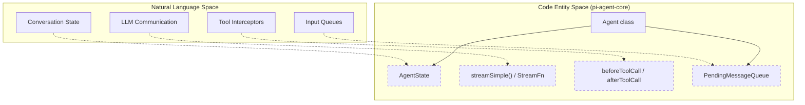
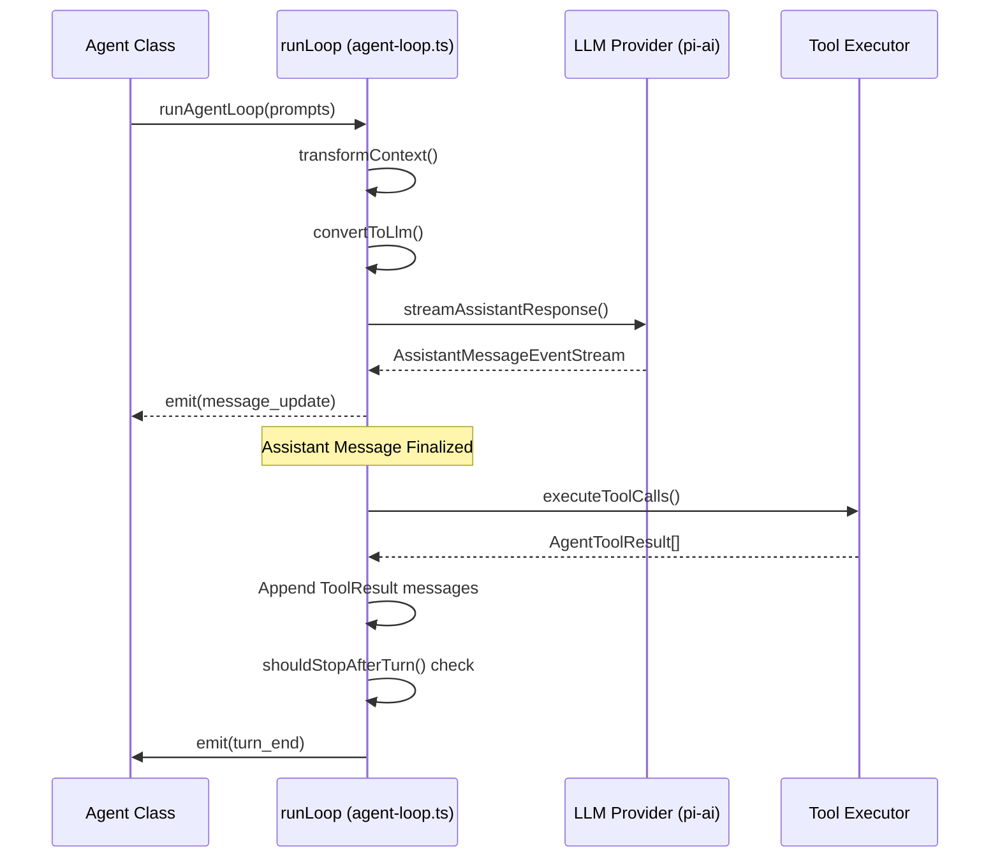
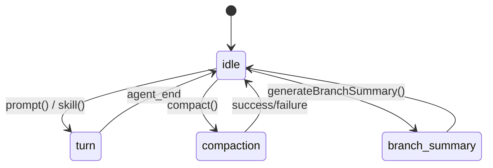

# Agent Loop (pi-agent-core)

관련 소스 파일

다음 파일들은 이 위키 페이지를 생성하기 위한 컨텍스트로 사용되었습니다.

- [packages/agent/CHANGELOG.md](packages/agent/CHANGELOG.md)
- [packages/agent/README.md](packages/agent/README.md)
- [packages/agent/docs/agent-harness.md](packages/agent/docs/agent-harness.md)
- [packages/agent/src/agent-loop.ts](packages/agent/src/agent-loop.ts)
- [packages/agent/src/agent.ts](packages/agent/src/agent.ts)
- [packages/agent/src/harness/agent-harness.ts](packages/agent/src/harness/agent-harness.ts)
- [packages/agent/src/harness/compaction/branch-summarization.ts](packages/agent/src/harness/compaction/branch-summarization.ts)
- [packages/agent/src/harness/compaction/compaction.ts](packages/agent/src/harness/compaction/compaction.ts)
- [packages/agent/src/harness/session/session.ts](packages/agent/src/harness/session/session.ts)
- [packages/agent/src/harness/types.ts](packages/agent/src/harness/types.ts)
- [packages/agent/src/index.ts](packages/agent/src/index.ts)
- [packages/agent/src/types.ts](packages/agent/src/types.ts)
- [packages/agent/test/agent-loop.test.ts](packages/agent/test/agent-loop.test.ts)
- [packages/agent/test/harness/agent-harness.test.ts](packages/agent/test/harness/agent-harness.test.ts)
- [packages/ai/CHANGELOG.md](packages/ai/CHANGELOG.md)
- [packages/coding-agent/CHANGELOG.md](packages/coding-agent/CHANGELOG.md)
- [packages/coding-agent/src/core/tools/tool-definition-wrapper.ts](packages/coding-agent/src/core/tools/tool-definition-wrapper.ts)
- [packages/tui/CHANGELOG.md](packages/tui/CHANGELOG.md)

`@earendil-works/pi-agent-core` 패키지는 `pi-ai` 추상화 위에 구축된 stateful, event-driven 에이전트 구현을 제공합니다 [packages/agent/README.md:1-3](). 이 패키지는 대화 transcript를 관리하고, tools를 실행하며, 병렬 실행 전략을 처리하고, 풍부한 lifecycle event 스트림을 방출합니다.

## Agent 클래스

`Agent` 클래스는 프로그래밍 방식 사용을 위한 기본 entry point입니다. 내부 `AgentState`를 유지하고 steering 및 follow-up messages를 위한 queues를 관리합니다 [packages/agent/src/agent.ts:166-170]().

### AgentState
상태는 에이전트의 현재 구성과 transcript를 나타냅니다. 주요 속성은 다음과 같습니다.
*   `systemPrompt`: LLM에 제공되는 지침입니다 [packages/agent/src/agent.ts:73]().
*   `model`: 사용할 LLM을 정의하는 `Model` 객체입니다 [packages/agent/src/agent.ts:74]().
*   `thinkingLevel`: 구성된 reasoning depth("off", "minimal" 등)입니다 [packages/agent/src/agent.ts:75]().
*   `messages`: `AgentMessage` 객체의 전체 transcript입니다 [packages/agent/src/agent.ts:82-83]().
*   `isStreaming`: 에이전트가 현재 run을 처리 중인지 나타내는 boolean입니다 [packages/agent/src/agent.ts:88]().
*   `pendingToolCalls`: 현재 실행 중인 tool call IDs의 `ReadonlySet<string>`입니다 [packages/agent/src/agent.ts:90]().
*   `errorMessage`: 마지막 turn이 실패한 경우 오류를 저장합니다 [packages/agent/src/agent.ts:91]().

### 구성과 Hooks
`Agent`는 `AgentOptions`를 통해 구성됩니다 [packages/agent/src/agent.ts:96-116]().
*   `convertToLlm`: `AgentMessage`(custom app types를 포함할 수 있음)를 필터링하고 표준 LLM roles(`user`, `assistant`, `toolResult`)로 변환하는 필수 함수입니다 [packages/agent/src/agent.ts:31-35](), [packages/agent/README.md:42-43]().
*   `transformContext`: LLM에 전송되기 전에 message history를 잘라내거나 수정하기 위한 선택적 hook입니다(예: context window management) [packages/agent/src/agent.ts:99](), [packages/agent/README.md:51]().
*   `beforeToolCall` / `afterToolCall`: tool execution을 차단하거나 tool results를 변경할 수 있는 interceptors입니다 [packages/agent/src/agent.ts:104-105]().
*   `toolExecution`: 여러 tool calls에 대한 전략을 구성하며, 기본값은 `"parallel"`입니다 [packages/agent/src/agent.ts:199](), [packages/agent/README.md:104]().

### 자연어에서 코드 엔터티로의 매핑: Agent 아키텍처
다음 다이어그램은 에이전트 동작의 고수준 개념을 코드베이스의 구체적인 클래스와 함수에 연결합니다.

Title: Agent Architecture Mapping

출처: [packages/agent/src/agent.ts:166-218](), [packages/agent/src/types.ts:24-26](), [packages/agent/src/types.ts:83-109]()

---

## Agent Loop 생명주기

핵심 로직은 `agent-loop.ts`의 `runLoop`에 있습니다 [packages/agent/src/agent-loop.ts:155](). 이 함수는 에이전트가 terminal state에 도달할 때까지 LLM에 메시지를 보내고 tool calls를 처리하는 반복 프로세스를 관리합니다.

### Turn 생명주기
단일 "turn"은 다음으로 구성됩니다.
1.  **Context Transformation**: message payload를 준비하기 위해 `transformContext`와 `convertToLlm`을 적용합니다 [packages/agent/src/agent-loop.ts:254-261]().
2.  **LLM Streaming**: provider에서 응답을 얻기 위해 `streamFn`(일반적으로 `streamSimple`)을 호출합니다 [packages/agent/src/agent-loop.ts:193]().
3.  **Tool Execution**: assistant가 tool calls를 생성하면 loop가 이를 실행하고 `toolResult` messages를 추가합니다 [packages/agent/src/agent-loop.ts:203-216]().
4.  **Steering Check**: LLM이 응답하는 동안 새 user messages가 queue에 들어왔는지 loop가 확인합니다 [packages/agent/src/agent-loop.ts:167]().
5.  **Graceful Stop**: `shouldStopAfterTurn`이 true를 반환하면 loop는 `turn_end` 이후, 다음 LLM call 이전에 종료됩니다 [packages/agent/src/agent-loop.ts:242-248]().

### Event Stream
`prompt()` 호출 중 에이전트는 `EventStream<AgentEvent, AgentMessage[]>`를 방출합니다 [packages/agent/src/agent-loop.ts:31-37]().

| Event Type | Trigger Point |
| :--- | :--- |
| `agent_start` | run이 시작될 때 [packages/agent/src/agent-loop.ts:109](). |
| `turn_start` | 각 LLM request cycle의 시작 시점 [packages/agent/src/agent-loop.ts:110](). |
| `message_start` | 어떤 message(user, assistant, tool)이든 시작될 때 [packages/agent/src/agent-loop.ts:112](). |
| `message_update` | **Assistant only.** delta가 포함된 `assistantMessageEvent`를 포함합니다 [packages/agent/README.md:151](). |
| `message_end` | message가 완료될 때 [packages/agent/README.md:152](). |
| `tool_execution_start` | tool implementation이 호출되기 전 [packages/agent/README.md:153](). |
| `tool_execution_update` | tool이 진행 상황을 stream하는 경우(예: bash output) [packages/agent/README.md:154](). |
| `tool_execution_end` | tool이 완료되고 results가 finalization된 후 [packages/agent/README.md:155](). |
| `turn_end` | assistant message와 tool results로 turn이 완료될 때 [packages/agent/README.md:149](). |
| `agent_end` | run의 최종 event [packages/agent/src/agent-loop.ts:147](). |

### Turn 실행 흐름
다음 다이어그램은 단일 agent turn을 통과하는 데이터 흐름을 보여줍니다.

Title: Turn Execution Data Flow

출처: [packages/agent/src/agent-loop.ts:155-246](), [packages/agent/README.md:58-74]()

---

## Tool 실행 모드

에이전트는 여러 tool calls를 포함하는 assistant messages에 대해 두 가지 실행 모드를 지원하며, `toolExecution`을 통해 구성할 수 있습니다 [packages/agent/src/types.ts:29-36]().

### 병렬 실행(기본값)
`parallel` 모드에서는 다음과 같이 동작합니다.
*   Tool calls는 순차적으로 준비됩니다(arguments 검증 및 `beforeToolCall` 실행) [packages/agent/README.md:104]().
*   실행이 허용된 tools는 동시에 실행됩니다 [packages/agent/README.md:104]().
*   각 tool이 finalization되는 즉시 `tool_execution_end` events가 방출됩니다 [packages/agent/README.md:104]().
*   **중요하게**, 결과 `toolResult` messages는 assistant가 요청한 원래 순서대로 transcript에 추가됩니다 [packages/agent/README.md:104]().

### 순차 실행
`sequential` 모드에서는 다음 tool이 시작되기 전에 각 tool이 준비, 실행, finalization됩니다 [packages/agent/src/types.ts:31](). batch 안의 어떤 tool이든 `executionMode: "sequential"`을 가지면 이 모드가 강제됩니다 [packages/agent/README.md:109]().

### 조기 종료
Tools는 `AfterToolCallResult`에 `terminate: true` 힌트를 반환할 수 있습니다 [packages/agent/src/types.ts:77-81](). 병렬 batch의 **모든** tool이 종료를 요청하는 경우에만 agent loop가 자동 follow-up LLM call을 건너뜁니다 [packages/agent/README.md:113]().

---

## Steering vs. Follow-up

`Agent` 클래스는 실행 중인 loop에 messages를 주입하기 위한 두 가지 구별된 메커니즘을 제공합니다.

### Steering
Steering messages는 다음 assistant response **이전**에 주입됩니다 [packages/agent/src/agent-loop.ts:182-190](). 에이전트가 tools를 실행하는 동안 사용자가 입력하면, 그 message는 다음 turn에서 LLM이 볼 수 있도록 context에 "steered"됩니다 [packages/agent/src/agent.ts:212](). `steeringMode`는 `"all"` 또는 `"one-at-a-time"`이 될 수 있습니다 [packages/agent/src/agent.ts:212]().

### Follow-up
Follow-up messages는 에이전트가 원래라면 멈췄을 시점 이후에 처리됩니다(즉, 더 이상 tool calls와 steering messages가 없는 경우) [packages/agent/src/agent-loop.ts:251-253](). 이를 통해 extensions 또는 system processes가 에이전트가 idle 상태가 된 뒤 새 turn을 트리거할 수 있습니다 [packages/agent/src/agent.ts:213]().

| Feature | Steering | Follow-up |
| :--- | :--- | :--- |
| **Queue Type** | `steeringQueue` [packages/agent/src/agent.ts:212]() | `followUpQueue` [packages/agent/src/agent.ts:213]() |
| **Injection Point** | 현재 loop의 다음 LLM call 전 [packages/agent/src/agent-loop.ts:182]() | loop가 종료될 시점 이후 [packages/agent/src/agent-loop.ts:251]() |
| **Primary Use** | 사용자 interruptions/corrections | 자동 system triggers / compaction |

출처: [packages/agent/src/agent.ts:118-152](), [packages/agent/src/agent-loop.ts:155-253]()

---

## AgentHarness 오케스트레이션

`Agent`가 stateful loop를 제공하는 반면, `AgentHarness`는 더 높은 수준의 orchestration layer 역할을 합니다 [packages/agent/docs/agent-harness.md:1-3](). 이것은 다음을 관리합니다.
*   **Session Persistence**: `Session` 및 storage backends와의 인터페이스 [packages/agent/src/harness/agent-harness.ts:180]().
*   **Resource Resolution**: 환경에서 `Skill`과 `PromptTemplate` 객체 로드 [packages/agent/src/harness/agent-harness.ts:190]().
*   **System Prompt Generation**: 현재 resources를 기준으로 dynamic system prompts 해석 [packages/agent/src/harness/agent-harness.ts:187]().
*   **Phase Management**: harness가 `idle`, `turn`, 또는 `compaction` 수행 중인지 추적 [packages/agent/docs/agent-harness.md:94-98]().

### Harness Phase Transition
Title: AgentHarness Phase Transitions

출처: [packages/agent/docs/agent-harness.md:94-108](), [packages/agent/src/harness/agent-harness.ts:181]()
