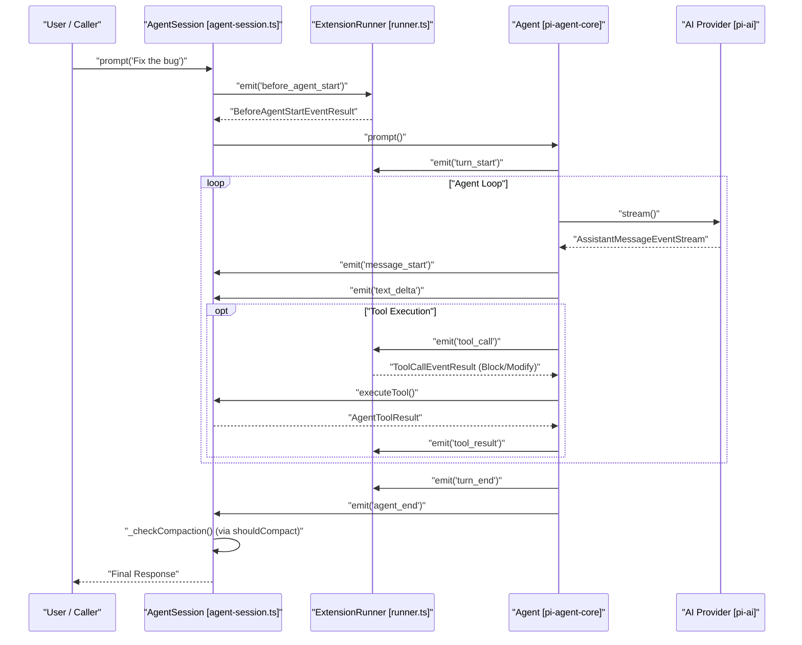
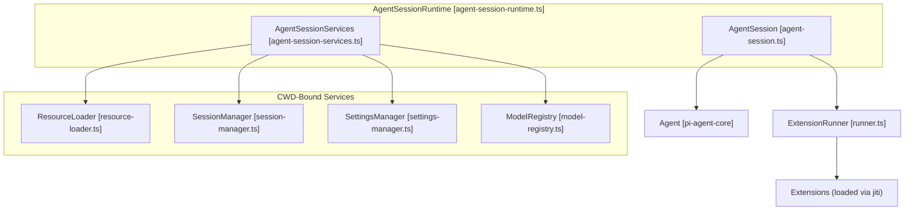

# AgentSession과 세션 생명주기

관련 소스 파일

다음 파일들은 이 위키 페이지를 생성하기 위한 컨텍스트로 사용되었습니다.

- [packages/coding-agent/src/core/agent-session-runtime.ts](packages/coding-agent/src/core/agent-session-runtime.ts)
- [packages/coding-agent/src/core/agent-session-services.ts](packages/coding-agent/src/core/agent-session-services.ts)
- [packages/coding-agent/src/core/agent-session.ts](packages/coding-agent/src/core/agent-session.ts)
- [packages/coding-agent/src/core/sdk.ts](packages/coding-agent/src/core/sdk.ts)
- [packages/coding-agent/src/modes/interactive/interactive-mode.ts](packages/coding-agent/src/modes/interactive/interactive-mode.ts)
- [packages/coding-agent/src/modes/print-mode.ts](packages/coding-agent/src/modes/print-mode.ts)
- [packages/coding-agent/src/modes/rpc/rpc-mode.ts](packages/coding-agent/src/modes/rpc/rpc-mode.ts)
- [packages/coding-agent/test/agent-session-auto-compaction-queue.test.ts](packages/coding-agent/test/agent-session-auto-compaction-queue.test.ts)
- [packages/coding-agent/test/agent-session-runtime-events.test.ts](packages/coding-agent/test/agent-session-runtime-events.test.ts)
- [packages/coding-agent/test/suite/agent-session-bash-persistence.test.ts](packages/coding-agent/test/suite/agent-session-bash-persistence.test.ts)
- [packages/coding-agent/test/suite/agent-session-compaction.test.ts](packages/coding-agent/test/suite/agent-session-compaction.test.ts)
- [packages/coding-agent/test/suite/agent-session-model-extension.test.ts](packages/coding-agent/test/suite/agent-session-model-extension.test.ts)
- [packages/coding-agent/test/suite/agent-session-prompt.test.ts](packages/coding-agent/test/suite/agent-session-prompt.test.ts)
- [packages/coding-agent/test/suite/agent-session-retry-events.test.ts](packages/coding-agent/test/suite/agent-session-retry-events.test.ts)
- [packages/coding-agent/test/suite/agent-session-runtime.test.ts](packages/coding-agent/test/suite/agent-session-runtime.test.ts)
- [packages/coding-agent/test/suite/regressions/1717-2113-agent-session-event-settlement.test.ts](packages/coding-agent/test/suite/regressions/1717-2113-agent-session-event-settlement.test.ts)
- [packages/coding-agent/test/suite/regressions/2023-queued-slash-command-followup.test.ts](packages/coding-agent/test/suite/regressions/2023-queued-slash-command-followup.test.ts)

`AgentSession` 클래스는 `coding-agent` 패키지의 중심 orchestrator입니다. `@earendil-works/pi-agent-core`의 저수준 `Agent` loop를 고수준 세션 관리, tool execution, extension system과 연결합니다 [packages/coding-agent/src/core/agent-session.ts:2-14]().

## 핵심 추상화: AgentSession

`AgentSession`은 단일 대화 thread의 상태와 생명주기를 캡슐화합니다. Interactive(TUI), RPC, Print 등 모든 실행 모드에서 사용됩니다 [packages/coding-agent/src/core/agent-session.ts:13-14](). model selection, thinking levels를 관리하고 `SessionManager`를 통한 persistence 인터페이스를 제공합니다 [packages/coding-agent/src/core/agent-session.ts:5-12]().

### 주요 함수
- `prompt(text, options)`: 사용자 입력을 위한 기본 entry point입니다. prompt template expansion, skill block parsing을 처리하고 agent loop를 시작합니다 [packages/coding-agent/src/core/agent-session.ts:310-348]().
- `steer(text)`: 에이전트가 끝날 때까지 기다리지 않고 현재 turn에 message를 주입하여, 긴 출력 중 사용자가 model을 "steer"할 수 있게 합니다 [packages/coding-agent/src/core/agent-session.ts:400-410]().
- `followUp(text)`: 현재 turn이 완료된 직후 처리될 message를 queue에 넣습니다 [packages/coding-agent/src/core/agent-session.ts:412-422]().
- `subscribe(listener)`: 외부 컴포넌트가 core agent events와 `compaction_start`, `queue_update`, `auto_retry_start` 같은 session-specific events를 포함한 통합 event stream을 수신할 수 있게 합니다 [packages/coding-agent/src/core/agent-session.ts:124-151]().
- `executeBash(command)`: `executeBashWithOperations`를 사용해 세션의 context와 working directory 안에서 shell commands를 실행하기 위한 직접 인터페이스를 제공합니다 [packages/coding-agent/src/core/agent-session.ts:1003-1011]().
- `compact(options)`: context window usage를 줄이기 위해 compaction process를 수동으로 트리거합니다 [packages/coding-agent/src/core/agent-session.ts:741-755]().

**출처:** [packages/coding-agent/src/core/agent-session.ts:1-151](), [packages/coding-agent/src/core/agent-session.ts:310-348](), [packages/coding-agent/src/core/agent-session.ts:1003-1011]()

---

## 세션 생명주기와 이벤트 흐름

세션 turn의 생명주기는 event-driven입니다. `prompt()`가 호출되면 `AgentSession`에서 subscribers(TUI 또는 RPC host 등)로 흐르는 일련의 events가 트리거됩니다.

### 자연어에서 코드 엔터티 공간으로: 생명주기 매핑

다음 다이어그램은 고수준 사용자 actions를 turn 중 트리거되는 구체적인 코드 엔터티와 events에 매핑합니다.

Title: Agent Session Turn Lifecycle

**출처:** [packages/coding-agent/src/core/agent-session.ts:124-151](), [packages/coding-agent/src/core/agent-session.ts:310-348](), [packages/coding-agent/test/agent-session-auto-compaction-queue.test.ts:49-53](), [packages/coding-agent/test/agent-session-auto-compaction-queue.test.ts:162-168]()

---

## AgentSessionRuntime과 Services

`AgentSessionRuntime`은 현재 `AgentSession`과 cwd-bound services를 소유합니다. branch switching, forking, session resuming 같은 session replacement operations를 담당합니다 [packages/coding-agent/src/core/agent-session-runtime.ts:68-77](). 세션이 교체될 때 이전 세션이 disposed되고 `session_shutdown` events가 방출되도록 보장합니다 [packages/coding-agent/src/core/agent-session-runtime.ts:167-175]().

### Runtime 아키텍처
- **AgentSessionServices**: `ResourceLoader`, `SettingsManager`, `ModelRegistry`처럼 현재 Working Directory(CWD)에 바인딩된 객체를 담는 container입니다 [packages/coding-agent/src/core/agent-session-services.ts:74-82]().
- **Session Replacement**: `switchSession`, `newSession`, `fork` 같은 methods는 먼저 현재 runtime을 해체한 뒤, `CreateAgentSessionRuntimeFactory`를 사용해 다음 runtime을 생성하고 적용합니다 [packages/coding-agent/src/core/agent-session-runtime.ts:35-41](), [packages/coding-agent/src/core/agent-session-runtime.ts:193-210]().
- **Shutdown Hooks**: `setBeforeSessionInvalidate`는 host-owned UI teardown(TUI components detach 등)이 `session_shutdown` handlers 이후, session object가 stale이 되기 전에 실행되도록 합니다 [packages/coding-agent/src/core/agent-session-runtime.ts:129-131]().

Title: Runtime and Service Association

**출처:** [packages/coding-agent/src/core/agent-session-runtime.ts:74-95](), [packages/coding-agent/src/core/agent-session-services.ts:74-82](), [packages/coding-agent/src/core/agent-session-runtime.ts:193-210](), [packages/coding-agent/src/core/agent-session-runtime.ts:129-131]()

---

## 세션 생성(SDK)

`createAgentSession` factory는 시스템을 instantiate하는 기본 방법입니다. credentials를 해석하고, settings를 로드하며, extensions를 검색하고, `AgentSession`을 연결합니다 [packages/coding-agent/src/core/sdk.ts:166-184]().

### 구성 옵션
`CreateAgentSessionOptions` 인터페이스는 세션 커스터마이징을 허용합니다.
- `cwd`: file discovery를 위한 project directory입니다 [packages/coding-agent/src/core/sdk.ts:36-36]().
- `model`: 사용할 특정 LLM이며, 보통 `findInitialModel`을 통해 해석됩니다 [packages/coding-agent/src/core/sdk.ts:46-46](), [packages/coding-agent/src/core/sdk.ts:13-13]().
- `tools`: 활성화할 tool names의 allowlist입니다 [packages/coding-agent/src/core/sdk.ts:67-67]().
- `noTools`: built-in tools에 대한 suppression mode입니다("all" 또는 "builtin") [packages/coding-agent/src/core/sdk.ts:59-59]().
- `resourceLoader`: skills, prompts, themes를 위한 custom loader입니다 [packages/coding-agent/src/core/sdk.ts:74-74]().

**출처:** [packages/coding-agent/src/core/sdk.ts:34-83](), [packages/coding-agent/src/core/sdk.ts:166-184]()

---

## Mode 통합

Extensions와 modes는 specialized contexts를 통해 `AgentSession` 생명주기와 상호작용합니다.

1. **Interactive Mode**: TUI rendering과 사용자 상호작용을 처리하며, logic을 `AgentSession`에 위임합니다 [packages/coding-agent/src/modes/interactive/interactive-mode.ts:1-4]().
2. **RPC Mode**: headless JSON-RPC protocol을 구현합니다. `select` 또는 `confirm` 같은 extension UI requests를 stdout으로 전송되는 `RpcExtensionUIRequest` 객체에 매핑합니다 [packages/coding-agent/src/modes/rpc/rpc-mode.ts:59-61](), [packages/coding-agent/src/modes/rpc/rpc-mode.ts:135-150]().
3. **Print Mode**: prompt를 보내고, 최종 assistant response를 기다린 다음, 종료 전에 stdout으로 출력하는 single-shot execution mode입니다 [packages/coding-agent/src/modes/print-mode.ts:2-7](), [packages/coding-agent/src/modes/print-mode.ts:129-146]().
4. **Extension UI Context**: 각 mode는 extensions가 요청한 interactions를 처리하기 위해 자체 `ExtensionUIContext` 구현을 제공합니다 [packages/coding-agent/src/modes/rpc/rpc-mode.ts:135-135]().

**출처:** [packages/coding-agent/src/modes/interactive/interactive-mode.ts:1-4](), [packages/coding-agent/src/modes/rpc/rpc-mode.ts:1-12](), [packages/coding-agent/src/modes/rpc/rpc-mode.ts:135-150](), [packages/coding-agent/src/modes/print-mode.ts:1-7](), [packages/coding-agent/src/modes/print-mode.ts:129-146]()
