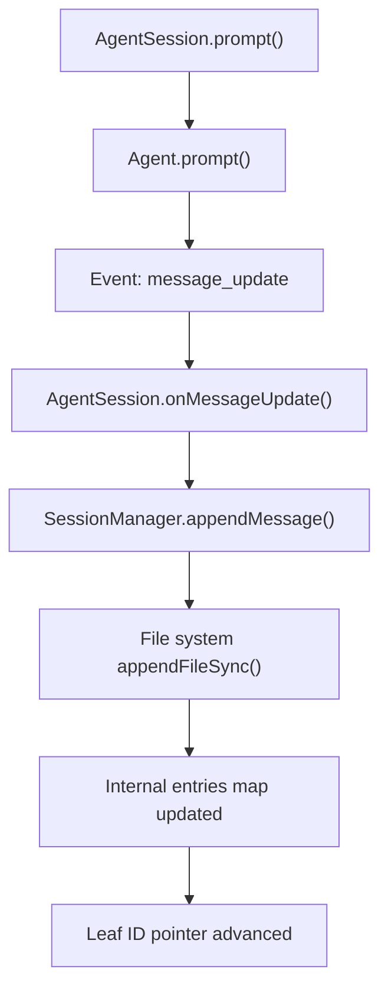
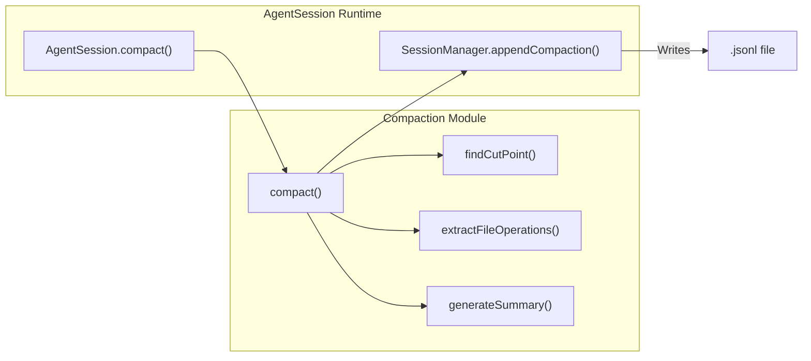

# 세션 관리와 Compaction

<details>
<summary>관련 소스 파일</summary>

다음 파일들은 이 위키 페이지를 생성하기 위한 컨텍스트로 사용되었습니다.

- [packages/agent/test/harness/compaction.test.ts](packages/agent/test/harness/compaction.test.ts)
- [packages/coding-agent/docs/compaction.md](packages/coding-agent/docs/compaction.md)
- [packages/coding-agent/src/cli/session-picker.ts](packages/coding-agent/src/cli/session-picker.ts)
- [packages/coding-agent/src/core/compaction/branch-summarization.ts](packages/coding-agent/src/core/compaction/branch-summarization.ts)
- [packages/coding-agent/src/core/compaction/compaction.ts](packages/coding-agent/src/core/compaction/compaction.ts)
- [packages/coding-agent/src/core/compaction/index.ts](packages/coding-agent/src/core/compaction/index.ts)
- [packages/coding-agent/src/core/compaction/utils.ts](packages/coding-agent/src/core/compaction/utils.ts)
- [packages/coding-agent/src/core/session-manager.ts](packages/coding-agent/src/core/session-manager.ts)
- [packages/coding-agent/src/modes/interactive/components/session-selector-search.ts](packages/coding-agent/src/modes/interactive/components/session-selector-search.ts)
- [packages/coding-agent/src/modes/interactive/components/session-selector.ts](packages/coding-agent/src/modes/interactive/components/session-selector.ts)
- [packages/coding-agent/test/agent-session-branching.test.ts](packages/coding-agent/test/agent-session-branching.test.ts)
- [packages/coding-agent/test/agent-session-compaction.test.ts](packages/coding-agent/test/agent-session-compaction.test.ts)
- [packages/coding-agent/test/compaction-serialization.test.ts](packages/coding-agent/test/compaction-serialization.test.ts)
- [packages/coding-agent/test/compaction-summary-reasoning.test.ts](packages/coding-agent/test/compaction-summary-reasoning.test.ts)
- [packages/coding-agent/test/compaction.test.ts](packages/coding-agent/test/compaction.test.ts)
- [packages/coding-agent/test/session-selector-path-delete.test.ts](packages/coding-agent/test/session-selector-path-delete.test.ts)
- [packages/coding-agent/test/session-selector-search.test.ts](packages/coding-agent/test/session-selector-search.test.ts)

</details>


이 페이지는 `pi` 코드베이스 안에서 세션 persistence, 트리 기반 history 관리, context compaction system의 기술적 구현을 자세히 설명합니다.

## JSONL 세션 형식과 트리 구조

`pi`의 세션은 **JSONL(JSON Lines)** 파일로 저장됩니다. 각 줄은 독립적인 JSON 객체이므로 전체 파일을 다시 쓰지 않고도 효율적으로 append할 수 있습니다. 현재 세션 형식 버전은 3이며, 단순한 선형 목록에서 branching과 metadata entries를 지원하는 복잡한 tree structures로 마이그레이션된 것을 반영합니다 [packages/coding-agent/src/core/session-manager.ts:30-30](), [packages/coding-agent/src/core/session-manager.ts:139-152](), [packages/coding-agent/src/core/session-manager.ts:225-243]().

### Session Entry Types

세션 파일의 모든 entry는 비선형 history tree를 유지하는 데 필요한 핵심 필드를 제공하는 `SessionEntryBase`를 확장합니다.

- **id**: 고유 entry identifier입니다. 일반적으로 짧은 8자 hex string 또는 UUIDv7이며, tree integrity를 유지하기 위해 충돌 확인을 거쳐 생성됩니다 [packages/coding-agent/src/core/session-manager.ts:48-48](), [packages/coding-agent/src/core/session-manager.ts:216-223]().
- **parentId**: 직전 entry의 ID입니다. root entries의 경우 `null`입니다 [packages/coding-agent/src/core/session-manager.ts:49-49]().

각 entry에는 기록된 시점을 나타내는 ISO-8601 형식의 `timestamp` string도 있습니다 [packages/coding-agent/src/core/session-manager.ts:50-50]().

| Entry Type          | 목적                                                  | 주요 필드                                                     |
|---------------------|----------------------------------------------------------|----------------------------------------------------------------|
| `session`           | 세션 header(첫 번째 줄)                              | `version`, `id`, `timestamp`, `cwd`, `parentSession`           |
| `message`           | LLM 대화 messages                               | `message`(`AgentMessage` 타입)                             |
| `compaction`        | context compaction을 위한 요약된 history               | `summary`, `firstKeptEntryId`, `tokensBefore`, `details?`      |
| `branch_summary`    | 다른 세션 branches에 대한 summaries(branch navigation) | `summary`, `fromId`, `details?`                                |
| `model_change`      | provider/model changes 추적                             | `provider`, `modelId`                                           |
| `thinking_level_change` | reasoning 또는 thinking level 변경                 | `thinkingLevel`                                                |
| `custom`            | extension-specific state persistence                     | `customType`, `data?`                                          |
| `custom_message`    | LLM context에 참여하는 extension-injected content | `content`, `display`, `details?`                               |
| `label`             | 사용자 정의 bookmark labels                             | `targetId`, `label`                                            |
| `session_info`      | display name 같은 session metadata                      | `name?`                                                       |

모든 interface definitions는 [packages/coding-agent/src/core/session-manager.ts:32-149]()를 참조하세요.

### Tree Navigation Logic

`SessionManager`는 세션을 방향성 비순환 그래프(DAG)로 모델링하여, `parentId` references를 통한 비선형 branching을 가능하게 합니다. 이는 branching/forking/cloning 동작을 지원합니다.

- **`getBranch(id)`**는 `parentId`를 재귀적으로 따라가 지정된 node에서 root까지의 선형 경로를 재구성합니다 [packages/coding-agent/src/core/session-manager.ts:195-195]().
- **`getTree()`**는 각 node가 entry와 그 child entries를 포함하는 재귀적 tree structure(`SessionTreeNode`)를 빌드하여, 세션의 모든 branches를 표현합니다 [packages/coding-agent/src/core/session-manager.ts:155-162](), [packages/coding-agent/src/core/session-manager.ts:199-199]().

Session entries는 `id`와 `parentId` properties를 통해 연결됩니다. `leafId`는 session tree에서 현재 focus point를 추적하며, 새 entries가 append될 때마다 앞으로 이동합니다 [packages/coding-agent/src/core/session-manager.ts:46-51](), [packages/coding-agent/src/core/session-manager.ts:192-192]().

**데이터 흐름: Session Persistence**

Title: Session Persistence Flow

출처: [packages/coding-agent/src/core/session-manager.ts:4-15](), [packages/coding-agent/src/core/session-manager.ts:46-51](), [packages/coding-agent/src/core/session-manager.ts:155-162]()

## SessionManager API

`SessionManager`는 session I/O, entry storage, tree traversal, mutation을 관리하는 중심 클래스입니다. 두 가지 모드를 지원합니다.

- **File-backed session**: 디스크의 JSONL 파일을 읽고 씁니다.
- **In-memory session**: entries를 메모리에 저장하며, transient sessions 또는 testing에 유용합니다.

### Creation Methods

- `SessionManager.create(agentDir: string, sessionsDir?: string)`: file-backed session manager를 초기화하거나 로드합니다 [packages/coding-agent/src/core/session-manager.ts:275-285]().
- `SessionManager.inMemory(cwd?: string)`: 선택적 current working directory와 함께 ephemeral in-memory session manager를 생성합니다 [packages/coding-agent/src/core/session-manager.ts:287-293]().

### 중요한 SessionManager Methods

| Method                    | 설명                               |
|---------------------------|-------------------------------------------|
| `appendMessage(message)`  | leaf에 연결된 새 `message` entry를 추가하고, 이를 persist하며 leaf pointer를 이동합니다 [packages/coding-agent/src/core/session-manager.ts:53-56]() |
| `appendCompaction(summary, firstKeptId, tokensBefore, details?, fromHook?)` | context compaction 이후 `compaction` entry를 leaf에 연결해 append합니다 [packages/coding-agent/src/core/session-manager.ts:69-78]() |
| `appendBranchSummary(summary, fromId, details?, fromHook?)` | 다른 branches의 context summaries를 유지하기 위한 `branch_summary` entry를 추가합니다 [packages/coding-agent/src/core/session-manager.ts:80-88]() |
| `appendCustomEntry(customType, data?)` | LLM context에 영향을 주지 않고 extension state data를 저장합니다 [packages/coding-agent/src/core/session-manager.ts:100-104]() |
| `fork(entryId)`            | branching을 위해 지정된 `entryId`까지 history가 잘린 새 session file을 생성합니다 [packages/coding-agent/src/core/session-manager.ts:391-410]() |
| `getEntries()`            | 모든 session entries를 append 순서로 반환합니다 [packages/coding-agent/src/core/session-manager.ts:198-198]() |
| `getBranch(entryId)`      | root에서 지정된 leaf까지의 경로를 이루는 entries 배열을 반환합니다 [packages/coding-agent/src/core/session-manager.ts:195-195]() |
| `getTree()`               | 모든 entries의 tree를 `SessionTreeNode[]`로 반환합니다 [packages/coding-agent/src/core/session-manager.ts:199-199]() |
| `getLeafId()`             | 현재 leaf entry id(마지막으로 append된 항목)를 가져옵니다 [packages/coding-agent/src/core/session-manager.ts:192-192]() |

출처: [packages/coding-agent/src/core/session-manager.ts:53-104](), [packages/coding-agent/src/core/session-manager.ts:186-201]()

## Compaction System

LLM의 제한된 context window를 처리하기 위해 pi는 오래된 대화 history를 압축된 summaries로 요약하는 **Context Compaction**을 도입합니다. 이를 통해 필수 context는 보존하면서 새 상호작용을 위한 token space를 확보합니다 [packages/coding-agent/docs/compaction.md:1-24]().

### Auto-Compaction Triggers

모든 prompt 전에 pi는 estimated context token count를 reserved margin을 뺀 LLM context window와 비교하여 compaction이 필요한지 평가합니다.

```text
Trigger if: contextTokens > contextWindow - reserveTokens
```

- `reserveTokens`의 기본값은 **16384 tokens**입니다.
- `keepRecentTokens`의 기본값은 **20000 tokens**이며, compaction되지 않고 남을 recent tokens의 수를 제어합니다.

이 설정은 `~/.pi/agent/settings.json` 또는 project-local `.pi/settings.json`에서 구성할 수 있습니다 [packages/coding-agent/src/core/compaction/compaction.ts:115-125](), [packages/coding-agent/src/core/compaction/compaction.ts:219-222]().

### Compaction Workflow

1. **Find Cut Point**: `findCutPoint()` 알고리즘은 최신 message부터 뒤로 이동하며 `keepRecentTokens` threshold에 도달할 때까지 estimated tokens를 누적합니다. tool results를 피하면서 user 또는 assistant messages 같은 자연스러운 message boundaries에서 cut하려고 시도합니다 [packages/coding-agent/src/core/compaction/compaction.ts:335-410]().

2. **Message Extraction**: 그런 다음 이전 compaction boundary(또는 session start)부터 cut point까지의 messages를 수집해 "compacted" range를 형성합니다 [packages/coding-agent/src/core/compaction/compaction.ts:141-210]().

3. **Summary Generation**: summarization용으로 설계된 system prompt(`SUMMARIZATION_SYSTEM_PROMPT`)를 사용해 LLM call이 실행되며, iterative refinement를 위해 prior summary가 있으면 관련 message span과 함께 전달합니다 [packages/coding-agent/src/core/compaction/utils.ts:168-171]().

4. **File Tracking**: summarized messages 안의 tool calls에서 file operations(read, edited, modified files)를 `extractFileOpsFromMessage()`로 추출하고, cumulative tracking을 위해 `CompactionEntry`의 `details` 필드에 기록합니다 [packages/coding-agent/src/core/compaction/utils.ts:29-56](), [packages/coding-agent/src/core/compaction/compaction.ts:32-36]().

5. **Entry Appending**: 생성된 summary는 `CompactionEntry`로 session file에 append되며, compaction되지 않은 messages가 이어지는 `firstKeptEntryId`를 지정합니다 [packages/coding-agent/docs/compaction.md:59-77]().

6. **Session Reload**: 세션이 다시 로드되어 active LLM context가 모든 older messages 대신 summary를 사용합니다.

### Split Turns

단일 turn(user message + associated assistant and tool messages)이 `keepRecentTokens`를 초과하면 compaction은 turn 중간에서 cut하고, 다음에 대한 별도 summaries를 생성합니다.

- 해당 turn 이전의 historical conversation.
- split turn의 prefix part.

이들은 partial turn cutting에도 context integrity를 보장하기 위해 병합됩니다 [packages/coding-agent/docs/compaction.md:81-108]().

### CompactionEntry Format

`CompactionEntry`는 다음과 같이 정의됩니다.

```typescript
export interface CompactionEntry<T = unknown> extends SessionEntryBase {
	type: "compaction";
	summary: string;
	firstKeptEntryId: string;
	tokensBefore: number;
	/** Extension-specific data (e.g., ArtifactIndex, version markers for structured compaction) */
	details?: T;
	/** True if generated by an extension, undefined/false if pi-generated (backward compatible) */
	fromHook?: boolean;
}
```

기본 `details` shape는 다음을 추적합니다.

```typescript
export interface CompactionDetails {
	readFiles: string[];
	modifiedFiles: string[];
}
```

Extensions는 추가 metadata를 저장하기 위해 여기에 custom structures를 정의할 수 있습니다 [packages/coding-agent/src/core/session-manager.ts:69-78](), [packages/coding-agent/src/core/compaction/compaction.ts:33-36]().

**코드 엔터티 공간: Compaction Logic**

Title: Compaction Logic and Data Flow

출처: [packages/coding-agent/src/core/compaction/compaction.ts:103-109](), [packages/coding-agent/src/core/compaction/compaction.ts:335-340](), [packages/coding-agent/src/core/compaction/compaction.ts:420-430](), [packages/coding-agent/src/core/session-manager.ts:69-78]()

## Branch Summarization

세션 tree의 branches 사이에서 focus를 전환할 때(예: `/tree`를 통한 navigation), pi는 떠나는 branches의 context를 보존하기 위해 **Branch Summaries**를 생성합니다. 이는 conversation path를 변경할 때 context loss를 방지합니다 [packages/coding-agent/src/core/compaction/branch-summarization.ts:1-6]().

### Summary Collection

`collectEntriesForBranchSummary()` 함수는 현재 leaf에서 target branch와의 common ancestor까지의 entries를 식별합니다. summaries가 일관되게 유지되도록 compaction boundaries를 무시하면서 compactions와 summaries를 포함한 entries를 수집합니다 [packages/coding-agent/src/core/compaction/branch-summarization.ts:100-138]().

### Summary Generation

compaction과 마찬가지로, collected entries에 summarization prompts를 적용해 요약된 텍스트 표현을 만들기 위한 LLM call이 수행됩니다 [packages/coding-agent/src/core/compaction/branch-summarization.ts:241-280](). branch 안의 file operations는 변경 사항을 추적하기 위해 `prepareBranchEntries()`를 통해 누적 방식으로 추출됩니다 [packages/coding-agent/src/core/compaction/branch-summarization.ts:187-210]().

### LLM Context와의 통합

`buildSessionContext()`에서 `branch_summary` entries는 `createBranchSummaryMessage()`를 통해 특수 `branchSummary` message roles로 변환됩니다. LLM은 이를 다른 branches의 압축된 context로 취급하여, navigation에도 대화의 연속성을 유지합니다 [packages/coding-agent/src/core/session-manager.ts:25-28](), [packages/coding-agent/src/core/compaction/branch-summarization.ts:148-172]().

### BranchSummaryEntry Format

```typescript
export interface BranchSummaryEntry<T = unknown> extends SessionEntryBase {
	type: "branch_summary";
	fromId: string;
	summary: string;
	/** Extension-specific data (not sent to LLM) */
	details?: T;
	/** True if generated by an extension, false if pi-generated */
	fromHook?: boolean;
}
```

출처: [packages/coding-agent/src/core/session-manager.ts:80-88](), [packages/coding-agent/src/core/compaction/branch-summarization.ts:42-45]()

## Branching, Forking, and Cloning

세션 tree는 다음을 허용합니다.

- **Branching**: `parentId`가 latest leaf가 아닌 entries를 통해 divergent histories를 추가합니다.
- **Forking**: exploratory divergent histories를 허용하기 위해 지정된 entry에서 잘린 새 session file을 생성합니다 [packages/coding-agent/src/core/session-manager.ts:391-410]().

`SessionManager.fork(entryId)` method는 fork point까지의 branch history를 새 session file로 복사하고, 그 지점에서 새 session tree를 시작하여 이를 처리합니다.

Cloning은 유사하지만 전체 history를 보존합니다.

## Extension Integration

Extensions는 session 및 compaction mechanisms에 긴밀하게 통합됩니다.

- **Custom Entries**(`custom` type)는 restart 후에도 유지되지만 LLM context에는 기여하지 않는 extension state를 저장합니다 [packages/coding-agent/src/core/session-manager.ts:100-104]().

- **Custom Messages**(`custom_message` type)는 extensions가 LLM context에 messages를 주입할 수 있게 하며, display와 metadata에 대한 제어를 제공합니다 [packages/coding-agent/src/core/session-manager.ts:131-137]().

- Extensions는 compaction을 수동으로 트리거하거나 compaction 및 session changes와 관련된 events를 listen할 수 있습니다.

- compaction 및 branch summary entries의 `fromHook` 필드는 extension-generated entries와 built-in entries를 구분하여 custom handling을 가능하게 합니다 [packages/coding-agent/src/core/session-manager.ts:77-77](), [packages/coding-agent/src/core/session-manager.ts:87-87]().

## 주요 데이터 구조 요약

| 개념                   | 코드 엔터티 / Interface                          | 목적                                      |
|---------------------------|-------------------------------------------------|----------------------------------------------|
| Session Entry             | `SessionEntry` [packages/coding-agent/src/core/session-manager.ts:140-149]() | session events를 나타내는 JSONL lines     |
| Session Tree Node         | `SessionTreeNode` [packages/coding-agent/src/core/session-manager.ts:155-162]() | children을 포함한 tree를 나타내는 recursive node |
| Compaction Entry          | `CompactionEntry` [packages/coding-agent/src/core/session-manager.ts:69-78]()   | older conversation tokens를 대체하는 summary  |
| Branch Summary Entry      | `BranchSummaryEntry` [packages/coding-agent/src/core/session-manager.ts:80-88]()| tree navigation 중 abandoned branch의 summary |
| Session Manager           | `SessionManager` class [packages/coding-agent/src/core/session-manager.ts:186-201]() | session persistence, tree, compaction 관리 |
| Compaction Logic          | `compact()`, `findCutPoint()` [packages/coding-agent/src/core/compaction/compaction.ts:335-430]() | summaries를 생성하는 core functions         |

출처: [packages/coding-agent/src/core/session-manager.ts:1-201](), [packages/coding-agent/src/core/compaction/compaction.ts:1-430](), [packages/coding-agent/src/core/compaction/branch-summarization.ts:1-280](), [packages/coding-agent/docs/compaction.md:1-141]()
