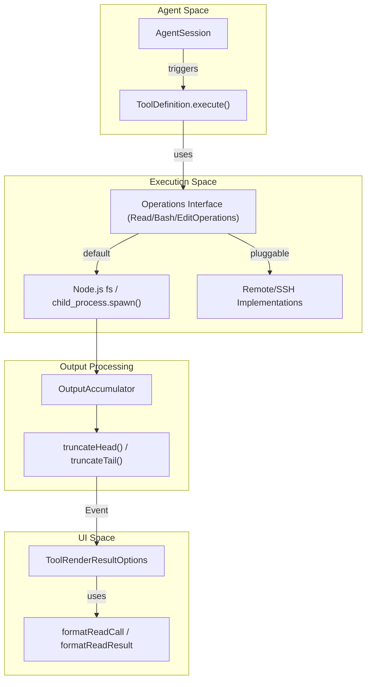
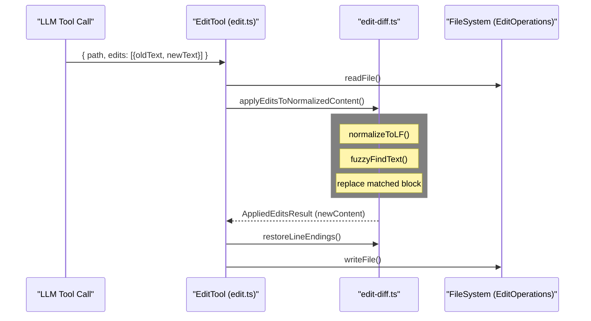

# 내장 도구

관련 소스 파일

다음 파일들은 이 위키 페이지를 생성하기 위한 컨텍스트로 사용되었습니다.

- [packages/coding-agent/examples/extensions/dynamic-tools.ts](packages/coding-agent/examples/extensions/dynamic-tools.ts)
- [packages/coding-agent/src/core/bash-executor.ts](packages/coding-agent/src/core/bash-executor.ts)
- [packages/coding-agent/src/core/index.ts](packages/coding-agent/src/core/index.ts)
- [packages/coding-agent/src/core/system-prompt.ts](packages/coding-agent/src/core/system-prompt.ts)
- [packages/coding-agent/src/core/tools/bash.ts](packages/coding-agent/src/core/tools/bash.ts)
- [packages/coding-agent/src/core/tools/edit-diff.ts](packages/coding-agent/src/core/tools/edit-diff.ts)
- [packages/coding-agent/src/core/tools/edit.ts](packages/coding-agent/src/core/tools/edit.ts)
- [packages/coding-agent/src/core/tools/file-mutation-queue.ts](packages/coding-agent/src/core/tools/file-mutation-queue.ts)
- [packages/coding-agent/src/core/tools/find.ts](packages/coding-agent/src/core/tools/find.ts)
- [packages/coding-agent/src/core/tools/grep.ts](packages/coding-agent/src/core/tools/grep.ts)
- [packages/coding-agent/src/core/tools/index.ts](packages/coding-agent/src/core/tools/index.ts)
- [packages/coding-agent/src/core/tools/ls.ts](packages/coding-agent/src/core/tools/ls.ts)
- [packages/coding-agent/src/core/tools/output-accumulator.ts](packages/coding-agent/src/core/tools/output-accumulator.ts)
- [packages/coding-agent/src/core/tools/path-utils.ts](packages/coding-agent/src/core/tools/path-utils.ts)
- [packages/coding-agent/src/core/tools/read.ts](packages/coding-agent/src/core/tools/read.ts)
- [packages/coding-agent/src/core/tools/truncate.ts](packages/coding-agent/src/core/tools/truncate.ts)
- [packages/coding-agent/src/core/tools/write.ts](packages/coding-agent/src/core/tools/write.ts)
- [packages/coding-agent/test/agent-session-dynamic-tools.test.ts](packages/coding-agent/test/agent-session-dynamic-tools.test.ts)
- [packages/coding-agent/test/file-mutation-queue.test.ts](packages/coding-agent/test/file-mutation-queue.test.ts)
- [packages/coding-agent/test/path-utils.test.ts](packages/coding-agent/test/path-utils.test.ts)
- [packages/coding-agent/test/session-info-modified-timestamp.test.ts](packages/coding-agent/test/session-info-modified-timestamp.test.ts)
- [packages/coding-agent/test/system-prompt.test.ts](packages/coding-agent/test/system-prompt.test.ts)
- [packages/coding-agent/test/tools.test.ts](packages/coding-agent/test/tools.test.ts)

`pi` coding agent는 파일 시스템 상호작용과 명령 실행을 위해 설계된 핵심 도구 모음을 제공합니다. 이러한 도구들은 `@mariozechner/pi-coding-agent` 패키지에 구현되어 있으며, 특화된 schemas, output truncation, TUI-friendly rendering을 통해 LLM 사용에 최적화되어 있습니다.

## 개요와 도구 Registry

시스템은 일곱 가지 주요 내장 도구인 `read`, `bash`, `edit`, `write`, `find`, `grep`, `ls`를 정의합니다. 이러한 도구들은 `createReadTool`, `createBashTool`, `createEditTool` 같은 factories를 통해 instantiate됩니다 [packages/coding-agent/test/tools.test.ts:19-25](). 이들은 LLM용 JSON schema, execution logic, custom TUI rendering components를 캡슐화하는 `ToolDefinition` 객체를 통해 관리됩니다 [packages/coding-agent/src/core/tools/edit.ts:8-25](), [packages/coding-agent/src/core/tools/find.ts:109-113]().

### 핵심 도구 모음
| Tool | 목적 | 주요 구현 파일 |
| :--- | :--- | :--- |
| `read` | auto-truncation과 image support를 포함해 file content를 읽습니다. | [packages/coding-agent/src/core/tools/read.ts:20-24]() |
| `bash` | streaming output과 함께 shell commands를 실행합니다. | [packages/coding-agent/src/core/tools/bash.ts:24-28]() |
| `edit` | 파일에 정밀한 search-and-replace edits를 적용합니다. | [packages/coding-agent/src/core/tools/edit.ts:33-53]() |
| `write` | 파일을 생성하거나 전체를 덮어씁니다. | [packages/coding-agent/src/core/tools/write.ts:14-17]() |
| `find` | glob patterns를 사용해 파일을 찾습니다(`fd`가 있으면 이를 사용). | [packages/coding-agent/src/core/tools/find.ts:20-26]() |
| `grep` | 파일 안에서 text patterns를 검색합니다(`ripgrep` 사용). | [packages/coding-agent/src/core/tools/grep.ts:24-36]() |
| `ls` | metadata와 함께 directory contents를 나열합니다. | [packages/coding-agent/src/core/tools/ls.ts:1-44]() |

**출처:** [packages/coding-agent/src/core/index.ts:1-78](), [packages/coding-agent/test/tools.test.ts:19-25](), [packages/coding-agent/src/core/tools/read.ts:20-24](), [packages/coding-agent/src/core/tools/bash.ts:24-28](), [packages/coding-agent/src/core/tools/edit.ts:33-53]()

---

## Tool 실행 아키텍처

내장 도구의 실행은 `AgentSession`에서 `ToolDefinition.execute` method로 이어지는 표준화된 흐름을 따릅니다. 각 도구는 "Pluggable Operations"(예: `ReadOperations`, `BashOperations`)를 지원하여, SSH나 containers 같은 remote systems에 로직을 위임할 수 있습니다 [packages/coding-agent/src/core/tools/read.ts:43-50](), [packages/coding-agent/src/core/tools/bash.ts:40-58]().

### Tool 실행 데이터 흐름
이 다이어그램은 tool call이 Agent에서 filesystem으로 이동하고 다시 TUI로 돌아오는 방식을 보여주며, code entities를 이 흐름에 매핑합니다.

**출처:** [packages/coding-agent/src/core/tools/read.ts:43-56](), [packages/coding-agent/src/core/tools/bash.ts:40-58](), [packages/coding-agent/src/core/tools/truncate.ts:1-22](), [packages/coding-agent/src/core/agent-session.ts:1-13]()

---

## Bash Executor

`bash` 도구는 장시간 실행되는 processes, streaming output, resource management를 처리하기 위해 특화된 `executeBashWithOperations` 함수를 사용합니다 [packages/coding-agent/src/core/bash-executor.ts:50-55]().

### 구현 세부 사항
- **Streaming & Sanitization:** `stdout` 또는 `stderr`에서 data가 도착하면, `sanitizeBinaryOutput`으로 처리하여 ANSI escape codes와 binary garbage를 제거합니다 [packages/coding-agent/src/core/bash-executor.ts:81-82]().
- **Output Accumulation:** output chunks의 rolling buffer를 유지합니다. output이 `DEFAULT_MAX_BYTES`를 초과하면 시스템 `tmpdir`의 `ensureTempFile`을 통해 temporary log file에 쓰기 시작합니다 [packages/coding-agent/src/core/bash-executor.ts:64-74]().
- **Process Management:** abort 또는 timeout 시 child processes와 그 descendants가 정리되도록 `killProcessTree`를 사용합니다 [packages/coding-agent/src/core/tools/bash.ts:90-98]().
- **Local Operations:** `createLocalBashOperations` factory는 표준 `spawn` 환경을 설정하고, `trackDetachedChildPid`를 통해 cleanup을 위한 detached PIDs를 추적합니다 [packages/coding-agent/src/core/tools/bash.ts:66-127]().

**출처:** [packages/coding-agent/src/core/bash-executor.ts:1-157](), [packages/coding-agent/src/core/tools/bash.ts:66-127](), [packages/coding-agent/src/core/tools/output-accumulator.ts:1-19]()

---

## Edit-Diff 알고리즘

`edit` 도구는 전체 파일 내용을 주고받는 overhead를 피하는 견고한 search-and-replace 메커니즘을 구현합니다.

### Fuzzy Matching & Normalization
`edit-diff.ts`의 알고리즘은 LLM이 자주 도입하는 사소한 formatting discrepancies를 처리합니다.
1. **Normalization:** `normalizeToLF`를 통해 text를 LF line endings로 변환합니다 [packages/coding-agent/src/core/tools/edit-diff.ts:19-21]().
2. **Fuzzy Search:** `oldText`에 대한 exact match가 실패하면, `fuzzyFindText`는 `normalizeForFuzzyMatch`를 통해 Unicode "smart" quotes, dashes, special spaces를 ASCII equivalents로 normalize하여 match를 시도합니다 [packages/coding-agent/src/core/tools/edit-diff.ts:34-55](), [packages/coding-agent/src/core/tools/edit-diff.ts:96-134]().
3. **Safety:** normalized space에서 `countOccurrences`로 occurrences를 세어, ambiguous edits를 방지하기 위해 `oldText`가 파일 내에서 고유한지 보장합니다 [packages/coding-agent/src/core/tools/edit-diff.ts:141-145]().

### Edit 실행 흐름

**출처:** [packages/coding-agent/src/core/tools/edit.ts:120-125](), [packages/coding-agent/src/core/tools/edit-diff.ts:96-134](), [packages/coding-agent/src/core/tools/edit-diff.ts:193-210]()

---

## File Mutation Queue

여러 edits 또는 writes가 빠르게 연속해서 발생할 때 race conditions를 방지하기 위해, 에이전트는 `withFileMutationQueue`를 사용합니다. 이 유틸리티는 파일 경로별로 file operations가 직렬화되도록 보장하여, concurrent write operations가 파일을 손상시키는 것을 방지합니다 [packages/coding-agent/src/core/tools/edit.ts:22](). 병렬 tool execution 중 filesystem integrity를 유지하기 위해 `edit`와 `write` 도구 모두에 적용됩니다 [packages/coding-agent/src/core/tools/write.ts:9]().

**출처:** [packages/coding-agent/src/core/tools/edit.ts:22](), [packages/coding-agent/src/core/tools/write.ts:9](), [packages/coding-agent/src/core/tools/file-mutation-queue.ts:1-10]()

---

## Truncation과 Path Utilities

LLM context limits를 관리하기 위해 모든 reading 및 execution tools는 엄격한 truncation logic을 구현합니다.

### Truncation Logic (`truncate.ts`)
- **`DEFAULT_MAX_BYTES`**: 표준 tool outputs에 대한 50KB 제한(51,200 bytes)입니다 [packages/coding-agent/src/core/tools/truncate.ts:18]().
- **`DEFAULT_MAX_LINES`**: 2000 line 제한입니다 [packages/coding-agent/src/core/tools/truncate.ts:18]().
- **`truncateHead` vs `truncateTail`**: `read`는 `truncateHead`를 사용하고(파일의 시작 부분을 유지하고 offset hint 제공), `bash`는 `truncateTail`을 사용합니다(가장 최근 output 유지) [packages/coding-agent/src/core/tools/read.ts:18](), [packages/coding-agent/src/core/bash-executor.ts:114]().

### Path Resolution (`path-utils.ts`)
`resolveToCwd`와 `resolveReadPathAsync` 함수는 에이전트가 의도된 working directory를 벗어나지 못하도록 보장합니다. 이들은 underlying Node.js `fs` calls를 위해 path normalization, `~` expansion, macOS-specific filename variations(NFD vs NFC normalization, screenshots의 AM/PM variants)을 처리합니다 [packages/coding-agent/src/core/tools/path-utils.ts:48-118]().

**출처:** [packages/coding-agent/src/core/tools/read.ts:15-18](), [packages/coding-agent/src/core/tools/truncate.ts:1-22](), [packages/coding-agent/src/core/tools/path-utils.ts:48-118]()

---

## TUI에서의 Tool Rendering

내장 도구는 Terminal UI에 렌더링할 tool call(arguments)과 result(output) 모두에 대한 custom formatting functions를 제공합니다.

- **Compact Rendering**: `read` 도구는 `AGENTS.md` 또는 `SKILL.md` 같은 project resources에 대한 compact classification을 지원하여, UI가 raw paths 대신 labeled summary를 표시할 수 있게 합니다 [packages/coding-agent/src/core/tools/read.ts:117-138]().
- **Syntax Highlighting**: `read`와 `write` 도구는 모두 `highlightCode`를 사용하여 file extension을 기준으로 file contents의 syntax-colored previews를 제공합니다 [packages/coding-agent/src/core/tools/read.ts:179-181](), [packages/coding-agent/src/core/tools/write.ts:146-149]().
- **Image Support**: `read` 도구는 `detectImageMimeType`을 통해 image MIME types를 감지합니다. vision-capable model이 사용되는 경우 `ImageContent` block을 반환하고, 그렇지 않으면 text placeholder를 제공합니다 [packages/coding-agent/src/core/tools/read.ts:87-92](), [packages/coding-agent/test/tools.test.ts:171-182]().
- **Incremental Rendering**: `write` 도구는 agent가 large file writes를 stream할 때 syntax highlighting을 점진적으로 업데이트하기 위해 `WriteHighlightCache`를 사용하여 performance를 유지합니다 [packages/coding-agent/src/core/tools/write.ts:90-121]().

**출처:** [packages/coding-agent/src/core/tools/read.ts:117-181](), [packages/coding-agent/src/core/tools/write.ts:90-162](), [packages/coding-agent/src/core/tools/edit.ts:195-215]()
