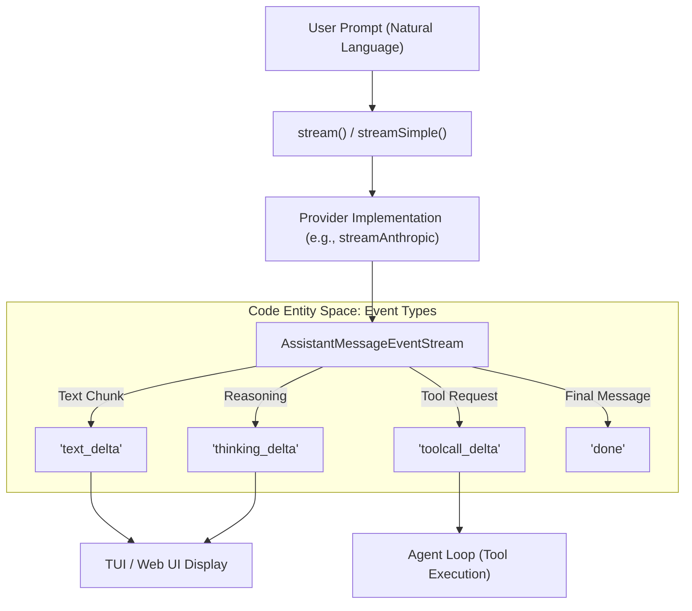
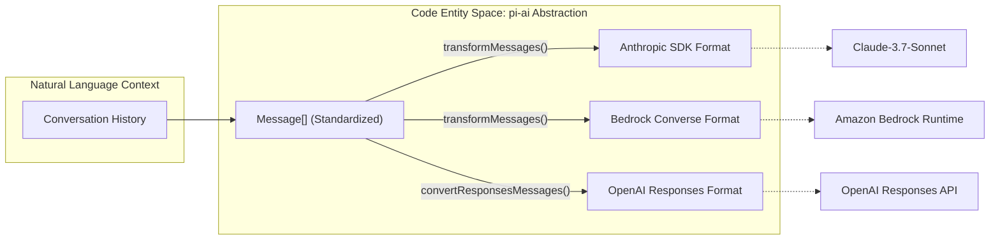

# LLM Provider 추상화 (pi-ai)

관련 소스 파일

다음 파일들은 이 위키 페이지를 생성하기 위한 컨텍스트로 사용되었습니다.

- [packages/ai/README.md](packages/ai/README.md)
- [packages/ai/src/index.ts](packages/ai/src/index.ts)
- [packages/ai/src/models.ts](packages/ai/src/models.ts)
- [packages/ai/src/providers/amazon-bedrock.ts](packages/ai/src/providers/amazon-bedrock.ts)
- [packages/ai/src/providers/anthropic.ts](packages/ai/src/providers/anthropic.ts)
- [packages/ai/src/providers/google.ts](packages/ai/src/providers/google.ts)
- [packages/ai/src/providers/openai-completions.ts](packages/ai/src/providers/openai-completions.ts)
- [packages/ai/src/providers/openai-responses.ts](packages/ai/src/providers/openai-responses.ts)
- [packages/ai/src/stream.ts](packages/ai/src/stream.ts)
- [packages/ai/src/types.ts](packages/ai/src/types.ts)
- [packages/ai/test/anthropic-adaptive-thinking-models.test.ts](packages/ai/test/anthropic-adaptive-thinking-models.test.ts)
- [packages/ai/test/anthropic-eager-tool-input-compat.test.ts](packages/ai/test/anthropic-eager-tool-input-compat.test.ts)
- [packages/ai/test/anthropic-force-adaptive-thinking.test.ts](packages/ai/test/anthropic-force-adaptive-thinking.test.ts)
- [packages/ai/test/anthropic-opus-4-8-smoke.test.ts](packages/ai/test/anthropic-opus-4-8-smoke.test.ts)
- [packages/ai/test/anthropic-thinking-disable.test.ts](packages/ai/test/anthropic-thinking-disable.test.ts)
- [packages/ai/test/bedrock-endpoint-resolution.test.ts](packages/ai/test/bedrock-endpoint-resolution.test.ts)
- [packages/ai/test/bedrock-thinking-payload.test.ts](packages/ai/test/bedrock-thinking-payload.test.ts)
- [packages/ai/test/openai-completions-tool-choice.test.ts](packages/ai/test/openai-completions-tool-choice.test.ts)
- [packages/ai/test/supports-xhigh.test.ts](packages/ai/test/supports-xhigh.test.ts)

`@mariozechner/pi-ai` 패키지는 다양한 Large Language Model(LLM) providers와 상호작용하기 위한 통합 streaming interface를 제공합니다. provider별 SDK 복잡성을 추상화하여 text generation, tool calling, "thinking"(reasoning), prompt caching 같은 고급 기능에 대한 일관된 API를 제공합니다.

## 목적과 범위

`pi-ai`의 핵심 목표는 model-agnostic agentic workflows를 가능하게 하는 것입니다. 이를 위해 다음을 제공합니다.
- **Unified Streaming API**: OpenAI, Anthropic, Google(Gemini/Vertex), Amazon Bedrock, Mistral을 포함한 모든 지원 providers에서 실시간 model output을 처리하기 위한 단일 protocol입니다 [packages/ai/src/stream.ts:40-74]().
- **Automatic Model Discovery**: pricing, context limits, capability flags를 포함하는 model metadata registry입니다 [packages/ai/src/models.ts:1-13]().
- **Context Persistence**: 서로 다른 models와 providers 사이에서 conversation history를 매끄럽게 hand-off할 수 있게 하는 표준화된 `Context` 형식입니다 [packages/ai/src/types.ts:253-258]().
- **Token and Cost Tracking**: model별 pricing을 기준으로 input, output, cache-related tokens와 costs를 통합 계산합니다 [packages/ai/src/models.ts:39-46]().

출처: [packages/ai/src/stream.ts:1-74](), [packages/ai/src/types.ts:1-260](), [packages/ai/src/models.ts:1-93]().

## Unified Streaming API

추상화 계층은 두 가지 주요 상호작용 패턴인 `stream()`과 `complete()`를 노출합니다. 둘 다 표준화된 `AssistantMessageEventStream`에서 동작하며, 이 stream은 text deltas, tool call updates, thinking/reasoning blocks에 대한 events를 방출합니다.

### 시스템 흐름: Stream Event Lifecycle

이 다이어그램은 Natural Language space(User Prompt)를 Code Entity space(Event Stream)에 연결합니다.

출처: [packages/ai/src/stream.ts:40-74](), [packages/ai/src/utils/event-stream.ts:1-100](), [packages/ai/src/types.ts:147-159](), [packages/ai/src/providers/anthropic.ts:215-260]().

event protocol과 특정 provider logic(OpenAI, Anthropic, Google, Azure, Bedrock 등)에 대한 자세한 내용은 **[Streaming API and Provider Implementations](#3.1)**를 참조하세요.

## Model Registry와 Discovery

이 패키지는 알려진 models와 그 capabilities에 대한 포괄적인 registry를 포함합니다. 이 metadata를 통해 시스템은 agent core에서 모든 model에 대한 logic을 hardcode하지 않고도 vision support, tool calling constraints, pricing calculations 같은 기능을 자동으로 처리할 수 있습니다.

| Feature | 설명 | 코드 참조 |
| :--- | :--- | :--- |
| **Model Registry** | context limits와 pricing을 포함한 생성된 model 목록입니다. | `MODELS` [packages/ai/src/models.ts:1-13]() |
| **Cost Calculation** | `Usage`와 model rates에서 total cost를 계산하는 logic입니다. | `calculateCost()` [packages/ai/src/models.ts:39-46]() |
| **Credential Resolution** | environment variables 또는 config에서 API keys를 검색합니다. | `getEnvApiKey()` [packages/ai/src/env-api-keys.ts:1-50]() |

출처: [packages/ai/src/types.ts:228-251](), [packages/ai/src/env-api-keys.ts:1-50](), [packages/ai/src/models.ts:1-93]().

models가 어떻게 resolve되고 API keys가 어떻게 관리되는지에 대한 자세한 내용은 **[Model Registry and Credential Resolution](#3.2)**를 참조하세요.

## Cross-Provider Concerns

LLM 추상화의 중요한 과제는 providers를 전환할 때 session continuity를 유지하는 것입니다. `pi-ai`는 message transformation과 표준화된 feature mapping을 통해 이를 처리합니다.

### Feature Mapping: Thinking and Caching

시스템은 "high reasoning effort" 같은 고수준 intents를 provider별 parameters로 매핑합니다.
- **Thinking Levels**: `minimal`에서 `xhigh`까지의 levels를 Anthropic의 `effort` [packages/ai/src/providers/anthropic.ts:184-211]() 또는 Bedrock의 `reasoning` [packages/ai/src/providers/amazon-bedrock.ts:59-62]() 같은 provider별 flags에 매핑합니다.
- **Prompt Caching**: Anthropic [packages/ai/src/providers/anthropic.ts:43-66]() 및 OpenAI Responses [packages/ai/src/providers/openai-responses.ts:47-52]() 같은 providers 전반에서 `cache_control` markers와 session affinity headers를 정규화합니다.

### Context Migration Logic

출처: [packages/ai/src/providers/transform-messages.ts:1-100](), [packages/ai/src/providers/anthropic.ts:37-39](), [packages/ai/src/providers/amazon-bedrock.ts:51-51](), [packages/ai/src/providers/openai-responses.ts:21-22]().

message transformation, adaptive thinking, prompt caching strategies에 대한 자세한 내용은 **[Prompt Caching, Thinking, and Cross-Provider Handoff](#3.3)**를 참조하세요.

***

**하위 페이지:**
- [Streaming API and Provider Implementations](#3.1)
- [Model Registry and Credential Resolution](#3.2)
- [Prompt Caching, Thinking, and Cross-Provider Handoff](#3.3)
