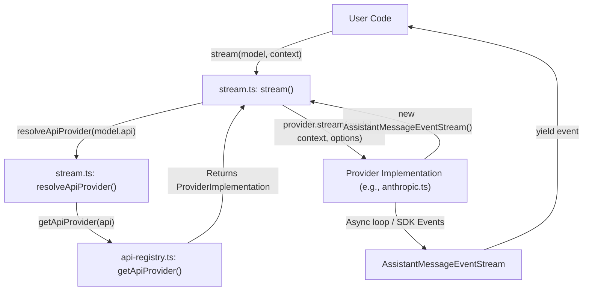
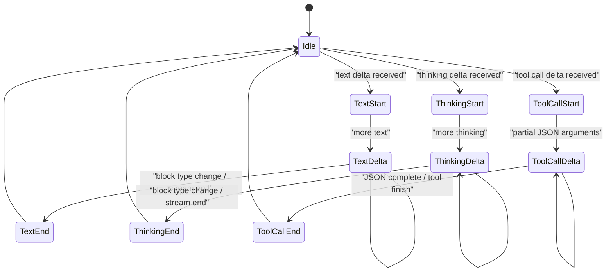

# Streaming API와 Provider 구현

관련 소스 파일

다음 파일들은 이 위키 페이지를 생성하기 위한 컨텍스트로 사용되었습니다.

- [packages/ai/README.md](packages/ai/README.md)
- [packages/ai/src/index.ts](packages/ai/src/index.ts)
- [packages/ai/src/models.ts](packages/ai/src/models.ts)
- [packages/ai/src/providers/amazon-bedrock.ts](packages/ai/src/providers/amazon-bedrock.ts)
- [packages/ai/src/providers/anthropic.ts](packages/ai/src/providers/anthropic.ts)
- [packages/ai/src/providers/azure-openai-responses.ts](packages/ai/src/providers/azure-openai-responses.ts)
- [packages/ai/src/providers/google-shared.ts](packages/ai/src/providers/google-shared.ts)
- [packages/ai/src/providers/google-vertex.ts](packages/ai/src/providers/google-vertex.ts)
- [packages/ai/src/providers/google.ts](packages/ai/src/providers/google.ts)
- [packages/ai/src/providers/mistral.ts](packages/ai/src/providers/mistral.ts)
- [packages/ai/src/providers/openai-codex-responses.ts](packages/ai/src/providers/openai-codex-responses.ts)
- [packages/ai/src/providers/openai-completions.ts](packages/ai/src/providers/openai-completions.ts)
- [packages/ai/src/providers/openai-prompt-cache.ts](packages/ai/src/providers/openai-prompt-cache.ts)
- [packages/ai/src/providers/openai-responses-shared.ts](packages/ai/src/providers/openai-responses-shared.ts)
- [packages/ai/src/providers/openai-responses.ts](packages/ai/src/providers/openai-responses.ts)
- [packages/ai/src/stream.ts](packages/ai/src/stream.ts)
- [packages/ai/src/types.ts](packages/ai/src/types.ts)
- [packages/ai/test/abort.test.ts](packages/ai/test/abort.test.ts)
- [packages/ai/test/anthropic-adaptive-thinking-models.test.ts](packages/ai/test/anthropic-adaptive-thinking-models.test.ts)
- [packages/ai/test/anthropic-eager-tool-input-compat.test.ts](packages/ai/test/anthropic-eager-tool-input-compat.test.ts)
- [packages/ai/test/anthropic-force-adaptive-thinking.test.ts](packages/ai/test/anthropic-force-adaptive-thinking.test.ts)
- [packages/ai/test/anthropic-opus-4-8-smoke.test.ts](packages/ai/test/anthropic-opus-4-8-smoke.test.ts)
- [packages/ai/test/anthropic-thinking-disable.test.ts](packages/ai/test/anthropic-thinking-disable.test.ts)
- [packages/ai/test/anthropic-tool-name-normalization.test.ts](packages/ai/test/anthropic-tool-name-normalization.test.ts)
- [packages/ai/test/azure-openai-base-url.test.ts](packages/ai/test/azure-openai-base-url.test.ts)
- [packages/ai/test/bedrock-endpoint-resolution.test.ts](packages/ai/test/bedrock-endpoint-resolution.test.ts)
- [packages/ai/test/bedrock-thinking-payload.test.ts](packages/ai/test/bedrock-thinking-payload.test.ts)
- [packages/ai/test/context-overflow.test.ts](packages/ai/test/context-overflow.test.ts)
- [packages/ai/test/empty.test.ts](packages/ai/test/empty.test.ts)
- [packages/ai/test/google-shared-gemini3-unsigned-tool-call.test.ts](packages/ai/test/google-shared-gemini3-unsigned-tool-call.test.ts)
- [packages/ai/test/google-vertex-api-key-resolution.test.ts](packages/ai/test/google-vertex-api-key-resolution.test.ts)
- [packages/ai/test/image-tool-result.test.ts](packages/ai/test/image-tool-result.test.ts)
- [packages/ai/test/lazy-module-load.test.ts](packages/ai/test/lazy-module-load.test.ts)
- [packages/ai/test/openai-codex-stream.test.ts](packages/ai/test/openai-codex-stream.test.ts)
- [packages/ai/test/openai-completions-prompt-cache.test.ts](packages/ai/test/openai-completions-prompt-cache.test.ts)
- [packages/ai/test/openai-completions-tool-choice.test.ts](packages/ai/test/openai-completions-tool-choice.test.ts)
- [packages/ai/test/openai-responses-copilot-provider.test.ts](packages/ai/test/openai-responses-copilot-provider.test.ts)
- [packages/ai/test/openai-responses-message-id.test.ts](packages/ai/test/openai-responses-message-id.test.ts)
- [packages/ai/test/stream.test.ts](packages/ai/test/stream.test.ts)
- [packages/ai/test/supports-xhigh.test.ts](packages/ai/test/supports-xhigh.test.ts)
- [packages/ai/test/tokens.test.ts](packages/ai/test/tokens.test.ts)
- [packages/ai/test/tool-call-without-result.test.ts](packages/ai/test/tool-call-without-result.test.ts)
- [packages/ai/test/total-tokens.test.ts](packages/ai/test/total-tokens.test.ts)
- [packages/ai/test/unicode-surrogate.test.ts](packages/ai/test/unicode-surrogate.test.ts)
- [packages/coding-agent/test/clipboard.test.ts](packages/coding-agent/test/clipboard.test.ts)

이 페이지는 `@mariozechner/pi-ai` 패키지가 제공하는 통합 streaming interface와 다양한 LLM providers에 대한 구체적인 구현을 자세히 설명합니다. 이 아키텍처는 provider별 SDK 차이를 추상화하면서도 tool calling, extended thinking, prompt caching 같은 고급 기능에 대한 높은 충실도의 접근을 유지합니다.

## Unified Streaming API

`pi-ai` 패키지의 핵심은 central registry에서 providers를 resolve하여 서로 다른 LLM APIs와 상호작용하기 위한 일관된 interface를 제공하는 함수 집합입니다 [packages/ai/src/stream.ts:32-38]().

### 핵심 함수
*   **`stream(model, context, options)`**: streaming responses를 위한 기본 entry point입니다. registry를 통해 적절한 provider를 resolve하고 `AssistantMessageEvent` 객체 stream을 시작합니다 [packages/ai/src/stream.ts:40-47]().
*   **`complete(model, context, options)`**: 모든 events를 누적하고 단일 `Promise<AssistantMessage>`를 반환하는 `stream()`의 convenience wrapper입니다 [packages/ai/src/stream.ts:49-56]().
*   **`streamSimple(model, context, options)`**: `stream()`과 유사하지만 통합 `reasoning`(`ThinkingLevel`) parameter를 포함하는 `SimpleStreamOptions`를 받습니다 [packages/ai/src/stream.ts:58-65]().
*   **`completeSimple(model, context, options)`**: `streamSimple()`의 non-streaming version입니다 [packages/ai/src/stream.ts:67-74]().

### AssistantMessageEventStream
모든 streaming functions는 events의 async iterable인 `AssistantMessageEventStream`을 반환합니다 [packages/ai/src/utils/event-stream.ts:1-50](). 이 stream은 model 진행 상황에 대한 fine-grained updates를 방출합니다.

| Event Type | 설명 | 주요 데이터 |
| :--- | :--- | :--- |
| `start` | request가 시작될 때 방출됩니다. | `partial`: 초기 `AssistantMessage` |
| `text_start` | 첫 text chunk를 수신할 때 방출됩니다. | `contentIndex`: message content array의 index |
| `text_delta` | 생성된 text의 모든 chunk에 대해 방출됩니다. | `delta`: 새 string fragment |
| `text_end` | text block이 완료될 때 방출됩니다. | `content`: 최종 text string |
| `thinking_start` | reasoning/thinking이 시작될 때 방출됩니다. | `contentIndex`: content array의 index |
| `thinking_delta` | reasoning/thinking chunks에 대해 방출됩니다. | `delta`: thinking fragment |
| `thinking_end` | reasoning이 완료될 때 방출됩니다. | `content`: 최종 thinking string |
| `toolcall_start` | tool call block이 시작될 때 방출됩니다. | `contentIndex`: content array의 index |
| `toolcall_delta` | partial tool argument JSON에 대해 방출됩니다. | `delta`: JSON fragment |
| `toolcall_end` | tool call이 완전히 파싱될 때 방출됩니다. | `toolCall`: 완료된 `ToolCall` object |
| `done` | stream이 성공적으로 끝날 때 방출됩니다. | `message`: 최종 `AssistantMessage` |
| `error` | terminal error가 발생할 때 방출됩니다. | `error`: error details가 포함된 `AssistantMessage` |

**출처:** [packages/ai/src/stream.ts:40-74](), [packages/ai/src/types.ts:2-4](), [packages/ai/src/utils/event-stream.ts:1-50]()

## 데이터 흐름: Call에서 Stream까지

다음 다이어그램은 `stream()` 호출이 registry를 거쳐 특정 provider implementation으로 routing되는 방식을 보여줍니다.

### 코드 엔터티 매핑: API Routing

**출처:** [packages/ai/src/stream.ts:32-47](), [packages/ai/src/api-registry.ts:1-20](), [packages/ai/src/utils/event-stream.ts:1-50]()

## Provider 구현

각 provider implementation은 `getEnvApiKey`를 통한 credential resolution [packages/ai/src/env-api-keys.ts:4-29](), `transformMessages`를 사용한 message transformation [packages/ai/src/providers/transform-messages.ts:1-50](), provider별 SDK events를 정규화된 `pi-ai` events로 매핑하는 일을 담당합니다.

### OpenAI (Completions & Responses)
*   **`openai-completions`**: 표준 chat completions API를 처리합니다. index와 ID로 tool call blocks를 추적하고, `parseStreamingJson`을 통해 streaming JSON arguments를 파싱합니다 [packages/ai/src/providers/openai-completions.ts:162-208]().
*   **`openai-responses`**: 더 새로운 Responses API입니다. event mapping에 `processResponsesStream`을 사용하고 reasoning effort를 처리합니다 [packages/ai/src/providers/openai-responses.ts:130-134]().
*   **Shared Logic**: 표준 구현과 Codex 구현 모두 `convertResponsesMessages`와 `convertResponsesTools`를 공유하여 일관된 ID normalization과 tool schema mapping을 보장합니다 [packages/ai/src/providers/openai-responses-shared.ts:1-100]().

### Anthropic
Anthropic 구현 [packages/ai/src/providers/anthropic.ts]()에는 다음을 위한 특정 logic이 포함됩니다.
*   **Claude Code Stealth Mode**: 공식 client behavior를 모방하기 위해 tool names를 "Claude Code" canonical casing에 맞게 normalize합니다(예: `bash` -> `Bash`) [packages/ai/src/providers/anthropic.ts:74-105]().
*   **Adaptive Thinking**: Claude 3.7+ models에 대해 `ThinkingLevel`을 adaptive `effort` levels(예: `max`, `xhigh`, `high`, `medium`, `low`)로 매핑합니다 [packages/ai/src/providers/anthropic.ts:159-211]().
*   **Cache Control**: long retention을 위한 optional TTL과 함께 ephemeral cache control을 지원합니다 [packages/ai/src/providers/anthropic.ts:53-66]().

### Google (Generative AI & Vertex)
*   **Thought Signatures**: chunks 전체에서 reasoning context를 보존하기 위해 `retainThoughtSignature`를 사용합니다 [packages/ai/src/providers/google.ts:133-136]().
*   **Tool ID Generation**: API가 tool calls에 ID를 제공하지 않는 경우 고유 ID를 생성하여 session manager와의 호환성을 보장합니다 [packages/ai/src/providers/google.ts:179-184]().

### Amazon Bedrock
`BedrockRuntimeClient`와 `ConverseStreamCommand`를 사용합니다 [packages/ai/src/providers/amazon-bedrock.ts:1-23]().
*   **Authentication**: Bedrock API keys에 대해 표준 SigV4와 `bearerToken` authentication을 모두 지원합니다 [packages/ai/src/providers/amazon-bedrock.ts:141-142]().
*   **Thinking**: Bedrock content block structure를 통해 `thinking` blocks를 처리하고 `thinkingDisplay`(summarized vs omitted)를 지원합니다 [packages/ai/src/providers/amazon-bedrock.ts:65-75]().

### OpenAI Codex (WebSocket & SSE)
`openai-codex-responses` API를 위한 특수 구현입니다 [packages/ai/src/providers/openai-codex-responses.ts]().
*   **Transport Flexibility**: WebSocket과 SSE transports를 모두 지원하며, "Message Too Big"(code 1009) 같은 WebSocket-specific issues에 대한 특정 error handling을 포함합니다 [packages/ai/src/providers/openai-codex-responses.ts:59-74]().
*   **Retry Logic**: rate limits와 service unavailability에 대한 견고한 retry mechanisms를 구현합니다 [packages/ai/src/providers/openai-codex-responses.ts:112-120]().

## Event Mapping Logic

Providers는 content blocks의 lifecycle을 추적하여 internal deltas를 통합 event types로 매핑합니다.

### 구현: Block Lifecycle

**출처:** [packages/ai/src/providers/google.ts:90-155](), [packages/ai/src/providers/openai-completions.ts:162-208](), [packages/ai/src/providers/anthropic.ts:31-37]()

## Provider 기능 요약

| Provider | API Key Env | Thinking Support | Tool Support | Caching Support |
| :--- | :--- | :--- | :--- | :--- |
| **OpenAI** | `OPENAI_API_KEY` | Yes (Reasoning Effort) | Yes | Yes (Metadata/Session) |
| **Anthropic** | `ANTHROPIC_API_KEY` | Yes (Adaptive Effort) | Yes | Yes (Ephemeral/TTL) |
| **Google** | `GOOGLE_API_KEY` | Yes (Thinking blocks) | Yes | Yes (Context) |
| **Bedrock** | `AWS_ACCESS_KEY_ID` | Yes (Claude 3.7+) | Yes | No |
| **Mistral** | `MISTRAL_API_KEY` | Yes | Yes | No |

**출처:** [packages/ai/src/providers/openai-responses.ts:109-115](), [packages/ai/src/providers/anthropic.ts:53-66](), [packages/ai/src/providers/google.ts:74-78](), [packages/ai/src/providers/amazon-bedrock.ts:141-142]()
