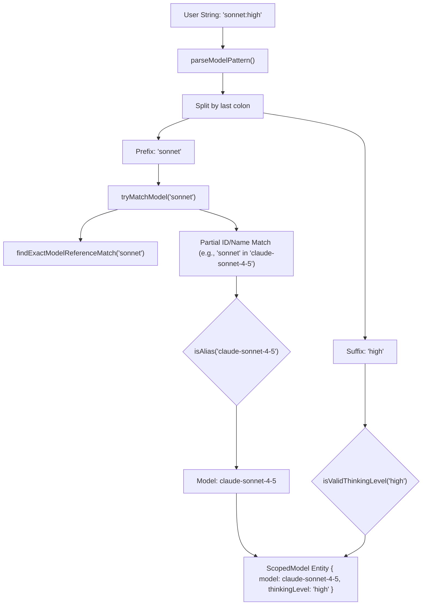
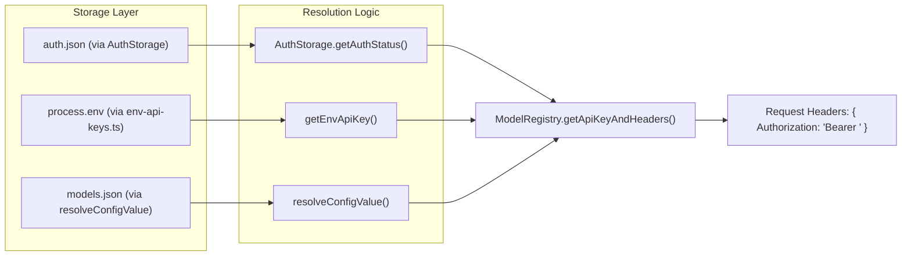

# Model Registry와 Credential Resolution

관련 소스 파일

다음 파일들은 이 위키 페이지를 생성하기 위한 컨텍스트로 사용되었습니다.

- [packages/ai/scripts/generate-models.ts](packages/ai/scripts/generate-models.ts)
- [packages/ai/src/env-api-keys.ts](packages/ai/src/env-api-keys.ts)
- [packages/ai/src/models.generated.ts](packages/ai/src/models.generated.ts)
- [packages/ai/src/providers/simple-options.ts](packages/ai/src/providers/simple-options.ts)
- [packages/coding-agent/docs/custom-provider.md](packages/coding-agent/docs/custom-provider.md)
- [packages/coding-agent/docs/models.md](packages/coding-agent/docs/models.md)
- [packages/coding-agent/docs/providers.md](packages/coding-agent/docs/providers.md)
- [packages/coding-agent/src/core/auth-storage.ts](packages/coding-agent/src/core/auth-storage.ts)
- [packages/coding-agent/src/core/model-registry.ts](packages/coding-agent/src/core/model-registry.ts)
- [packages/coding-agent/src/core/model-resolver.ts](packages/coding-agent/src/core/model-resolver.ts)
- [packages/coding-agent/src/core/resolve-config-value.ts](packages/coding-agent/src/core/resolve-config-value.ts)
- [packages/coding-agent/test/auth-storage.test.ts](packages/coding-agent/test/auth-storage.test.ts)
- [packages/coding-agent/test/model-registry.test.ts](packages/coding-agent/test/model-registry.test.ts)
- [packages/coding-agent/test/model-resolver.test.ts](packages/coding-agent/test/model-resolver.test.ts)

model registry와 credential resolution system은 여러 providers 전반에서 LLM을 검색하고, technical capabilities(reasoning, vision, context windows)를 해석하며, 필요한 authentication tokens를 안전하게 가져오기 위한 통합 interface를 제공합니다.

## Model Registry

model registry는 build-time generation부터 runtime discovery와 사용자 정의 overrides까지 model metadata의 생명주기를 관리합니다.

### Build-time Generation (`generate-models.ts`)

수동 유지보수 없이 최신 model 목록을 유지하기 위해, 시스템은 여러 sources의 데이터를 집계하는 build script `generate-models.ts` [packages/ai/scripts/generate-models.ts:1-2]()를 사용합니다.
1.  **Dynamic Discovery:** OpenRouter API [packages/ai/scripts/generate-models.ts:122-123]()와 NVIDIA NIM [packages/ai/scripts/generate-models.ts:124-127]() 같은 sources에서 model data를 가져옵니다.
2.  **Normalization:** provider-specific pricing(예: input/output/cache costs)과 metadata를 normalize합니다 [packages/ai/scripts/generate-models.ts:27-32]().
3.  **Thinking Level Mapping:** pi의 abstract levels(minimal, high 등)가 OpenAI의 `reasoning_effort` 또는 Anthropic의 adaptive thinking 같은 provider-specific strings 또는 values에 어떻게 매핑되는지 정의합니다 [packages/ai/scripts/generate-models.ts:163-178]().
4.  **Output:** `models.generated.ts`에 static `MODELS` registry를 생성합니다 [packages/ai/src/models.generated.ts:1-6](). 이 파일에는 Bedrock, Anthropic, OpenAI, Google 등 여러 models의 metadata가 수천 줄 포함됩니다 [packages/ai/src/models.generated.ts:7-241]().

### Runtime Registry (`ModelRegistry`)

`pi-coding-agent`의 `ModelRegistry` 클래스는 runtime에서 model discovery를 위한 기본 entry point입니다 [packages/coding-agent/src/core/model-registry.ts:1-20]().

*   **Custom Models:** `~/.pi/agent/models.json`에서 사용자 정의 models와 overrides를 로드합니다 [packages/coding-agent/src/core/model-registry.ts:22-27]().
*   **Validation:** custom models는 TypeBox를 사용해 `ModelDefinitionSchema`에 대해 validate됩니다 [packages/coding-agent/src/core/model-registry.ts:151-171]().
*   **API Compatibility:** `OpenAICompletionsCompat`처럼 표준 APIs를 emulate하는 providers를 위한 compatibility settings를 처리합니다 [packages/coding-agent/src/core/model-registry.ts:101-127]().

**출처:** [packages/ai/scripts/generate-models.ts](), [packages/ai/src/models.generated.ts](), [packages/coding-agent/src/core/model-registry.ts](), [packages/coding-agent/docs/models.md]()

---

## Model Resolution Algorithm

Model resolution은 사용자 제공 string(예: `--model` flag 또는 `/model` command)을 구체적인 `Model` 객체와 선택적 `ThinkingLevel`로 변환합니다.

### Resolution Flow

`parseModelPattern` 함수는 matching algorithm을 구현합니다 [packages/coding-agent/src/core/model-resolver.ts:192-215]().

1.  **Exact Match:** `findExactModelReferenceMatch()`를 통해 pattern이 `provider/modelId` 또는 bare `modelId`와 정확히 일치하는지 확인합니다 [packages/coding-agent/src/core/model-resolver.ts:76-118]().
2.  **Thinking Suffix:** match가 없고 pattern에 colon이 포함된 경우(예: `sonnet:high`), suffix가 `isValidThinkingLevel()`을 사용해 유효한 `ThinkingLevel`인지 확인합니다 [packages/coding-agent/src/core/model-resolver.ts:211-215](). 유효하면 suffix를 제거하고 prefix에 대해 재귀적으로 처리합니다.
3.  **Fuzzy/Glob Match:** 여전히 match가 없으면 `tryMatchModel()`이 model IDs와 names에 대해 partial case-insensitive search를 수행합니다 [packages/coding-agent/src/core/model-resolver.ts:124-135]().
4.  **Alias Preference:** 여러 models가 match되는 경우(예: `claude-3-5-sonnet` vs `claude-3-5-sonnet-20241022`), 알고리즘은 `isAlias()`를 통해 "aliases"(date suffixes가 없는 IDs)를 우선합니다 [packages/coding-agent/src/core/model-resolver.ts:62-69]().

### Initial Model Selection

시스템은 다음을 확인하여 세션의 starting model을 결정합니다.
1.  `--model` CLI argument.
2.  `PI_MODEL` environment variable.
3.  `defaultModelPerProvider`를 통한 provider별 hardcoded default [packages/coding-agent/src/core/model-resolver.ts:14-50]().

### Model Mapping: Natural Language to Code Entity

Title: Model Resolution Data Flow

**출처:** [packages/coding-agent/src/core/model-resolver.ts](), [packages/coding-agent/test/model-resolver.test.ts]()

---

## Credential Resolution

Credentials(API keys와 OAuth tokens)는 `AuthStorage`와 `env-api-keys.ts`가 관리하는 계층형 priority system을 통해 resolve됩니다.

### Resolution Priority

request가 만들어질 때 `ModelRegistry`는 다음 순서로 credentials를 resolve합니다.

1.  **CLI Overrides:** `--api-key`로 제공되고 `setRuntimeApiKey()`를 통해 설정됩니다 [packages/coding-agent/src/core/auth-storage.ts:229-231]().
2.  **Auth File (`auth.json`):** `~/.pi/agent/auth.json`에 저장됩니다. `AuthStorage`가 관리합니다 [packages/coding-agent/src/core/auth-storage.ts:24-35]().
3.  **Environment Variables:** `env-api-keys.ts`에 매핑된 `OPENAI_API_KEY` 또는 `ANTHROPIC_API_KEY` 같은 표준 variables입니다 [packages/ai/src/env-api-keys.ts:91-133]().
4.  **Custom Resolvers:** `models.json`에 정의된 shell commands입니다(예: `"apiKey": "!op read ..."`).

### Dynamic Value Resolution

`resolveConfigValue` 함수는 keys와 headers에 대해 지원되는 형식을 처리합니다 [packages/coding-agent/src/core/resolve-config-value.ts:39-42]().
*   **Literal:** 문자열을 그대로 사용합니다.
*   **Shell Command:** `!`로 시작하는 문자열은 `child_process`를 통해 실행되고, 해당 `stdout`이 값으로 사용됩니다 [packages/coding-agent/src/core/resolve-config-value.ts:36-36]().
*   **Environment Interpolation:** `$ENV_VAR` 또는 `${ENV_VAR}`를 포함하는 문자열은 현재 process environment를 사용해 확장됩니다 [packages/coding-agent/docs/providers.md:113-121]().

### OAuth Flow Implementation

GitHub Copilot 또는 OpenAI Codex 같은 subscription-based providers를 위해 시스템은 OAuth flows를 구현합니다.
1.  사용자는 `/login` command를 통해 시작합니다 [packages/coding-agent/docs/providers.md:14-22]().
2.  Credentials는 `AuthStorage`가 관리하며, 이 클래스는 여러 instances가 tokens를 refresh하려고 할 때 race conditions를 방지하기 위해 file locking(`proper-lockfile`)을 사용합니다 [packages/coding-agent/src/core/auth-storage.ts:7-22]().
3.  `withLockAsync` method는 `auth.json`에 대한 atomic updates를 보장합니다 [packages/coding-agent/src/core/auth-storage.ts:124-172]().

### Credential Entity Mapping

Title: Credential Discovery and Resolution

**출처:** [packages/coding-agent/src/core/auth-storage.ts](), [packages/coding-agent/src/core/model-registry.ts](), [packages/ai/src/env-api-keys.ts](), [packages/coding-agent/src/core/resolve-config-value.ts]()

---

## File Summary Table

| File | 역할 |
| :--- | :--- |
| `packages/ai/src/models.generated.ts` | 모든 built-in model metadata에 대한 auto-generated source of truth입니다 [packages/ai/src/models.generated.ts:1-6](). |
| `packages/ai/scripts/generate-models.ts` | registry를 빌드하기 위해 providers에서 데이터를 집계하는 script입니다 [packages/ai/scripts/generate-models.ts:1-23](). |
| `packages/coding-agent/src/core/model-registry.ts` | runtime model collection을 관리하고 `models.json`을 validate합니다 [packages/coding-agent/src/core/model-registry.ts:1-20](). |
| `packages/coding-agent/src/core/model-resolver.ts` | fuzzy matching, thinking level parsing, default selection logic을 구현합니다 [packages/coding-agent/src/core/model-resolver.ts:1-12](). |
| `packages/coding-agent/src/core/auth-storage.ts` | file locks를 사용해 `auth.json` credentials를 thread-safe하게 저장합니다 [packages/coding-agent/src/core/auth-storage.ts:1-22](). |
| `packages/ai/src/env-api-keys.ts` | providers를 표준 environment variable names에 매핑합니다 [packages/ai/src/env-api-keys.ts:91-133](). |

**출처:** [packages/ai/src/models.generated.ts](), [packages/ai/scripts/generate-models.ts](), [packages/coding-agent/src/core/model-registry.ts](), [packages/coding-agent/src/core/model-resolver.ts](), [packages/coding-agent/src/core/auth-storage.ts](), [packages/ai/src/env-api-keys.ts]()
