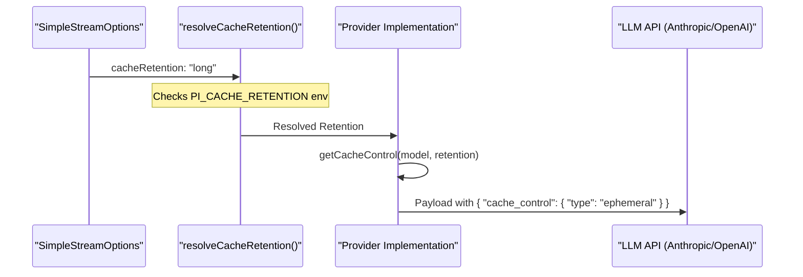
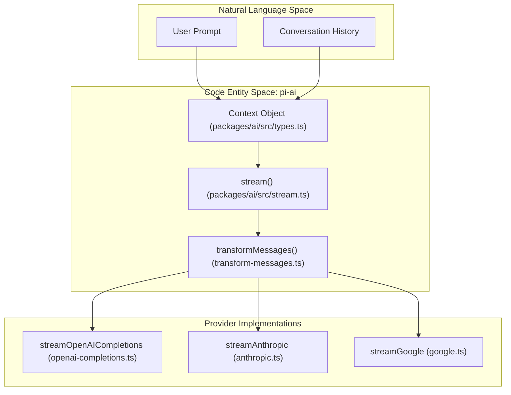
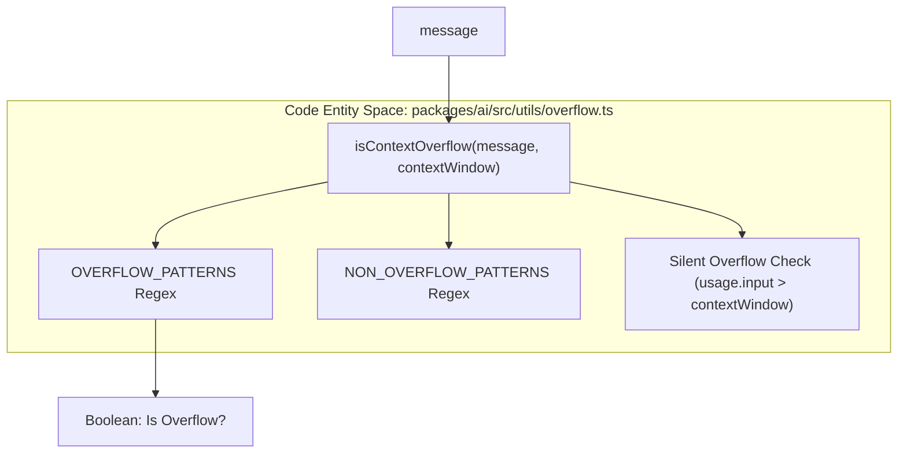

# Prompt Caching, Thinking, Cross-Provider Handoff

관련 소스 파일

다음 파일들은 이 위키 페이지를 생성하기 위한 컨텍스트로 사용되었습니다.

- [packages/ai/src/providers/transform-messages.ts](packages/ai/src/providers/transform-messages.ts)
- [packages/ai/src/utils/json-parse.ts](packages/ai/src/utils/json-parse.ts)
- [packages/ai/src/utils/overflow.ts](packages/ai/src/utils/overflow.ts)
- [packages/ai/test/anthropic-sse-parsing.test.ts](packages/ai/test/anthropic-sse-parsing.test.ts)
- [packages/ai/test/cache-retention.test.ts](packages/ai/test/cache-retention.test.ts)
- [packages/ai/test/cross-provider-handoff.test.ts](packages/ai/test/cross-provider-handoff.test.ts)
- [packages/ai/test/github-copilot-anthropic.test.ts](packages/ai/test/github-copilot-anthropic.test.ts)
- [packages/ai/test/overflow.test.ts](packages/ai/test/overflow.test.ts)
- [packages/ai/test/transform-messages-copilot-openai-to-anthropic.test.ts](packages/ai/test/transform-messages-copilot-openai-to-anthropic.test.ts)

이 페이지는 `@mariozechner/pi-ai` 패키지의 고급 기능을 자세히 설명하며, prompt caching과 internal reasoning(thinking) 같은 stateful LLM 기능을 어떻게 관리하는지, 그리고 서로 다른 model providers 사이에서 매끄러운 context migration을 어떻게 지원하는지에 초점을 둡니다.

## Prompt Caching

Prompt caching은 긴 contexts에 대한 prefix computations를 재사용하여 latency와 cost를 줄입니다. 시스템은 서로 다른 provider implementations 전반에서 caching을 위한 통합 interface를 구현합니다.

### Cache Retention and Control
`CacheRetention` 타입은 cached prompt에 대해 선호되는 persistence level인 `none`, `short`, `long`을 정의합니다 [packages/ai/src/types.ts:75-75]().

*   **OpenAI (Completions/Responses):** direct OpenAI requests의 경우 `long` retention은 `prompt_cache_retention` 필드를 통해 `24h` duration으로 매핑됩니다 [packages/ai/src/providers/openai-prompt-cache.ts:51-53](). 또한 64자로 clamp된 `sessionId`를 기준으로 `prompt_cache_key` 설정을 지원합니다 [packages/ai/src/providers/openai-prompt-cache.ts:46-49]().
*   **Anthropic:** `ephemeral` type의 `cache_control`을 사용합니다. `long` retention이 요청되고 model에서 지원되는 경우 `ttl: "1h"` 속성을 추가합니다 [packages/ai/src/providers/anthropic.ts:54-67]().
*   **Session Affinity:** session-based routing을 지원하는 providers의 경우 `sessionId`가 `session_id`, `x-client-request-id`, `x-session-affinity` 같은 headers를 통해 전달됩니다 [packages/ai/src/providers/openai-prompt-cache.ts:65-72](). 이는 `compat.sendSessionAffinityHeaders`로 구성할 수 있습니다 [packages/ai/src/providers/openai-prompt-cache.ts:64-64]().

### 데이터 흐름: Caching Request
다음 다이어그램은 request lifecycle 중 cache preferences가 어떻게 resolve되고 적용되는지 보여줍니다.

**Prompt Cache Resolution Flow**

출처: [packages/ai/src/providers/anthropic.ts:44-67](), [packages/ai/src/providers/openai-prompt-cache.ts:40-75](), [packages/ai/test/cache-retention.test.ts:23-50](), [packages/ai/test/openai-completions-prompt-cache.test.ts:114-133]()

---

## Thinking and Reasoning

"Thinking"은 최종 답변을 생성하기 전 model의 internal chain-of-thought process를 의미합니다. `pi-ai`는 이러한 blocks를 streaming하고 capture하기 위한 통합 interface를 제공합니다.

### Thinking Levels and Budgets
시스템은 provider-specific reasoning efforts를 추상화하기 위해 `ThinkingLevel` map(`minimal`, `low`, `medium`, `high`, `xhigh`)을 사용합니다 [packages/ai/src/types.ts:62-64]().

*   **Adaptive Thinking:** 최신 models(예: Claude 3.7, GPT-o1)는 model이 depth를 결정하는 adaptive thinking을 사용합니다. 이는 `reasoningEffort`(OpenAI) 또는 `effort`(Anthropic)를 통해 제어됩니다 [packages/ai/src/providers/openai-responses.ts:55-59](), [packages/ai/src/providers/anthropic.ts:181-203]().
*   **Budget-based Thinking:** 특정 models(예: Google Gemini 2.0+)는 reasoning을 제한하기 위해 `thinkingBudgetTokens`를 사용합니다 [packages/ai/src/providers/google.ts:38-43](), [packages/ai/src/types.ts:67-72]().

### Redacted Thinking and Signatures
model의 thinking이 redacted되는 경우(예: safety filters에 의해), 시스템은 `ThinkingContent` blocks를 통해 content를 처리합니다 [packages/ai/src/types.ts:252-261](). 
*   **`thinkingSignature`**: provider의 opaque, 보통 encrypted payloads를 저장합니다. 이 signature는 multi-turn continuity에 중요합니다. thinking text가 redacted되거나 UI에서 생략되더라도 subsequent turns에서 provider에 다시 전달되어야 하기 때문입니다 [packages/ai/src/providers/google.ts:131-134](), [packages/ai/src/types.ts:258-260]().
*   **`thoughtSignature`**: 위와 유사하지만, tool execution 중 reasoning context를 유지하기 위해 `ToolCall` 객체에서 특별히 사용됩니다 [packages/ai/src/types.ts:235-237]().

### Thinking Implementation Details
| Feature | OpenAI Implementation | Anthropic Implementation | Google Implementation |
| :--- | :--- | :--- | :--- |
| **Option Name** | `reasoningEffort` | `effort` | `thinking.budgetTokens` |
| **Content Type** | `thinking` block | `thinking` block | `thinking` block |
| **Streaming** | `thinking_delta` event | `thinking_delta` event | `thinking_delta` event |
| **Persistence** | `thinkingSignature` | Opaque signature in block | `thoughtSignature` |

출처: [packages/ai/src/providers/openai-responses.ts:153-160](), [packages/ai/src/providers/anthropic.ts:181-212](), [packages/ai/src/providers/google.ts:36-43](), [packages/ai/src/types.ts:62-72]()

---

## Cross-Provider Context Migration

`pi-ai`의 핵심 강점은 세션 중간에 conversation context를 한 provider에서 다른 provider로 hand off할 수 있다는 점입니다. 이는 주로 `transformMessages`가 처리합니다 [packages/ai/src/providers/transform-messages.ts:64-68]().

### `transformMessages` Logic
`transformMessages` 함수는 cross-provider compatibility를 보장하기 위해 여러 중요한 transformations를 수행합니다.

1.  **Image Downgrading**: target model이 vision을 지원하지 않는 경우(`!model.input.includes("image")`), image blocks는 `(image omitted: model does not support images)` 같은 placeholders로 대체됩니다 [packages/ai/src/providers/transform-messages.ts:12-13](), [packages/ai/src/providers/transform-messages.ts:35-57]().
2.  **Tool Call ID Normalization**: 서로 다른 providers는 다양한 ID constraints를 가집니다. 예를 들어 Anthropic은 `^[a-zA-Z0-9_-]+$`(최대 64자)를 요구하는 반면, OpenAI Responses는 pipe characters를 포함한 450자 이상의 IDs를 생성할 수 있습니다 [packages/ai/src/providers/transform-messages.ts:60-63](). 이 함수는 original IDs를 normalized versions로 매핑하고 대응하는 `toolResult` messages를 업데이트합니다 [packages/ai/src/providers/transform-messages.ts:69-87]().
3.  **Thinking Block Conversion**: 
    *   **Same Model**: replay를 위해 thinking blocks와 signatures(redacted content 포함)를 유지합니다 [packages/ai/src/providers/transform-messages.ts:98-106]().
    *   **Different Model**: redacted thinking은 제거됩니다. plaintext thinking은 새 model이 이전 model의 reasoning을 볼 수 있도록 표준 `text` blocks로 변환됩니다 [packages/ai/src/providers/transform-messages.ts:101-113](). `thoughtSignature`는 tool calls에서 제거됩니다 [packages/ai/src/providers/transform-messages.ts:128-131]().
4.  **Orphaned Tool Call Resolution**: 시스템은 corresponding result가 없는 tool calls를 식별합니다(예: error 또는 interruption 때문). complete turn sequences에 대한 API requirements를 충족하기 위해 `isError: true`와 "No result provided" text가 포함된 synthetic `toolResult` messages를 삽입합니다 [packages/ai/src/providers/transform-messages.ts:156-177]().

### 구현: Context Handoff Architecture
`stream` 함수는 entry point 역할을 하며, 올바른 provider를 resolve하고 `transformMessages`를 통해 transformation을 적용하는 implementation을 호출합니다.

**Context Handoff Architecture**

출처: [packages/ai/src/providers/transform-messages.ts:64-220](), [packages/ai/src/stream.ts:25-32](), [packages/ai/test/cross-provider-handoff.test.ts:1-23](), [packages/ai/test/transform-messages-copilot-openai-to-anthropic.test.ts:49-88]()

### Robustness Utilities
cross-provider handoff의 "messy"한 현실을 처리하기 위해 `pi-ai`는 다음을 포함합니다.
*   **`repairJson`**: raw control characters를 escape하고 tool call JSON의 invalid escape sequences를 수정합니다. 이는 streamed outputs에서 흔합니다 [packages/ai/src/utils/json-parse.ts:32-83]().
*   **`parseStreamingJson`**: `partial-json`과 `repairJson`을 사용해 incomplete tool call streams에서 가능한 한 많은 valid data를 추출합니다 [packages/ai/src/utils/json-parse.ts:104-124]().

### Token and Context Overflow
handoff 중 `pi-ai`는 cumulative `Usage`를 추적합니다. `isContextOverflow` 유틸리티는 combined context가 target model의 limits를 초과하는 시점을 감지합니다 [packages/ai/src/utils/overflow.ts:125-126]().
*   **Error Detection**: `OVERFLOW_PATTERNS`를 사용해 20개 이상의 providers(Anthropic, OpenAI, Google, Groq, xAI 등)의 error strings를 match합니다 [packages/ai/src/utils/overflow.ts:34-58]().
*   **Silent Overflow**: Xiaomi MiMo처럼 silent하게 truncate하는 providers를 감지합니다. 이는 `stopReason: "length"`와 zero output tokens, filled context window의 조합을 확인하여 수행됩니다 [packages/ai/src/utils/overflow.ts:104-108](), [packages/ai/test/overflow.test.ts:106-109]().

**Overflow Detection Logic**

출처: [packages/ai/src/utils/json-parse.ts:32-124](), [packages/ai/src/utils/overflow.ts:1-126](), [packages/ai/test/overflow.test.ts:1-120]()
