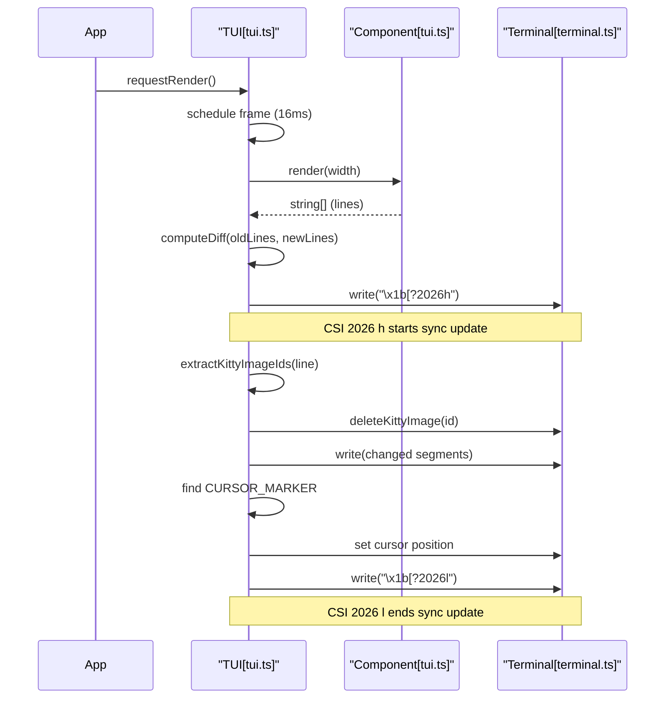

# Terminal UI (pi-tui)

<details>
<summary>관련 소스 파일</summary>

다음 파일들은 이 위키 페이지를 생성하기 위한 컨텍스트로 사용되었습니다.

- [packages/coding-agent/docs/terminal-setup.md](packages/coding-agent/docs/terminal-setup.md)
- [packages/coding-agent/docs/tui.md](packages/coding-agent/docs/tui.md)
- [packages/coding-agent/examples/extensions/overlay-qa-tests.ts](packages/coding-agent/examples/extensions/overlay-qa-tests.ts)
- [packages/tui/README.md](packages/tui/README.md)
- [packages/tui/native/darwin/prebuilds/darwin-arm64/darwin-modifiers.node](packages/tui/native/darwin/prebuilds/darwin-arm64/darwin-modifiers.node)
- [packages/tui/native/darwin/prebuilds/darwin-x64/darwin-modifiers.node](packages/tui/native/darwin/prebuilds/darwin-x64/darwin-modifiers.node)
- [packages/tui/native/darwin/src/darwin-modifiers.c](packages/tui/native/darwin/src/darwin-modifiers.c)
- [packages/tui/src/native-modifiers.ts](packages/tui/src/native-modifiers.ts)
- [packages/tui/src/terminal.ts](packages/tui/src/terminal.ts)
- [packages/tui/src/tui.ts](packages/tui/src/tui.ts)
- [packages/tui/test/chat-simple.ts](packages/tui/test/chat-simple.ts)
- [packages/tui/test/key-tester.ts](packages/tui/test/key-tester.ts)
- [packages/tui/test/overlay-non-capturing.test.ts](packages/tui/test/overlay-non-capturing.test.ts)
- [packages/tui/test/overlay-options.test.ts](packages/tui/test/overlay-options.test.ts)
- [packages/tui/test/overlay-short-content.test.ts](packages/tui/test/overlay-short-content.test.ts)
- [packages/tui/test/terminal.test.ts](packages/tui/test/terminal.test.ts)
- [packages/tui/test/tui-overlay-style-leak.test.ts](packages/tui/test/tui-overlay-style-leak.test.ts)
- [packages/tui/test/tui-render.test.ts](packages/tui/test/tui-render.test.ts)
- [packages/tui/test/virtual-terminal.ts](packages/tui/test/virtual-terminal.ts)

</details>


`@mariozechner/pi-tui` 패키지는 interactive CLI applications를 위해 특별히 설계된 고성능 differential rendering UI framework입니다. component-based architecture, 고급 terminal abstractions, 그리고 **CSI 2026** 같은 최신 terminal protocols를 사용한 flicker-free updates를 제공합니다. [packages/tui/README.md:1-15]()

## 핵심 개념

TUI는 components가 자신의 시각적 상태를 나타내는 strings(lines) 배열을 생성하는 "render-loop" 모델 위에 구축됩니다. 핵심 `TUI` 클래스는 lifecycle, input distribution, 그리고 이러한 lines를 terminal로 효율적으로 전송하는 작업을 관리합니다. [packages/tui/src/tui.ts:1-12]()

### Differential Rendering
높은 성능과 낮은 latency를 보장하기 위해 `pi-tui`는 변경된 부분만 업데이트하는 세 가지 전략의 rendering system을 사용합니다. [packages/tui/README.md:7-9](). 이전 terminal 상태를 추적하고, 현재 view를 다음 view로 변환하는 데 필요한 최소 escape sequences 집합을 계산합니다. 이는 streaming AI responses 같은 복잡한 작업 중 16ms frame budget을 유지하는 데 중요합니다. [packages/tui/src/tui.ts:1-12]()

자세한 내용은 [TUI Core: Rendering and Terminal Abstraction](#4.1)을 참조하세요.

### Component Model
시스템은 UI elements를 위한 단순하지만 강력한 interface를 사용합니다. 모든 시각적 element는 특정 viewport width가 주어졌을 때 어떻게 render되어야 하는지 정의하는 `Component` interface를 구현해야 합니다. [packages/tui/src/tui.ts:39-63]()

| Interface | 책임 |
| :--- | :--- |
| `Component` | 모든 UI elements의 base interface입니다. `render(width)`, `handleInput(data)`, `invalidate()`를 정의합니다. [packages/tui/src/tui.ts:39-63]() |
| `Focusable` | keyboard focus를 받을 수 있고 IME 지원을 위해 hardware cursor를 표시해야 하는 components를 위한 extension입니다. [packages/tui/src/tui.ts:74-77]() |
| `OverlayHandle` | overlay를 표시할 때 반환되는 handle이며, visibility와 focus를 제어하는 데 사용됩니다. [packages/tui/src/tui.ts:188-201]() |

### Input and Focus
Input은 중앙 집중식 listener system을 통해 처리됩니다. component가 `tui.setFocus(component)`를 통해 focus되면 keyboard data의 주 수신자가 됩니다. [packages/tui/README.md:38-47](). TUI는 batched input을 개별 sequences로 분할하기 위해 `StdinBuffer`를 사용하여, components가 reliable key matching을 위한 단일 events를 받을 수 있도록 보장합니다. [packages/tui/src/terminal.ts:178-182]()

자세한 내용은 [Editor, Input, and Keybindings](#4.2)를 참조하세요.

## 시스템 아키텍처

다음 다이어그램은 핵심 `TUI` engine, terminal abstraction, component library 사이의 관계를 보여줍니다.

### TUI Entity Relationship
```mermaid
graph TD
    subgraph "Terminal Abstraction"
        "Terminal[terminal.ts]" --> "ProcessTerminal[terminal.ts]"
        "Terminal[terminal.ts]" --> "VirtualTerminal[virtual-terminal.ts]"
    end

    subgraph "Core Engine"
        "TUI[tui.ts]" -- "manages" --> "Component[tui.ts]"
        "TUI[tui.ts]" -- "writes to" --> "Terminal[terminal.ts]"
        "TUI[tui.ts]" -- "handles" --> "OverlayHandle[tui.ts]"
        "ProcessTerminal[terminal.ts]" -- "negotiates" --> "KittyProtocol[terminal.ts]"
    end

    subgraph "Component Library"
        "Component[tui.ts]" <|-- "Container[tui.ts]"
        "Component[tui.ts]" <|-- "Editor[components/editor.ts]"
        "Component[tui.ts]" <|-- "Input[components/input.ts]"
        "Component[tui.ts]" <|-- "Markdown[components/markdown.ts]"
        "Component[tui.ts]" <|-- "Loader[components/loader.ts]"
    end

    "Container[tui.ts]" -- "contains" --> "Component[tui.ts]"
    "ProcessTerminal[terminal.ts]" -- "uses" --> "StdinBuffer[stdin-buffer.ts]"
    "TUI[tui.ts]" -- "positions" --> "CURSOR_MARKER[tui.ts]"
```
출처: [packages/tui/src/tui.ts:39-230](), [packages/tui/src/terminal.ts:53-112](), [packages/tui/README.md:53-154](), [packages/tui/src/tui.ts:90-90]()

## 주요 기능

### Synchronized Output
TUI는 frames가 atomic하게 render되도록 **CSI 2026**(Synchronized Output)을 사용합니다. 이는 화면의 큰 영역을 업데이트할 때 terminal applications에서 흔히 발생하는 "tearing" 또는 flickering을 방지합니다. [packages/tui/README.md:8]()

### Overlay System
`pi-tui`는 modals, dropdowns, floating dialogs를 위한 정교한 overlay system을 지원합니다. Overlays는 `OverlayOptions`를 통해 관리되며 anchors(예: `center`, `bottom-right`) 또는 percentage-based coordinates를 사용해 위치를 지정할 수 있습니다. [packages/tui/src/tui.ts:95-177](). 시스템은 생성 시 keyboard focus를 가져가지 않는 `nonCapturing` overlays를 지원합니다. [packages/tui/test/overlay-non-capturing.test.ts:56-72]()

### Keyboard Protocol Negotiation
`ProcessTerminal` 클래스는 terminal과 **Kitty keyboard protocol**을 자동으로 negotiate합니다. 이를 통해 많은 terminal emulators에서 standard keys와 구분하기 어려운 modifier keys(예: `Shift+Enter`)를 reliable하게 감지할 수 있습니다. [packages/tui/src/terminal.ts:164-168](). terminal이 Kitty를 지원하지 않으면 `modifyOtherKeys`로 fallback합니다. [packages/tui/test/terminal.test.ts:105-130]()

### TUI Rendering Flow

출처: [packages/tui/src/tui.ts:1-34](), [packages/tui/src/tui.ts:85-90](), [packages/tui/README.md:7-15](), [packages/tui/src/terminal.ts:68-74]()

## 하위 페이지

- **[TUI Core: Rendering and Terminal Abstraction](#4.1)**: differential rendering strategies, synchronized output, terminal abstraction(`Terminal`/`ProcessTerminal`), inline image protocols를 자세히 설명합니다.
- **[Editor, Input, and Keybindings](#4.2)**: multi-line `Editor`와 single-line `Input` components, grapheme-aware cursor movement, undo stack, `KeybindingsManager`를 다룹니다.
- **[TUI Components Library](#4.3)**: `Markdown`, `SelectList`, `SettingsList`, `Image`, `Box`, 그리고 IME 지원을 위한 `Focusable` interface를 포함한 built-in components catalog입니다.

---
출처:
- [packages/tui/src/tui.ts:1-230]()
- [packages/tui/src/terminal.ts:1-200]()
- [packages/tui/README.md:1-155]()
- [packages/coding-agent/docs/tui.md:9-85]()
- [packages/tui/test/terminal.test.ts:1-175]()
- [packages/tui/test/overlay-non-capturing.test.ts:1-113]()
