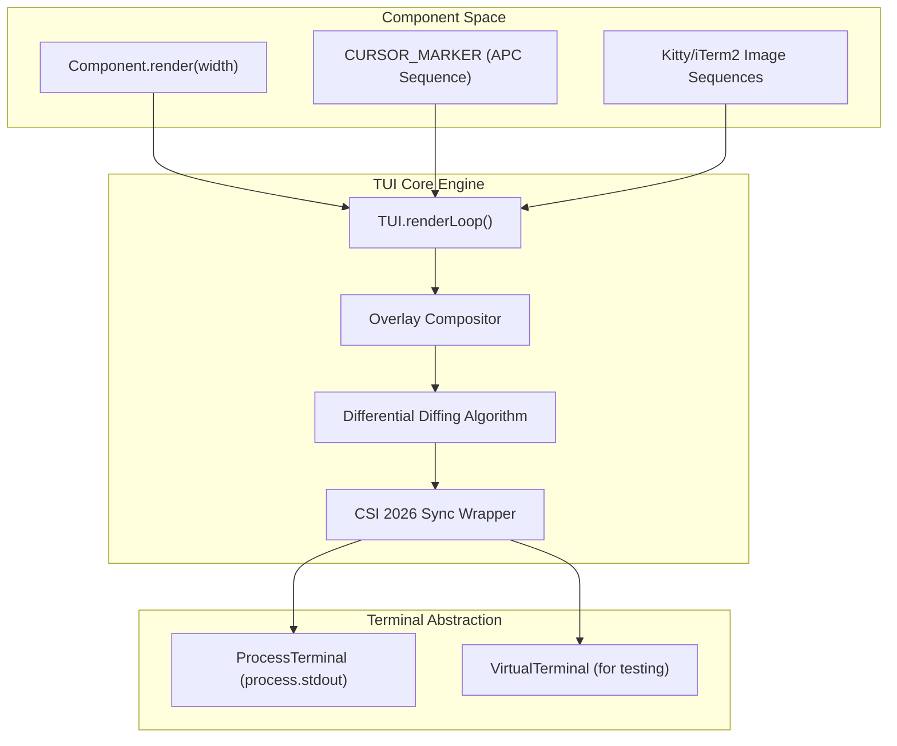
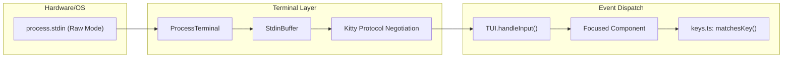

# TUI Core: 렌더링과 터미널 추상화

<details>
<summary>관련 소스 파일</summary>

다음 파일들은 이 위키 페이지를 생성하기 위한 컨텍스트로 사용되었습니다.

- [packages/coding-agent/docs/terminal-setup.md](packages/coding-agent/docs/terminal-setup.md)
- [packages/coding-agent/docs/tui.md](packages/coding-agent/docs/tui.md)
- [packages/coding-agent/examples/extensions/overlay-qa-tests.ts](packages/coding-agent/examples/extensions/overlay-qa-tests.ts)
- [packages/coding-agent/test/theme-detection.test.ts](packages/coding-agent/test/theme-detection.test.ts)
- [packages/tui/README.md](packages/tui/README.md)
- [packages/tui/native/darwin/prebuilds/darwin-arm64/darwin-modifiers.node](packages/tui/native/darwin/prebuilds/darwin-arm64/darwin-modifiers.node)
- [packages/tui/native/darwin/prebuilds/darwin-x64/darwin-modifiers.node](packages/tui/native/darwin/prebuilds/darwin-x64/darwin-modifiers.node)
- [packages/tui/native/darwin/src/darwin-modifiers.c](packages/tui/native/darwin/src/darwin-modifiers.c)
- [packages/tui/src/components/image.ts](packages/tui/src/components/image.ts)
- [packages/tui/src/native-modifiers.ts](packages/tui/src/native-modifiers.ts)
- [packages/tui/src/terminal-image.ts](packages/tui/src/terminal-image.ts)
- [packages/tui/src/terminal.ts](packages/tui/src/terminal.ts)
- [packages/tui/src/tui.ts](packages/tui/src/tui.ts)
- [packages/tui/src/utils.ts](packages/tui/src/utils.ts)
- [packages/tui/test/chat-simple.ts](packages/tui/test/chat-simple.ts)
- [packages/tui/test/key-tester.ts](packages/tui/test/key-tester.ts)
- [packages/tui/test/overlay-non-capturing.test.ts](packages/tui/test/overlay-non-capturing.test.ts)
- [packages/tui/test/overlay-options.test.ts](packages/tui/test/overlay-options.test.ts)
- [packages/tui/test/overlay-short-content.test.ts](packages/tui/test/overlay-short-content.test.ts)
- [packages/tui/test/regression-regional-indicator-width.test.ts](packages/tui/test/regression-regional-indicator-width.test.ts)
- [packages/tui/test/terminal-image.test.ts](packages/tui/test/terminal-image.test.ts)
- [packages/tui/test/terminal.test.ts](packages/tui/test/terminal.test.ts)
- [packages/tui/test/truncate-to-width.test.ts](packages/tui/test/truncate-to-width.test.ts)
- [packages/tui/test/tui-overlay-style-leak.test.ts](packages/tui/test/tui-overlay-style-leak.test.ts)
- [packages/tui/test/tui-render.test.ts](packages/tui/test/tui-render.test.ts)
- [packages/tui/test/virtual-terminal.ts](packages/tui/test/virtual-terminal.ts)
- [packages/tui/test/wrap-ansi.test.ts](packages/tui/test/wrap-ansi.test.ts)
- [packages/tui/vitest.config.ts](packages/tui/vitest.config.ts)

</details>


`@earendil-works/pi-tui` 패키지는 작지만 강력한 terminal user interface(TUI) 프레임워크를 제공합니다. component model, differential rendering, terminal abstraction layers를 갖추어 고성능의 flicker-free interactive CLI applications를 가능하게 합니다. 이 페이지는 핵심 `TUI` 클래스의 구현과 작동 방식, 이 클래스가 사용하는 differential rendering strategies, atomic screen updates를 위한 CSI 2026 synchronized output, `Terminal`/`ProcessTerminal` 추상화, Kitty와 iTerm2 protocols를 통한 inline image rendering support, overlay compositing system, 그리고 16ms frame rendering budget 적용을 자세히 설명합니다.

---

## TUI 클래스: 핵심 렌더링 엔진

[packages/tui/src/tui.ts:214]()의 `TUI` 클래스는 terminal rendering의 중심 orchestrator 역할을 합니다. child components를 관리하고, input events를 처리하며, terminal resizing을 다루고, UI updates를 효율적으로 render합니다.

### 주요 책임
- `Component` interface를 구현하는 component tree를 관리합니다 [packages/tui/src/tui.ts:39-63]().
- frames 사이의 diffs를 계산하여 redraws를 최소화하는 differential rendering을 제공합니다 [packages/tui/src/tui.ts:1335-1440]().
- `showOverlay`를 통해 modal 또는 floating UI elements를 위한 overlays를 지원합니다 [packages/tui/src/tui.ts:468-525]().
- `CURSOR_MARKER`를 사용해 cursor positioning과 IME-friendly hardware cursor support를 처리합니다 [packages/tui/src/tui.ts:90]().
- responsive UI updates를 보장하기 위해 고정 frame budget(약 16ms)을 유지합니다 [packages/tui/src/tui.ts:1310-1330]().

### Component Interface
Components는 [packages/tui/src/tui.ts:39-63]()에 정의된 최소 interface를 따릅니다.

```typescript
export interface Component {
    render(width: number): string[];
    handleInput?(data: string): void;
    wantsKeyRelease?: boolean;
    invalidate(): void;
}
```

Focusable components는 `Focusable` interface를 구현합니다 [packages/tui/src/tui.ts:74-77]().

```typescript
export interface Focusable {
    focused: boolean;
}
```

`CURSOR_MARKER`(`\x1b_pi:c\x07`)는 zero-width Application Program Command(APC) escape sequence입니다 [packages/tui/src/tui.ts:90](). Focused components는 자신의 `render` output에 이를 방출합니다. `TUI`는 이 marker를 스캔하고 제거한 뒤, IME candidate window positioning을 지원하기 위해 해당 위치에 hardware terminal cursor를 배치합니다 [packages/tui/src/tui.ts:1400-1420]().

### Differential Rendering Strategy

`TUI`는 terminal writes를 최소화하는 정교한 rendering loop [packages/tui/src/tui.ts:1335-1440]()를 사용합니다.

1.  **Frame Comparison**: `lastLines` buffer를 유지하고 이를 `renderChildren()`의 새 output과 비교합니다 [packages/tui/src/tui.ts:1348]().
2.  **Image-aware Diffing**: line에 image가 포함되어 있으면(`isImageLine`으로 감지), TUI는 Kitty image ID를 추적합니다. image가 이동하거나 변경되면 redraw 전에 `deleteKittyImage` command를 발행합니다 [packages/tui/src/tui.ts:1375-1390]().
3.  **Synchronized Updates**: terminal이 CSI 2026을 지원하면 전체 frame update를 `\x1b[?2026h` (begin) and `\x1b[?2026l` (end) to ensure atomic screen updates [packages/tui/src/tui.ts:1358-1438]().

### 16ms Frame Budget
responsiveness를 보장하기 위해 `TUI.requestRender()` [packages/tui/src/tui.ts:1310]()는 render calls를 coalesce합니다. `renderTimeout`을 사용해 높은 부하에서도 UI가 약 60fps refresh rate를 초과하지 않도록 하여 부드러운 interactive experience를 유지합니다.

**출처:** [packages/tui/src/tui.ts:39-1440](), [packages/tui/src/terminal-image.ts:141-148](), [packages/tui/README.md:169-185]()

---

## Terminal Abstraction과 ProcessTerminal

`Terminal` interface [packages/tui/src/terminal.ts:53-95]()는 TUI를 underlying environment에서 분리하여 `VirtualTerminal`을 통한 testing을 쉽게 합니다.

### ProcessTerminal 구현
`ProcessTerminal` [packages/tui/src/terminal.ts:99]()은 실제 `process.stdin`과 `process.stdout`을 관리합니다.

-   **Raw Mode**: `process.stdin.setRawMode(true)`를 통해 raw mode를 활성화합니다 [packages/tui/src/terminal.ts:141]().
-   **Keyboard Protocol**: **Kitty keyboard protocol**을 활성화하기 위해 active query를 수행합니다 [packages/tui/src/terminal.ts:167](). 이를 통해 modifier keys(Shift, Alt, Ctrl)와 key release events를 reliable하게 감지할 수 있습니다 [packages/tui/src/terminal.ts:18-35]().
-   **Input Normalization**: physical Shift key가 눌려 있을 때 Apple Terminal의 Return key를 Shift+Enter sequences로 rewrite하는 등 platform-specific quirks를 처리합니다 [packages/tui/src/terminal.ts:45-48]().
-   **StdinBuffer**: batched terminal input을 discrete escape sequences로 분할하기 위해 `StdinBuffer` [packages/tui/src/stdin-buffer.ts:10]()를 사용하여 `matchesKey()`가 올바르게 동작하도록 보장합니다 [packages/tui/src/terminal.ts:178-185]().

**출처:** [packages/tui/src/terminal.ts:1-200](), [packages/tui/src/stdin-buffer.ts:1-50]()

---

## Inline Image Rendering

TUI는 Kitty와 iTerm2 protocols를 사용한 high-fidelity image rendering을 지원합니다.

### Capability Detection
`detectCapabilities()` [packages/tui/src/terminal-image.ts:65-120]()는 environment variables(`TERM_PROGRAM`, `KITTY_WINDOW_ID`, `ITERM_SESSION_ID`)를 검사하여 사용할 protocol을 결정합니다. 특히 `tmux`의 경우 client가 OSC 8 hyperlinks를 forward하는지 probing하여 처리합니다 [packages/tui/src/terminal-image.ts:49-63]().

### Rendering Logic
`Image` component [packages/tui/src/components/image.ts:24]()는 적절한 escape sequences를 생성하기 위해 `renderImage()`를 사용합니다.

-   **Kitty Protocol**: `\x1b_G` sequences를 사용합니다 [packages/tui/src/terminal-image.ts:160](). 효율적인 updates를 위해 chunked base64 data와 image IDs를 지원합니다.
-   **iTerm2 Protocol**: `\x1b]1337;File=` sequences를 사용합니다 [packages/tui/src/terminal-image.ts:222]().
-   **Space Reservation**: images는 cells "위에" render되므로, TUI는 vertical space를 예약하기 위해 빈 lines를 방출하여 terminal scrollback이 image를 덮어쓰지 않도록 합니다 [packages/tui/src/components/image.ts:95-111]().

**출처:** [packages/tui/src/terminal-image.ts:1-230](), [packages/tui/src/components/image.ts:1-126]()

---

## Overlay Compositing System

Overlays는 base component tree 위에 UI elements(dialogs 또는 menus 등)를 render할 수 있게 합니다.

-   **Positioning**: `OverlayOptions` [packages/tui/src/tui.ts:141-177]()를 통해 관리되며, `anchor` points(예: `center`, `bottom-right`) 또는 absolute `row`/`col` coordinates를 지원합니다.
-   **Sizing**: `SizeValue`(numbers 또는 `"50%"` 같은 percentage strings)를 지원합니다 [packages/tui/src/tui.ts:119]().
-   **Focus Management**: `OverlayHandle` [packages/tui/src/tui.ts:188]()은 programmatic control을 가능하게 합니다. overlay가 표시되면 일반적으로 `nonCapturing`이 설정되지 않는 한 focus를 capture합니다 [packages/tui/src/tui.ts:176]().
-   **Compositing**: render cycle 중 overlays는 terminal bounds를 넘지 않도록 `sliceByColumn`과 `visibleWidth`를 사용해 base lines 위에 "painted"됩니다 [packages/tui/src/tui.ts:1180-1250]().

**출처:** [packages/tui/src/tui.ts:97-209](), [packages/tui/src/tui.ts:1180-1250]()

---

## 시스템 아키텍처 다이어그램

### 렌더링 파이프라인: Component에서 Terminal까지
이 다이어그램은 high-level `Component` output이 optimized terminal sequences로 변환되는 방식을 보여줍니다.



**출처:** [packages/tui/src/tui.ts:1335-1440](), [packages/tui/src/terminal.ts:53-95]()

### Input Handling: Hardware에서 Component까지
이 다이어그램은 terminal device의 raw bytes가 structured events로 변환되는 흐름을 추적합니다.



**출처:** [packages/tui/src/terminal.ts:100-185](), [packages/tui/src/stdin-buffer.ts:10-40](), [packages/tui/src/tui.ts:850-890]()

---

## 요약 표: 핵심 TUI 기능

| Feature | Implementation Entity | 목적 |
| :--- | :--- | :--- |
| **Atomic Updates** | `CSI 2026` sequences | 복잡한 redraws 중 화면 flickering을 방지합니다. |
| **Enhanced Input** | `Kitty Keyboard Protocol` | Shift+Enter, Ctrl+Backspace, key releases 감지를 가능하게 합니다. |
| **IME Support** | `CURSOR_MARKER` + `Focusable` | CJK candidate windows를 위해 hardware cursor를 배치합니다. |
| **Graphics** | `Kitty` / `iTerm2` Protocols | terminal 안에 high-resolution images를 직접 render합니다. |
| **Performance** | `Differential Diffing` | 변경된 characters/lines만 terminal에 씁니다. |
| **Layout** | `Overlay Compositor` | z-indexing이 있는 modal dialogs와 floating UI elements를 허용합니다. |

**출처:** [packages/tui/src/tui.ts:1-200](), [packages/tui/src/terminal.ts:100-150](), [packages/tui/README.md:1-50]()
