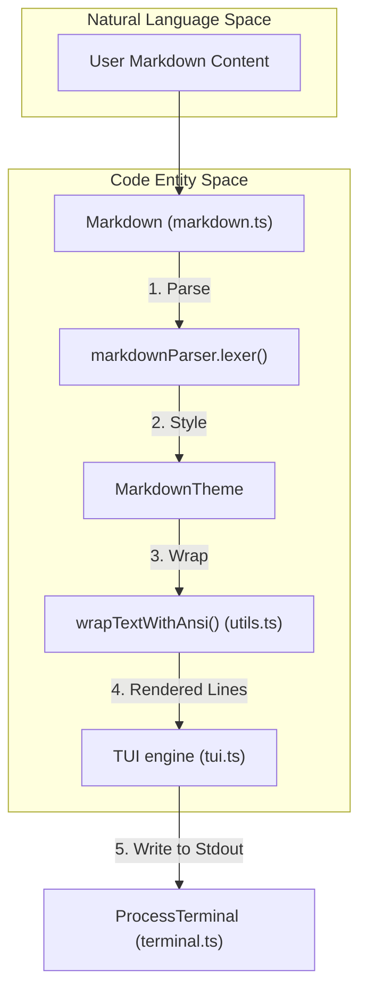
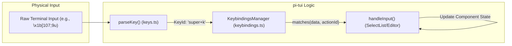

# TUI Components Library

관련 소스 파일

다음 파일들은 이 위키 페이지를 생성하기 위한 컨텍스트로 사용되었습니다.

- [packages/coding-agent/docs/tmux.md](packages/coding-agent/docs/tmux.md)
- [packages/coding-agent/src/modes/interactive/components/custom-editor.ts](packages/coding-agent/src/modes/interactive/components/custom-editor.ts)
- [packages/coding-agent/src/modes/interactive/components/user-message-selector.ts](packages/coding-agent/src/modes/interactive/components/user-message-selector.ts)
- [packages/coding-agent/test/theme-detection.test.ts](packages/coding-agent/test/theme-detection.test.ts)
- [packages/tui/src/components/image.ts](packages/tui/src/components/image.ts)
- [packages/tui/src/components/markdown.ts](packages/tui/src/components/markdown.ts)
- [packages/tui/src/components/select-list.ts](packages/tui/src/components/select-list.ts)
- [packages/tui/src/components/text.ts](packages/tui/src/components/text.ts)
- [packages/tui/src/index.ts](packages/tui/src/index.ts)
- [packages/tui/src/keys.ts](packages/tui/src/keys.ts)
- [packages/tui/src/terminal-image.ts](packages/tui/src/terminal-image.ts)
- [packages/tui/test/keys.test.ts](packages/tui/test/keys.test.ts)
- [packages/tui/test/markdown.test.ts](packages/tui/test/markdown.test.ts)
- [packages/tui/test/terminal-image.test.ts](packages/tui/test/terminal-image.test.ts)

`pi-tui` 패키지는 고성능 differential rendering을 위해 설계된 견고한 terminal components library를 제공합니다. 이러한 components는 ANSI styling, Unicode grapheme widths(Emojis와 East Asian characters 포함), Kitty images 같은 terminal-specific protocols의 복잡성을 처리합니다.

## Core Interfaces

모든 TUI elements는 [packages/tui/src/tui.ts:93-97]()에 정의된 두 가지 주요 interfaces를 통해 상호작용합니다.

### `Component`
render 가능한 모든 element의 base interface입니다.
*   `render(width: number): string[]`: 특정 width에서 component의 visual state를 나타내는 strings 배열을 반환합니다. Lines는 자체 internal ANSI styling을 처리해야 합니다 [packages/tui/src/tui.ts:93-95]().
*   `invalidate(): void`: component의 internal state가 변경되었고 cache가 clear되어야 함을 알립니다 [packages/tui/src/tui.ts:110-114]().

### `Focusable`
user input을 받는 elements를 위한 `Component`의 extension입니다.
*   `handleInput(keyData: string): void`: raw terminal input strings(escape sequences 포함)를 처리합니다 [packages/tui/src/tui.ts:96-97]().
*   `isFocusable(comp: any)`: component가 focusable interface를 구현하는지 확인하는 type guard입니다 [packages/tui/src/tui.ts:97-101]().

출처: [packages/tui/src/tui.ts:93-114]()

## Layout and Structure Components

### Box and Container
`Container`는 child components의 vertical stack을 관리합니다. 사용 가능한 width를 계산하고 모든 children의 rendered lines를 단일 stream으로 수집하여 `TUI` engine에 전달합니다 [packages/tui/src/tui.ts:94](). `Box`([packages/tui/src/index.ts:12]()에서 export됨)는 custom background function을 통해 layout constraints와 padding을 제공합니다 [packages/tui/src/components/box.ts:10-14]().

### Text and TruncatedText
*   **Text**: word wrapping과 optional background styling을 사용해 multi-line text를 표시합니다. text 또는 width가 변경되지 않는 한 다시 wrapping하지 않도록 caching mechanism을 사용합니다 [packages/tui/src/components/text.ts:7-106]().
*   **TruncatedText**: 긴 strings를 available terminal width에 맞게 clip하고 ellipsis(예: `…`)를 추가하는 작업을 특별히 처리합니다. ANSI escape codes가 적절히 닫히도록 하여 style이 terminal의 나머지 부분으로 "bleeding"되는 것을 방지합니다 [packages/tui/src/components/truncated-text.ts:1-50]().

### Spacer
components 사이에 vertical whitespace(empty lines)를 제공합니다 [packages/tui/src/components/spacer.ts:1-25]().

출처: [packages/tui/src/components/text.ts:7-106](), [packages/tui/src/components/truncated-text.ts:1-50](), [packages/tui/src/tui.ts:94](), [packages/tui/src/index.ts:12-29]()

## Content Components

### Markdown Renderer
`Markdown` component는 `marked` library를 사용해 Markdown을 terminal-ready output으로 parse합니다. 다음을 지원합니다.
*   **Theming**: `MarkdownTheme` interface에 정의된 headings, links, code blocks, text decorations(bold, italic 등)을 위한 custom functions [packages/tui/src/components/markdown.ts:53-71]().
*   **Indentation**: nested lists와 ordered list numbering을 자동으로 처리합니다. 특히 LLMs가 items 사이에 non-indented code blocks를 출력하더라도 original numbering을 보존합니다 [packages/tui/test/markdown.test.ts:191-223]().
*   **Task Lists**: `[ ]`와 `[x]` 같은 task list markers를 render합니다 [packages/tui/test/markdown.test.ts:183-189]().
*   **Image Integration**: `isImageLine`을 사용해 image lines를 감지하고 protocol-specific rendering이 가능하도록 standard word-wrapping을 방지합니다 [packages/tui/src/components/markdown.ts:164-182]().
*   **Strict Strikethrough**: strikethrough parsing이 terminal expectations와 일관되도록 custom `StrictStrikethroughTokenizer`를 사용합니다 [packages/tui/src/components/markdown.ts:8-28]().

### Image
`Image` component는 사용 가능한 최적의 terminal protocol(Kitty, iTerm2, Sixel)을 사용해 graphics를 render합니다.
*   **Protocol Detection**: terminal capabilities를 자동으로 query하여 `encodeKitty` 또는 `encodeITerm2` 중 하나를 선택합니다 [packages/tui/src/terminal-image.ts:65-120]().
*   **Fallback**: terminal이 graphics를 지원하지 않으면 placeholder 또는 fallback text를 render합니다 [packages/tui/src/components/image.ts:112-119]().
*   **ID Allocation**: Kitty의 경우 main app과 extensions 사이의 collisions를 피하기 위해 unique random IDs를 생성합니다 [packages/tui/src/terminal-image.ts:150-158]().

### Loader
`Loader`와 `CancellableLoader`는 asynchronous operations에 대한 visual feedback을 제공합니다. TUI의 render loop와 통합되는 frame-based animation system을 사용합니다 [packages/tui/src/components/loader.ts:1-60]().

출처: [packages/tui/src/components/markdown.ts:1-214](), [packages/tui/src/terminal-image.ts:65-158](), [packages/tui/src/components/loader.ts:1-60](), [packages/tui/test/markdown.test.ts:183-223](), [packages/tui/src/components/image.ts:1-126]()

## Interactive Components

### SelectList
options 집합에서 선택하기 위한 vertical list입니다.
*   **Filtering**: `setFilter(string)`을 통한 real-time filtering을 지원합니다 [packages/tui/src/components/select-list.ts:60-64]().
*   **Fuzzy Matching**: `SelectList`는 prefix matching을 사용하지만, library는 더 복잡한 search scenarios를 위해 `fuzzyFilter`를 제공합니다 [packages/tui/src/fuzzy.ts:99-137]().
*   **Scrolling**: `maxVisible` items보다 긴 lists를 자동으로 처리하며, selection counts와 함께 scroll indicators를 추가합니다 [packages/tui/src/components/select-list.ts:85-109]().
*   **Layout**: `SelectListLayoutOptions`를 통해 primary column width와 custom truncation을 구성할 수 있습니다 [packages/tui/src/components/select-list.ts:34-38]().

### SettingsList
configuration 편집을 위한 specialized list입니다. `SettingItem` objects를 UI toggles 또는 value selectors로 매핑하며, 보통 `/settings` dialog에서 사용됩니다 [packages/tui/src/components/settings-list.ts:1-50]().

### Editor and Input
`Editor` component는 full-featured multi-line text area를 제공합니다. `CustomEditor`는 이를 확장하여 interrupts(Ctrl+C), image pasting, extension-registered shortcuts 같은 application-level keybindings를 처리합니다 [packages/coding-agent/src/modes/interactive/components/custom-editor.ts:7-80]().

출처: [packages/tui/src/components/select-list.ts:1-137](), [packages/tui/src/fuzzy.ts:99-137](), [packages/coding-agent/src/modes/interactive/components/custom-editor.ts:7-80]()

## System Integration Diagrams

### Component Rendering Flow
이 다이어그램은 component의 state가 terminal-ready ANSI strings로 변환되는 방식을 보여줍니다.

출처: [packages/tui/src/components/markdown.ts:147-170](), [packages/tui/src/tui.ts:104](), [packages/tui/src/index.ts:107]()

### Input Handling Architecture
이 다이어그램은 Kitty keyboard protocol 지원을 포함해 raw terminal sequences가 component actions로 매핑되는 방식을 보여줍니다.

출처: [packages/tui/src/keys.ts:15](), [packages/tui/src/keybindings.ts:43](), [packages/tui/src/components/select-list.ts:112-137]()

## ANSI and Unicode Utilities

library는 common terminal rendering artifacts를 해결하기 위해 `packages/tui/src/utils.ts`에 의존합니다.

| Function | 목적 |
| :--- | :--- |
| `visibleWidth(str)` | column width를 계산하며, ZWJ, Emojis(width 2)를 올바르게 처리하고 ANSI codes를 무시합니다 [packages/tui/src/index.ts:107](). |
| `wrapTextWithAnsi(text, width)` | styling을 보존하면서 text를 wrap합니다(예: line이 blue이면 다음 wrapped line도 blue ANSI code로 시작) [packages/tui/src/index.ts:107](). |
| `truncateToWidth(text, width, ellipsis)` | string을 특정 width로 안전하게 clip하고 boundary에서 모든 ANSI styles가 reset되도록 보장합니다 [packages/tui/src/index.ts:107](). |
| `applyBackgroundToLine(line, width, bgFn)` | text가 더 짧더라도 background color를 전체 terminal width로 확장합니다 [packages/tui/src/components/markdown.ts:188](). |

### Kitty Keyboard Protocol
`keys.ts` module은 Kitty keyboard protocol을 구현합니다. 이를 통해 `pi`는 `Ctrl+Enter`와 `Enter`를 구분할 수 있고, base layout keys를 매핑하여 non-Latin layouts를 지원합니다(예: flag 4 "Report alternate keys"를 통해 Cyrillic layout이 활성화되어 있어도 `ctrl+c` match) [packages/tui/src/keys.ts:4-19](), [packages/tui/test/keys.test.ts:47-54]().

출처: [packages/tui/src/keys.ts:1-19](), [packages/tui/src/index.ts:107](), [packages/tui/src/components/markdown.ts:188](), [packages/tui/test/keys.test.ts:42-80]()

## Theme Integration
`pi` interactive mode는 중앙 집중식 theme system을 사용합니다. Components는 foreground와 background colors에 theme tokens를 적용합니다.

*   **Markdown Theming**: `MarkdownTheme` interface를 통해 모든 element type에 대한 custom ANSI styling functions를 제공할 수 있습니다 [packages/tui/src/components/markdown.ts:53-71]().
*   **Background Application**: `Text`와 `Markdown`의 `render` methods 안에서 `applyBackgroundToLine`을 사용하여 background colors가 전체 component width를 채우도록 보장합니다 [packages/tui/src/components/markdown.ts:188](), [packages/tui/src/components/text.ts:79-81]().

출처: [packages/tui/src/components/markdown.ts:53-71](), [packages/tui/src/components/text.ts:79-81](), [packages/tui/src/components/markdown.ts:180-195]()
