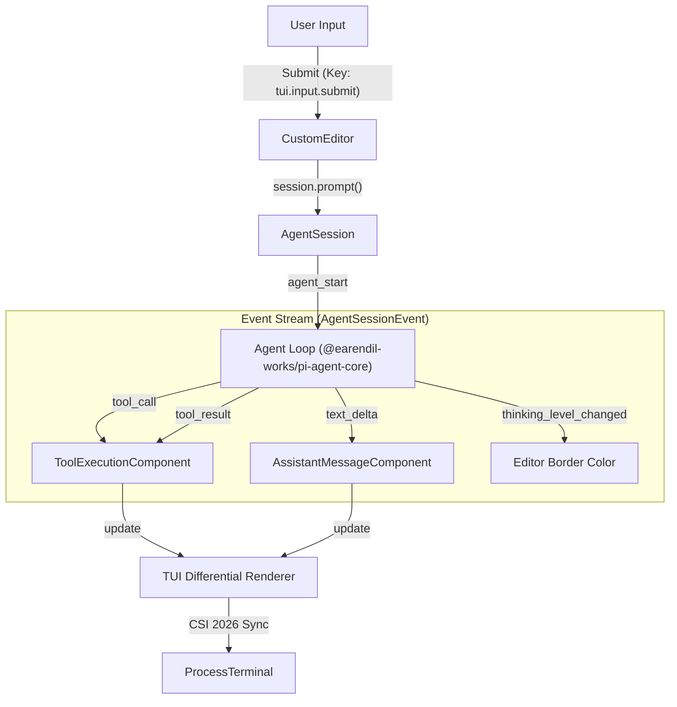

# Interactive Mode (CLI)

관련 소스 파일

다음 파일들은 이 위키 페이지를 생성하기 위한 컨텍스트로 사용되었습니다.

- [packages/coding-agent/src/core/agent-session.ts](packages/coding-agent/src/core/agent-session.ts)
- [packages/coding-agent/src/core/sdk.ts](packages/coding-agent/src/core/sdk.ts)
- [packages/coding-agent/src/modes/index.ts](packages/coding-agent/src/modes/index.ts)
- [packages/coding-agent/src/modes/interactive/interactive-mode.ts](packages/coding-agent/src/modes/interactive/interactive-mode.ts)
- [packages/coding-agent/src/modes/print-mode.ts](packages/coding-agent/src/modes/print-mode.ts)
- [packages/coding-agent/src/modes/rpc/rpc-mode.ts](packages/coding-agent/src/modes/rpc/rpc-mode.ts)

**Interactive Mode**는 사용자가 `pi` coding agent와 상호작용하는 기본 방식입니다. agent lifecycle, session history, real-time tool execution feedback을 관리하는 full-featured Terminal User Interface(TUI)를 제공합니다.

interactive mode는 [packages/coding-agent/src/modes/interactive/interactive-mode.ts:5]()의 `InteractiveMode` 클래스에 구현되어 있습니다. 이 클래스는 사용자의 terminal과 underlying LLM providers 사이의 간극을 연결하기 위해 `AgentSession` 추상화를 활용합니다 [packages/coding-agent/src/core/agent-session.ts:13-14]().

## Component Hierarchy and Layout

TUI는 `@earendil-works/pi-tui` 패키지가 제공하는 component-based architecture를 사용해 구축됩니다. layout은 일관된 conversation flow를 제공하도록 vertical하게 구성됩니다.

### Visual Structure
1.  **Startup Header**: `AGENTS.md` rules, active prompt templates, skills, extensions를 포함해 loaded resources를 표시합니다.
2.  **Messages**: `UserMessageComponent`, `AssistantMessageComponent`, specialized tool execution blocks를 포함하는 scrollable list입니다 [packages/coding-agent/src/modes/interactive/interactive-mode.ts:100-126]().
3.  **Working/Thinking Indicator**: LLM generation 또는 tool execution 중 나타나는 dynamic row이며, `BorderedLoader`로 표현됩니다 [packages/coding-agent/src/modes/interactive/interactive-mode.ts:102]().
4.  **Editor**: file references와 slash commands에 대한 syntax highlighting을 갖춘 multi-line input area(`CustomEditor`)입니다 [packages/coding-agent/src/modes/interactive/components/custom-editor.ts:102](). Border color는 현재 `ThinkingLevel`을 나타냅니다 [packages/coding-agent/src/core/agent-session.ts:138]().
5.  **Footer**: 현재 working directory, session ID, total token/cache usage, cost, active model을 보여주는 status bar입니다 [packages/coding-agent/src/modes/interactive/components/footer.ts:112]().

### Component Mapping

| Code Entity | UI Role |
| :--- | :--- |
| `ChatContainer` | conversation history를 위한 main scrollable area [packages/coding-agent/src/modes/interactive/interactive-mode.ts:34]() |
| `CustomEditor` | `@` file search와 autocomplete를 갖춘 multi-line input [packages/coding-agent/src/modes/interactive/components/custom-editor.ts:102]() |
| `ToolExecutionComponent` | tool calls(read, write, edit)와 results를 시각화합니다 [packages/coding-agent/src/modes/interactive/components/tool-execution.ts:121]() |
| `BashExecutionComponent` | terminal command output을 위한 specialized renderer입니다 [packages/coding-agent/src/modes/interactive/components/bash-execution.ts:99]() |
| `FooterComponent` | session metadata와 system status를 표시합니다 [packages/coding-agent/src/modes/interactive/components/footer.ts:112]() |
| `LoginDialogComponent` | OAuth provider selection과 authentication을 처리합니다 [packages/coding-agent/src/modes/interactive/components/login-dialog.ts:116]() |

개별 components에 대한 자세한 내용은 [Interactive Mode Components](#5.1)를 참조하세요.

## Interactive Loop

interactive mode는 `AgentSession`을 중심으로 하는 event-driven loop에서 동작합니다. low-level `AgentEvent`와 `AgentSessionEvent` instances를 TUI updates로 변환합니다.

### System Flow: Input to Render

*출처: [packages/coding-agent/src/core/agent-session.ts:124-149](), [packages/coding-agent/src/modes/interactive/interactive-mode.ts:1-4]()*

`InteractiveMode`는 UI를 real-time으로 업데이트하기 위해 `AgentSessionEvent` types를 subscribe합니다. 주요 events는 다음과 같습니다.
*   `text_delta`: assistant response text를 chat으로 stream합니다.
*   `tool_call`: tool execution block 표시를 trigger합니다.
*   `thinking_level_changed`: model의 reasoning state를 반영하도록 editor border color를 업데이트합니다 [packages/coding-agent/src/core/agent-session.ts:138-138]().

## Slash Commands and Navigation

Interactive mode는 TUI를 벗어나지 않고 session management와 configuration을 수행하기 위한 "Slash Commands"를 지원합니다. 이들은 `BUILTIN_SLASH_COMMANDS` registry에 등록됩니다 [packages/coding-agent/src/core/slash-commands.ts:85]().

*   **Session Navigation**: `/tree`, `/fork`, `/clone` 같은 commands는 사용자가 conversation history를 navigate하고 branch할 수 있게 합니다 [packages/coding-agent/src/core/agent-session.ts:11-11]().
*   **Model Management**: `/model`은 session 중간에 providers 또는 models를 전환하기 위해 `ModelSelectorComponent`를 엽니다 [packages/coding-agent/src/modes/interactive/interactive-mode.ts:117]().
*   **System Configuration**: `/settings`는 global 또는 project-local configuration을 수정하기 위해 interactive `SettingsSelectorComponent`를 엽니다 [packages/coding-agent/src/modes/interactive/components/settings-selector.ts:121]().

commands의 전체 목록과 생성 방법은 [Slash Commands and Prompt Templates](#5.3)를 참조하세요.

## Configuration and Theming

TUI의 appearance와 behavior는 높은 수준으로 구성할 수 있습니다.
*   **Keybindings**: `KeybindingsManager`를 통해 매핑됩니다. 사용자는 `keybindings.json`에서 `app.interrupt` 또는 `tui.input.submit` 같은 default actions를 override할 수 있습니다 [packages/coding-agent/src/core/keybindings.ts:77]().
*   **Themes**: `Theme` 클래스는 color tokens와 markdown styles를 처리합니다. TUI는 `initTheme`과 `onThemeChange`를 통한 live theme switching을 지원합니다 [packages/coding-agent/src/modes/interactive/theme/theme.ts:134-135]().

interface customization에 대한 자세한 내용은 [Settings, Themes, and Keybindings](#5.2)를 참조하세요.

## Alternative Execution Modes

Interactive Mode가 기본값이지만, `pi`는 automation과 integration을 위해 non-interactive modes로도 실행할 수 있습니다.
*   **Print Mode**: `runPrintMode`를 통해 실행됩니다. session을 `stdout`으로 한 번 출력하고 종료합니다. plain text와 JSON event streams를 모두 지원합니다 [packages/coding-agent/src/modes/print-mode.ts:32]().
*   **RPC Mode**: `runRpcMode`를 통해 실행됩니다. 다른 applications에 `pi`를 embedding하기 위해 `stdin`/`stdout` over JSON-RPC 2.0 interface를 제공합니다 [packages/coding-agent/src/modes/rpc/rpc-mode.ts:53-55]().

자세한 내용은 [Alternative Execution Modes: Print and RPC](#5.4)를 참조하세요.

출처: [packages/coding-agent/src/modes/interactive/interactive-mode.ts](), [packages/coding-agent/src/core/agent-session.ts](), [packages/coding-agent/src/modes/rpc/rpc-mode.ts](), [packages/coding-agent/src/modes/print-mode.ts](), [packages/coding-agent/src/core/keybindings.ts](), [packages/coding-agent/src/modes/interactive/theme/theme.ts]()
