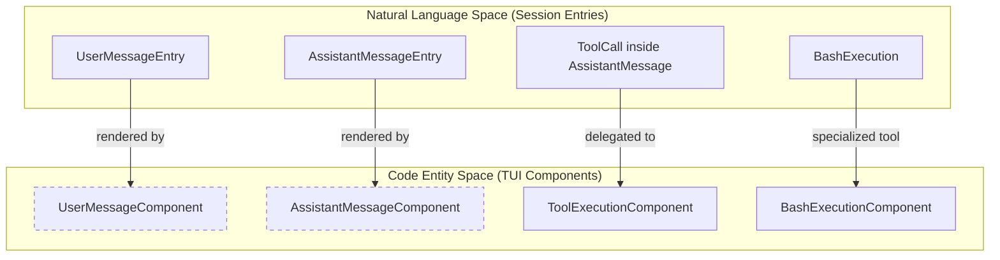
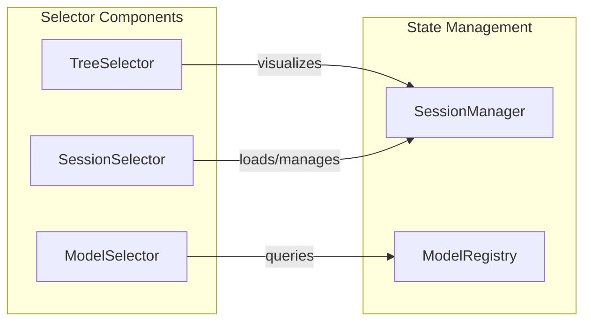
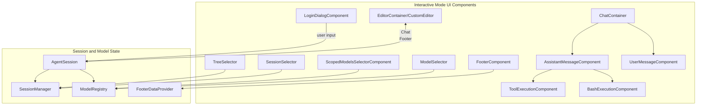

# Interactive Mode Components

관련 소스 파일

다음 파일들은 이 위키 페이지를 생성하기 위한 컨텍스트로 사용되었습니다.

- [packages/coding-agent/src/cli/startup-ui.ts](packages/coding-agent/src/cli/startup-ui.ts)
- [packages/coding-agent/src/core/footer-data-provider.ts](packages/coding-agent/src/core/footer-data-provider.ts)
- [packages/coding-agent/src/core/tools/render-utils.ts](packages/coding-agent/src/core/tools/render-utils.ts)
- [packages/coding-agent/src/modes/interactive/components/assistant-message.ts](packages/coding-agent/src/modes/interactive/components/assistant-message.ts)
- [packages/coding-agent/src/modes/interactive/components/bash-execution.ts](packages/coding-agent/src/modes/interactive/components/bash-execution.ts)
- [packages/coding-agent/src/modes/interactive/components/bordered-loader.ts](packages/coding-agent/src/modes/interactive/components/bordered-loader.ts)
- [packages/coding-agent/src/modes/interactive/components/branch-summary-message.ts](packages/coding-agent/src/modes/interactive/components/branch-summary-message.ts)
- [packages/coding-agent/src/modes/interactive/components/compaction-summary-message.ts](packages/coding-agent/src/modes/interactive/components/compaction-summary-message.ts)
- [packages/coding-agent/src/modes/interactive/components/custom-message.ts](packages/coding-agent/src/modes/interactive/components/custom-message.ts)
- [packages/coding-agent/src/modes/interactive/components/dynamic-border.ts](packages/coding-agent/src/modes/interactive/components/dynamic-border.ts)
- [packages/coding-agent/src/modes/interactive/components/extension-input.ts](packages/coding-agent/src/modes/interactive/components/extension-input.ts)
- [packages/coding-agent/src/modes/interactive/components/extension-selector.ts](packages/coding-agent/src/modes/interactive/components/extension-selector.ts)
- [packages/coding-agent/src/modes/interactive/components/first-time-setup.ts](packages/coding-agent/src/modes/interactive/components/first-time-setup.ts)
- [packages/coding-agent/src/modes/interactive/components/footer.ts](packages/coding-agent/src/modes/interactive/components/footer.ts)
- [packages/coding-agent/src/modes/interactive/components/index.ts](packages/coding-agent/src/modes/interactive/components/index.ts)
- [packages/coding-agent/src/modes/interactive/components/model-selector.ts](packages/coding-agent/src/modes/interactive/components/model-selector.ts)
- [packages/coding-agent/src/modes/interactive/components/oauth-selector.ts](packages/coding-agent/src/modes/interactive/components/oauth-selector.ts)
- [packages/coding-agent/src/modes/interactive/components/scoped-models-selector.ts](packages/coding-agent/src/modes/interactive/components/scoped-models-selector.ts)
- [packages/coding-agent/src/modes/interactive/components/tool-execution.ts](packages/coding-agent/src/modes/interactive/components/tool-execution.ts)
- [packages/coding-agent/src/modes/interactive/components/user-message.ts](packages/coding-agent/src/modes/interactive/components/user-message.ts)
- [packages/coding-agent/src/utils/fs-watch.ts](packages/coding-agent/src/utils/fs-watch.ts)
- [packages/coding-agent/test/assistant-message.test.ts](packages/coding-agent/test/assistant-message.test.ts)
- [packages/coding-agent/test/first-time-setup.test.ts](packages/coding-agent/test/first-time-setup.test.ts)
- [packages/coding-agent/test/footer-data-provider.test.ts](packages/coding-agent/test/footer-data-provider.test.ts)
- [packages/coding-agent/test/footer-width.test.ts](packages/coding-agent/test/footer-width.test.ts)
- [packages/coding-agent/test/suite/regressions/3217-scoped-model-order.test.ts](packages/coding-agent/test/suite/regressions/3217-scoped-model-order.test.ts)
- [packages/coding-agent/test/tool-execution-component.test.ts](packages/coding-agent/test/tool-execution-component.test.ts)
- [packages/coding-agent/test/user-message.test.ts](packages/coding-agent/test/user-message.test.ts)

`pi` CLI의 Interactive Mode는 포괄적인 Terminal UI(TUI) component hierarchy로 구축되어 있습니다. 이러한 components는 agent sessions를 조율하며, user input, model selection, session navigation, tool execution rendering, session history visualization을 처리합니다.

---

## Component Hierarchy and Data Flow

UI components는 `AgentSession` data model과 긴밀하게 통신하며, session states와 commands를 동적으로 반영합니다.

### Core Interactive Mode UI Structure

| Component | Function |
| --------- | -------- |
| `ChatContainer` | scrollable chat messages를 render하고 layout과 focus shifts를 관리하는 root component입니다. |
| `EditorContainer` | prompt와 command editing을 위한 input을 표시하는 `CustomEditor`를 호스팅합니다. |
| `FooterComponent` | 현재 working directory(CWD), git branch, token usage, cost estimates, active model info를 동적으로 보여줍니다 [packages/coding-agent/src/modes/interactive/components/footer.ts:48-195](). |
| `SessionSelector` | 현재 folder 또는 모든 sessions에 대한 scope filtering과 rename/delete capabilities를 포함해 session browsing, searching, management를 제공합니다 [packages/coding-agent/src/modes/interactive/components/session-selector.ts:56-187](). |
| `TreeSelector` | branching과 folding support를 포함한 session history를 시각화하며, session tree를 navigable ASCII-art list로 flatten합니다 [packages/coding-agent/src/modes/interactive/components/tree-selector.ts:50-193](). |
| `ModelSelector` | real-time fuzzy search와 scoped views를 통해 사용 가능한 LLM models를 전환하거나 filter하는 UI입니다 [packages/coding-agent/src/modes/interactive/components/model-selector.ts:34-135](). |
| `ScopedModelsSelectorComponent` | session-only state와 reorder functionality를 포함해 quick-cycling model lists를 관리하는 specialized component입니다 [packages/coding-agent/src/modes/interactive/components/scoped-models-selector.ts:90-151](). |
| `LoginDialogComponent` | 여러 flows(device code, URL prompt, manual input)를 지원하고 interactive links를 render하며 user inputs를 관리하는 OAuth login dialog입니다 [packages/coding-agent/src/modes/interactive/components/login-dialog.ts:11-194](). |

---

### Message Rendering Flow Mapping

이 다이어그램은 서로 다른 session message types가 conversation과 tool outputs를 render하는 구체적인 UI components에 어떻게 대응되는지 강조합니다.

출처: [packages/coding-agent/src/modes/interactive/components/assistant-message.ts:12-147](), [packages/coding-agent/src/modes/interactive/components/user-message.ts:1-50](), [packages/coding-agent/src/modes/interactive/components/tool-execution.ts:13-79](), [packages/coding-agent/src/modes/interactive/components/bash-execution.ts:21-65]()

---

## Core Message Components

### AssistantMessageComponent

`AssistantMessageComponent`는 다음을 포함해 LLM assistant messages rendering을 처리합니다.

- **Thinking Blocks**: reasoning 또는 "thinking" blocks의 toggleable visibility를 지원합니다. 숨겨진 경우 subdued "Thinking..." label을 표시합니다 [packages/coding-agent/src/modes/interactive/components/assistant-message.ts:101-105]().
- **Markdown Rendering**: tailored Markdown component와 theme를 사용해 message content를 markdown styling으로 render합니다 [packages/coding-agent/src/modes/interactive/components/assistant-message.ts:93]().
- **Terminal Integration**: message boundaries를 구분하기 위해 OSC 133 shell sequences (`\x1b]133;A\x07`)를 삽입하여 semantic scrollback 같은 advanced terminal features를 지원합니다 [packages/coding-agent/src/modes/interactive/components/assistant-message.ts:5-70]().
- **Error and Abort Display**: tool results가 없을 때 LLM provider errors 또는 user-initiated aborts를 inline으로 보여줍니다 [packages/coding-agent/src/modes/interactive/components/assistant-message.ts:128-145]().

### ToolExecutionComponent

이 component는 tool execution lifecycles를 동적으로 render합니다.

- **Renderer Resolution**: `ToolDefinition`을 사용해 tool-specific `renderCall`과 `renderResult` methods를 얻으며, extension override가 제공되지 않으면 built-in definitions를 우선합니다 [packages/coding-agent/src/modes/interactive/components/tool-execution.ts:81-99]().
- **Rendering Shell Variants**: 두 가지 rendering shells를 지원합니다.
  - `default`: themed `Box`로 감싼 output입니다 [packages/coding-agent/src/modes/interactive/components/tool-execution.ts:68]().
  - `self`: tool이 자체 UI framing을 관리하며 `selfRenderContainer` 안에서 render합니다 [packages/coding-agent/src/modes/interactive/components/tool-execution.ts:70-73]().
- **Image Support**: tools가 반환한 image data를 감지하고, 호환되지 않는 images(예: non-PNG)를 Kitty-compatible terminals에서 inline rendering하기 위해 PNG format으로 변환합니다 [packages/coding-agent/src/modes/interactive/components/tool-execution.ts:178-198]().
- **State Flags**: execution status(started/completed), argument completeness, partial updates, expansion toggle state를 추적합니다 [packages/coding-agent/src/modes/interactive/components/tool-execution.ts:147-220]().

### BashExecutionComponent

bash commands를 interactive하게 실행하기 위한 specialized rendering component입니다.

- **Streaming Output**: ANSI codes를 제거하고 line endings를 normalize하면서 output chunks를 real-time으로 append합니다 [packages/coding-agent/src/modes/interactive/components/bash-execution.ts:80-96]().
- **Visual Truncation**: collapsed 상태일 때 output을 `PREVIEW_LINES` window(기본 20)로 제한하기 위해 width-aware visual truncation을 구현합니다 [packages/coding-agent/src/modes/interactive/components/bash-execution.ts:147-167]().
- **Context Awareness**: standard commands와 context에서 제외된 commands(`!!`로 prefix됨)를 구분하고, border colors를 "dim"으로 조정합니다 [packages/coding-agent/src/modes/interactive/components/bash-execution.ts:32-38]().

출처: [packages/coding-agent/src/modes/interactive/components/assistant-message.ts:73-146](), [packages/coding-agent/src/modes/interactive/components/tool-execution.ts:13-226](), [packages/coding-agent/src/modes/interactive/components/bash-execution.ts:21-218]()

---

## Selectors and Navigation Components

### TreeSelector

`TreeSelector`는 session branches를 navigable, foldable ASCII tree로 시각화합니다.

- **Flattening & Indentation**: recursive session trees를 flat list로 변환하고 visual hierarchy를 위한 indentation과 ASCII connectors를 계산합니다 [packages/coding-agent/src/modes/interactive/components/tree-selector.ts:143-193]().
- **Filter Modes**: `no-tools`, `user-only`, `labeled-only` 같은 여러 filter modes를 지원합니다 [packages/coding-agent/src/modes/interactive/components/tree-selector.ts:39]().

### ModelSelector

search와 scope filtering을 포함한 model selection component입니다.

- **Scope Management**: `all`(사용 가능한 모든 models)과 `scoped`(configured providers) 사이를 toggle합니다 [packages/coding-agent/src/modes/interactive/components/model-selector.ts:197-216]().
- **Dynamic Search**: user input에 따라 real-time으로 models를 filter하기 위해 `fuzzyFilter`를 사용합니다 [packages/coding-agent/src/modes/interactive/components/model-selector.ts:218-228]().

### ScopedModelsSelectorComponent

quick cycling(Ctrl+P)을 위한 enabled models 관리에 특화되어 있습니다.

- **Reordering**: list에서 models를 위아래로 이동하는 것을 지원합니다 [packages/coding-agent/src/modes/interactive/components/scoped-models-selector.ts:49-59]().
- **Persistence**: `onPersist`를 통해 settings에 명시적으로 저장되기 전까지 변경 사항은 session-only입니다 [packages/coding-agent/src/modes/interactive/components/scoped-models-selector.ts:129-132]().

### SessionSelector

advanced filtering과 sorting을 통해 sessions를 선택하고 관리합니다.

- **Hierarchical Display**: branching history를 보여주기 위해 sessions의 tree structure를 빌드합니다 [packages/coding-agent/src/modes/interactive/components/session-selector.ts:189-202]().
- **Management Operations**: TUI에서 직접 renaming sessions와 deleting session files를 지원합니다 [packages/coding-agent/src/modes/interactive/components/session-selector.ts:102-108]().

---

### Navigation and State Management Overview

출처: [packages/coding-agent/src/modes/interactive/components/tree-selector.ts:50-90](), [packages/coding-agent/src/modes/interactive/components/model-selector.ts:34-135](), [packages/coding-agent/src/modes/interactive/components/session-selector.ts:56-187](), [packages/coding-agent/src/modes/interactive/components/scoped-models-selector.ts:90-151]()

---

## FooterComponent: Status Display

`FooterComponent`는 다음을 포함하는 single-line status bar를 제공합니다.

- **Token Statistics**: 모든 session entries 전반의 cumulative usage(Input, Output, Cache Read/Write)입니다 [packages/coding-agent/src/modes/interactive/components/footer.ts:86-100]().
- **Cache Performance**: prompt tokens와 cache reads를 기준으로 `latestCacheHitRate`를 계산합니다 [packages/coding-agent/src/modes/interactive/components/footer.ts:101-104]().
- **Context Window Utilization**: color-coded warnings와 함께 현재 context window usage를 보여줍니다 [packages/coding-agent/src/modes/interactive/components/footer.ts:145-151]().
- **Environment Info**: CWD(`formatCwdForFooter`로 shortened), git branch(`FooterDataProvider` 사용), session name을 표시합니다 [packages/coding-agent/src/modes/interactive/components/footer.ts:110-123]().
- **Cost and Subscription**: total session cost를 보여주고 OAuth subscription 사용 여부를 나타냅니다 [packages/coding-agent/src/modes/interactive/components/footer.ts:132-136]().

출처: [packages/coding-agent/src/modes/interactive/components/footer.ts:48-195](), [packages/coding-agent/src/core/footer-data-provider.ts:99-132]()

---

## LoginDialogComponent: Authentication

login flows 중 사용되는 focused dialog component입니다.

- **Flow Support**: `showAuth`(URL-based), `showDeviceCode`(polling), `showPrompt`(manual input)를 처리합니다 [packages/coding-agent/src/modes/interactive/components/login-dialog.ts:89-169]().
- **Terminal UX**: 지원되는 경우 OSC 8 escape sequences를 사용해 clickable hyperlinks를 render합니다 [packages/coding-agent/src/modes/interactive/components/login-dialog.ts:92-97]().
- **Browser Integration**: authentication pages를 열기 위해 `openBrowser`를 자동으로 호출합니다 [packages/coding-agent/src/modes/interactive/components/login-dialog.ts:104]().

출처: [packages/coding-agent/src/modes/interactive/components/login-dialog.ts:11-194]()

---

## CustomEditor with Autocomplete

main prompt input area는 base TUI `Editor` component를 확장합니다.

- slash commands와 file path completions를 위한 integrated autocomplete features.
- message follow-up과 external editor invocation 같은 actions를 resolve하기 위해 core의 `KeybindingsManager`와 상호작용합니다.
- multiline editing과 semantic keybindings를 지원합니다 [packages/coding-agent/src/modes/interactive/components/custom-editor.ts:1-50]().

---

# Summary Mermaid Diagram

출처: [packages/coding-agent/src/modes/interactive/components/footer.ts:48-56](), [packages/coding-agent/src/core/footer-data-provider.ts:99-124](), [packages/coding-agent/src/modes/interactive/components/tool-execution.ts:13-79](), [packages/coding-agent/src/modes/interactive/components/login-dialog.ts:30-70]()
