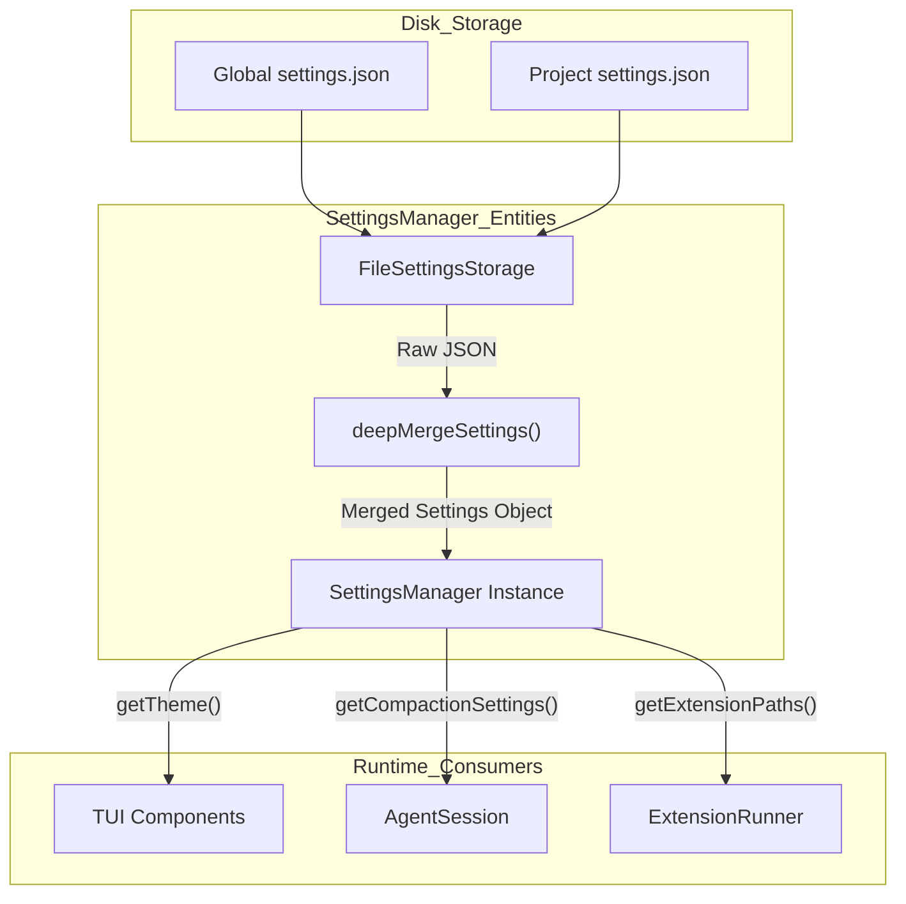
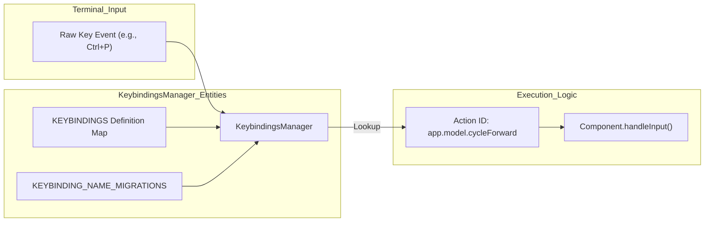

# Settings, Themes, Keybindings

관련 소스 파일

다음 파일들은 이 위키 페이지를 생성하기 위한 컨텍스트로 사용되었습니다.

- [packages/coding-agent/docs/keybindings.md](packages/coding-agent/docs/keybindings.md)
- [packages/coding-agent/docs/settings.md](packages/coding-agent/docs/settings.md)
- [packages/coding-agent/docs/themes.md](packages/coding-agent/docs/themes.md)
- [packages/coding-agent/examples/extensions/dynamic-resources/SKILL.md](packages/coding-agent/examples/extensions/dynamic-resources/SKILL.md)
- [packages/coding-agent/examples/extensions/dynamic-resources/dynamic.json](packages/coding-agent/examples/extensions/dynamic-resources/dynamic.json)
- [packages/coding-agent/examples/extensions/dynamic-resources/dynamic.md](packages/coding-agent/examples/extensions/dynamic-resources/dynamic.md)
- [packages/coding-agent/examples/extensions/dynamic-resources/index.ts](packages/coding-agent/examples/extensions/dynamic-resources/index.ts)
- [packages/coding-agent/src/config.ts](packages/coding-agent/src/config.ts)
- [packages/coding-agent/src/core/keybindings.ts](packages/coding-agent/src/core/keybindings.ts)
- [packages/coding-agent/src/core/settings-manager.ts](packages/coding-agent/src/core/settings-manager.ts)
- [packages/coding-agent/src/modes/interactive/components/settings-selector.ts](packages/coding-agent/src/modes/interactive/components/settings-selector.ts)
- [packages/coding-agent/src/modes/interactive/components/tree-selector.ts](packages/coding-agent/src/modes/interactive/components/tree-selector.ts)
- [packages/coding-agent/src/modes/interactive/theme/dark.json](packages/coding-agent/src/modes/interactive/theme/dark.json)
- [packages/coding-agent/src/modes/interactive/theme/light.json](packages/coding-agent/src/modes/interactive/theme/light.json)
- [packages/coding-agent/src/modes/interactive/theme/theme-schema.json](packages/coding-agent/src/modes/interactive/theme/theme-schema.json)
- [packages/coding-agent/src/modes/interactive/theme/theme.ts](packages/coding-agent/src/modes/interactive/theme/theme.ts)
- [packages/coding-agent/src/package-manager-cli.ts](packages/coding-agent/src/package-manager-cli.ts)
- [packages/coding-agent/src/utils/child-process.ts](packages/coding-agent/src/utils/child-process.ts)
- [packages/coding-agent/src/utils/pi-user-agent.ts](packages/coding-agent/src/utils/pi-user-agent.ts)
- [packages/coding-agent/src/utils/version-check.ts](packages/coding-agent/src/utils/version-check.ts)
- [packages/coding-agent/test/config.test.ts](packages/coding-agent/test/config.test.ts)
- [packages/coding-agent/test/package-command-paths.test.ts](packages/coding-agent/test/package-command-paths.test.ts)
- [packages/coding-agent/test/pi-user-agent.test.ts](packages/coding-agent/test/pi-user-agent.test.ts)
- [packages/coding-agent/test/session-selector-rename.test.ts](packages/coding-agent/test/session-selector-rename.test.ts)
- [packages/coding-agent/test/settings-manager.test.ts](packages/coding-agent/test/settings-manager.test.ts)
- [packages/coding-agent/test/test-theme-colors.ts](packages/coding-agent/test/test-theme-colors.ts)
- [packages/coding-agent/test/tree-selector.test.ts](packages/coding-agent/test/tree-selector.test.ts)
- [packages/coding-agent/test/version-check.test.ts](packages/coding-agent/test/version-check.test.ts)
- [packages/tui/src/components/settings-list.ts](packages/tui/src/components/settings-list.ts)
- [packages/tui/src/keybindings.ts](packages/tui/src/keybindings.ts)

이 페이지는 `pi` CLI의 configuration systems를 자세히 설명하며, user preferences가 어떻게 관리되는지, TUI가 JSON themes를 통해 어떻게 styled되는지, 그리고 keyboard shortcuts가 namespaced actions에 어떻게 매핑되는지 다룹니다.

## Settings Management

`SettingsManager`는 user preferences의 loading, merging, persistence를 처리합니다. project-specific settings가 global defaults를 override하는 계층형 configuration model을 지원합니다 [packages/coding-agent/src/core/settings-manager.ts:125-153]().

### Configuration Scopes
| Scope | File Path | Description |
|-------|-----------|-------------|
| **Global** | `~/.pi/agent/settings.json` | 사용자의 모든 projects에 적용됩니다 [packages/coding-agent/docs/settings.md:7-7](). |
| **Project** | `.pi/settings.json` | 해당 directory 안에서 `pi`를 실행할 때만 적용됩니다 [packages/coding-agent/docs/settings.md:8-8](). |

### Implementation Details
- **Deep Merging**: Settings는 `deepMergeSettings`를 사용해 recursively merge됩니다. project settings(`overrides`)의 primitives와 arrays는 global values(`base`)를 덮어쓰며, nested objects(`compaction`, `retry`, `warnings` 등)는 merge됩니다 [packages/coding-agent/src/core/settings-manager.ts:125-153]().
- **Concurrency**: `FileSettingsStorage` 클래스는 여러 instances가 JSON files를 수정할 때 atomic writes를 보장하고 corruption을 방지하기 위해 `proper-lockfile`을 사용합니다 [packages/coding-agent/src/core/settings-manager.ts:5-5]().
- **Persistence**: TUI `/settings` menu에서 변경한 사항은 disk로 flush됩니다. manager는 programmatic updates 중 data loss를 피하기 위해 unknown 또는 externally added JSON keys를 보존합니다 [packages/coding-agent/test/settings-manager.test.ts:28-58]().
- **Packages and Extensions**: Settings는 `packages`(npm/git sources)와 local `extensions`, `skills`, `prompts`, `themes` paths 정의를 허용합니다 [packages/coding-agent/src/core/settings-manager.ts:102-106]().
- **Model Budgets**: 서로 다른 reasoning levels에 대한 custom token budgets는 `thinkingBudgets`를 통해 구성할 수 있습니다 [packages/coding-agent/src/core/settings-manager.ts:46-51](), [packages/coding-agent/docs/settings.md:36-48]().

### Settings Data Flow
다음 다이어그램은 settings가 disk에서 runtime state로 어떻게 resolve되는지 보여줍니다.

**Settings Resolution Logic**

출처: [packages/coding-agent/src/core/settings-manager.ts:125-153](), [packages/coding-agent/test/settings-manager.test.ts:41-41]()

---

## Theme System

theme system은 JSON files를 통해 TUI appearance를 완전히 customize할 수 있게 합니다. Themes는 UI elements, Markdown rendering, syntax highlighting을 위한 color tokens를 정의합니다 [packages/coding-agent/src/modes/interactive/theme/theme.ts:29-100]().

### Color Tokens and Schema
Themes는 TypeBox를 사용해 정의된 strict schema에 대해 validate됩니다 [packages/coding-agent/src/modes/interactive/theme/theme.ts:29-104](). 주요 token categories는 다음과 같습니다.
- **Core UI**: `accent`, `border`, `success`, `error`, `muted`, `dim`, `thinkingText` [packages/coding-agent/src/modes/interactive/theme/theme.ts:35-45]().
- **Messages**: `userMessageBg`, `toolSuccessBg`, `customMessageLabel`, `toolOutput` [packages/coding-agent/src/modes/interactive/theme/theme.ts:47-57]().
- **Markdown**: `mdHeading`, `mdCodeBlock`, `mdLink`, `mdListBullet` [packages/coding-agent/src/modes/interactive/theme/theme.ts:59-68]().
- **Syntax**: `syntaxKeyword`, `syntaxString`, `syntaxFunction`, `syntaxOperator` [packages/coding-agent/src/modes/interactive/theme/theme.ts:74-82]().
- **Thinking Levels**: 서로 다른 reasoning intensities를 위한 특정 border colors: `thinkingOff`, `thinkingMinimal`, `thinkingLow`, `thinkingMedium`, `thinkingHigh`, `thinkingXhigh` [packages/coding-agent/src/modes/interactive/theme/theme.ts:84-89]().

### Theme Components
- **SettingsSelectorComponent**: settings toggling과 real-time theme switching을 위한 GUI를 제공하는 TUI component입니다 [packages/coding-agent/src/modes/interactive/components/settings-selector.ts:216-221]().
- **SettingsList**: descriptions와 selectable values 또는 submenus를 포함한 key-value pairs를 render하기 위한 specialized `pi-tui` component입니다 [packages/coding-agent/src/modes/interactive/components/settings-selector.ts:126-140]().
- **DynamicBorder**: selectors(`TreeSelector` 또는 `SettingsSelector` 등)에서 active UI elements 주변에 themed borders를 render하는 데 사용됩니다 [packages/coding-agent/src/modes/interactive/components/tree-selector.ts:14-14](), [packages/coding-agent/src/modes/interactive/components/settings-selector.ts:17-17]().
- **TreeSelector**: theme colors를 사용해 nodes와 active paths를 표시하며 session history를 ASCII tree로 시각화합니다 [packages/coding-agent/src/modes/interactive/components/tree-selector.ts:50-90]().

출처: [packages/coding-agent/src/modes/interactive/theme/theme.ts:29-104](), [packages/coding-agent/src/modes/interactive/components/settings-selector.ts:216-221](), [packages/coding-agent/src/modes/interactive/components/tree-selector.ts:50-90]()

---

## Keybindings Configuration

Keybindings는 physical keystrokes를 semantic **Action IDs**에 매핑합니다. 이를 통해 사용자는 underlying TUI logic을 변경하지 않고도 모든 command를 rebind할 수 있습니다.

### Namespaced Action IDs
Actions는 collisions를 방지하고 discoverability를 높이기 위해 namespace별로 그룹화됩니다.
- `tui.editor.*`: text editor 안에서의 movement와 deletion [packages/tui/src/keybindings.ts:8-29]().
- `tui.input.*`: Input submission과 line handling [packages/tui/src/keybindings.ts:31-34]().
- `app.session.*`: Session management(fork, tree, rename, delete) [packages/coding-agent/src/core/keybindings.ts:29-32]().
- `app.tree.*`: `/tree` component 안에서의 navigation과 filtering [packages/coding-agent/src/core/keybindings.ts:33-36]().
- `app.models.*`: scoped models selector 안에서의 management [packages/coding-agent/src/core/keybindings.ts:42-47]().

### Keybindings Manager
`KeybindingsManager`는 다음을 처리합니다.
1. **Loading**: agent directory에서 `keybindings.json`을 읽습니다 [packages/coding-agent/src/core/keybindings.ts:9-11]().
2. **Migration**: legacy non-namespaced IDs(예: `cursorUp`, `newLine`)를 새 namespaced format으로 자동 migrate합니다 [packages/coding-agent/src/core/keybindings.ts:204-230]().
3. **Conflict Detection**: 여러 actions가 claim한 key combinations를 추적합니다 [packages/tui/src/keybindings.ts:159-159]().

### Input Mapping Logic
다음 다이어그램은 raw key event가 application action으로 변환되는 방식을 보여줍니다.

**Keyboard Event to Action Mapping**

출처: [packages/coding-agent/src/core/keybindings.ts:63-202](), [packages/coding-agent/src/core/keybindings.ts:204-226](), [packages/tui/src/keybindings.ts:155-165]()

### Common Default Keybindings
| Action ID | Default Key | Description |
|-----------|-------------|-------------|
| `app.interrupt` | `escape` | 현재 agent loop를 취소하거나 dialog를 닫습니다 [packages/coding-agent/src/core/keybindings.ts:65-65](). |
| `app.model.select` | `ctrl+l` | model selection UI를 엽니다 [packages/coding-agent/src/core/keybindings.ts:84-84](). |
| `app.thinking.cycle` | `shift+tab` | reasoning intensities를 순환합니다 [packages/coding-agent/src/core/keybindings.ts:72-75](). |
| `tui.editor.yank` | `ctrl+y` | kill ring에서 Emacs-style paste를 수행합니다 [packages/tui/src/keybindings.ts:115-115](). |
| `app.message.followUp` | `alt+enter` | 현재 response 이후 전송될 message를 queue에 넣습니다 [packages/coding-agent/src/core/keybindings.ts:98-98](). |
| `app.tree.foldOrUp` | `ctrl+left` | tree navigator에서 현재 branch segment를 fold합니다 [packages/coding-agent/src/core/keybindings.ts:114-117](). |

출처: [packages/coding-agent/src/core/keybindings.ts:63-202](), [packages/tui/src/keybindings.ts:54-134](), [packages/coding-agent/docs/keybindings.md:1-140]()
