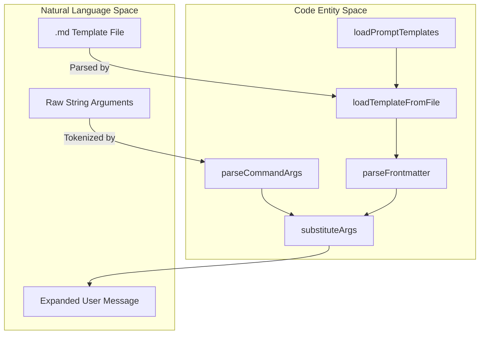
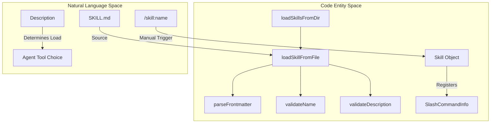

# Slash Commands와 Prompt Templates

<details>
<summary>관련 소스 파일</summary>

다음 파일들은 이 위키 페이지를 생성하기 위한 컨텍스트로 사용되었습니다.

- [.pi/prompts/is.md](.pi/prompts/is.md)
- [.pi/prompts/pr.md](.pi/prompts/pr.md)
- [.pi/prompts/wr.md](.pi/prompts/wr.md)
- [packages/coding-agent/docs/prompt-templates.md](packages/coding-agent/docs/prompt-templates.md)
- [packages/coding-agent/docs/skills.md](packages/coding-agent/docs/skills.md)
- [packages/coding-agent/src/core/prompt-templates.ts](packages/coding-agent/src/core/prompt-templates.ts)
- [packages/coding-agent/src/core/skills.ts](packages/coding-agent/src/core/skills.ts)
- [packages/coding-agent/src/core/slash-commands.ts](packages/coding-agent/src/core/slash-commands.ts)
- [packages/coding-agent/test/fixtures/skills/root-skill-preferred/SKILL.md](packages/coding-agent/test/fixtures/skills/root-skill-preferred/SKILL.md)
- [packages/coding-agent/test/fixtures/skills/root-skill-preferred/nested-child/SKILL.md](packages/coding-agent/test/fixtures/skills/root-skill-preferred/nested-child/SKILL.md)
- [packages/coding-agent/test/prompt-templates.test.ts](packages/coding-agent/test/prompt-templates.test.ts)
- [packages/coding-agent/test/skills.test.ts](packages/coding-agent/test/skills.test.ts)

</details>


이 페이지는 `pi`의 interactive command system을 문서화하며, hard-coded slash commands와 dynamic prompt template system을 모두 다룹니다. 이러한 메커니즘을 통해 사용자는 session state를 제어하고, conversation tree를 탐색하며, 짧은 snippets에서 복잡한 workflows를 확장할 수 있습니다.

## Slash Commands

Slash commands는 `/`로 시작하는 특수 inputs이며, LLM으로 전송되는 대신 internal functions를 trigger합니다. 중앙 registry를 통해 관리되며 core system, extensions, loaded skills가 제공할 수 있습니다.

### Built-in Commands
TUI의 핵심 기능은 `BUILTIN_SLASH_COMMANDS` registry에 정의된 built-in commands 집합을 통해 노출됩니다 [packages/coding-agent/src/core/slash-commands.ts:18-41]().

| Command | Description |
| :--- | :--- |
| `/settings` | settings menu를 엽니다 [packages/coding-agent/src/core/slash-commands.ts:19-19](). |
| `/model` | model을 선택합니다(selector UI 열기) [packages/coding-agent/src/core/slash-commands.ts:20-20](). |
| `/scoped-models` | Ctrl+P cycling을 위한 models를 enable/disable합니다 [packages/coding-agent/src/core/slash-commands.ts:21-21](). |
| `/export` | session을 export합니다(기본 HTML, 또는 path 지정: .html/.jsonl) [packages/coding-agent/src/core/slash-commands.ts:22-22](). |
| `/import` | JSONL file에서 session을 import하고 resume합니다 [packages/coding-agent/src/core/slash-commands.ts:23-23](). |
| `/share` | session을 secret GitHub gist로 share합니다 [packages/coding-agent/src/core/slash-commands.ts:24-24](). |
| `/copy` | 마지막 agent message를 clipboard에 복사합니다 [packages/coding-agent/src/core/slash-commands.ts:25-25](). |
| `/name` | session display name을 설정합니다 [packages/coding-agent/src/core/slash-commands.ts:26-26](). |
| `/session` | session info와 stats를 표시합니다 [packages/coding-agent/src/core/slash-commands.ts:27-27](). |
| `/changelog` | changelog entries를 표시합니다 [packages/coding-agent/src/core/slash-commands.ts:28-28](). |
| `/hotkeys` | 모든 keyboard shortcuts를 표시합니다 [packages/coding-agent/src/core/slash-commands.ts:29-29](). |
| `/fork` | 이전 user message에서 새 fork를 생성합니다 [packages/coding-agent/src/core/slash-commands.ts:30-30](). |
| `/clone` | 현재 위치에서 현재 session을 duplicate합니다 [packages/coding-agent/src/core/slash-commands.ts:31-31](). |
| `/tree` | session tree를 탐색합니다(branches 전환) [packages/coding-agent/src/core/slash-commands.ts:32-32](). |
| `/trust` | future sessions를 위해 project trust decision을 저장합니다 [packages/coding-agent/src/core/slash-commands.ts:33-33](). |
| `/login` | provider authentication을 구성합니다 [packages/coding-agent/src/core/slash-commands.ts:34-34](). |
| `/logout` | provider authentication을 제거합니다 [packages/coding-agent/src/core/slash-commands.ts:35-35](). |
| `/new` | 새 session을 시작합니다 [packages/coding-agent/src/core/slash-commands.ts:36-36](). |
| `/compact` | session context를 수동으로 compact합니다 [packages/coding-agent/src/core/slash-commands.ts:37-37](). |
| `/resume` | 다른 session을 resume합니다 [packages/coding-agent/src/core/slash-commands.ts:38-38](). |
| `/reload` | keybindings, extensions, skills, prompts, themes를 reload합니다 [packages/coding-agent/src/core/slash-commands.ts:39-39](). |
| `/quit` | application을 종료합니다 [packages/coding-agent/src/core/slash-commands.ts:40-41](). |

### Command Registration and Sources
Commands는 `SlashCommandSource`에 따라 분류됩니다 [packages/coding-agent/src/core/slash-commands.ts:4-11]().
1.  **Built-in**: core registry에 hard-code되어 있습니다 [packages/coding-agent/src/core/slash-commands.ts:18-41]().
2.  **Extension**: `ExtensionAPI.registerCommand()`를 통해 동적으로 등록됩니다.
3.  **Skill**: 각 loaded skill마다 `/skill:name`으로 자동 생성됩니다 [packages/coding-agent/docs/skills.md:75-80]().
4.  **Prompt**: prompt directories에서 발견된 `.md` files로부터 생성됩니다 [packages/coding-agent/src/core/prompt-templates.ts:188-237]().

출처:
- [packages/coding-agent/src/core/slash-commands.ts:4-41]()
- [packages/coding-agent/docs/skills.md:75-80]()
- [packages/coding-agent/src/core/prompt-templates.ts:188-237]()

---

## Prompt Templates

Prompt templates는 slash command로 호출될 때 더 긴 text prompts로 확장되는 Markdown files입니다(예: `/pr`이 복잡한 PR review instructions로 확장).

### Template Structure
Templates는 metadata를 정의하는 YAML frontmatter와 prompt content를 위한 Markdown body를 사용합니다 [packages/coding-agent/src/core/prompt-templates.ts:103-132]().

*   **Name**: filename에서 파생됩니다(예: `pr.md`는 `/pr`이 됨) [packages/coding-agent/src/core/prompt-templates.ts:108-108]().
*   **Description**: autocomplete에서 사용되며, `frontmatter.description` 또는 body의 첫 non-empty line에서 가져옵니다 [packages/coding-agent/src/core/prompt-templates.ts:111-119]().
*   **Argument Hint**: TUI autocomplete에 표시됩니다(예: `"<PR-URL>"`). frontmatter의 `argument-hint`로 정의됩니다 [packages/coding-agent/src/core/prompt-templates.ts:124-124]().

Example `pr.md` template:
```markdown
---
description: Review PRs from URLs with structured issue and code analysis
argument-hint: "<PR-URL>"
---
You are given one or more GitHub PR URLs: $@
...
```
[./.pi/prompts/pr.md:1-6]()

### Argument Substitution
`substituteArgs` 함수는 bash-like syntax를 사용해 정교한 argument parsing과 substitution을 지원합니다 [packages/coding-agent/src/core/prompt-templates.ts:69-101]().

| Syntax | Description |
| :--- | :--- |
| `$1`, `$2` | Positional arguments [packages/coding-agent/src/core/prompt-templates.ts:97-98](). |
| `$@` or `$ARGUMENTS` | 모든 arguments를 space로 join한 값 [packages/coding-agent/src/core/prompt-templates.ts:93-95](). |
| `${N:-default}` | positional arg `N`이며, 누락된 경우 default value 사용 [packages/coding-agent/src/core/prompt-templates.ts:75-79](). |
| `${@:N}` | index `N`(1-indexed)부터 시작하는 arguments [packages/coding-agent/src/core/prompt-templates.ts:81-91](). |
| `${@:N:L}` | index `N`부터 시작하는 `L`개의 arguments [packages/coding-agent/src/core/prompt-templates.ts:87-89](). |

`parseCommandArgs` 함수는 quoted strings(예: `/cmd "arg with spaces"`)를 처리하여 spaces가 포함된 arguments가 단일 tokens로 취급되도록 보장합니다 [packages/coding-agent/src/core/prompt-templates.ts:24-55]().

출처:
- [packages/coding-agent/src/core/prompt-templates.ts:24-101]()
- [packages/coding-agent/src/core/prompt-templates.ts:103-132]()
- [./.pi/prompts/pr.md:1-6]()

### Data Flow: Template to Prompt
다음 다이어그램은 template file이 최종 prompt string으로 변환되는 방식을 보여줍니다.

"Prompt Template Expansion Flow"

출처:
- [packages/coding-agent/src/core/prompt-templates.ts:24-101]()
- [packages/coding-agent/src/core/prompt-templates.ts:103-132]()
- [packages/coding-agent/src/core/prompt-templates.ts:193-237]()

---

## Agent Skills

Skills는 on-demand로 로드되는 specialized workflows입니다. prompt templates와 달리, skills는 agent가 읽고 지침으로 따르도록 의도되어 있지만 slash commands로도 등록됩니다.

### Skill Discovery and Validation
Skills는 `~/.pi/agent/skills/`와 project-local `.pi/skills/`를 포함한 여러 locations에서 로드됩니다 [packages/coding-agent/src/core/skills.ts:168-171](). skill은 `SKILL.md` 파일을 포함하는 directory로 정의됩니다 [packages/coding-agent/docs/skills.md:97-105]().

Pi는 [Agent Skills standard](https://agentskills.io/specification)에 따라 skills를 validate하며, 다음을 확인합니다.
*   **Name**: 최대 64자, lowercase a-z, 0-9, hyphens [packages/coding-agent/src/core/skills.ts:92-112]().
*   **Description**: 필수이며, 최대 1024자 [packages/coding-agent/src/core/skills.ts:117-127]().
*   **Invocation**: frontmatter에서 `disable-model-invocation: true`를 사용해 skills를 system prompt에서 숨길 수 있습니다 [packages/coding-agent/src/core/skills.ts:67-72]().

"Skill Loading and Command Registration"

출처:
- [packages/coding-agent/src/core/skills.ts:88-127]()
- [packages/coding-agent/src/core/skills.ts:168-221]()
- [packages/coding-agent/docs/skills.md:75-80]()

### Configuration and Discovery Rules
`loadPromptTemplates`와 `loadSkills` 함수는 search order를 정의합니다.
1.  **Global**: `agentDir/prompts/` 또는 `agentDir/skills/` [packages/coding-agent/src/core/prompt-templates.ts:201-201](), [packages/coding-agent/docs/skills.md:26-28]().
2.  **Project**: `[cwd]/.pi/prompts/` 또는 `[cwd]/.pi/skills/` [packages/coding-agent/src/core/prompt-templates.ts:202-202](), [packages/coding-agent/docs/skills.md:29-31]().
3.  **Explicit**: CLI 또는 settings를 통해 제공된 paths [packages/coding-agent/src/core/prompt-templates.ts:240-245](), [packages/coding-agent/docs/skills.md:34-34]().

`/reload` command는 keybindings, extensions, skills, prompts, themes 전체 refresh를 trigger합니다 [packages/coding-agent/src/core/slash-commands.ts:39-39]().

출처:
- [packages/coding-agent/src/core/prompt-templates.ts:193-245]()
- [packages/coding-agent/src/core/skills.ts:168-185]()
- [packages/coding-agent/src/core/slash-commands.ts:39-39]()
