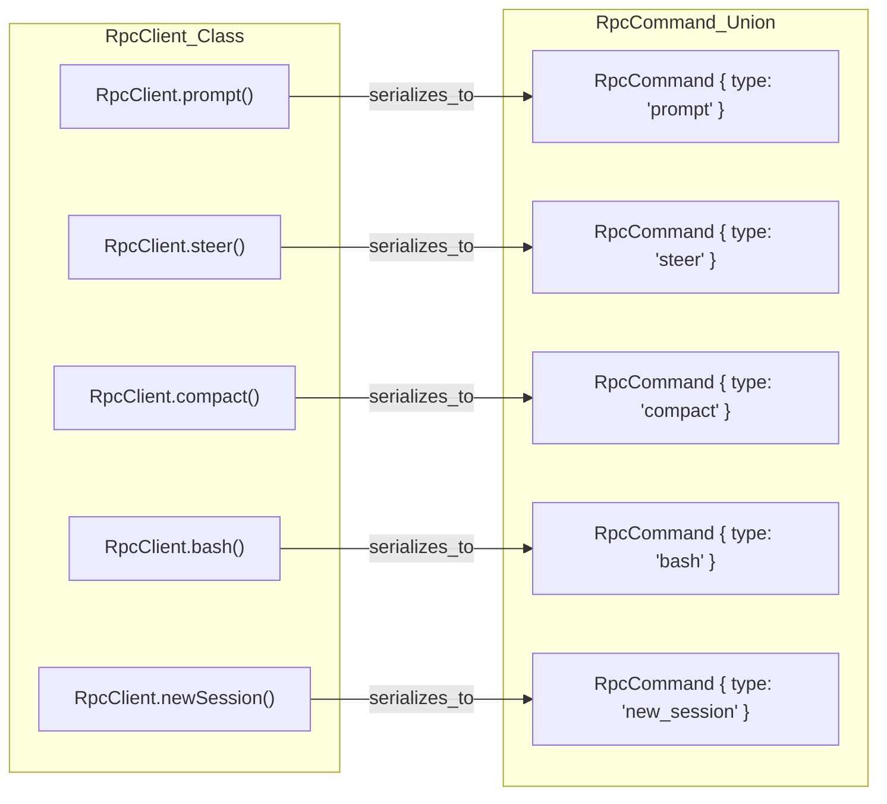

# 대체 실행 모드: Print와 RPC

<details>
<summary>관련 소스 파일</summary>

다음 파일들은 이 위키 페이지를 생성하기 위한 컨텍스트로 사용되었습니다.

- [packages/coding-agent/docs/rpc.md](packages/coding-agent/docs/rpc.md)
- [packages/coding-agent/docs/sdk.md](packages/coding-agent/docs/sdk.md)
- [packages/coding-agent/examples/extensions/trigger-compact.ts](packages/coding-agent/examples/extensions/trigger-compact.ts)
- [packages/coding-agent/src/core/output-guard.ts](packages/coding-agent/src/core/output-guard.ts)
- [packages/coding-agent/src/modes/rpc/rpc-client.ts](packages/coding-agent/src/modes/rpc/rpc-client.ts)
- [packages/coding-agent/src/modes/rpc/rpc-types.ts](packages/coding-agent/src/modes/rpc/rpc-types.ts)
- [packages/coding-agent/test/interactive-mode-clone-command.test.ts](packages/coding-agent/test/interactive-mode-clone-command.test.ts)
- [packages/coding-agent/test/interactive-mode-compaction.test.ts](packages/coding-agent/test/interactive-mode-compaction.test.ts)
- [packages/coding-agent/test/print-mode.test.ts](packages/coding-agent/test/print-mode.test.ts)
- [packages/coding-agent/test/rpc-client-process-exit.test.ts](packages/coding-agent/test/rpc-client-process-exit.test.ts)
- [packages/coding-agent/test/rpc-prompt-response-semantics.test.ts](packages/coding-agent/test/rpc-prompt-response-semantics.test.ts)
- [packages/coding-agent/test/rpc.test.ts](packages/coding-agent/test/rpc.test.ts)
- [packages/coding-agent/test/stdout-cleanliness.test.ts](packages/coding-agent/test/stdout-cleanliness.test.ts)
- [packages/coding-agent/test/trigger-compact-extension.test.ts](packages/coding-agent/test/trigger-compact-extension.test.ts)

</details>


표준 interactive Terminal UI 외에도, `pi` coding agent는 scripting, automation, 그리고 IDE나 custom dashboards 같은 다른 환경으로의 깊은 통합을 위해 설계된 대체 실행 모드를 지원합니다. 이러한 모드들은 동일한 underlying `AgentSession` logic을 활용하지만 input과 output을 위한 서로 다른 interfaces를 노출합니다.

## 1. Print Mode (`runPrintMode`)

Print mode는 "single-shot" 실행 모드입니다. 전체 TUI session에 들어가지 않고 prompt를 실행한 뒤 terminal에서 바로 output을 보고 싶은 CLI 사용자를 위해 설계되었습니다. human-readable stdout과 machine-readable JSON event stream을 모두 지원합니다.

### Implementation and Data Flow
이 모드의 entry point는 `packages/coding-agent/src/modes/print-mode.ts`의 `runPrintMode`입니다 [packages/coding-agent/test/print-mode.test.ts:4-4](). 이 함수는 `AgentSession`을 초기화하고 즉시 사용자의 prompt를 호출합니다.

- **Stdout Output**: 기본적으로 assistant text deltas와 tool execution status를 `stdout`에 출력합니다 [packages/coding-agent/docs/sdk.md:31-35]().
- **JSON Event Stream**: 활성화된 경우(일반적으로 `--json` 같은 flags를 통해), raw `AgentSessionEvent` stream을 JSONL로 출력하여 external tools가 agent의 진행 상황을 real-time으로 parse할 수 있게 합니다.
- **Lifecycle**: agent가 "idle" state에 도달하면(no more tool calls 또는 pending turns) process가 종료됩니다. 성공 시 exit code `0`을 반환하고, assistant error가 발생하면 `1`을 반환합니다 [packages/coding-agent/test/print-mode.test.ts:126-141]().

**출처:** [packages/coding-agent/docs/sdk.md:31-35](), [packages/coding-agent/test/print-mode.test.ts:4-4](), [packages/coding-agent/test/print-mode.test.ts:93-142]()

---

## 2. RPC Mode (`runRpcMode`)

RPC mode는 `stdin`과 `stdout`을 통한 JSON protocol로 coding agent의 headless operation을 가능하게 합니다. 이는 IDE extensions 또는 external UIs에 `pi`를 embedding하기 위한 기본 메커니즘입니다 [packages/coding-agent/docs/rpc.md:2-5]().

### Protocol Specifications
- **Framing**: record delimiter로 `\n`을 사용하는 엄격한 JSONL(JSON Lines) semantics를 사용합니다 [packages/coding-agent/docs/rpc.md:27-30](). Node.js `readline`은 JSON strings 안에서 유효한 `U+2028`과 `U+2029` 같은 Unicode separators를 기준으로 split하기 때문에 non-compliant하다고 명시되어 있습니다 [packages/coding-agent/docs/rpc.md:36-37]().
- **Commands (stdin)**: Clients는 actions(예: `prompt`, `get_state`, `compact`)를 나타내는 JSON objects를 전송합니다 [packages/coding-agent/src/modes/rpc/rpc-types.ts:19-69]().
- **Responses (stdout)**: agent는 `success` boolean과 선택적 `data`를 포함하는 response object로 응답합니다. `success: true`는 prompt가 accepted 또는 queued되었음을 나타냅니다 [packages/coding-agent/src/modes/rpc/rpc-types.ts:111-120](), [packages/coding-agent/docs/rpc.md:71-76]().
- **Events (stdout)**: 비동기 `AgentEvent` objects가 JSON lines로 stream되며, agent의 real-time progress를 나타냅니다 [packages/coding-agent/docs/rpc.md:23-23]().

### Command/Event Lifecycle
RPC mode는 lifecycle을 관리하기 위해 `AgentSessionRuntime`을 사용합니다. 이를 통해 `new_session` 또는 `switch_session` 같은 commands가 process를 재시작하지 않고도 active `AgentSession`을 교체할 수 있습니다 [packages/coding-agent/docs/sdk.md:120-125]().

#### RPC Execution Flow
이 다이어그램은 command가 `stdin`에서 RPC handler를 거쳐 core `AgentSession`으로 이동하는 방식을 보여줍니다.

"RPC Execution Flow"
```mermaid
graph TD
    subgraph "ExternalProcess"
        [Client] -- "JSONL_Command" --> [stdin]
    end

    subgraph "piProcess_runRpcMode"
        [stdin] --> attachJsonlLineReader["attachJsonlLineReader (jsonl.ts)"]
        attachJsonlLineReader --> RpcHandler["RpcHandler (rpc-mode.ts)"]
        RpcHandler -- "execute" --> AgentSessionRuntime["AgentSessionRuntime (agent-session-runtime.ts)"]
        AgentSessionRuntime -- "call" --> AgentSession["AgentSession (agent-session.ts)"]
        
        AgentSession -- "AgentEvent" --> serializeJsonLine["serializeJsonLine (jsonl.ts)"]
        serializeJsonLine -- "JSONL_Event" --> [stdout]
        
        RpcHandler -- "RpcResponse" --> serializeJsonLine
    end

    subgraph "AgentCore"
        AgentSession -- "loop" --> AgentLoop["AgentLoop (pi-agent-core)"]
    end
```
**출처:** [packages/coding-agent/docs/rpc.md:19-37](), [packages/coding-agent/src/modes/rpc/rpc-types.ts:111-120](), [packages/coding-agent/src/modes/rpc/rpc-client.ts:126-128](), [packages/coding-agent/docs/sdk.md:120-125]()

---

## 3. TypeScript RPC Client (`RpcClient`)

library를 직접 link하지 않고 `pi`를 subprocess로 spawn하려는 Node.js applications를 위해, 패키지는 high-level `RpcClient`를 제공합니다 [packages/coding-agent/src/modes/rpc/rpc-client.ts:54-54]().

### Key Functions
- `start()`: `--mode rpc` flag와 함께 `pi` binary를 spawn하고 `stdout`에 JSONL line reader를 attach합니다 [packages/coding-agent/src/modes/rpc/rpc-client.ts:72-138]().
- `prompt(message, images)`: user prompt를 전송하고 전송 직후 반환합니다. clients는 stream을 받기 위해 `onEvent`를 사용합니다 [packages/coding-agent/src/modes/rpc/rpc-client.ts:196-198]().
- `onEvent(listener)`: 비동기 `AgentEvent` stream을 위한 callback을 등록합니다 [packages/coding-agent/src/modes/rpc/rpc-client.ts:170-178]().
- `getState()`: model info와 message counts를 포함한 현재 `RpcSessionState`를 가져옵니다 [packages/coding-agent/src/modes/rpc/rpc-client.ts:251-254]().

### Code Entity Mapping: Client to Protocol
이 다이어그램은 `RpcClient` methods를 이들이 생성하여 wire로 전송하는 `RpcCommand` types에 매핑합니다.

"RpcClient to RpcCommand Mapping"

**출처:** [packages/coding-agent/src/modes/rpc/rpc-client.ts:191-249](), [packages/coding-agent/src/modes/rpc/rpc-types.ts:19-69]()

---

## 4. Advanced RPC Features

### Steering and Follow-ups
RPC mode는 `streamingBehavior`를 지정하여 agent가 streaming 중일 때도 상호작용할 수 있게 합니다 [packages/coding-agent/docs/rpc.md:55-59]().
- **Steer**: agent를 mid-turn에서 interrupt합니다. 현재 assistant turn이 tool calls 실행을 마친 뒤, 다음 LLM call 이전에 전달됩니다 [packages/coding-agent/docs/rpc.md:61-62]().
- **Follow-up**: agent가 현재 task를 완전히 끝내고 멈춘 뒤에만 처리될 message를 queue에 넣습니다 [packages/coding-agent/docs/rpc.md:62-63]().

### Bash Execution
RPC protocol은 agent 내부 `bash-executor`를 통해 shell commands를 직접 실행할 수 있게 하며, `output`, `exitCode`, `cancelled` status를 포함하는 `BashResult`를 반환합니다 [packages/coding-agent/src/modes/rpc/rpc-types.ts:52-53](), [packages/coding-agent/src/modes/rpc/rpc-types.ts:168-168]().

### Session State and Statistics
`get_state`와 `get_session_stats` commands는 token usage와 auto-compaction status를 포함해 현재 session에 대한 깊은 visibility를 제공합니다 [packages/coding-agent/src/modes/rpc/rpc-types.ts:91-104]().

| Command | Return Data | Purpose |
| :--- | :--- | :--- |
| `get_state` | `RpcSessionState` | 현재 model, thinking level, streaming status [packages/coding-agent/src/modes/rpc/rpc-types.ts:120-120](). |
| `get_messages` | `AgentMessage[]` | 전체 conversation history [packages/coding-agent/src/modes/rpc/rpc-types.ts:194-194](). |
| `get_available_models` | `ModelInfo[]` | 현재 provider가 지원하는 LLM models 목록 [packages/coding-agent/src/modes/rpc/rpc-types.ts:140-143](). |
| `export_html` | `{ path: string }` | session의 static HTML transcript를 생성합니다 [packages/coding-agent/src/modes/rpc/rpc-types.ts:173-173](). |
| `compact` | `CompactionResult` | compaction process를 수동으로 trigger합니다 [packages/coding-agent/src/modes/rpc/rpc-types.ts:160-160](). |

### Output Guard and Stdout Cleanliness
protocol integrity를 보장하기 위해 `pi`는 internal logs 또는 unexpected tool output이 JSONL stream을 손상시키는 것을 방지하는 `output-guard.ts`를 사용합니다 [packages/coding-agent/src/core/output-guard.ts:45-70](). non-interactive modes에서는 trusted startup information이 `stderr`로 routing되고, `stdout`은 primary data stream 전용으로 유지됩니다 [packages/coding-agent/test/stdout-cleanliness.test.ts:99-107]().

**출처:** [packages/coding-agent/src/modes/rpc/rpc-types.ts:19-196](), [packages/coding-agent/docs/rpc.md:79-121](), [packages/coding-agent/test/rpc.test.ts:36-45](), [packages/coding-agent/src/core/output-guard.ts:45-70](), [packages/coding-agent/test/stdout-cleanliness.test.ts:99-107]()
