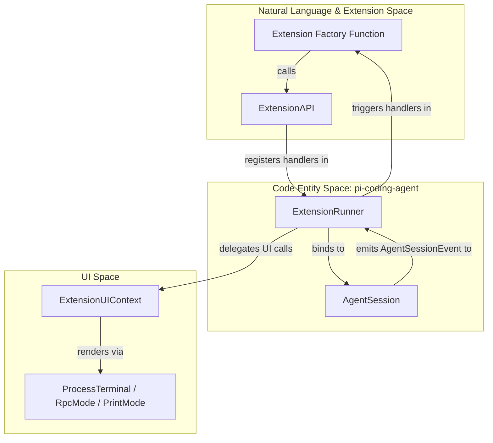
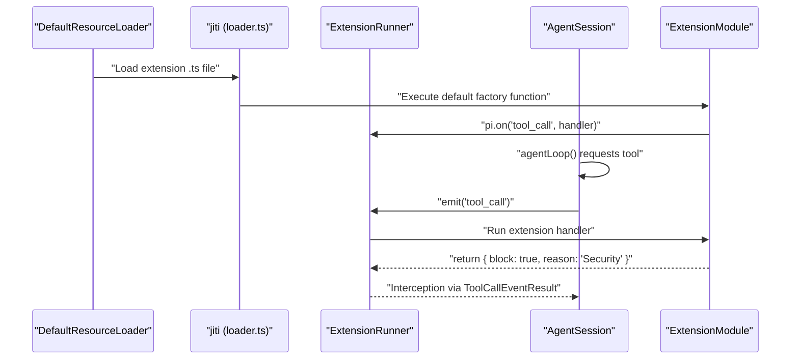

# Extension System

관련 소스 파일

다음 파일들은 이 위키 페이지를 생성하기 위한 컨텍스트로 사용되었습니다.

- [packages/coding-agent/docs/extensions.md](packages/coding-agent/docs/extensions.md)
- [packages/coding-agent/examples/extensions/README.md](packages/coding-agent/examples/extensions/README.md)
- [packages/coding-agent/src/core/extensions/index.ts](packages/coding-agent/src/core/extensions/index.ts)
- [packages/coding-agent/src/core/extensions/loader.ts](packages/coding-agent/src/core/extensions/loader.ts)
- [packages/coding-agent/src/core/extensions/runner.ts](packages/coding-agent/src/core/extensions/runner.ts)
- [packages/coding-agent/src/core/extensions/types.ts](packages/coding-agent/src/core/extensions/types.ts)
- [packages/coding-agent/src/index.ts](packages/coding-agent/src/index.ts)
- [packages/coding-agent/test/extensions-runner.test.ts](packages/coding-agent/test/extensions-runner.test.ts)

`pi` extension system은 개발자가 lifecycle events를 subscribe하고, custom tools를 등록하며, slash commands를 추가하고, interactive UI components를 생성하여 agent의 동작을 확장할 수 있게 합니다. Extensions는 TypeScript로 작성되며 별도의 compilation 단계 없이 runtime에 동적으로 로드됩니다.

## Architecture Overview

extension architecture는 **Extension Runtime**, **Extension Runner**, **Agent Session** 사이의 decoupled relationship을 중심으로 구축됩니다.

*   **Discovery & Loading**: Extensions는 global 및 project-local directories에서 발견되며 `jiti`를 사용해 로드됩니다 [packages/coding-agent/src/core/extensions/loader.ts:15-15]().
*   **Binding**: 로드된 extensions는 `ExtensionRunner`를 통해 `AgentSession`에 바인딩됩니다 [packages/coding-agent/src/core/agent-session.ts:183-186]().
*   **Interaction**: Extensions는 `ExtensionAPI` [packages/coding-agent/src/core/extensions/types.ts:173-173]()를 통해 시스템과 상호작용하며, 이 API는 UI primitives, tool registration, event subscriptions에 대한 접근을 제공합니다.

### System Interaction Diagram

이 다이어그램은 `ExtensionRunner`가 개발자가 사용하는 high-level `ExtensionAPI`와 내부 `AgentSession` logic을 어떻게 연결하는지 보여줍니다.

**출처:** [packages/coding-agent/src/core/extensions/runner.ts:225-230](), [packages/coding-agent/src/core/agent-session.ts:157-187](), [packages/coding-agent/src/core/extensions/loader.ts:124-170](), [packages/coding-agent/src/modes/interactive/interactive-mode.ts:73-73]()

## Extension API and Lifecycle Events

`ExtensionAPI`는 extension authors를 위한 기본 interface입니다. 다음을 가능하게 합니다.
*   **Event Handling**: `session_start`, `tool_call`, `message_end` 같은 events를 subscribe합니다 [packages/coding-agent/src/core/extensions/types.ts:227-250]().
*   **Tool Registration**: `pi.registerTool()`을 통해 LLM에 새 capabilities를 추가합니다 [packages/coding-agent/src/core/extensions/types.ts:261-261]().
*   **UI Interaction**: `ctx.ui`를 통해 사용자에게 input을 요청하거나 notifications를 표시합니다 [packages/coding-agent/src/core/extensions/types.ts:124-168]().

events와 API methods의 전체 catalog는 **[Extension API and Lifecycle Events](#6.1)**를 참조하세요.

**출처:** [packages/coding-agent/src/core/extensions/types.ts:1-300]()

## Loading and Discovery

`pi`는 extensions를 찾기 위해 세 단계 discovery strategy를 사용합니다.
1.  **Global**: `~/.pi/agent/extensions/` [packages/coding-agent/docs/extensions.md:116-117]()
2.  **Project-local**: `.pi/extensions/` [packages/coding-agent/docs/extensions.md:118-119]()
3.  **Configured**: `settings.json` 또는 `--extension` CLI flag로 지정된 paths [packages/coding-agent/src/core/settings-manager.ts:95-99]().

Extensions는 `jiti`를 사용해 로드됩니다. `jiti`는 modern syntax와 virtual module mapping을 처리하는 runtime을 제공하여 TypeScript를 직접 실행할 수 있게 합니다 [packages/coding-agent/src/core/extensions/loader.ts:44-61](). `ExtensionRuntime`은 hot-reloads(`/reload`를 통해) 중 extensions의 "stale" state를 관리하여, extension의 이전 version에서 온 handlers가 새 session을 방해하지 않도록 보장합니다 [packages/coding-agent/src/core/extensions/loader.ts:154-158]().

loading pipeline과 hot-reloading에 대한 자세한 내용은 **[Extension Loading and Discovery](#6.2)**를 참조하세요.

**출처:** [packages/coding-agent/src/core/extensions/loader.ts:1-40](), [packages/coding-agent/src/core/package-manager.ts:92-108](), [packages/coding-agent/src/core/settings-manager.ts:95-99]()

## Extension Runtime Flow

다음 다이어그램은 extension의 lifecycle을 discovery에서 `AgentSession` 안의 execution까지 매핑합니다.

**출처:** [packages/coding-agent/src/core/extensions/loader.ts:124-170](), [packages/coding-agent/src/core/extensions/runner.ts:225-250](), [packages/coding-agent/src/core/agent-session.ts:53-80](), [packages/coding-agent/src/core/resource-loader.ts:163-164]()

## Examples and Patterns

codebase에는 다양한 reference extensions와 patterns가 포함되어 있습니다. 일반적인 patterns는 다음과 같습니다.
*   **Safety Gates**: destructive commands를 확인하기 위해 `bash` tool calls를 intercept합니다(예: `rm -rf` 확인) [packages/coding-agent/docs/extensions.md:69-74]().
*   **Stateful Tools**: `pi.appendEntry()`를 사용해 session turns 전반에 persist되는 local data를 관리합니다 [packages/coding-agent/docs/extensions.md:15-15]().
*   **Custom Providers**: `pi.registerProvider()`를 통해 완전히 새로운 LLM backends를 구현합니다 [packages/coding-agent/src/core/extensions/loader.ts:161-163]().
*   **UI Customization**: `ctx.ui.setWidget()` 또는 `ctx.ui.setFooter()`를 사용해 TUI layout을 변경합니다 [packages/coding-agent/src/core/extensions/types.ts:162-180]().
*   **Conflict Management**: `ExtensionRunner`는 extension shortcuts가 built-in keybindings와 충돌할 때 자동으로 감지하고 경고합니다 [packages/coding-agent/src/core/extensions/runner.ts:67-108]().

이 예제들의 walkthrough는 **[Extension Examples and Patterns](#6.3)**를 참조하세요.

**출처:** [packages/coding-agent/docs/extensions.md:1-100](), [packages/coding-agent/src/core/extensions/types.ts:124-180](), [packages/coding-agent/examples/extensions/README.md:1-130]()
