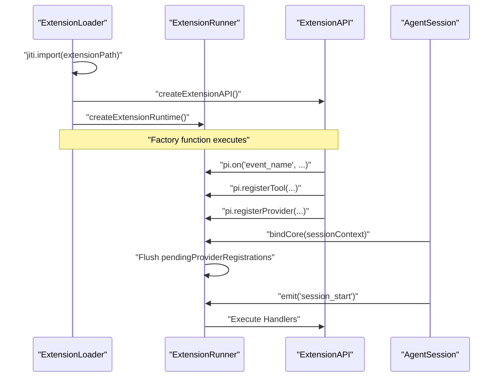
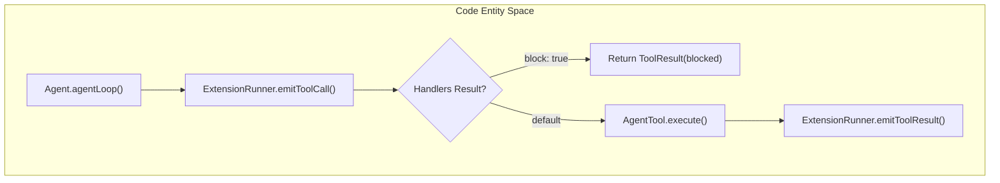
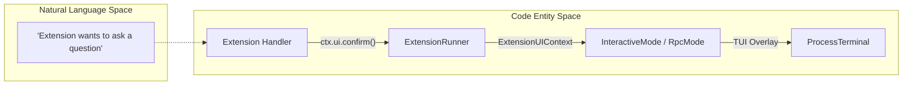

# Extension API와 Lifecycle Events

관련 소스 파일

다음 파일들은 이 위키 페이지를 생성하기 위한 컨텍스트로 사용되었습니다.

- [packages/coding-agent/docs/extensions.md](packages/coding-agent/docs/extensions.md)
- [packages/coding-agent/examples/extensions/README.md](packages/coding-agent/examples/extensions/README.md)
- [packages/coding-agent/examples/extensions/dynamic-tools.ts](packages/coding-agent/examples/extensions/dynamic-tools.ts)
- [packages/coding-agent/src/core/extensions/index.ts](packages/coding-agent/src/core/extensions/index.ts)
- [packages/coding-agent/src/core/extensions/loader.ts](packages/coding-agent/src/core/extensions/loader.ts)
- [packages/coding-agent/src/core/extensions/runner.ts](packages/coding-agent/src/core/extensions/runner.ts)
- [packages/coding-agent/src/core/extensions/types.ts](packages/coding-agent/src/core/extensions/types.ts)
- [packages/coding-agent/src/core/system-prompt.ts](packages/coding-agent/src/core/system-prompt.ts)
- [packages/coding-agent/src/index.ts](packages/coding-agent/src/index.ts)
- [packages/coding-agent/test/agent-session-dynamic-tools.test.ts](packages/coding-agent/test/agent-session-dynamic-tools.test.ts)
- [packages/coding-agent/test/extensions-runner.test.ts](packages/coding-agent/test/extensions-runner.test.ts)
- [packages/coding-agent/test/system-prompt.test.ts](packages/coding-agent/test/system-prompt.test.ts)

`pi`의 Extensions는 개발자가 agent behavior를 intercept하고, custom tools를 등록하며, interactive UI components를 만들 수 있게 하는 TypeScript modules입니다. 이 시스템은 extensions가 `AgentSession`이 방출하는 lifecycle events를 subscribe하는 hook-based architecture를 사용합니다.

## ExtensionAPI Interface

`ExtensionAPI`는 extension의 기본 entry point입니다. extension의 default factory function에 첫 번째 argument로 전달됩니다 [packages/coding-agent/src/core/extensions/types.ts:413-414]().

### Core Methods

| Method | Description |
| :--- | :--- |
| `pi.on(event, handler)` | lifecycle event를 subscribe합니다 [packages/coding-agent/src/core/extensions/types.ts:416-417](). |
| `pi.registerTool(def)` | LLM이 호출할 수 있는 새 tool을 등록합니다 [packages/coding-agent/src/core/extensions/types.ts:419-420](). |
| `pi.registerCommand(name, def)` | slash command(예: `/my-command`)를 추가합니다 [packages/coding-agent/src/core/extensions/types.ts:422-423](). |
| `pi.appendEntry(entry)` | session의 JSONL log에 custom data를 persist합니다 [packages/coding-agent/src/core/extensions/types.ts:446-447](). |
| `pi.registerShortcut(key, def)` | global keyboard shortcut을 바인딩합니다 [packages/coding-agent/src/core/extensions/types.ts:425-426](). |
| `pi.registerFlag(name, def)` | `pi --flag`로 사용할 수 있는 CLI flag를 등록합니다 [packages/coding-agent/src/core/extensions/types.ts:431-432](). |
| `pi.registerProvider(name, config)` | custom LLM provider를 등록합니다 [packages/coding-agent/src/core/extensions/types.ts:434-435](). |
| `pi.unregisterProvider(name)` | custom LLM provider 등록을 해제합니다 [packages/coding-agent/src/core/extensions/types.ts:437-438](). |

출처: [packages/coding-agent/src/core/extensions/types.ts:413-447]()

### Extension Initialization Flow

다음 다이어그램은 extension이 `jiti`를 통해 로드되고 `AgentSession`에 바인딩되는 방식을 보여줍니다.

**Extension Binding Sequence**

출처: [packages/coding-agent/src/core/extensions/loader.ts:15-61](), [packages/coding-agent/src/core/extensions/loader.ts:124-170](), [packages/coding-agent/src/core/extensions/runner.ts:224-250](), [packages/coding-agent/src/core/agent-session.ts:732-750]()

## Lifecycle Events Catalog

Extensions는 agent turn과 session management의 다양한 단계에 hook할 수 있습니다.

### Session & Environment Events
*   `session_start`: extension이 session에 바인딩될 때 방출됩니다 [packages/coding-agent/src/core/extensions/types.ts:285-288]().
*   `resources_discover`: `ResourceLoader`가 skills, prompts, themes를 scan할 때 trigger됩니다 [packages/coding-agent/src/core/extensions/types.ts:333-336]().
*   `session_shutdown`: session이 닫히기 전에 방출됩니다 [packages/coding-agent/src/core/extensions/types.ts:328-331]().
*   `session_before_switch`: 다른 session으로 전환하기 전에 방출됩니다 [packages/coding-agent/src/core/extensions/types.ts:290-293]().
*   `session_before_fork`: 현재 session을 fork하기 전에 방출됩니다 [packages/coding-agent/src/core/extensions/types.ts:295-298]().
*   `session_before_compact`: session history를 compact하기 전에 방출됩니다 [packages/coding-agent/src/core/extensions/types.ts:300-303]().
*   `session_compact`: session compaction 후에 방출됩니다 [packages/coding-agent/src/core/extensions/types.ts:305-308]().
*   `session_before_tree`: session tree를 navigate하기 전에 방출됩니다 [packages/coding-agent/src/core/extensions/types.ts:310-313]().
*   `session_tree`: session tree를 navigate한 후에 방출됩니다 [packages/coding-agent/src/core/extensions/types.ts:315-318]().
*   `user_bash`: 사용자가 bash command를 실행할 때 방출됩니다 [packages/coding-agent/src/core/extensions/types.ts:320-323]().
*   `input`: 사용자가 agent에 input을 제공할 때 방출됩니다 [packages/coding-agent/src/core/extensions/types.ts:325-326]().

### Agent Turn Events
*   `before_agent_start`: LLM이 호출되기 전에 system prompt를 수정하거나 messages를 inject할 수 있게 합니다 [packages/coding-agent/src/core/extensions/types.ts:213-217]().
*   `before_provider_request`: LLM provider(예: OpenAI/Anthropic)에 대한 raw request를 intercept합니다 [packages/coding-agent/src/core/extensions/types.ts:233-237]().
*   `turn_start` / `turn_end`: 단일 agent loop iteration의 시작과 끝을 표시합니다 [packages/coding-agent/src/core/extensions/types.ts:205-211]().
*   `message_start` / `message_update` / `message_end`: assistant의 streaming response에 hook합니다 [packages/coding-agent/src/core/extensions/types.ts:239-248]().
*   `context`: agent의 context가 변경될 때 방출됩니다 [packages/coding-agent/src/core/extensions/types.ts:219-222]().

### Tool Interception
Extensions는 `tool_call` event를 사용해 tool calls를 block하거나 수정할 수 있습니다. handler가 `{ block: true }`를 반환하면 tool execution은 건너뜁니다 [packages/coding-agent/src/core/extensions/types.ts:250-255]().
*   `tool_call`: tool이 실행되기 전에 방출됩니다 [packages/coding-agent/src/core/extensions/types.ts:250-255]().
*   `tool_result`: tool이 실행되고 result를 반환한 후 방출됩니다 [packages/coding-agent/src/core/extensions/types.ts:257-260]().

**Tool Execution Interception Logic**

출처: [packages/coding-agent/src/core/extensions/runner.ts:544-580](), [packages/coding-agent/src/core/extensions/types.ts:250-260]()

## ExtensionContext Objects

event handler 또는 command가 실행될 때, UI와 session state에 접근할 수 있는 context object를 받습니다.

### ExtensionContext
event handlers에 전달됩니다.
*   `ctx.ui`: dialogs, notifications, custom components를 표시하기 위한 `ExtensionUIContext` 접근을 제공합니다 [packages/coding-agent/src/core/extensions/types.ts:124-190]().
*   `ctx.sessionManager`: 현재 session history와 branching에 대한 read-only access입니다 [packages/coding-agent/src/core/extensions/types.ts:403-404]().
*   `ctx.model`: active LLM에 대한 정보입니다 [packages/coding-agent/src/core/extensions/types.ts:402-403]().
*   `ctx.modelRegistry`: LLM providers와 models를 관리하기 위한 `ModelRegistry` 접근입니다 [packages/coding-agent/src/core/extensions/types.ts:405-406]().
*   `ctx.cwd`: 현재 working directory입니다 [packages/coding-agent/src/core/extensions/types.ts:407-408]().
*   `ctx.exec`: shell commands 실행을 위한 utility입니다 [packages/coding-agent/src/core/extensions/types.ts:409-410]().
*   `ctx.eventBus`: events를 publish하고 subscribe하기 위한 event bus입니다 [packages/coding-agent/src/core/extensions/types.ts:411-412]().

출처: [packages/coding-agent/src/core/extensions/types.ts:399-412]()

### ExtensionCommandContext
slash command handlers에 전달됩니다. navigation actions로 `ExtensionContext`를 확장합니다.
*   `ctx.newSession()`: 새 session을 시작합니다 [packages/coding-agent/src/core/extensions/types.ts:358-359]().
*   `ctx.fork(entryId)`: 특정 message에서 branch를 생성합니다 [packages/coding-agent/src/core/extensions/types.ts:360-361]().
*   `ctx.reload()`: extensions와 resources를 hot-reload합니다 [packages/coding-agent/src/core/extensions/types.ts:363-364]().
*   `ctx.navigateTree()`: session tree를 navigate합니다 [packages/coding-agent/src/core/extensions/types.ts:362-363]().
*   `ctx.switchSession()`: 다른 session으로 전환합니다 [packages/coding-agent/src/core/extensions/types.ts:365-366]().
*   `ctx.waitForIdle()`: agent가 idle 상태가 될 때까지 기다립니다 [packages/coding-agent/src/core/extensions/types.ts:357-358]().

출처: [packages/coding-agent/src/core/extensions/types.ts:355-366]()

## UI Primitives

Extensions는 `ExtensionUIContext`를 통해 사용자와 상호작용합니다. `interactive-mode`에서는 이것들이 TUI components에 매핑되고, `rpc-mode`에서는 JSON messages를 방출합니다.

| Method | Code Entity / Implementation |
| :--- | :--- |
| `confirm()` | `LoginDialogComponent` style prompt를 표시합니다 [packages/coding-agent/src/modes/interactive/interactive-mode.ts:1335-1345]() |
| `select()` | `SelectList` 또는 `TreeSelectorComponent`를 사용합니다 [packages/coding-agent/src/modes/interactive/interactive-mode.ts:1316-1333]() |
| `setStatus()` | `FooterComponent`를 업데이트합니다 [packages/coding-agent/src/modes/interactive/interactive-mode.ts:1416-1418]() |
| `setWidget()` | editor 위/아래에 `Component`를 render합니다 [packages/coding-agent/src/modes/interactive/interactive-mode.ts:1451-1473]() |
| `custom()` | raw `pi-tui` component를 `Overlay`에 mount합니다 [packages/coding-agent/src/modes/interactive/interactive-mode.ts:1532-1565]() |
| `addAutocompleteProvider()` | editor의 autocomplete logic을 wrap합니다 [packages/coding-agent/src/modes/interactive/interactive-mode.ts:1612-1615]() |
| `notify()` | notification을 표시합니다 [packages/coding-agent/src/modes/interactive/interactive-mode.ts:1399-1401]() |
| `onTerminalInput()` | raw terminal input에 대한 handler를 등록합니다 [packages/coding-agent/src/modes/interactive/interactive-mode.ts:1403-1405]() |
| `setWorkingMessage()` | working/loading message를 설정합니다 [packages/coding-agent/src/modes/interactive/interactive-mode.ts:1420-1422]() |
| `setWorkingVisible()` | working loader를 표시하거나 숨깁니다 [packages/coding-agent/src/modes/interactive/interactive-mode.ts:1424-1426]() |
| `setWorkingIndicator()` | working indicator를 구성합니다 [packages/coding-agent/src/modes/interactive/interactive-mode.ts:1428-1430]() |
| `setHiddenThinkingLabel()` | hidden thinking blocks의 label을 설정합니다 [packages/coding-agent/src/modes/interactive/interactive-mode.ts:1432-1434]() |
| `setFooter()` | custom footer component를 설정합니다 [packages/coding-agent/src/modes/interactive/interactive-mode.ts:1475-1480]() |
| `setHeader()` | custom header component를 설정합니다 [packages/coding-agent/src/modes/interactive/interactive-mode.ts:1482-1484]() |
| `setTitle()` | terminal window/tab title을 설정합니다 [packages/coding-agent/src/modes/interactive/interactive-mode.ts:1486-1488]() |
| `pasteToEditor()` | editor에 text를 paste합니다 [packages/coding-agent/src/modes/interactive/interactive-mode.ts:1490-1492]() |
| `setEditorText()` | editor의 text content를 설정합니다 [packages/coding-agent/src/modes/interactive/interactive-mode.ts:1494-1496]() |
| `getEditorText()` | editor의 text content를 가져옵니다 [packages/coding-agent/src/modes/interactive/interactive-mode.ts:1498-1500]() |
| `editor()` | custom editor component를 표시합니다 [packages/coding-agent/src/modes/interactive/interactive-mode.ts:1502-1504]() |
| `setEditorComponent()` | custom editor component를 설정합니다 [packages/coding-agent/src/modes/interactive/interactive-mode.ts:1617-1619]() |
| `getEditorComponent()` | 현재 editor component를 가져옵니다 [packages/coding-agent/src/modes/interactive/interactive-mode.ts:1621-1623]() |
| `theme` | 현재 theme에 접근합니다 [packages/coding-agent/src/modes/interactive/interactive-mode.ts:1625-1627]() |
| `getAllThemes()` | 사용 가능한 모든 themes를 가져옵니다 [packages/coding-agent/src/modes/interactive/interactive-mode.ts:1629-1631]() |
| `getTheme()` | 이름으로 특정 theme를 가져옵니다 [packages/coding-agent/src/modes/interactive/interactive-mode.ts:1633-1635]() |
| `setTheme()` | 현재 theme를 설정합니다 [packages/coding-agent/src/modes/interactive/interactive-mode.ts:1637-1639]() |
| `getToolsExpanded()` | tools가 expanded 상태인지 확인합니다 [packages/coding-agent/src/modes/interactive/interactive-mode.ts:1641-1643]() |
| `setToolsExpanded()` | tools의 expanded state를 설정합니다 [packages/coding-agent/src/modes/interactive/interactive-mode.ts:1645-1647]() |

**UI Request Flow (Natural Language to Code)**

출처: [packages/coding-agent/src/core/extensions/types.ts:124-190](), [packages/coding-agent/src/modes/interactive/interactive-mode.ts:1335-1345](), [packages/coding-agent/src/modes/rpc/rpc-mode.ts:135-138]()

## Data Persistence via `appendEntry`

Extensions는 session log에 custom entries를 append하여 restarts 후에도 유지되는 state를 저장할 수 있습니다.
1.  Extension이 `pi.appendEntry({ type: "custom", ... })`를 호출합니다 [packages/coding-agent/src/core/extensions/types.ts:446-447]().
2.  `AgentSession`이 이를 `SessionManager.appendEntry()`로 forward합니다 [packages/coding-agent/src/core/agent-session.ts:854-856]().
3.  entry가 `.jsonl` session file에 기록됩니다 [packages/coding-agent/src/core/session-manager.ts:573-585]().
4.  reload 시 extension은 `ctx.sessionManager.getEntries()`를 scan하여 자신의 data를 찾을 수 있습니다 [packages/coding-agent/src/core/extensions/types.ts:403-404]().

출처: [packages/coding-agent/src/core/agent-session.ts:854-860](), [packages/coding-agent/src/core/session-manager.ts:573-585](), [packages/coding-agent/src/core/extensions/types.ts:446-450]()
