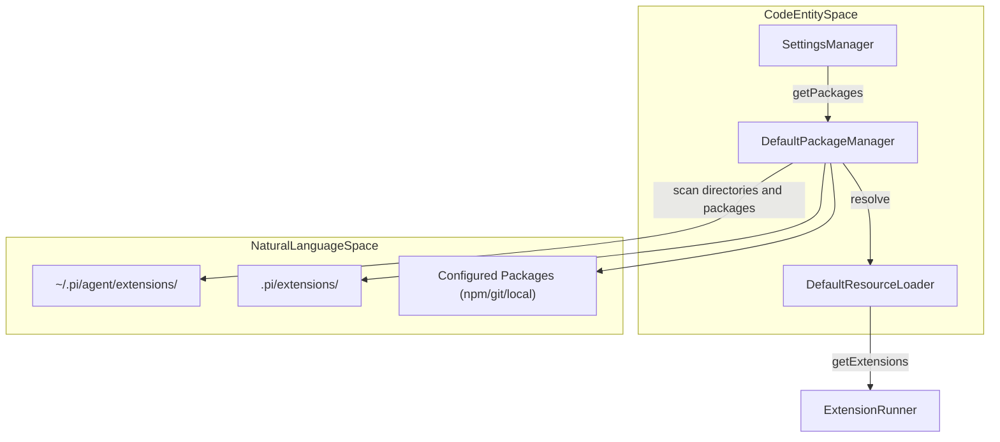
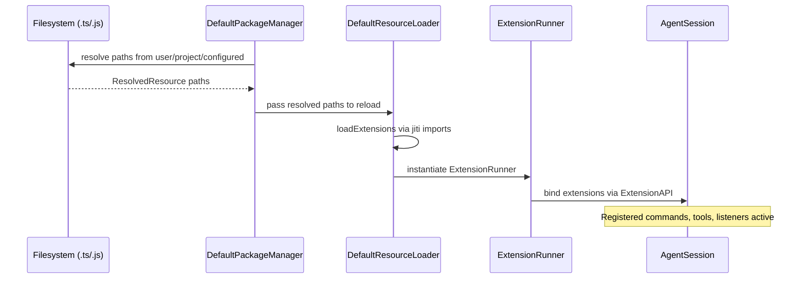

# Extension Loading and Discovery

관련 소스 파일

다음 파일들은 이 위키 페이지를 생성하기 위한 컨텍스트로 사용되었습니다.

- [packages/coding-agent/docs/packages.md](packages/coding-agent/docs/packages.md)
- [packages/coding-agent/examples/extensions/project-trust.ts](packages/coding-agent/examples/extensions/project-trust.ts)
- [packages/coding-agent/src/core/package-manager.ts](packages/coding-agent/src/core/package-manager.ts)
- [packages/coding-agent/src/core/resource-loader.ts](packages/coding-agent/src/core/resource-loader.ts)
- [packages/coding-agent/src/utils/git.ts](packages/coding-agent/src/utils/git.ts)
- [packages/coding-agent/test/extensions-discovery.test.ts](packages/coding-agent/test/extensions-discovery.test.ts)
- [packages/coding-agent/test/git-ssh-url.test.ts](packages/coding-agent/test/git-ssh-url.test.ts)
- [packages/coding-agent/test/git-update.test.ts](packages/coding-agent/test/git-update.test.ts)
- [packages/coding-agent/test/package-manager-ssh.test.ts](packages/coding-agent/test/package-manager-ssh.test.ts)
- [packages/coding-agent/test/package-manager.test.ts](packages/coding-agent/test/package-manager.test.ts)
- [packages/coding-agent/test/resource-loader.test.ts](packages/coding-agent/test/resource-loader.test.ts)

`pi`의 Extensions는 lifecycle events를 subscribe하고, tools를 등록하며, commands 또는 UI elements를 통합하여 agent를 확장하는 모듈식 TypeScript artifacts입니다. 이 페이지는 extensions가 어떻게 발견, 로드, session에 바인딩되는지 자세히 설명하며, global, local, configured sources를 지원하는 견고하고 유연한 plugin system을 보여줍니다.

---

## Discovery Mechanism

Extensions discovery는 계층적 접근 방식을 따르며, 주로 `PackageManager`와 `ResourceLoader` components를 통해 관리됩니다. 이 설계는 resources에 대한 예측 가능한 precedence를 제공하고 local directories, remote packages(npm/git), explicit configuration 같은 다양한 source types를 수용합니다.

### The Three-Tier Hierarchy

1. **Global (User) Scope**  
   사용자 전역으로 설치된 extensions는 `~/.pi/agent/extensions/` 아래에 있으며, project-level resources에 의해 override되지 않는 한 모든 projects에서 활성화됩니다. 이들은 `user` scope를 가지며 명시적으로 구성되거나 auto-discovered될 수 있습니다 [packages/coding-agent/src/core/package-manager.ts:112-116]().
   
2. **Project-Local Scope**  
   현재 project의 working directory 안 `.pi/extensions/`에 정의된 extensions는 해당 project에만 적용됩니다. 이러한 project-scoped extensions는 global extensions보다 우선하며, 마찬가지로 configurable 또는 auto-discovered될 수 있습니다 [packages/coding-agent/src/core/package-manager.ts:161-171]().

3. **Configured Paths**  
   convention-based discovery 외에도, explicit extension paths는 `settings.json`의 `extensions` 또는 configured package sources(`npm:`, `git:` 또는 local paths) 아래에 정의할 수 있습니다. 이를 통해 agent environment에 arbitrary external extensions를 설치하거나 연결하여 포함할 수 있습니다 [packages/coding-agent/docs/packages.md:50-53]().

### Resource Precedence and Conflict Resolution

duplicates 또는 overlapping resource names를 조정하기 위해 `resourcePrecedenceRank`는 metadata origins를 기준으로 rank를 할당합니다(lower가 higher precedence).

| Rank | Source                                         | Description                                       |
|-------|------------------------------------------------|-----------------------------------------------------------|
| 0     | Project + settings entry (local, explicit)      | 최우선: 명시적으로 구성된 local project resource |
| 1     | Project + auto-discovered (auto, project local) | auto-discovered되었지만 project folder 안에 있는 resource |
| 2     | User + settings entry (local, explicit)         | 명시적으로 구성된 global user-level resource |
| 3     | User + auto-discovered (auto, user global)      | auto-discovered된 global user-level resource |
| 4     | Package resource (origin: "package")           | external npm/git packages 안에 bundled된 extensions |

이는 project-specific customizations가 user/global extensions를 override하고, user/global extensions가 다시 third-party package contents를 override하도록 보장합니다 [packages/coding-agent/src/core/package-manager.ts:173-177]().

### Discovery Pipeline Diagram

이 다이어그램은 source directories에서 최종 runtime extensions list까지 discovery 중 system components가 어떻게 협력하는지 보여줍니다.

**Legend:**  
- **SettingsManager**는 configured package sources를 제공합니다.  
- **DefaultPackageManager**는 filesystem scan과 installs updates를 수행합니다 [packages/coding-agent/src/core/package-manager.ts:92-108]().
- **DefaultResourceLoader**는 resolved resource paths를 수집하고 extensions를 로드합니다 [packages/coding-agent/src/core/resource-loader.ts:32-42]().
- **ExtensionRunner**는 extension lifecycles와 API bindings를 관리합니다 [packages/coding-agent/test/resource-loader.test.ts:7-9]().

출처: [packages/coding-agent/src/core/package-manager.ts:92-108](), [packages/coding-agent/src/core/resource-loader.ts:32-42](), [packages/coding-agent/src/core/resource-loader.ts:156-161]()

---

## Loading and Execution

### Jiti-Based Loading

Extensions는 `jiti` runtime loader를 사용해 동적으로 로드됩니다. 이를 통해 별도 build step overhead 없이 `.ts` 또는 `.js` extension files를 즉시 evaluation하며 import할 수 있고, live code updates가 가능해집니다. 이 접근 방식은 빠른 iteration을 돕고 agent session 중 programmatic reloads를 지원합니다 [packages/coding-agent/src/core/resource-loader.ts:12-13]().

### ExtensionRuntime Bind Pattern

extensions를 호스팅하는 핵심 runtime은 `ExtensionRunner`입니다. Extensions는 `ExtensionAPI` interface를 받는 default function을 export하는 factory functions로 로드됩니다.

1. **Discovery**: `DefaultPackageManager.resolve()`가 resolved and filtered extension paths를 반환합니다 [packages/coding-agent/src/core/package-manager.ts:93-103]().
2. **Loading**: `DefaultResourceLoader`가 `loadExtensions`를 호출하고, 이는 `jiti`를 사용해 extension factories를 import하고 instantiate합니다 [packages/coding-agent/src/core/extensions/loader.ts:6-14]().
3. **Binding**: 각 extension factory는 `ExtensionAPI` 객체(`pi`)를 받아 commands, tools, lifecycle event listeners를 등록할 수 있습니다 [packages/coding-agent/test/extensions-discovery.test.ts:24-28]().
4. **Running**: `ExtensionRunner`는 events dispatch와 registered hooks 실행을 위해 이러한 instances를 관리합니다.

### Reload and Hot-Reload via /reload

`/reload` slash command는 live extension reload를 호출합니다.

- `DefaultResourceLoader.reload()`는 internal caches를 reset하고 `PackageManager`를 통해 fresh discovery를 trigger합니다 [packages/coding-agent/src/core/resource-loader.ts:156-161]().
- `SettingsManager`는 disk에서 settings가 변경되었으면 이를 refresh하여 새 configured packages 또는 paths가 고려되도록 보장합니다 [packages/coding-agent/src/core/settings-manager.ts:113-114]().
- 새 extension instances가 생성되고 active `AgentSession`에 바인딩되어, agent restart 없이 이전 extensions를 대체합니다 [packages/coding-agent/src/core/resource-loader.ts:33-36]().

출처: [packages/coding-agent/src/core/resource-loader.ts:12-13](), [packages/coding-agent/src/core/extensions/loader.ts:6-14](), [packages/coding-agent/src/core/resource-loader.ts:156-161]()

---

## Package Management Pipeline

network(npm 또는 Git repositories)를 통해 배포되는 extensions와 기타 resources는 `DefaultPackageManager`가 제어하는 integrated package lifecycle을 통해 관리됩니다.

| Feature | Implementation Detail |
|---------|-----------------------|
| **npm Support** | `.pi/npm` 또는 `~/.pi/agent/npm` 아래에 packages를 설치하기 위해 `npm install`(또는 configurable `npmCommand`)을 호출합니다 [packages/coding-agent/src/core/package-manager.ts:94-95](), [packages/coding-agent/docs/packages.md:60-64]() |
| **Git Support** | pinned commits/tags를 clone하고 checkout합니다. update operations를 위해 `git fetch`, `reset --hard`, `clean`을 지원합니다 [packages/coding-agent/src/utils/git.ts:6-19](), [packages/coding-agent/test/git-update.test.ts:155-165]() |
| **Dependency Isolation** | `package.json`이 있으면 cloned package 안에서 `npm install`을 실행하여 dependencies를 package context로 격리합니다 [packages/coding-agent/docs/packages.md:167-171]() |
| **Manifests** | explicit resource paths를 위한 `package.json`의 `pi` key를 지원하며, 대안으로 `extensions/` 같은 conventional directories를 사용합니다 [packages/coding-agent/docs/packages.md:118-129]() |

### Loading Dataflow Sequence

이 sequence diagram은 extension source discovery에서 runtime binding까지의 흐름을 보여줍니다.

출처: [packages/coding-agent/src/core/package-manager.ts:93-103](), [packages/coding-agent/src/core/resource-loader.ts:156-161](), [packages/coding-agent/docs/packages.md:118-129]()

---

## Implementation Details

### Key Classes and Roles

| Class / Interface | Description |
|-------------------|-------------|
| `DefaultPackageManager` | installed packages를 관리하고, extension/skill/prompt/theme paths를 resolve하며, npm/git lifecycle을 처리합니다 [packages/coding-agent/src/core/package-manager.ts:92-108]() |
| `DefaultResourceLoader` | `PackageManager`를 query하고, `jiti`를 통해 extensions를 로드하며, skills, prompts, themes를 집계하여 resource loading을 조율합니다 [packages/coding-agent/src/core/resource-loader.ts:156-188]() |
| `SettingsManager` | user 및 project settings를 읽고 관리하며, package source lists와 extension paths를 `PackageManager`에 제공합니다 [packages/coding-agent/src/core/settings-manager.ts:113-114]() |

### Resource Discovery Patterns

`PackageManager`는 directories를 scan할 때 resources를 자동으로 찾기 위해 regex patterns를 사용합니다.

- **Extensions**: `/\.(ts|js)$/`와 matching되는 files [packages/coding-agent/src/core/package-manager.ts:191]().
- **Skills and Prompts**: `/\.md$/`와 matching되는 files [packages/coding-agent/src/core/package-manager.ts:192-193]().
- **Themes**: `/\.json$/`와 matching되는 JSON files [packages/coding-agent/src/core/package-manager.ts:194]().

### Resource Loader Logic

`DefaultResourceLoader`는 path와 settings context로 초기화됩니다. `reload()` 중에는 다음을 수행합니다.

- `PackageManager.resolve()`를 호출하여 canonical resource path lists를 생성합니다 [packages/coding-agent/src/core/package-manager.ts:93]().
- Extension factories를 `jiti`를 통해 import하고 instantiate합니다.
- `AGENTS.md`와 `CLAUDE.md` 같은 context files를 현재 working directory에서 root까지 upward로 walk하여 발견하고 project context를 누적합니다 [packages/coding-agent/src/core/resource-loader.ts:97-112]().
- System prompts를 strings 또는 files에서 resolve합니다 [packages/coding-agent/src/core/resource-loader.ts:44-59]().

출처: [packages/coding-agent/src/core/package-manager.ts:190-195](), [packages/coding-agent/src/core/resource-loader.ts:97-112](), [packages/coding-agent/src/core/resource-loader.ts:156-188]()
