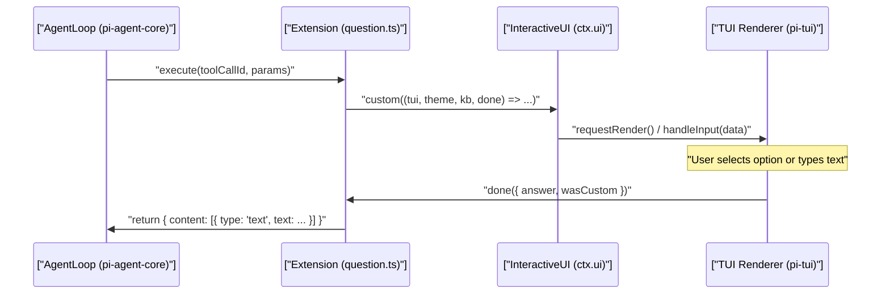
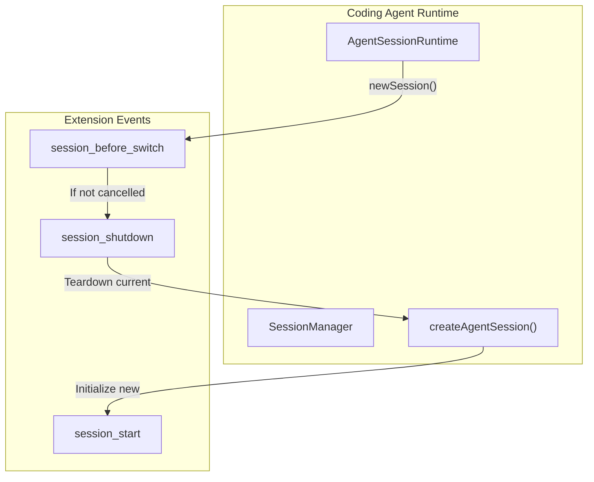

# 확장 예제와 패턴

관련 소스 파일

다음 파일들은 이 위키 페이지를 생성하기 위한 컨텍스트로 사용되었습니다.

- [packages/coding-agent/examples/README.md](packages/coding-agent/examples/README.md)
- [packages/coding-agent/examples/extensions/bash-spawn-hook.ts](packages/coding-agent/examples/extensions/bash-spawn-hook.ts)
- [packages/coding-agent/examples/extensions/built-in-tool-renderer.ts](packages/coding-agent/examples/extensions/built-in-tool-renderer.ts)
- [packages/coding-agent/examples/extensions/custom-compaction.ts](packages/coding-agent/examples/extensions/custom-compaction.ts)
- [packages/coding-agent/examples/extensions/custom-provider-anthropic/.gitignore](packages/coding-agent/examples/extensions/custom-provider-anthropic/.gitignore)
- [packages/coding-agent/examples/extensions/custom-provider-anthropic/package-lock.json](packages/coding-agent/examples/extensions/custom-provider-anthropic/package-lock.json)
- [packages/coding-agent/examples/extensions/custom-provider-anthropic/package.json](packages/coding-agent/examples/extensions/custom-provider-anthropic/package.json)
- [packages/coding-agent/examples/extensions/custom-provider-gitlab-duo/.gitignore](packages/coding-agent/examples/extensions/custom-provider-gitlab-duo/.gitignore)
- [packages/coding-agent/examples/extensions/custom-provider-gitlab-duo/package.json](packages/coding-agent/examples/extensions/custom-provider-gitlab-duo/package.json)
- [packages/coding-agent/examples/extensions/handoff.ts](packages/coding-agent/examples/extensions/handoff.ts)
- [packages/coding-agent/examples/extensions/hello.ts](packages/coding-agent/examples/extensions/hello.ts)
- [packages/coding-agent/examples/extensions/minimal-mode.ts](packages/coding-agent/examples/extensions/minimal-mode.ts)
- [packages/coding-agent/examples/extensions/qna.ts](packages/coding-agent/examples/extensions/qna.ts)
- [packages/coding-agent/examples/extensions/question.ts](packages/coding-agent/examples/extensions/question.ts)
- [packages/coding-agent/examples/extensions/questionnaire.ts](packages/coding-agent/examples/extensions/questionnaire.ts)
- [packages/coding-agent/examples/extensions/sandbox/index.ts](packages/coding-agent/examples/extensions/sandbox/index.ts)
- [packages/coding-agent/examples/extensions/shutdown-command.ts](packages/coding-agent/examples/extensions/shutdown-command.ts)
- [packages/coding-agent/examples/extensions/ssh.ts](packages/coding-agent/examples/extensions/ssh.ts)
- [packages/coding-agent/examples/extensions/subagent/README.md](packages/coding-agent/examples/extensions/subagent/README.md)
- [packages/coding-agent/examples/extensions/subagent/index.ts](packages/coding-agent/examples/extensions/subagent/index.ts)
- [packages/coding-agent/examples/extensions/summarize.ts](packages/coding-agent/examples/extensions/summarize.ts)
- [packages/coding-agent/examples/extensions/todo.ts](packages/coding-agent/examples/extensions/todo.ts)
- [packages/coding-agent/examples/extensions/tool-override.ts](packages/coding-agent/examples/extensions/tool-override.ts)
- [packages/coding-agent/examples/extensions/truncated-tool.ts](packages/coding-agent/examples/extensions/truncated-tool.ts)
- [packages/coding-agent/test/edit-tool-no-full-redraw.test.ts](packages/coding-agent/test/edit-tool-no-full-redraw.test.ts)

`pi` 확장 시스템은 개발자가 생명주기 이벤트 처리, 사용자 정의 도구, 명령, UI 오버레이, 외부 서비스 연동을 통해 에이전트 동작을 사용자화할 수 있게 한다. 이 페이지는 `packages/coding-agent/examples/extensions/` 디렉터리의 표준 예제 확장들을 살펴보며, 구현 방식, 데이터 흐름, 아키텍처 패턴을 설명한다.

## 예제 개요

예제 확장들은 다양한 시나리오를 다루며, 대략 목적별로 구성되어 있다.

| 범주 | 주요 예제 | 설명 |
| :--- | :--- | :--- |
| **생명주기 및 안전성** | `permission-gate.ts`, `sandbox/` | 위험한 명령 실행 전에 확인을 요청하거나 경로를 보호하는 안전 게이트. |
| **사용자 정의 도구** | `hello.ts`, `todo.ts`, `subagent/`, `truncated-tool.ts` | 표준 도구나 UI에 기능을 추가하는 새 도구 또는 래퍼. |
| **명령 및 UI** | `handoff.ts`, `question.ts`, `doom-overlay/` | 슬래시 명령, 오버레이, 세션 계획, 사용자 정의 UI. |
| **연동** | `git-checkpoint.ts`, `custom-provider-anthropic/`, `ssh.ts` | Git 연동, 사용자 정의 LLM provider, SSH를 통한 원격 실행. |

**출처:** [packages/coding-agent/examples/README.md:1-26]()

---

## 도구 패턴

### 최소 도구 구현
가장 단순한 확장 예제는 `hello.ts`로, `pi.registerTool()`을 사용해 도구를 정의하고 등록하는 방법을 보여준다. 매개변수에는 `TypeBox` 스키마를 사용하고 `execute()` 메서드를 제공한다.

- `Type.Object`를 사용해 도구 이름, 설명, 입력 매개변수 스키마를 정의한다. [packages/coding-agent/examples/extensions/hello.ts:8-14]()
- `params`와 `ctx`를 받는 비동기 `execute` 함수를 구현한다. [packages/coding-agent/examples/extensions/hello.ts:16-21]()
- 에이전트를 위한 `content` 배열과 UI를 위한 `details`를 반환한다. [packages/coding-agent/examples/extensions/hello.ts:17-20]()

**출처:** [packages/coding-agent/examples/extensions/hello.ts:1-26]()

### 도구 재정의와 가로채기
확장은 같은 이름으로 도구를 등록하여 내장 도구를 재정의할 수 있다.

- **감사 및 접근 제어:** `tool-override.ts` 예제는 `read` 도구를 래핑해 각 접근을 `read-access.log`에 기록하고, `isBlockedPath`를 사용해 `.env` 또는 `~/.ssh` 같은 민감한 경로에 대한 접근을 차단한다. [packages/coding-agent/examples/extensions/tool-override.ts:69-92]()
- **SSH를 통한 원격 실행:** `ssh.ts` 확장은 `--ssh` 플래그가 제공되면 핵심 도구(`read`, `write`, `edit`, `bash`)를 재정의해 SSH를 통해 원격으로 실행한다. 작업을 프록시하기 위해 `sshExec`를 사용한다. [packages/coding-agent/examples/extensions/ssh.ts:29-45](), [packages/coding-agent/examples/extensions/ssh.ts:128-182]()
- **OS 샌드박싱:** `sandbox/` 확장은 `bash` 도구를 재정의해 `@anthropic-ai/sandbox-runtime`을 사용한다. 파일 시스템과 네트워크 제한을 적용하기 위해 명령을 `SandboxManager.wrapWithSandbox`로 감싼다. [packages/coding-agent/examples/extensions/sandbox/index.ts:132-139](), [packages/coding-agent/examples/extensions/sandbox/index.ts:214-227]()

**출처:** [packages/coding-agent/examples/extensions/tool-override.ts:1-145](), [packages/coding-agent/examples/extensions/ssh.ts:1-207](), [packages/coding-agent/examples/extensions/sandbox/index.ts:1-227]()

---

## 대화형 UI와 사용자 입력

확장은 도구 실행 내부에서 `ctx.ui` API를 통해 풍부한 대화형 UI를 표시할 수 있다.

### 질문 도구 패턴
`question.ts` 확장은 에이전트 처리를 일시 중지하고 사용자에게 여러 옵션이 있는 질문을 묻는 도구를 구현한다.

- `ctx.ui.custom()`을 사용해 TUI 컴포넌트를 렌더링한다. [packages/coding-agent/examples/extensions/question.ts:64-65]()
- `optionIndex`와 `editMode`("Type something..." 사용자 정의 입력용)의 내부 상태를 관리한다. [packages/coding-agent/examples/extensions/question.ts:66-67]()
- `Key.up`, `Key.down`, `Key.enter` 같은 터미널 키를 캡처하도록 `handleInput`을 구현한다. [packages/coding-agent/examples/extensions/question.ts:98-136]()
- 터미널 `width`에 따라 UI를 동적으로 렌더링한다. [packages/coding-agent/examples/extensions/question.ts:138-186]()

### 브리지: UI 상호작용 흐름
이 다이어그램은 사용자 정의 UI 도구 호출에 관여하는 코드 엔티티를 사용자 상호작용 공간에 매핑한다.

**출처:** [packages/coding-agent/examples/extensions/question.ts:43-196](), [packages/coding-agent/examples/extensions/question.ts:98-136]()

---

## 고급 아키텍처 패턴

### 서브에이전트와 컨텍스트 격리
`subagent/` 확장은 별도 프로세스로 실행되는 특화 에이전트에 작업을 위임한다.

- `node:child_process.spawn`을 사용해 서브에이전트 프로세스를 생성한다. [packages/coding-agent/examples/extensions/subagent/index.ts:15]()
- **Single**, **Parallel**, **Chain** 모드를 지원한다. [packages/coding-agent/examples/extensions/subagent/index.ts:7-10]()
- `input`, `output`, `cacheRead`, `cost` 같은 사용량 통계를 캡처한다. [packages/coding-agent/examples/extensions/subagent/index.ts:133-141]()
- 진행 상황과 결과를 표시하기 위해 `Container` 및 `Markdown` 컴포넌트를 사용한다. [packages/coding-agent/examples/extensions/subagent/index.ts:23]()

**출처:** [packages/coding-agent/examples/extensions/subagent/index.ts:1-200]()

### 컨텍스트 핸드오프 명령
`handoff.ts` 확장은 대화 컨텍스트를 새 세션으로 이전하기 위한 `/handoff` 슬래시 명령을 제공한다.

1. **컨텍스트 추출:** `getHandoffMessages`를 사용해 현재 브랜치의 히스토리를 수집한다. [packages/coding-agent/examples/extensions/handoff.ts:102]()
2. **프롬프트 생성:** 컨텍스트 이전용으로 설계된 `SYSTEM_PROMPT`와 함께 `complete()`를 호출한다. [packages/coding-agent/examples/extensions/handoff.ts:20-40](), [packages/coding-agent/examples/extensions/handoff.ts:136-150]()
3. **검토:** 사용자가 수정할 수 있도록 생성된 프롬프트를 `ctx.ui.editor()`에서 연다. [packages/coding-agent/examples/extensions/handoff.ts:168]()
4. **전환:** 새 스레드를 시작하기 위해 `parentSession` 추적과 함께 `ctx.newSession()`을 호출한다. [packages/coding-agent/examples/extensions/handoff.ts:178-184]()

**출처:** [packages/coding-agent/examples/extensions/handoff.ts:1-191]()

### 브리지: 세션 전환 생명주기
세션 전환 또는 핸드오프 중 코드 엔티티의 매핑.

**출처:** [packages/coding-agent/examples/extensions/handoff.ts:178-184](), [packages/coding-agent/examples/extensions/ssh.ts:184-200]()

---

## 사용자 정의 Provider

`pi` 확장은 새 LLM provider를 등록할 수 있다.

- **Anthropic (`custom-provider-anthropic/`)**: 확장 내부에서 공식 `@anthropic-ai/sdk`를 사용하는 방법을 보여준다. [packages/coding-agent/examples/extensions/custom-provider-anthropic/package.json:16-18]()
- **GitLab Duo (`custom-provider-gitlab-duo/`)**: GitLab의 AI Gateway를 통해 스트리밍 요청을 프록시한다. [packages/coding-agent/examples/extensions/custom-provider-gitlab-duo/package.json:1-16]()

**출처:** [packages/coding-agent/examples/extensions/custom-provider-anthropic/package.json:1-20](), [packages/coding-agent/examples/extensions/custom-provider-gitlab-duo/package.json:1-16]()

---

## 패턴 요약

| 패턴 | 설명 | 주요 코드 참조 |
| :--- | :--- | :--- |
| **도구 재정의** | 내장 이름(예: `bash`, `read`)으로 도구를 등록한다. | `tool-override.ts:70` |
| **동적 도구** | 플래그나 컨텍스트에 따라 `session_start` 내부에서 도구를 등록한다. | `ssh.ts:128-182` |
| **UI 위임** | 사용자 의사결정을 위해 제어를 `ctx.ui.custom`에 넘긴다. | `question.ts:64` |
| **핸드오프** | 컨텍스트 추출 후 `ctx.newSession`을 호출한다. | `handoff.ts:178` |
| **프로세스 생성** | 외부 바이너리 또는 `pi` 인스턴스를 하위 작업으로 실행한다. | `subagent/index.ts:15` |

**출처:** [packages/coding-agent/examples/extensions/tool-override.ts:70](), [packages/coding-agent/examples/extensions/ssh.ts:128-182](), [packages/coding-agent/examples/extensions/question.ts:64](), [packages/coding-agent/examples/extensions/handoff.ts:178](), [packages/coding-agent/examples/extensions/subagent/index.ts:15]()
