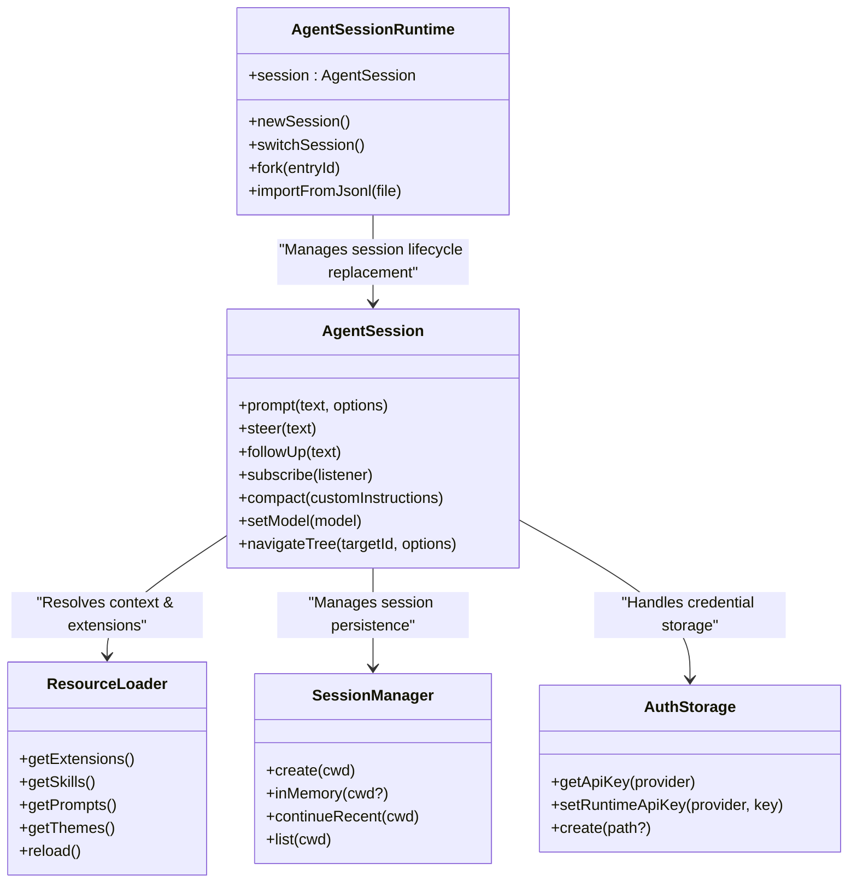
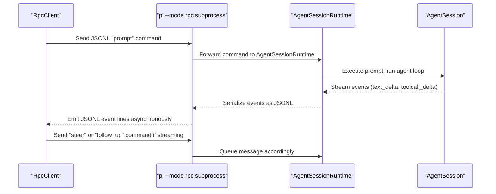

# SDK와 프로그래밍 방식 사용

<details>
<summary>관련 소스 파일</summary>

다음 파일들은 이 위키 페이지를 생성하기 위한 컨텍스트로 사용되었습니다.

- [packages/coding-agent/docs/rpc.md](packages/coding-agent/docs/rpc.md)
- [packages/coding-agent/docs/sdk.md](packages/coding-agent/docs/sdk.md)
- [packages/coding-agent/examples/sdk/01-minimal.ts](packages/coding-agent/examples/sdk/01-minimal.ts)
- [packages/coding-agent/examples/sdk/02-custom-model.ts](packages/coding-agent/examples/sdk/02-custom-model.ts)
- [packages/coding-agent/examples/sdk/03-custom-prompt.ts](packages/coding-agent/examples/sdk/03-custom-prompt.ts)
- [packages/coding-agent/examples/sdk/04-skills.ts](packages/coding-agent/examples/sdk/04-skills.ts)
- [packages/coding-agent/examples/sdk/05-tools.ts](packages/coding-agent/examples/sdk/05-tools.ts)
- [packages/coding-agent/examples/sdk/07-context-files.ts](packages/coding-agent/examples/sdk/07-context-files.ts)
- [packages/coding-agent/examples/sdk/08-prompt-templates.ts](packages/coding-agent/examples/sdk/08-prompt-templates.ts)
- [packages/coding-agent/examples/sdk/09-api-keys-and-oauth.ts](packages/coding-agent/examples/sdk/09-api-keys-and-oauth.ts)
- [packages/coding-agent/examples/sdk/10-settings.ts](packages/coding-agent/examples/sdk/10-settings.ts)
- [packages/coding-agent/examples/sdk/11-sessions.ts](packages/coding-agent/examples/sdk/11-sessions.ts)
- [packages/coding-agent/examples/sdk/12-full-control.ts](packages/coding-agent/examples/sdk/12-full-control.ts)
- [packages/coding-agent/examples/sdk/README.md](packages/coding-agent/examples/sdk/README.md)
- [packages/coding-agent/src/modes/rpc/rpc-client.ts](packages/coding-agent/src/modes/rpc/rpc-client.ts)
- [packages/coding-agent/src/modes/rpc/rpc-types.ts](packages/coding-agent/src/modes/rpc/rpc-types.ts)
- [packages/coding-agent/test/rpc-client-process-exit.test.ts](packages/coding-agent/test/rpc-client-process-exit.test.ts)

</details>


`pi` 모노레포는 다양한 애플리케이션 요구에 맞춰 최적화된, 핵심 에이전트 시스템과 프로그래밍 방식으로 연동하는 여러 경로를 제공한다. 개발자는 SDK를 사용해 Node.js 앱 안에 에이전트를 긴밀히 임베드하거나, RPC 하위 프로세스 인터페이스를 통해 원격으로 상호작용하거나, `pi-web-ui` 패키지로 풍부한 웹 클라이언트 경험을 만들 수 있다.

이 섹션은 이러한 프로그래밍 인터페이스의 상위 수준 개요와, 이들이 핵심 에이전트 로직에 어떻게 연결되는지를 설명한다. 자세한 API와 사용 지침은 SDK API와 웹 UI 컴포넌트를 다루는 전문 하위 페이지 링크를 참고한다.

---

### 연동 환경

이 다이어그램은 `pi` 에이전트 기능으로 들어가는 프로그래밍 진입점들의 생태계와 핵심 내부 컴포넌트와의 관계를 보여준다.

**프로그래밍 방식 연동 개요**
```mermaid
graph TD
    subgraph "External_Application"
        [App_Logic] --> [SDK_Client]
        [App_Logic] --> [RPC_Client]
        [Web_App] --> [pi-web-ui]
    end

    subgraph "pi-coding-agent_SDK"
        [SDK_Client] --> ["createAgentSession()"]
        ["createAgentSession()"] --> [AgentSession]
    end

    subgraph "pi_CLI_Subprocess"
        [RPC_Client] -- "JSONL_over_Stdin_Stdout" --> [RPC_Mode]
        [RPC_Mode] --> [AgentSessionRuntime]
        [AgentSessionRuntime] --> [AgentSession]
    end

    subgraph "Core_Logic"
        [AgentSession] --> [Agent_Loop]
        [Agent_Loop] --> [Tool_Executor]
        [Agent_Loop] --> [pi-ai_Abstraction]
    end

    [pi-web-ui] -- "Lit_Components" --> [AgentSession]
```

- Node.js 앱의 **SDK Client**는 `createAgentSession()`을 사용해 런타임 상태, 세션, 도구에 연결된 `AgentSession` 인스턴스를 얻는다.
- **RPC Client**는 JSONL-over-stdin/stdout 모드로 에이전트를 실행하는 별도 하위 프로세스를 제어하며, 언어 중립적 연동과 프로세스 격리에 적합하다.
- **pi-web-ui**는 브라우저 기반 UI에 에이전트 기능을 임베드하고 동일한 핵심 API에 연결되는 반응형 Web Components(Lit 기반)를 제공한다.
- 모든 인터페이스는 궁극적으로 핵심 에이전트 루프와 AI 추상화를 통해 에이전트 생명주기, 상태, 도구 실행을 조율하는 **Agent Session**을 구동한다.

출처: [packages/coding-agent/docs/sdk.md:3-12](), [packages/coding-agent/docs/rpc.md:1-6](), [packages/coding-agent/src/modes/rpc/rpc-client.ts:1-5]()

---

## 7.1 pi-coding-agent SDK

주요 Node.js 임베딩 인터페이스는 `pi-coding-agent` SDK이다. 이 SDK는 핵심 `AgentSession` 추상화와 세션 지속성, 자격 증명 관리, 리소스 사용자화를 위한 관련 서비스를 노출한다.

### 개요

- 기본 옵션 또는 사용자 정의 옵션으로 에이전트 세션을 인스턴스화하려면 `createAgentSession()`을 사용한다 [packages/coding-agent/docs/sdk.md:50-68]().
- 반환된 `AgentSession`은 다음과 같은 메서드를 노출한다.
  - `prompt(text)`: 에이전트에 프롬프트를 보내고 완료를 기다린다 [packages/coding-agent/docs/sdk.md:77-77]().
  - `steer(text)` 및 `followUp(text)`: 스트리밍 중이거나 완료 후에 메시지를 큐에 넣는다 [packages/coding-agent/docs/sdk.md:80-81]().
  - `subscribe()`를 통한 이벤트 구독으로 스트리밍 업데이트와 도구 사용 이벤트를 수신한다 [packages/coding-agent/docs/sdk.md:84-84]().
  - 세션 파일/경로 정보와 모델 제어(예: `setModel()`) [packages/coding-agent/docs/sdk.md:87-91]().
  - 상태 탐색(`navigateTree`)과 세션 압축(`compact`) [packages/coding-agent/docs/sdk.md:104-107]().
- 고급 제어를 위해 `createAgentSessionRuntime()`은 새 세션, 전환, 포크, 가져오기/내보내기 흐름을 지원하는 세션 생명주기를 관리한다 [packages/coding-agent/docs/sdk.md:120-155]().
- `ResourceLoader` 인터페이스와 `DefaultResourceLoader`는 확장, 스킬, 프롬프트 템플릿, 컨텍스트 파일, 테마의 프로그래밍 방식 탐색과 재정의를 구현한다 [packages/coding-agent/docs/sdk.md:54-54]().
- 세션 지속성은 `SessionManager`를 통해 구성할 수 있으며, 파일 기반 세션 또는 인메모리 임시 세션을 지원한다 [packages/coding-agent/docs/sdk.md:66-66]().
- `AuthStorage`는 API 키와 OAuth 토큰 관리를 추상화하며, LLM provider 탐색을 위해 `ModelRegistry`와 통합된다 [packages/coding-agent/docs/sdk.md:22-23]().

### SDK 아키텍처와 관계



### 사용 시나리오

SDK의 일반적인 사용 사례는 다음과 같다.
- 에이전트 추론과 도구 실행을 임베드하는 사용자 정의 Node.js CLI 또는 애플리케이션 구축.
- 대화형 워크플로의 프로그래밍 방식 테스트와 자동화.
- 브랜칭, 포크, 회고적 탐색을 포함한 고급 세션 관리.
- 코드에서 스킬, 프롬프트 템플릿, 확장 같은 리소스를 확장하거나 재정의.
- LLM 모델과 에이전트 사고 수준을 동적으로 제어하고 전환.

최소 구성부터 전체 구성까지 13개의 광범위한 예제를 포함해 SDK를 코드 수준에서 완전히 살펴보려면 하위 페이지 **[pi-coding-agent SDK](#7.1)**를 참고한다.

출처: [packages/coding-agent/docs/sdk.md:2-115, 120-182](), [packages/coding-agent/examples/sdk/README.md:9-24]()

---

## 7.2 RPC 모드와 하위 프로세스 사용

Node.js 외부의 연동 시나리오나 프로세스 격리가 필요한 경우, `pi` 에이전트는 `stdin`/`stdout`을 통해 전체 기능을 노출하는 JSONL 기반 RPC 모드를 지원한다.

### 주요 사항

- RPC 모드에 진입하려면 `--mode rpc`로 에이전트 CLI를 실행한다 [packages/coding-agent/docs/rpc.md:9-10]().
- 모든 명령, 상태 쿼리, 알림은 엄격한 프레이밍을 사용하는 JSON lines로 인코딩된다 [packages/coding-agent/docs/rpc.md:22-30]().
- 명령에는 `prompt`, `steer`, `follow_up`, `abort`, 세션 제어, 모델 및 사고 수준 전환, 압축, bash 실행이 포함된다 [packages/coding-agent/src/modes/rpc/rpc-types.ts:19-69]().
- RPC 프로토콜은 메시지 업데이트, 도구 호출, 에이전트 생명주기 이벤트에 대한 비동기 이벤트 스트리밍을 지원한다 [packages/coding-agent/docs/rpc.md:24-24]().
- TypeScript `RpcClient` 클래스는 하위 프로세스 실행, 비동기 명령 전송, 이벤트 수신, 요청 상관관계를 통한 응답 해석을 위한 편리한 래퍼를 제공한다 [packages/coding-agent/src/modes/rpc/rpc-client.ts:54-185]().
- 스트리밍 중 메시지 큐 동작(`steer`, `follow_up`)과 abort 의미론을 세밀하게 제어한다 [packages/coding-agent/docs/rpc.md:56-64]().
- `new_session`, `switch_session`, `fork`, `clone` 같은 전체 세션 생명주기 명령을 제공한다 [packages/coding-agent/src/modes/rpc/rpc-types.ts:55-60]().

### RPC 연동 흐름



전체 명령 집합, 응답 구조, `RpcClient` API를 포함한 자세한 내용은 하위 페이지 **[pi-coding-agent SDK](#7.1)**를 참고한다. 이 페이지는 SDK 기능의 일부로 RPC를 다룬다.

출처: [packages/coding-agent/docs/rpc.md:1-75](), [packages/coding-agent/src/modes/rpc/rpc-types.ts:1-104](), [packages/coding-agent/src/modes/rpc/rpc-client.ts:1-183]()

---

## 7.3 Web UI Package (pi-web-ui)

`@mariozechner/pi-web-ui` 패키지는 웹 프런트엔드 환경에 pi의 에이전트 기능을 임베드할 수 있도록 Lit 기반 Web Components와 브라우저 스토리지 솔루션을 묶어 제공한다.

### 핵심 기능

- **ChatPanel**: 메시지 흐름, 사용자 입력, 에이전트 생명주기 이벤트를 관리하는 기본 UI 컨테이너.
- **AgentInterface**: 사용자 인터페이스와 기본 `AgentSession` 사이의 상호작용 관리를 처리한다.
- **MessageList** 및 **StreamingMessageContainer**: 각각 전체 메시지 히스토리와 실시간 스트리밍 업데이트를 렌더링한다.
- **Tool Renderers**: Bash 명령, JavaScript REPL, artifacts 같은 도구의 출력을 렌더링하기 위한 특화 컴포넌트.
- **Sandboxed Execution**: 샌드박스 iframe을 사용해 코드를 안전하게 실행하는 기능을 지원한다.
- **IndexedDB Storage Backend**: 브라우저에서 메시지와 세션 상태를 위한 로컬 우선 영구 스토리지를 제공한다.

### Web UI 컴포넌트 계층과 데이터 흐름

```mermaid
graph LR
    [ChatPanel] --> [AgentInterface]
    [AgentInterface] --> [MessageList]
    [AgentInterface] --> [StreamingMessageContainer]
    [MessageList] --> [AssistantMessage]
    [AssistantMessage] --> [Tool_Renderers]
    [AppStorage] --> [IndexedDBStorageBackend]
    [AgentSession] -- "Events" --> [ChatPanel]
```

- Web UI 컴포넌트는 SDK에서 사용하는 것과 동일한 기본 `AgentSession` 로직과 통합된다.
- UI 컴포넌트는 이벤트 구독, 메시지 렌더링, 도구 출력 시각화를 처리한다.

UI 컴포넌트, 도구 렌더러, 스토리지 연동, 예제 앱에 대한 포괄적인 문서는 하위 페이지 **[Web UI Package (pi-web-ui)](#7.2)**를 참고한다.

---

# 요약

`pi` 코드베이스는 다양한 임베딩 전략을 가능하게 하는, 프로그래밍 방식 사용에 대한 계층형 접근을 지원한다.

| 인터페이스         | 설명                                                     | 사용 사례                                     |
|-------------------|-----------------------------------------------------------------|-----------------------------------------------|
| **SDK (Node.js)** | `createAgentSession` 및 관련 API를 사용한 직접 임베딩.  | 사용자 정의 서버 측 앱, CLI 도구, 자동화 |
| **RPC Mode**      | JSONL RPC 프로토콜로 제어되는 헤드리스 에이전트 하위 프로세스.    | 크로스 언어 연동, IDE 플러그인       |
| **Web UI Package**| 로컬 지속성과 샌드박스를 갖춘 브라우저 기반 Lit 컴포넌트. | 풍부한 에이전트 상호작용을 제공하는 웹 앱            |

개발자는 깊은 연동에는 SDK로, 격리되고 언어 중립적인 제어에는 RPC로 시작할 수 있다.

API, 패턴, 예제에 대한 전체 세부 정보는 하위 페이지를 참고한다.
- **[pi-coding-agent SDK](#7.1)**
- **[Web UI Package (pi-web-ui)](#7.2)**

출처: [packages/coding-agent/docs/sdk.md:3-14](), [packages/coding-agent/docs/rpc.md:1-5](), [packages/coding-agent/src/modes/rpc/rpc-client.ts:1-5]()
