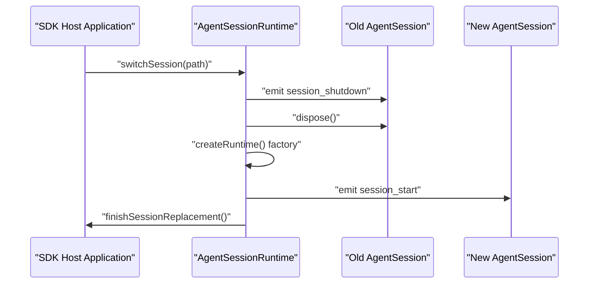
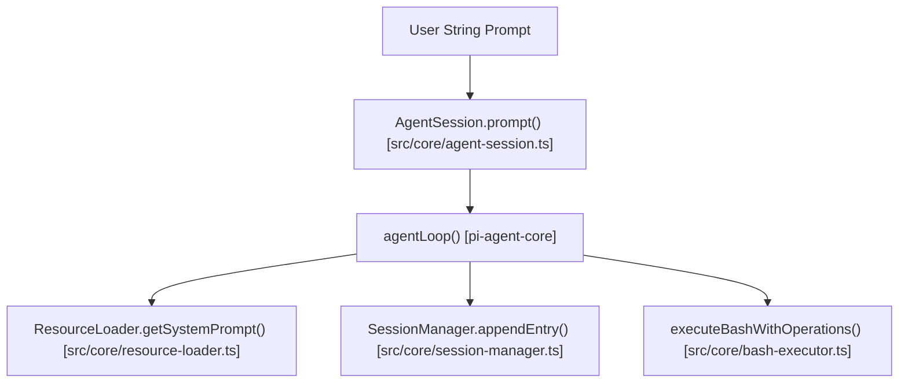
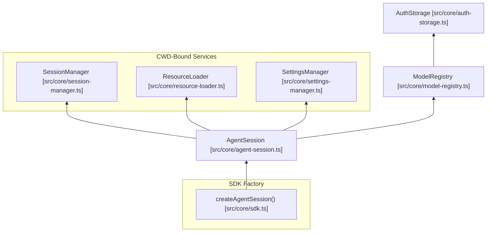

# pi-coding-agent SDK

<details>
<summary>관련 소스 파일</summary>

다음 파일들은 이 위키 페이지를 생성하기 위한 컨텍스트로 사용되었습니다.

- [packages/coding-agent/examples/sdk/01-minimal.ts](packages/coding-agent/examples/sdk/01-minimal.ts)
- [packages/coding-agent/examples/sdk/02-custom-model.ts](packages/coding-agent/examples/sdk/02-custom-model.ts)
- [packages/coding-agent/examples/sdk/03-custom-prompt.ts](packages/coding-agent/examples/sdk/03-custom-prompt.ts)
- [packages/coding-agent/examples/sdk/04-skills.ts](packages/coding-agent/examples/sdk/04-skills.ts)
- [packages/coding-agent/examples/sdk/05-tools.ts](packages/coding-agent/examples/sdk/05-tools.ts)
- [packages/coding-agent/examples/sdk/07-context-files.ts](packages/coding-agent/examples/sdk/07-context-files.ts)
- [packages/coding-agent/examples/sdk/08-prompt-templates.ts](packages/coding-agent/examples/sdk/08-prompt-templates.ts)
- [packages/coding-agent/examples/sdk/09-api-keys-and-oauth.ts](packages/coding-agent/examples/sdk/09-api-keys-and-oauth.ts)
- [packages/coding-agent/examples/sdk/10-settings.ts](packages/coding-agent/examples/sdk/10-settings.ts)
- [packages/coding-agent/examples/sdk/11-sessions.ts](packages/coding-agent/examples/sdk/11-sessions.ts)
- [packages/coding-agent/examples/sdk/12-full-control.ts](packages/coding-agent/examples/sdk/12-full-control.ts)
- [packages/coding-agent/examples/sdk/README.md](packages/coding-agent/examples/sdk/README.md)
- [packages/coding-agent/src/core/agent-session-runtime.ts](packages/coding-agent/src/core/agent-session-runtime.ts)
- [packages/coding-agent/src/core/agent-session.ts](packages/coding-agent/src/core/agent-session.ts)
- [packages/coding-agent/src/core/sdk.ts](packages/coding-agent/src/core/sdk.ts)
- [packages/coding-agent/src/modes/interactive/interactive-mode.ts](packages/coding-agent/src/modes/interactive/interactive-mode.ts)
- [packages/coding-agent/src/modes/print-mode.ts](packages/coding-agent/src/modes/print-mode.ts)
- [packages/coding-agent/src/modes/rpc/rpc-mode.ts](packages/coding-agent/src/modes/rpc/rpc-mode.ts)
- [packages/coding-agent/test/agent-session-runtime-events.test.ts](packages/coding-agent/test/agent-session-runtime-events.test.ts)
- [packages/coding-agent/test/suite/agent-session-runtime.test.ts](packages/coding-agent/test/suite/agent-session-runtime.test.ts)

</details>


`pi-coding-agent` SDK는 Node.js 애플리케이션 또는 다른 TypeScript 환경 안에 pi의 코딩 에이전트 기능을 임베드하기 위한 포괄적인 프로그래밍 인터페이스를 제공한다. 이 SDK는 에이전트 생명주기, 프롬프트 처리, 세션 지속성, 모델 제어, 리소스 로딩(확장, 스킬, 프롬프트), 내장 또는 사용자 정의 도구와의 상호작용 관리를 단순화한다.

---

## 핵심 API: `createAgentSession()`

`createAgentSession()` 함수는 `AgentSession`을 생성하는 기본 팩토리이다. 이 함수는 cwd에 묶인 서비스 초기화, 리소스 로딩, 인증, 모델 레지스트리, 세션 관리(파일 기반 또는 메모리), 도구 구성을 조율한다 [packages/coding-agent/src/core/sdk.ts:166-234]().

```typescript
import { createAgentSession, SessionManager, AuthStorage, ModelRegistry } from "@earendil-works/pi-coding-agent";

const authStorage = AuthStorage.create();
const modelRegistry = ModelRegistry.create(authStorage);

const { session } = await createAgentSession({
  sessionManager: SessionManager.inMemory(),
  authStorage,
  modelRegistry,
});
```

옵션을 제공하지 않으면 `createAgentSession()`은 확장, 스킬, 프롬프트 템플릿, 테마에 대한 관례적 탐색을 수행하는 `DefaultResourceLoader`를 사용하며, 일반적으로 `~/.pi/agent`, 현재 작업 디렉터리의 `.pi/`, 기타 표준 위치를 스캔한다 [packages/coding-agent/src/core/sdk.ts:180-184]().

### 주요 구성과 옵션

| 옵션           | 설명                                                                                                         |
|------------------|---------------------------------------------------------------------------------------------------------------------|
| `cwd`            | 프로젝트 로컬 탐색을 위한 작업 디렉터리(기본값은 `process.cwd()`) [packages/coding-agent/src/core/sdk.ts:36-36]() |
| `agentDir`       | 전역 구성 디렉터리, 기본값은 `~/.pi/agent` [packages/coding-agent/src/core/sdk.ts:38-38]()                          |
| `model`          | 사용할 특정 LLM 모델 인스턴스 [packages/coding-agent/src/core/sdk.ts:46-46]()                                                  |
| `thinkingLevel`  | 추론 깊이 설정: off, low, medium, high [packages/coding-agent/src/core/sdk.ts:48-48]()                                         |
| `tools`          | 활성화할 도구 이름 allowlist [packages/coding-agent/src/core/sdk.ts:67-67]()                                              |
| `customTools`    | 추가 사용자 정의 도구 배열 [packages/coding-agent/src/core/sdk.ts:71-71]()                                               |
| `resourceLoader` | 확장, 스킬, 프롬프트, 테마를 제공 [packages/coding-agent/src/core/sdk.ts:73-73]()                                  |
| `sessionManager` | 세션 지속성을 제어 [packages/coding-agent/src/core/sdk.ts:77-77]()                                  |
| `settingsManager`| 압축 또는 재시도 같은 설정을 구성 [packages/coding-agent/src/core/sdk.ts:79-79]()                                                |

출처: [packages/coding-agent/src/core/sdk.ts:34-83](), [packages/coding-agent/examples/sdk/README.md:109-122]()

---

## AgentSession API

`AgentSession` 인터페이스는 대화 관리, 메시지 생명주기, 이벤트 스트리밍, 런타임 설정 제어에 필요한 모든 기능을 캡슐화한다 [packages/coding-agent/src/core/agent-session.ts:157-300]().

### 핵심 메서드와 속성

*   `prompt(text, options)`: 사용자 프롬프트를 보내고 에이전트가 턴을 마칠 때까지 기다린다 [packages/coding-agent/src/core/agent-session.ts:358-358]().
*   `steer(text)`: 다음 LLM 호출 전에 에이전트 루프를 인터럽트한다 [packages/coding-agent/src/core/agent-session.ts:446-446]().
*   `followUp(text)`: 에이전트가 idle 상태가 되면 처리할 메시지를 큐에 넣는다 [packages/coding-agent/src/core/agent-session.ts:451-451]().
*   `subscribe(listener)`: `AgentSessionEvent` 스트림을 구독한다 [packages/coding-agent/src/core/agent-session.ts:304-304]().
*   `compact(customInstructions)`: 토큰을 절약하기 위해 대화 히스토리를 압축한다 [packages/coding-agent/src/core/agent-session.ts:571-571]().
*   `setModel(model)`: 세션의 활성 모델을 변경한다 [packages/coding-agent/src/core/agent-session.ts:503-503]().

### 이벤트 구독

`subscribe()` 메서드는 `message_update`(텍스트 delta용), `tool_execution_start/end`, `agent_end`를 포함하는 `AgentSessionEvent` 객체를 스트리밍한다 [packages/coding-agent/src/core/agent-session.ts:124-151]().

출처: [packages/coding-agent/src/core/agent-session.ts:157-600](), [packages/coding-agent/examples/sdk/README.md:126-144]()

---

## ResourceLoader 구성

`ResourceLoader` 추상화는 확장, 스킬, 프롬프트 템플릿, 테마, 컨텍스트 파일을 제공한다 [packages/coding-agent/src/core/agent-session.ts:165-165](). `DefaultResourceLoader`는 표준 디렉터리에서 디스크 탐색을 수행하고 로드된 리소스를 캐시한다 [packages/coding-agent/src/core/sdk.ts:181-184]().

```typescript
const resourceLoader = new DefaultResourceLoader({
  cwd: process.cwd(),
  agentDir: getAgentDir(),
  skillsOverride: (current) => ({
    skills: [...current.skills, customSkill],
    diagnostics: current.diagnostics,
  }),
});
await resourceLoader.reload();

const { session } = await createAgentSession({ resourceLoader });
```

출처: [packages/coding-agent/examples/sdk/04-skills.ts:27-38](), [packages/coding-agent/src/core/sdk.ts:169-184]()

---

## 세션 지속성과 관리

### SessionManager

`SessionManager`는 메시지 스토리지 백엔드를 처리한다 [packages/coding-agent/src/core/sdk.ts:17-17]().

| 메서드 | 설명 |
| :--- | :--- |
| `SessionManager.create(cwd, dir)` | 파일 기반 manager를 생성한다 [packages/coding-agent/src/core/sdk.ts:178-178](). |
| `SessionManager.inMemory(cwd)` | 임시 인메모리 manager를 생성한다 [packages/coding-agent/examples/sdk/12-full-control.ts:62-62](). |

### AgentSessionRuntime

`AgentSessionRuntime`은 활성 `AgentSession`을 소유하고 그 생명주기, 특히 세션 교체(전환, 포크, 새로 시작)를 관리한다 [packages/coding-agent/src/core/agent-session-runtime.ts:74-95]().

*   `switchSession(path)`: JSONL 파일에서 세션을 재개한다 [packages/coding-agent/src/core/agent-session-runtime.ts:193-210]().
*   `newSession()`: 같은 환경에서 새 세션을 시작한다 [packages/coding-agent/src/core/agent-session-runtime.ts:212-225]().
*   `fork(entryId)`: 특정 메시지에서 대화를 분기한다 [packages/coding-agent/src/core/agent-session-runtime.ts:227-240]().

### 세션 런타임 생명주기



출처: [packages/coding-agent/src/core/agent-session-runtime.ts:167-210](), [packages/coding-agent/test/agent-session-runtime-events.test.ts:92-134]()

---

## SDK 예제

코드베이스는 `packages/coding-agent/examples/sdk/`에 13개의 표준 SDK 예제를 제공한다 [packages/coding-agent/examples/sdk/README.md:9-24]().

1.  `01-minimal.ts`: 모든 기본값을 사용하는 가장 단순한 사용법.
2.  `02-custom-model.ts`: 모델과 thinking level 선택.
3.  `03-custom-prompt.ts`: 시스템 프롬프트 교체 또는 수정.
4.  `04-skills.ts`: 스킬 탐색, 필터링, 교체.
5.  `05-tools.ts`: 내장 도구 allowlist.
6.  `06-extensions.ts`: 로깅, 차단, 결과 수정.
7.  `07-context-files.ts`: AGENTS.md 컨텍스트 파일.
8.  `08-slash-commands.ts`: 파일 기반 슬래시 명령.
9.  `09-api-keys-and-oauth.ts`: API 키 해석.
10. `10-settings.ts`: 압축과 재시도 재정의.
11. `11-sessions.ts`: 인메모리와 영구 저장 비교.
12. `12-full-control.ts`: 모든 것을 교체하고 탐색을 사용하지 않음 [packages/coding-agent/examples/sdk/12-full-control.ts:1-77]().
13. `13-session-runtime.ts`: 런타임 기반 세션 교체 관리.

출처: [packages/coding-agent/examples/sdk/README.md:1-105](), [packages/coding-agent/examples/sdk/12-full-control.ts:1-77]()

---

## 개념 공간 연결

### 자연어에서 코드로: 프롬프트 실행



출처: [packages/coding-agent/src/core/agent-session.ts:358-444](), [packages/coding-agent/src/core/bash-executor.ts:41-41]()

### 코드 엔티티 관계



출처: [packages/coding-agent/src/core/sdk.ts:166-234](), [packages/coding-agent/src/core/agent-session.ts:157-187]()

---

# 출처
- packages/coding-agent/src/core/sdk.ts:1-234
- packages/coding-agent/src/core/agent-session.ts:1-600
- packages/coding-agent/src/core/agent-session-runtime.ts:1-252
- packages/coding-agent/examples/sdk/README.md:1-145
- packages/coding-agent/examples/sdk/12-full-control.ts:1-77
- packages/coding-agent/examples/sdk/10-settings.ts:1-54
- packages/coding-agent/examples/sdk/04-skills.ts:1-56
- packages/coding-agent/src/modes/rpc/rpc-mode.ts:1-220
- packages/coding-agent/test/agent-session-runtime-events.test.ts:1-220
- packages/coding-agent/test/suite/agent-session-runtime.test.ts:1-210
