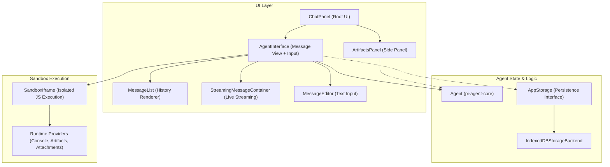
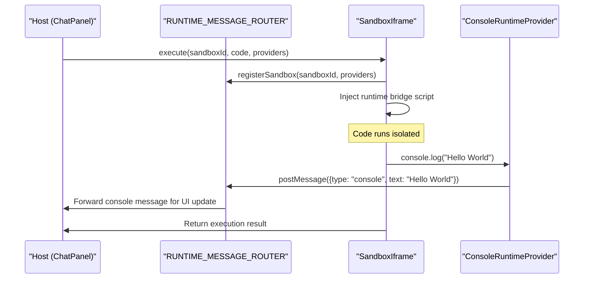
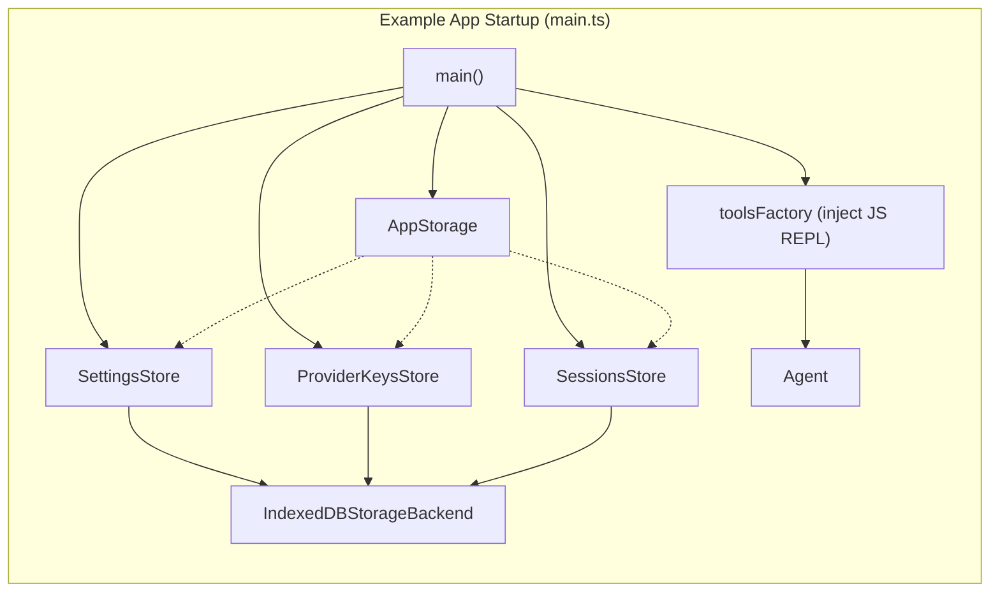

# Web UI Package (pi-web-ui)

관련 소스 파일

다음 파일들은 이 위키 페이지를 생성하기 위한 컨텍스트로 사용되었습니다.

- [package-lock.json](package-lock.json)
- [packages/agent/package.json](packages/agent/package.json)
- [packages/ai/package.json](packages/ai/package.json)
- [packages/coding-agent/docs/rpc.md](packages/coding-agent/docs/rpc.md)
- [packages/coding-agent/docs/sdk.md](packages/coding-agent/docs/sdk.md)
- [packages/coding-agent/package.json](packages/coding-agent/package.json)
- [packages/coding-agent/src/modes/rpc/rpc-client.ts](packages/coding-agent/src/modes/rpc/rpc-client.ts)
- [packages/coding-agent/src/modes/rpc/rpc-types.ts](packages/coding-agent/src/modes/rpc/rpc-types.ts)
- [packages/coding-agent/test/rpc-client-process-exit.test.ts](packages/coding-agent/test/rpc-client-process-exit.test.ts)
- [packages/tui/package.json](packages/tui/package.json)

`@mariozechner/pi-web-ui` 패키지는 pi 에이전트 아키텍처와 통합되는 웹 기반 채팅 UI를 만들기 위해 설계된 재사용 가능한 웹 컴포넌트, 런타임 provider, 스토리지 유틸리티 모음을 제공한다. 이 패키지는 핵심 에이전트 로직(`pi-agent-core`)과 AI provider 추상화(`pi-ai`)를 지속성과 샌드박스 코드 실행 기능을 갖춘 기능적이고 상호작용 가능한 브라우저 환경으로 연결한다.

---

## 아키텍처 개요

이 패키지는 UI 컴포넌트, 에이전트 상태 관리, 런타임 샌드박싱, 도구 렌더링, 영구 스토리지를 분리하는 계층형 설계를 사용한다. 이러한 모듈식 접근은 자연어 입력에서 에이전트 상태 변경, 스트리밍 업데이트, 백엔드 지속성까지 이어지는 유연한 통합과 명확한 데이터 흐름을 가능하게 한다.

### 컴포넌트와 데이터 흐름 토폴로지

상위 수준 UI 뷰(`ChatPanel`, `AgentInterface`)는 에이전트 상태 이벤트를 구독하고 대화, 라이브 스트리밍, artifacts, 사용자 입력 렌더링을 조율한다. 세션, provider 키, 설정의 지속성은 브라우저에서 IndexedDB를 백엔드로 사용하는 `AppStorage`가 처리한다.

샌드박스 iframe 환경과의 통신은 콘솔 캡처와 artifact 관리 같은 특수 런타임 기능을 지원하면서 임의의 JavaScript 코드를 안전하게 실행할 수 있게 한다.

출처: [packages/agent/package.json:2-10](), [packages/ai/package.json:2-10](), [packages/coding-agent/package.json:39-41]()

---

## 핵심 UI 컴포넌트

### ChatPanel

`ChatPanel`은 전체 레이아웃(대화와 artifacts 사이드 패널)을 구성하는 루트 UI 요소이다. 뷰포트 너비에 따라 side-by-side 레이아웃과 overlay 레이아웃 사이를 동적으로 전환한다(일반적으로 약 800px breakpoint 사용). 이 컴포넌트는 환경을 인식하는 도구를 주입하는 `toolsFactory`를 받으며, 예를 들어 샌드박스 런타임 provider에 접근할 수 있는 `javascript_repl` 도구를 포함할 수 있다.

### AgentInterface

`AgentInterface`는 메시징 UI를 조율하는 상태 보유 컴포넌트이다. 에이전트 이벤트를 구독해 메시지 히스토리, 스트리밍 업데이트, 도구 호출 결과를 유지한다.

- **MessageList**: 과거의 모든 메시지가 포함된 확정된 안정적 대화 히스토리를 렌더링한다.
- **StreamingMessageContainer**: 현재 진행 중인 스트리밍 assistant 메시지를 표시하며, `AssistantMessageEventStream`의 증분 업데이트를 처리한다 [packages/ai/package.json:69-74]().
- **MessageEditor**: 사용자 프롬프트를 위한 텍스트와 파일 첨부를 지원하는 여러 줄 입력 컴포넌트.

`AgentInterface`는 `@earendil-works/pi-agent-core`의 `Agent` 인스턴스에 직접 연결되어 [packages/agent/package.json:2-10](), 그 이벤트 스트림에 반응하고 prompt, steer, follow up 제어를 노출한다.

출처: [packages/agent/package.json:2-10](), [packages/coding-agent/package.json:39-41](), [packages/coding-agent/docs/sdk.md:31-35]()

---

## 샌드박스 실행 시스템

이 패키지는 신뢰할 수 없는 사용자 코드를 샌드박스 iframe 내부에서 안전하게 실행하는 고급 시스템을 포함하며, 주로 `javascript_repl` 도구와 artifact 렌더링 같은 기능에 사용된다.

### SandboxIframe과 런타임 Provider

`SandboxIframe`은 iframe 내부에서 JavaScript 코드를 안전하게 실행하기 위한 샌드박스 환경을 관리한다. 호스트와 iframe 사이의 통신은 서로 다른 런타임 provider의 메시지를 UI 컴포넌트로 다시 multiplex하는 router를 통해 전달된다.

샌드박스 런타임은 추가 기능을 캡슐화한다.

- **ConsoleRuntimeProvider**: 샌드박스 내부의 `console.log`, `console.error` 및 관련 호출을 가로채고 표시를 위해 로그를 호스트 UI로 보낸다.
- **ArtifactsRuntimeProvider**: 샌드박스 코드가 `ArtifactsPanel` 상태를 생성하고 업데이트할 수 있게 하며, artifact pill과 복잡한 상태 보유 요소를 지원한다.
- **AttachmentsRuntimeProvider**: 샌드박스 코드 실행 내에서 사용자가 업로드한 파일에 접근할 수 있게 한다.
- **FileDownloadRuntimeProvider**: 샌드박스에서 시작된 파일 생성과 다운로드 상호작용을 지원한다.

#### 샌드박스 코드 실행 흐름

출처: [package-lock.json:48-67](), [packages/coding-agent/package.json:15-15]()

---

## 도구 렌더러

UI 패키지는 여러 에이전트 도구를 위한 렌더러를 구현하여 브라우저에서 출력이 풍부하게 표시되도록 한다.

| 도구 이름           | 설명                                                  |
|---------------------|--------------------------------------------------------------|
| `javascript_repl`   | 샌드박스에서 JavaScript를 실행하고 콘솔 출력과 반환된 파일을 표시한다. |
| `artifacts`        | `ArtifactsPanel`의 상태를 업데이트하고 생성/업데이트된 artifacts를 나타내는 pill을 렌더링한다. |
| `extract_document` | PDF, DOCX, XLSX, 이미지 파일에서 텍스트와 메타데이터를 추출한다. |
| `bash`             | 셸 실행의 명령줄 출력을 렌더링한다 [packages/coding-agent/src/modes/rpc/rpc-types.ts:11-11](). |

`read`, `bash`, `edit` 같은 `pi-coding-agent`의 내장 도구는 `AgentSession` 추상화를 통해 통합된다 [packages/coding-agent/docs/sdk.md:65-65]().

출처: [packages/coding-agent/package.json:2-4](), [packages/coding-agent/src/modes/rpc/rpc-types.ts:11-12](), [packages/coding-agent/docs/sdk.md:65-65]()

---

## 스토리지와 지속성 계층

이 패키지는 웹 기반 데이터 저장소를 위한 중앙 지속성 인터페이스인 `AppStorage`를 제공한다. 내부적으로 IndexedDB를 활용하며, 영구 데이터를 관리하기 위한 여러 도메인별 store를 노출한다.

- **SettingsStore**: 프록시 구성과 HTTP timeout 같은 전역 앱 환경설정을 관리한다.
- **ProviderKeysStore**: LLM provider(OpenAI, Anthropic 등)의 API 키를 안전하게 저장한다 [packages/ai/package.json:69-74]().
- **SessionsStore**: 메시지, 사용량 통계, 메타데이터를 포함한 채팅 세션 데이터를 처리한다 [packages/coding-agent/docs/sdk.md:26-26]().
- **CustomProvidersStore**: 비표준 또는 로컬 LLM endpoint의 구성을 지속화한다.

`IndexedDBStorageBackend`는 IndexedDB 사용 세부 사항을 추상화하고 이러한 상위 수준 store와 통합되어, 웹 환경 내에서 견고한 비동기 데이터 지속성을 가능하게 한다.

출처: [packages/coding-agent/docs/sdk.md:19-29](), [packages/ai/package.json:69-74]()

---

## 예제 애플리케이션 통합

예제 앱은 UI 컴포넌트, 스토리지, 도구를 연결하는 방법을 보여준다.

- `IndexedDBStorageBackend`는 여러 store의 스키마로 초기화된다.
- `toolsFactory`는 `SandboxRuntimeProviders`에 접근할 수 있는 특수 `javascript_repl` 도구를 주입한다.
- `saveSession` 함수는 에이전트 상태와 메타데이터를 직렬화하고 `SessionsStore`를 통해 지속화한다.
- 사용자 정의 `Agent` 인스턴스는 attachments를 포함한 확장 메시지 유형을 지원하는 transport adapter와 함께 생성된다.

출처: [packages/coding-agent/docs/sdk.md:19-29](), [packages/coding-agent/package.json:39-41]()

---

# 요약

`@mariozechner/pi-web-ui` 패키지는 pi의 에이전트 기능을 활용하는 풍부한 대화형 채팅 UI를 만들 수 있게 한다. 이 패키지는 메시지 보기, 편집, artifacts를 위한 UI 컴포넌트와 샌드박스 JavaScript 실행 환경을 함께 제공한다. 견고한 데이터 지속성을 위해 IndexedDB가 사용된다. 도구 렌더러는 일반적인 에이전트 기능을 특화된 상호작용형 표시 방식으로 지원한다.

---

# 출처

- packages/agent/package.json:2-10
- packages/ai/package.json:2-10, 69-74
- packages/coding-agent/package.json:2-4, 15, 39-41
- packages/coding-agent/docs/sdk.md:19-29, 31-35, 65
- packages/coding-agent/src/modes/rpc/rpc-types.ts:11-12
- package-lock.json:48-67
