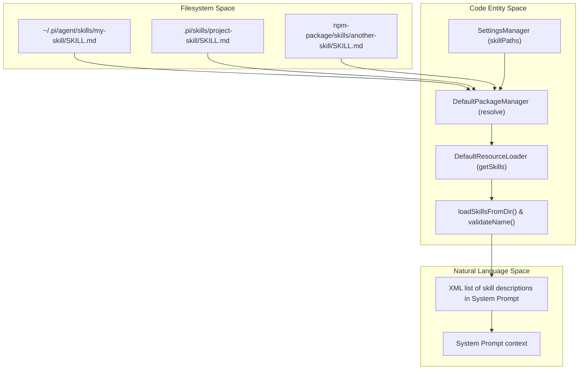
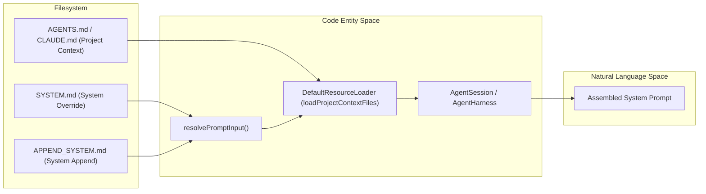

# 스킬, 프롬프트 템플릿, 컨텍스트 파일

관련 소스 파일

다음 파일들은 이 위키 페이지를 생성하기 위한 컨텍스트로 사용되었습니다.

- [.pi/prompts/is.md](.pi/prompts/is.md)
- [.pi/prompts/pr.md](.pi/prompts/pr.md)
- [.pi/prompts/wr.md](.pi/prompts/wr.md)
- [packages/agent/src/harness/prompt-templates.ts](packages/agent/src/harness/prompt-templates.ts)
- [packages/agent/src/harness/skills.ts](packages/agent/src/harness/skills.ts)
- [packages/agent/test/harness/prompt-templates.test.ts](packages/agent/test/harness/prompt-templates.test.ts)
- [packages/agent/test/harness/skills.test.ts](packages/agent/test/harness/skills.test.ts)
- [packages/agent/test/scratch/simple.ts](packages/agent/test/scratch/simple.ts)
- [packages/coding-agent/docs/packages.md](packages/coding-agent/docs/packages.md)
- [packages/coding-agent/docs/prompt-templates.md](packages/coding-agent/docs/prompt-templates.md)
- [packages/coding-agent/docs/skills.md](packages/coding-agent/docs/skills.md)
- [packages/coding-agent/examples/extensions/project-trust.ts](packages/coding-agent/examples/extensions/project-trust.ts)
- [packages/coding-agent/src/core/package-manager.ts](packages/coding-agent/src/core/package-manager.ts)
- [packages/coding-agent/src/core/prompt-templates.ts](packages/coding-agent/src/core/prompt-templates.ts)
- [packages/coding-agent/src/core/resource-loader.ts](packages/coding-agent/src/core/resource-loader.ts)
- [packages/coding-agent/src/core/skills.ts](packages/coding-agent/src/core/skills.ts)
- [packages/coding-agent/src/utils/git.ts](packages/coding-agent/src/utils/git.ts)
- [packages/coding-agent/test/fixtures/skills/root-skill-preferred/SKILL.md](packages/coding-agent/test/fixtures/skills/root-skill-preferred/SKILL.md)
- [packages/coding-agent/test/fixtures/skills/root-skill-preferred/nested-child/SKILL.md](packages/coding-agent/test/fixtures/skills/root-skill-preferred/nested-child/SKILL.md)
- [packages/coding-agent/test/git-ssh-url.test.ts](packages/coding-agent/test/git-ssh-url.test.ts)
- [packages/coding-agent/test/git-update.test.ts](packages/coding-agent/test/git-update.test.ts)
- [packages/coding-agent/test/package-manager-ssh.test.ts](packages/coding-agent/test/package-manager-ssh.test.ts)
- [packages/coding-agent/test/package-manager.test.ts](packages/coding-agent/test/package-manager.test.ts)
- [packages/coding-agent/test/prompt-templates.test.ts](packages/coding-agent/test/prompt-templates.test.ts)
- [packages/coding-agent/test/resource-loader.test.ts](packages/coding-agent/test/resource-loader.test.ts)
- [packages/coding-agent/test/skills.test.ts](packages/coding-agent/test/skills.test.ts)

`pi`의 동작은 세 가지 주요 리소스 유형인 **Skills**, **Prompt Templates**, **Context Files**에 의해 형성된다. 이 리소스들은 필요할 때 기능을 로드하고, 재사용 가능한 명령 확장을 제공하며, 프로젝트별 근거 정보를 주입해 에이전트 동작과 프롬프트 구성을 영향을 줄 수 있게 한다.

---

## 스킬

스킬은 대체로 [Agent Skills standard](https://agentskills.io/specification)를 따르는 독립형 기능 패키지이다. 스킬은 워크플로, 헬퍼 스크립트, 참조 문서로 구성되며, 에이전트가 지식과 작업 집합을 확장하기 위해 필요할 때 점진적으로 로드한다 [packages/coding-agent/docs/skills.md:3-7]().

### 탐색과 로딩

`DefaultPackageManager`와 `DefaultResourceLoader`는 여러 구성 계층에서 스킬 탐색을 처리하여 포괄적이고 점진적인 스킬 로딩을 제공한다 [packages/coding-agent/docs/skills.md:24-35]().

`pi`가 우선순위에 따라 탐색하는 위치는 다음과 같다.

1. 다음과 같은 **전역** 위치:
   - `~/.pi/agent/skills/` [packages/coding-agent/docs/skills.md:27-27]()
   - `~/.agents/skills/` [packages/coding-agent/docs/skills.md:28-28]()
2. **프로젝트 로컬** 위치:
   - `.pi/skills/` [packages/coding-agent/docs/skills.md:30-30]()
   - 현재 작업 디렉터리 또는 그 상위 디렉터리의 `.agents/skills/` [packages/coding-agent/docs/skills.md:31-31]()
3. **패키지**, 즉 하위 디렉터리로 포함되었거나 패키지의 `package.json`에서 `pi.skills` 아래에 선언된 스킬 [packages/coding-agent/docs/packages.md:118-129]().
4. CLI에서 `--skill <path>`로 제공하거나 `settings.json`에 설정한 **명시적 경로** [packages/coding-agent/docs/skills.md:33-34]().

스킬 탐색은 스킬 루트를 정의하는 `SKILL.md` 파일을 찾기 위해 디렉터리를 재귀적으로 검사하거나, 특정 디렉터리의 루트 `.md` 파일을 개별 스킬로 로드한다 [packages/coding-agent/src/core/skills.ts:163-171](), [packages/coding-agent/docs/skills.md:37-39]().

### 스킬 구조와 검증

각 스킬은 메인 `SKILL.md` 파일을 포함하는 디렉터리로 표현되며, 이 파일은 YAML frontmatter를 사용해 다음과 같은 메타데이터 필드를 지정한다.

- `name`: 안정적인 소문자-하이픈 이름(`pi`에서는 디렉터리 이름과 일치할 필요 없음) [packages/coding-agent/docs/skills.md:143-143]().
- `description`: 스킬 사용에 대한 간결한 설명 [packages/coding-agent/docs/skills.md:144-144]().
- `license`, `compatibility`, `metadata`, `allowed-tools`, `disable-model-invocation` 같은 선택 필드 [packages/coding-agent/docs/skills.md:145-149]().

스킬 콘텐츠에는 워크플로, 설정 지침, 코드 스니펫, 디렉터리에 포함된 스크립트나 assets에 대한 상대 참조가 포함된다 [packages/coding-agent/docs/skills.md:92-136]().

스킬은 다음 기준으로 검증된다.
- 이름 길이(최대 64자) [packages/coding-agent/src/core/skills.ts:11-11]().
- 이름 형식(소문자 a-z, 숫자, 하이픈, 선행/후행/연속 하이픈 금지) [packages/coding-agent/src/core/skills.ts:99-109]().
- 설명 존재 여부와 길이(최대 1024자) [packages/coding-agent/src/core/skills.ts:14-14]().
- 알 수 없는 frontmatter 필드는 무시되지만, 설명이 없으면 제외된다 [packages/coding-agent/src/core/skills.ts:120-127]().

### 데이터 흐름: 스킬 통합

스킬은 `DefaultPackageManager`를 통해 파일 시스템에서 해석된 리소스로 배포되며 [packages/coding-agent/src/core/package-manager.ts:92-93](), `loadSkillsFromDir`를 사용해 파싱하고 검증하는 `DefaultResourceLoader`에 의해 로드된다 [packages/coding-agent/src/core/resource-loader.ts:34-34](), [packages/coding-agent/src/core/skills.ts:168-171]().

시스템 프롬프트에는 스킬 이름과 설명의 XML 인코딩 목록이 포함된다. 전체 스킬 콘텐츠는 에이전트가 `read` 도구를 사용해 `SKILL.md` 파일에 접근할 때 필요에 따라 지연 로드된다 [packages/coding-agent/docs/skills.md:67-71]().

**스킬 명령 호출:**
- 인자 전달과 함께 `/skill:name` 슬래시 명령으로 등록된다 [packages/coding-agent/docs/skills.md:75-80]().
- 인자는 스킬 콘텐츠에 `User: <args>` 줄로 추가된다 [packages/coding-agent/docs/skills.md:82-82]().

### 스킬 탐색과 사용 다이어그램

출처: [packages/coding-agent/src/core/skills.ts:168-226](), [packages/coding-agent/docs/skills.md:24-82](), [packages/coding-agent/src/core/package-manager.ts:60-65]().

---

## 프롬프트 템플릿

프롬프트 템플릿은 인자 placeholder가 포함된 재사용 가능한 텍스트 조각을 제공하여, 슬래시 명령을 통한 명령 확장과 매개변수화된 프롬프트 작성을 가능하게 한다.

### 템플릿 형식과 로딩

프롬프트 템플릿은 다음과 같은 필드를 포함하는 YAML frontmatter가 있는 Markdown(`.md`) 파일로 저장된다.
- `description`: 템플릿 사용법을 설명하는 텍스트 [packages/coding-agent/src/core/prompt-templates.ts:111-111]().
- `argument-hint`: 예상 인자에 대한 힌트 텍스트 [packages/coding-agent/src/core/prompt-templates.ts:124-124]().

템플릿 본문에는 `$1`, `$@`, `$ARGUMENTS`, `${@:N}` 같은 인자 placeholder가 포함되며, bash 스타일의 위치 기반 및 슬라이스 치환을 허용한다 [packages/coding-agent/src/core/prompt-templates.ts:58-68]().

템플릿은 다음 위치에서 탐색된다.
- 전역 프롬프트 템플릿: `<agentDir>/prompts/` [packages/coding-agent/src/core/prompt-templates.ts:201-201]().
- 프로젝트 프롬프트 템플릿: `<cwd>/.pi/prompts/` [packages/coding-agent/src/core/prompt-templates.ts:202-202]().
- 사용자/설정에서 제공한 명시적 프롬프트 경로 [packages/coding-agent/src/core/prompt-templates.ts:182-182]().

`DefaultResourceLoader`는 시작과 reload 시 프롬프트 템플릿의 로딩과 인덱싱을 관리한다 [packages/coding-agent/src/core/resource-loader.ts:35-35]().

### 인자 치환과 확장 로직

인자 치환은 다음을 지원한다.
- 개별 위치 인자를 위한 `$1`, `$2`, ... [packages/coding-agent/src/core/prompt-templates.ts:73-76]().
- 결합된 모든 인자를 위한 `$ARGUMENTS` 또는 `$@` [packages/coding-agent/src/core/prompt-templates.ts:93-95]().
- N번째 위치부터 인자를 슬라이스하기 위한 `${@:N}` [packages/coding-agent/src/core/prompt-templates.ts:81-91]().
- 기본값이 있는 위치 인자를 위한 `${N:-default}` [packages/coding-agent/src/core/prompt-templates.ts:75-79]().

`substituteArgs(content: string, args: string[])` 함수는 템플릿 본문에서 이러한 치환을 안전하게 수행한다 [packages/coding-agent/src/core/prompt-templates.ts:69-101]().

### 명령 확장 흐름

사용자가 프롬프트 템플릿 이름과 일치하는 슬래시 명령(예: `.pi/prompts/pr.md`에 정의된 `/pr <url>`)을 입력하면 시스템은 다음을 수행한다.
1. 이름으로 프롬프트 템플릿을 찾는다 [packages/coding-agent/src/core/prompt-templates.ts:108-108]().
2. `parseCommandArgs()`를 사용해 인자 문자열을 파싱한다 [packages/coding-agent/src/core/prompt-templates.ts:24-55]().
3. `substituteArgs()`를 통해 인자 치환을 적용해 완전히 확장된 프롬프트 텍스트를 생성한다 [packages/coding-agent/src/core/prompt-templates.ts:69-101]().
4. 확장된 프롬프트를 표준 에이전트 턴 로직으로 전달한다.

출처: [packages/coding-agent/src/core/prompt-templates.ts:24-203](), [packages/coding-agent/src/core/resource-loader.ts:35-35](), [.pi/prompts/pr.md:1-4]().

---

## 컨텍스트 파일

컨텍스트 파일은 관련 정책이나 지침으로 에이전트에 근거를 제공하기 위해 프로젝트별 또는 전역 콘텐츠를 시스템 프롬프트에 주입하는 메커니즘을 제공한다.

### 탐색 메커니즘

`DefaultResourceLoader`는 현재 작업 디렉터리와 그 상위 디렉터리, 그리고 전역 에이전트 디렉터리를 스캔하여 특정 파일 이름의 컨텍스트 파일을 자동으로 탐색한다 [packages/coding-agent/src/core/resource-loader.ts:79-117]().
- `AGENTS.md` / `CLAUDE.md`(및 대문자 변형) [packages/coding-agent/src/core/resource-loader.ts:62-62]().
- `SYSTEM.md`(`getSystemPrompt`를 통해) [packages/coding-agent/src/core/resource-loader.ts:38-38]().
- `APPEND_SYSTEM.md`(`getAppendSystemPrompt`를 통해) [packages/coding-agent/src/core/resource-loader.ts:39-39]().

탐색은 파일 시스템 루트에 도달할 때까지 디렉터리 트리를 위로 올라가며, 고유한 컨텍스트 파일을 상위 디렉터리 순서(루트에서 CWD 방향)로 수집한다 [packages/coding-agent/src/core/resource-loader.ts:97-112]().

### 컨텍스트 파일 통합 다이어그램

출처: [packages/coding-agent/src/core/resource-loader.ts:44-117]().

---

## 구현 세부 사항

### 핵심 인터페이스

- `Skill`: 이름, 설명, 파일 경로를 포함하는 로드된 스킬을 나타낸다 [packages/coding-agent/src/core/skills.ts:74-81]().
- `PromptTemplate`: 이름, 설명, 콘텐츠를 포함하는 로드된 템플릿을 나타낸다 [packages/coding-agent/src/core/prompt-templates.ts:11-18]().
- `DefaultResourceLoader`: 모든 리소스의 생명주기와 탐색을 관리한다 [packages/coding-agent/src/core/resource-loader.ts:156-213]().
- `DefaultPackageManager`: 사용자, 프로젝트, 패키지 범위에 걸쳐 리소스 경로 해석을 처리한다 [packages/coding-agent/src/core/package-manager.ts:92-108]().

### 우선순위와 재정의

리소스 경로 해석은 충돌을 처리하기 위해 우선순위를 따른다. 높은 순서부터 낮은 순서까지의 우선순위는 다음과 같다.
1. 명시적으로 선언된 프로젝트 로컬 리소스(Rank 0) [packages/coding-agent/src/core/package-manager.ts:175-175]().
2. 프로젝트에서 자동 탐색된 리소스(Rank 1) [packages/coding-agent/src/core/package-manager.ts:175-175]().
3. 명시적으로 선언된 사용자 로컬 리소스(Rank 2) [packages/coding-agent/src/core/package-manager.ts:175-175]().
4. 사용자가 자동 탐색한 리소스(Rank 3) [packages/coding-agent/src/core/package-manager.ts:175-175]().
5. fallback으로 사용하는 패키지 리소스(Rank 4) [packages/coding-agent/src/core/package-manager.ts:174-174]().

이 순위 지정은 이름이 충돌할 때 프로젝트별 지침이나 템플릿이 전역 기본값보다 우선하도록 보장한다 [packages/coding-agent/src/core/package-manager.ts:162-177]().

출처:
- [packages/coding-agent/src/core/package-manager.ts:47-177]()
- [packages/coding-agent/src/core/resource-loader.ts:32-154]()
- [packages/coding-agent/src/core/skills.ts:74-112]()
- [packages/coding-agent/src/core/prompt-templates.ts:11-101]()
