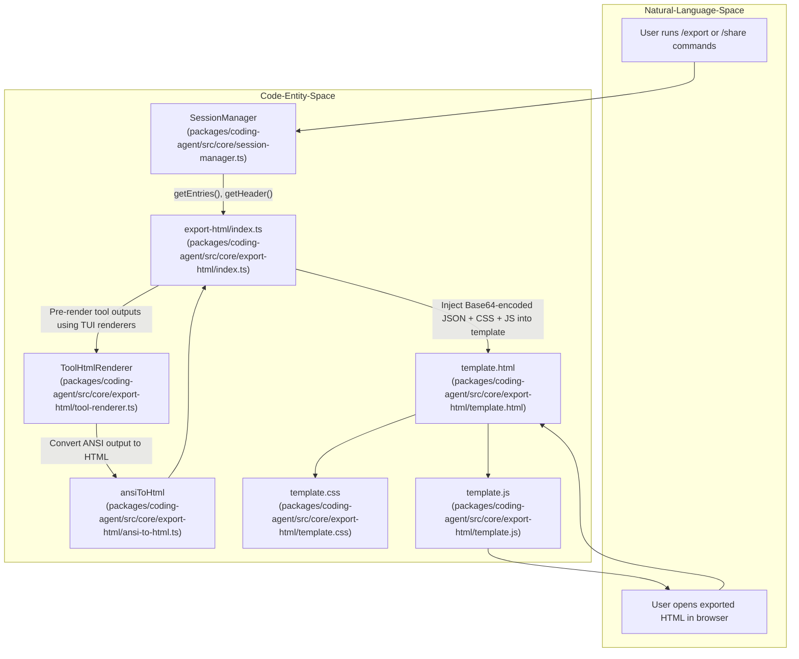

# 세션 내보내기와 HTML 렌더링

관련 소스 파일

다음 파일들은 이 위키 페이지를 생성하기 위한 컨텍스트로 사용되었습니다.

- [packages/coding-agent/src/core/export-html/ansi-to-html.ts](packages/coding-agent/src/core/export-html/ansi-to-html.ts)
- [packages/coding-agent/src/core/export-html/index.ts](packages/coding-agent/src/core/export-html/index.ts)
- [packages/coding-agent/src/core/export-html/template.css](packages/coding-agent/src/core/export-html/template.css)
- [packages/coding-agent/src/core/export-html/template.html](packages/coding-agent/src/core/export-html/template.html)
- [packages/coding-agent/src/core/export-html/template.js](packages/coding-agent/src/core/export-html/template.js)
- [packages/coding-agent/src/core/export-html/tool-renderer.ts](packages/coding-agent/src/core/export-html/tool-renderer.ts)
- [packages/coding-agent/src/core/export-html/vendor/highlight.min.js](packages/coding-agent/src/core/export-html/vendor/highlight.min.js)
- [packages/coding-agent/src/core/export-html/vendor/marked.min.js](packages/coding-agent/src/core/export-html/vendor/marked.min.js)
- [packages/coding-agent/test/export-html-skill-block.test.ts](packages/coding-agent/test/export-html-skill-block.test.ts)
- [packages/coding-agent/test/export-html-whitespace.test.ts](packages/coding-agent/test/export-html-whitespace.test.ts)
- [packages/coding-agent/test/export-html-xss.test.ts](packages/coding-agent/test/export-html-xss.test.ts)

Session Export and HTML Rendering 시스템은 사용자가 라이브 TUI 환경 밖에서 에이전트 상호작용을 공유, 보관, 검토할 수 있게 하는 핵심 기능을 제공한다. 이 시스템은 중첩된 대화 구조, 도구 호출, ANSI 터미널 출력, 임베드된 이미지를 포함한 전체 세션 데이터를 어떤 브라우저에서든 열 수 있는 독립형 대화형 HTML 문서로 변환한다.

이 페이지는 `/export`와 `/share` 명령, export-html 렌더링 스택, XSS 정화 메커니즘, GitHub Gist 업로드 흐름을 포함한 내보내기 시스템의 상위 수준 개요를 제공한다. 자세한 기술 정보와 구현 세부 사항은 링크된 하위 페이지에 있다.

---

## 상위 수준 흐름

내보내기 프로세스는 TUI 대화형 모드의 `/export` 또는 `/share` 슬래시 명령을 통해 시작된다. 시스템은 전체 세션 트리를 직렬화하고, 적용 가능한 경우 도구 출력을 수집하고 사전 렌더링한 뒤, 모든 데이터를 자체 완결형 HTML 템플릿에 주입한다. 이 템플릿에는 임베드된 CSS와 JavaScript가 포함되어 이식 가능한 문서를 생성한다.

런타임에서 내보낸 HTML 파일은 임베드된 세션 JSON을 디코딩하고 브라우저에서 대화 트리와 메시지 콘텐츠를 동적으로 렌더링하며, 브랜치 탐색과 도구 출력 펼치기 같은 상호작용성을 보존한다.

### 데이터 흐름에서 코드 엔티티로의 매핑

**요약:**

- `SessionManager`는 세션 entries와 메타데이터를 제공한다 [packages/coding-agent/src/core/export-html/index.ts:131-132]().
- `export-html/index.ts` 모듈은 내보내기를 조율하며, 사용자 정의 도구 출력 렌더링이 필요할 경우 `ToolHtmlRenderer`를 호출한다 [packages/coding-agent/src/core/export-html/index.ts:183-205]().
- ANSI 터미널 escape sequence는 `ansiToHtml`에 의해 HTML로 변환된다 [packages/coding-agent/src/core/export-html/ansi-to-html.ts:198-250]().
- 전체 내보내기 HTML 템플릿은 이식성을 위해 모든 리소스를 인라인으로 임베드한다 [packages/coding-agent/src/core/export-html/template.html:42-53]().
- 브라우저 런타임에서는 `template.js`가 동적 렌더링과 탐색을 구동한다 [packages/coding-agent/src/core/export-html/template.js:1-111]().

**출처:** [packages/coding-agent/src/core/export-html/index.ts:143-175](), [packages/coding-agent/src/core/export-html/tool-renderer.ts:25-36](), [packages/coding-agent/src/core/export-html/ansi-to-html.ts:198-250]()

---

## 내보내기 아키텍처

시스템의 핵심에는 최종 HTML 문서를 합성하는 `export-html` 모듈이 있다. 이 모듈은 정적 템플릿 파일 집합(`template.html`, `template.css`, `template.js`)을 읽고, 동적 테마 변수를 주입하며, Base64로 인코딩된 JSON 세션 데이터를 임베드한다.

- 메인 함수 `generateHtml`은 템플릿 파일을 로드하고 텍스트 치환을 수행하여 CSS 테마 변수, 인코딩된 세션 스냅샷, markdown 및 구문 강조를 위한 vendor 라이브러리를 삽입한다 [packages/coding-agent/src/core/export-html/index.ts:143-175]().
- 테마 색상은 현재 TUI 테마에서 정규화되어 내보낸 문서에서 일관된 배경색과 카드 색상을 생성한다. 여기에는 명시적인 export theme 색상이 없는 경우 색상을 파생하는 과정도 포함된다 [packages/coding-agent/src/core/export-html/index.ts:111-128]().
- 세션 데이터에는 entries, 도구 메타데이터, labels, 선택적으로 도구 호출과 결과의 사전 렌더링된 HTML이 포함된다 [packages/coding-agent/src/core/export-html/index.ts:130-138]().
- 내보내기 HTML은 렌더링과 상호작용을 위해 외부 리소스를 필요로 하지 않는 완전한 자체 완결형 문서이다 [packages/coding-agent/src/core/export-html/template.html:1-55]().
  
임베드된 `template.js` JavaScript 코드는 임베드된 세션의 클라이언트 측 파싱, 탐색 가능한 트리 뷰 구성 [packages/coding-agent/src/core/export-html/template.js:73-111](), 메시지 필터링, 적절한 정화와 구문 강조를 갖춘 markdown 콘텐츠의 안전한 렌더링을 담당한다.

렌더링 파이프라인, ANSI 변환, skill block 렌더링 로직에 대한 자세한 설명은 하위 페이지 [Export HTML Architecture](#9.1)를 참고한다.

**출처:** [packages/coding-agent/src/core/export-html/index.ts:108-128](), [packages/coding-agent/src/core/export-html/index.ts:143-175](), [packages/coding-agent/src/core/export-html/template.html:1-55](), [packages/coding-agent/src/core/export-html/template.css:1-16]()

---

## 도구 렌더링과 사전 렌더링

도구 출력의 충실한 표현을 렌더링하는 것은 내보내기 정확도에 매우 중요하다. 이는 두 가지 방식으로 처리된다.

- **네이티브 도구 렌더링**: `bash`, `read`, `write`, `edit`, `ls`처럼 알려진 출력 형식을 가진 일부 도구는 런타임에 JavaScript를 사용해 HTML 템플릿 안에서 직접 렌더링된다 [packages/coding-agent/src/core/export-html/index.ts:178]().

- **사용자 정의 도구 사전 렌더링**: 사용자 또는 확장에서 정의한 도구의 경우, 내보내기 프로세스는 내보내기 HTML을 생성하기 전에 Node.js 안에서 도구의 TUI 렌더러(`renderCall` 및 `renderResult` 메서드)를 호출한다. ANSI escape code가 포함된 터미널 문자열인 결과 출력은 색상과 서식을 보존하기 위해 `ansiLinesToHtml` 함수를 사용해 HTML로 변환된다 [packages/coding-agent/src/core/export-html/tool-renderer.ts:58-172]().  
  이러한 HTML 스냅샷은 키가 지정된 map 아래의 세션 데이터 JSON에 임베드되어 런타임 HTML 렌더러가 직접 사용할 수 있으며, 클라이언트 측에서 도구를 다시 렌더링할 필요를 없앤다 [packages/coding-agent/src/core/export-html/index.ts:183-205]().

이 사전 렌더링 접근은 라이브 TUI에 표시되는 방식과 일관되게 접을 수 있는 세부 정보가 포함된 복잡한 도구 출력을 정확하고 성능 좋게 렌더링할 수 있게 한다.

깔끔한 내보내기 외관을 유지하기 위해 도구 출력 주변의 과도한 공백은 HTML 변환 전에 신중하게 trim되며 [packages/coding-agent/src/core/export-html/tool-renderer.ts:50-56](), export whitespace 테스트에서 검증된 스타일 규칙을 따른다 [packages/coding-agent/test/export-html-whitespace.test.ts:9-42]().

**출처:** [packages/coding-agent/src/core/export-html/index.ts:178-205](), [packages/coding-agent/src/core/export-html/tool-renderer.ts:58-172](), [packages/coding-agent/test/export-html-whitespace.test.ts:9-42]()

---

## 보안과 XSS 정화

내보낸 세션에는 임의의 사용자 콘텐츠, 도구 데이터, LLM 생성 텍스트가 포함될 수 있고 브라우저 컨텍스트에서 렌더링되므로, 내보내기 시스템은 포괄적인 cross-site scripting(XSS) 완화를 구현한다.

- 임베드된 JavaScript는 `marked` markdown renderer를 사용자 정의 override로 확장하여 다음을 수행한다.
  - 링크와 이미지에서 `javascript:` 및 `vbscript:` 같은 위험한 URL scheme을 차단한다 [packages/coding-agent/test/export-html-xss.test.ts:7-11]().
  - 속성 주입 누수를 방지하기 위해 모든 `href`, `src`, `mimeType` 속성을 철저히 escape한다 [packages/coding-agent/test/export-html-xss.test.ts:23-32]().
  - DOM 요소에 삽입하기 전에 entry ID, 모델 이름, 세션 메타데이터, 도구 이름을 정화한다 [packages/coding-agent/test/export-html-xss.test.ts:40-66]().

- 내보내기의 클라이언트 측 렌더러는 innerHTML 할당을 통한 주입을 무력화하기 위해 `escapeHtml`을 광범위하게 사용한다 [packages/coding-agent/src/core/export-html/ansi-to-html.ts:63-70]().

- 사용자 메시지에 임베드된 내부 Pi skill XML block에는 특별 처리가 적용된다. 내보내기는 wrapper tag를 제거하고 포함된 스킬 콘텐츠와 사용자가 작성한 프롬프트를 별도의 block으로 렌더링하여, 내부 XML markup을 노출하지 않으면서 깔끔한 표시를 보존한다 [packages/coding-agent/test/export-html-skill-block.test.ts:7-14]().

이 견고한 정화는 내보낸 파일을 임의의 브라우저에서 안전하게 공유하고 볼 수 있도록 보장하는 데 필수적이다.

**출처:** [packages/coding-agent/test/export-html-xss.test.ts:4-67](), [packages/coding-agent/test/export-html-skill-block.test.ts:4-40](), [packages/coding-agent/src/core/export-html/ansi-to-html.ts:63-70]()

---

## 이미지 처리와 클립보드 지원

세션에는 도구 출력이나 사용자 데이터와 관련된 이미지가 포함되는 경우가 많다. 내보내기 시스템은 이를 HTML 출력 안의 임베드된 Base64 data URI로 처리한다.

- 이미지는 내보내기 또는 세션 관리 중 native `sharp` binding이나 WASM 기반 `photon`을 사용해 다음을 위해 전처리된다.
  - 크기와 호환성을 최적화하기 위한 리사이징 및 형식 변환.
  - 올바른 표시를 보장하기 위한 EXIF orientation 메타데이터 보정.
  - 크로스 플랫폼 클립보드 붙여넣기 경험을 개선하기 위해 BMP 같은 이미지 형식을 PNG로 변환.

- 클립보드 이미지 캡처와 처리는 사용자 환경과 통합하기 위해 플랫폼별 native binding에 의존한다.

이러한 이미지 작업의 전체 기술 세부 사항은 전용 하위 페이지 [Image Processing and Clipboard](#9.2)를 참고한다.

**출처:** ([Export HTML Architecture](#9.1) 개요에서 참조되며 이미지 관련 하위 페이지 [9.2]에서 계획됨)

---

## GitHub Gist 업로드 흐름

`/share` 명령은 생성된 HTML 내보내기를 GitHub Gist로 업로드하여 내보내기 기능을 확장한다.

- 저장된 GitHub token을 사용해 사용자를 인증한다.
- 전체 HTML 내보내기 파일을 포함하는 public 또는 unlisted Gist를 생성한다.
- 사용자에게 GitHub Gist URL과 직접 preview link를 반환하여 즉시 접근하고 공유할 수 있게 한다.

이 기능은 GitHub API와 통합되어 세션 내보내기를 라이브 웹 문서로 쉽게 공유할 수 있게 한다.

**출처:** (CLI 슬래시 명령 로직을 통해 구현됨. 오케스트레이션은 HTML 생성을 위해 `packages/coding-agent/src/core/export-html/index.ts`에서 발생함).

---

## 요약

Session Export and HTML Rendering 시스템은 다음을 갖춘 AI 에이전트 세션의 지속적이고 풍부한 내보내기를 가능하게 한다.

- 완전한 세션 트리 구조와 메타데이터.
- 웹 UI에서의 대화형 대화 탐색.
- ANSI color code를 HTML로 변환한 터미널 도구 출력의 정확한 렌더링.
- 확장 도구를 위한 사전 렌더링 지원.
- markdown, URL, 속성, 임베드된 콘텐츠 정화를 통한 포괄적인 XSS 보안.
- 향상된 시각적 충실도를 위한 이미지 임베딩과 처리.
- 즉시 공유를 위한 GitHub Gist 연동.

포괄적인 기술 세부 사항과 사용 예시는 관련 하위 페이지를 참고한다.

- [Export HTML Architecture](#9.1) — 템플릿 렌더링, ANSI to HTML 변환, skill block 처리를 포함한 export-html 모듈 심층 분석.
- [Image Processing and Clipboard](#9.2) — 이미지 리사이징, 형식 변환, EXIF orientation, 클립보드 캡처에 대한 세부 사항.

---

### 하위 페이지
- [Export HTML Architecture](#9.1)
- [Image Processing and Clipboard](#9.2)

---

**출처:**

- `packages/coding-agent/src/core/export-html/index.ts:1-182`  
- `packages/coding-agent/src/core/export-html/tool-renderer.ts:1-173`  
- `packages/coding-agent/src/core/export-html/ansi-to-html.ts:1-259`  
- `packages/coding-agent/src/core/export-html/template.html`  
- `packages/coding-agent/src/core/export-html/template.css`  
- `packages/coding-agent/src/core/export-html/template.js:1-176`  
- `packages/coding-agent/test/export-html-xss.test.ts`  
- `packages/coding-agent/test/export-html-whitespace.test.ts`  
- `packages/coding-agent/test/export-html-skill-block.test.ts`
