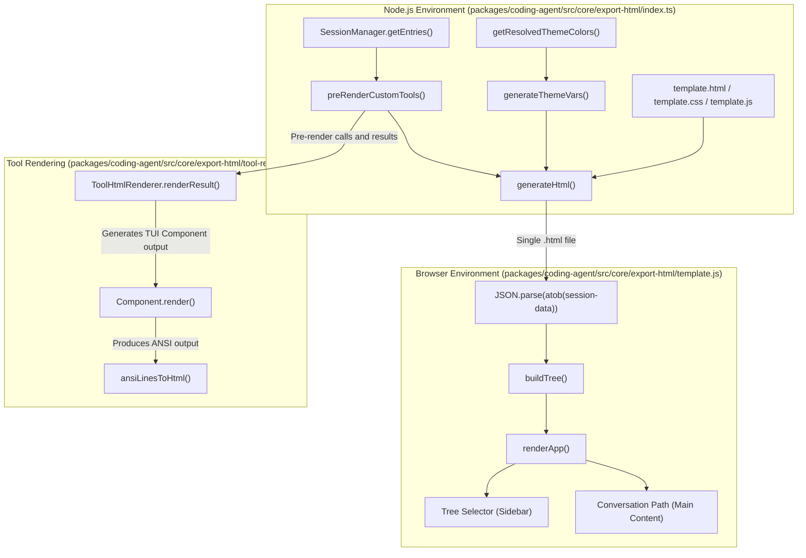
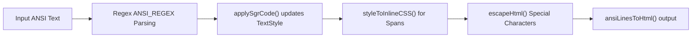
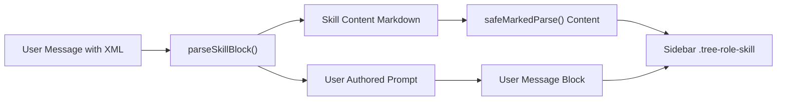

# Export HTML 아키텍처

<details>
<summary>관련 소스 파일</summary>

다음 파일들은 이 위키 페이지를 생성하기 위한 컨텍스트로 사용되었습니다.

- [packages/coding-agent/src/core/export-html/ansi-to-html.ts](packages/coding-agent/src/core/export-html/ansi-to-html.ts)
- [packages/coding-agent/src/core/export-html/index.ts](packages/coding-agent/src/core/export-html/index.ts)
- [packages/coding-agent/src/core/export-html/template.css](packages/coding-agent/src/core/export-html/template.css)
- [packages/coding-agent/src/core/export-html/template.html](packages/coding-agent/src/core/export-html/template.html)
- [packages/coding-agent/src/core/export-html/template.js](packages/coding-agent/src/core/export-html/template.js)
- [packages/coding-agent/src/core/export-html/tool-renderer.ts](packages/coding-agent/src/core/export-html/tool-renderer.ts)
- [packages/coding-agent/src/core/export-html/vendor/highlight.min.js](packages/coding-agent/src/core/export-html/vendor/highlight.min.js)
- [packages/coding-agent/src/core/export-html/vendor/marked.min.js](packages/coding-agent/src/core/export-html/vendor/marked.min.js)
- [packages/coding-agent/test/export-html-skill-block.test.ts](packages/coding-agent/test/export-html-skill-block.test.ts)
- [packages/coding-agent/test/export-html-whitespace.test.ts](packages/coding-agent/test/export-html-whitespace.test.ts)
- [packages/coding-agent/test/export-html-xss.test.ts](packages/coding-agent/test/export-html-xss.test.ts)

</details>


`pi` 코드베이스의 `export-html` 모듈은 `AgentSession`의 독립형 대화형 HTML 표현을 생성하는 역할을 한다. 이 내보내기는 브라우저 환경에서 Terminal UI(TUI) 경험을 충실히 재현하는 것을 목표로 하며, 분기형 대화 트리, 안전한 Markdown 렌더링, 도구 출력을 위한 ANSI-to-HTML 변환, 이미지와 기타 세션 데이터의 안전한 처리를 제공한다.

---

## 개요와 파이프라인

내보내기 파이프라인은 세션의 구조화된 데이터(`SessionEntry` 목록과 메타데이터)를 단일 HTML 파일로 변환한다. 이 파일은 세션 콘텐츠의 Base64 인코딩 JSON payload와 템플릿의 CSS 및 JavaScript를 임베드하여, 브라우저 안에서만 대화형 탐색과 렌더링이 가능하게 한다.

### 세션 내보내기 파이프라인 다이어그램



이 다이어그램은 세션 데이터가 인메모리 Node.js 구조에서 사용자 정의 사전 렌더링과 템플릿 주입을 거쳐, 브라우저에서 호스팅되는 대화형 문서로 흐르는 방식을 보여준다.

**출처:**
- `[packages/coding-agent/src/core/export-html/index.ts:142-174]()`
- `[packages/coding-agent/src/core/export-html/template.js:8-15]()`
- `[packages/coding-agent/src/core/export-html/tool-renderer.ts:121-171]()`

---

## 템플릿 렌더링 파이프라인

핵심 HTML 생성은 내보내기 시점에 세션 데이터를 HTML, CSS, JavaScript 템플릿에 통합하는 `generateHtml` 함수가 처리한다.

### 파이프라인 단계

1. **템플릿과 Vendor Script 읽기:**
   Markdown 파싱용 `marked.min.js`와 구문 강조용 `highlight.min.js` 같은 번들 vendor script와 함께 `template.html`, `template.css`, `template.js` 파일을 읽는다 `[packages/coding-agent/src/core/export-html/index.ts:143-150]()`.

2. **테마 변수 주입:**
   `getResolvedThemeColors()`를 통해 해석된 테마 색상과 `getThemeExportColors()`의 명시적 export 색상을 병합하여 테마 기반 CSS 변수를 생성한다 `[packages/coding-agent/src/core/export-html/index.ts:111-124]()`. 테마가 export 전용 색상을 정의하지 않은 경우, `deriveExportColors()`는 기본 사용자 메시지 배경색의 밝기를 조정해 적절한 배경색을 파생한다.

3. **세션 데이터 인코딩:**
   메타데이터, entries, 시스템 프롬프트, 도구 정의, 사전 렌더링된 사용자 정의 도구 출력을 포함한 전체 세션 상태를 JSON으로 직렬화하고 Base64로 인코딩한다. 이 Base64 문자열은 ID가 `session-data`인 `<script>` 태그에 임베드된다 `[packages/coding-agent/src/core/export-html/index.ts:159-171]()`.

4. **템플릿 변수 치환:**
   CSS 변수, 인코딩된 세션 데이터, 인라인 script를 placeholder 태그(`{{CSS}}`, `{{SESSION_DATA}}`, `{{JS}}` 등)를 대체하여 `template.html`에 주입하고, 최종 배포 가능한 HTML 파일을 생성한다 `[packages/coding-agent/src/core/export-html/index.ts:169-174]()`.

**핵심 함수 설명:**
- `generateThemeVars(themeName)`: 테마 색상을 위한 CSS custom properties 블록을 생성한다 `[packages/coding-agent/src/core/export-html/index.ts:111-129]()`.
- `deriveExportColors(baseColor)`: 밝기와 휘도를 조정해 페이지 배경, 카드 배경, 정보 섹션 배경색을 만든다 `[packages/coding-agent/src/core/export-html/index.ts:81-106]()`.
- `generateHtml(sessionData, themeName)`: 템플릿 파일 읽기, 테마 CSS 생성, 데이터 인코딩, 최종 HTML 문자열 조립을 조율한다 `[packages/coding-agent/src/core/export-html/index.ts:143-175]()`.

**출처:**
- `[packages/coding-agent/src/core/export-html/index.ts:81-174]()`
- `[packages/coding-agent/src/core/export-html/template.html:42-53]()`

---

## 도구 렌더링 아키텍처

에이전트 세션 안의 도구는 내보내기에서 내장 도구인지 사용자 정의 확장 도구인지에 따라 다르게 렌더링된다.

### 내장 도구와 사용자 정의 도구 렌더링

| 도구 유형 | 렌더링 전략 | 위치 |
| :--- | :--- | :--- |
| **내장 도구** | 순수 JavaScript(`template.js` 로직)를 사용해 템플릿에서 클라이언트 측 렌더링 | `[packages/coding-agent/src/core/export-html/index.ts:178]()` |
| `bash`, `read`, `write`, `edit`, `ls` | | |
| **사용자 정의 도구** | 내보내기 중 서버 측에서 TUI 출력을 ANSI로 렌더링한 뒤 ANSI를 HTML로 변환하여 사전 렌더링 | `[packages/coding-agent/src/core/export-html/index.ts:183-186]()`, `[packages/coding-agent/src/core/export-html/tool-renderer.ts:58-172]()` |

### ToolHtmlRenderer: 사용자 정의 도구 렌더링 파이프라인

- 사용자 정의 도구는 해당 TUI 렌더 메서드(`renderCall`, `renderResult`)를 호출해 ANSI 인코딩 출력을 얻는 방식으로 렌더링된다 `[packages/coding-agent/src/core/export-html/tool-renderer.ts:128-160]()`.
- ANSI 출력 줄은 HTML 변환 전에 `trimRenderedResultLines`를 사용해 빈 padding 줄을 trim하여 정리된다 `[packages/coding-agent/src/core/export-html/tool-renderer.ts:50-56]()`.
- ANSI는 `ansiLinesToHtml`(`ansi-to-html.ts`에서 제공)에 의해 inline style이 적용된 HTML span으로 변환되어 스타일과 색상을 충실히 복제할 수 있게 한다 `[packages/coding-agent/src/core/export-html/ansi-to-html.ts:198-250]()`.

**공백 처리:**
- 출력 컨테이너 CSS 스타일은 다음을 사용한다.
  - `.ansi-line` 요소는 터미널 줄 간격과 정렬을 보존하기 위해 `white-space: pre`로 설정된다 `[packages/coding-agent/test/export-html-whitespace.test.ts:16]()`.
  - `.output-preview`와 `.output-full` 컨테이너는 들여쓰기를 유지하면서 줄바꿈을 허용하기 위해 `white-space: pre-wrap`을 사용한다 `[packages/coding-agent/test/export-html-whitespace.test.ts:13-15]()`.

**오류 처리:**
- `renderCall`과 `renderResult`는 예외를 catch하고 사용자 정의 renderer가 실패할 경우 구조화된 출력 또는 렌더링되지 않은 출력으로 fallback한다 `[packages/coding-agent/src/core/export-html/tool-renderer.ts:115-168]()`.

**출처:**
- `[packages/coding-agent/src/core/export-html/index.ts:177-186]()`
- `[packages/coding-agent/src/core/export-html/tool-renderer.ts:50-172]()`
- `[packages/coding-agent/src/core/export-html/ansi-to-html.ts:1-259]()`
- `[packages/coding-agent/test/export-html-whitespace.test.ts:10-18]()`

---

## ANSI to HTML 변환 세부 사항

ANSI-to-HTML 변환 유틸리티는 터미널 escape code를 파싱하고 inline CSS가 적용된 스타일 HTML을 출력한다.

- 표준 텍스트 스타일인 bold, dim, italic, underline을 지원한다 `[packages/coding-agent/src/core/export-html/ansi-to-html.ts:123-138]()`.
- 16개 표준 ANSI 색상, 256색 palette 색상, RGB true color 전경/배경색을 변환한다 `[packages/coding-agent/src/core/export-html/ansi-to-html.ts:139-185]()`.
- 주입을 방지하기 위해 모든 HTML 특수 문자를 escape한다 `[packages/coding-agent/src/core/export-html/ansi-to-html.ts:63-70]()`.
- 줄 구조를 유지하기 위해 각 줄을 `<div class="ansi-line">`로 감싼다 `[packages/coding-agent/src/core/export-html/ansi-to-html.ts:256-258]()`.

### 변환 흐름



**출처:**
- `[packages/coding-agent/src/core/export-html/ansi-to-html.ts:60-258]()`

---

## 보안과 정화(XSS 보호)

Markdown 렌더링과 도구 출력에는 사용자 입력이나 도구 데이터가 임베드될 수 있으므로, 내보내기는 XSS 공격을 방지하기 위해 엄격한 보안 메커니즘을 적용한다.

### `template.js`의 정화 조치

- **Marked Renderer Overrides:** 링크와 이미지에 대한 사용자 정의 override는 `javascript:`, `vbscript:` 같은 위험한 URL scheme과, 안전한 이미지를 나타내는 경우가 아닌 위험한 inline data URI를 차단한다 `[packages/coding-agent/test/export-html-xss.test.ts:7-16]()`.
- **HTML 속성 Escaping:** 동적으로 삽입되는 모든 ID, URL, mime type, 임베드된 base64 이미지 데이터는 HTML 속성에 주입되기 전에 `escapeHtml`을 사용해 escape되어 속성 주입이나 태그 탈출을 방지한다 `[packages/coding-agent/test/export-html-xss.test.ts:18-41]()`.
- **사이드바와 메타데이터 Escaping:** 사이드바에 렌더링되는 메타데이터 필드(model identifier, thinking level, role, tool name)는 안전하게 escape되어 세션 메타데이터를 통한 주입을 방지한다 `[packages/coding-agent/test/export-html-xss.test.ts:43-61]()`.
- **유틸리티 함수:** `escapeHtml`은 공유되며 ANSI-to-HTML과 템플릿 렌더링 전반에서 모든 동적 콘텐츠를 안전하게 하기 위해 사용된다 `[packages/coding-agent/src/core/export-html/ansi-to-html.ts:63-70]()`.

**출처:**
- `[packages/coding-agent/test/export-html-xss.test.ts:1-62]()`
- `[packages/coding-agent/src/core/export-html/ansi-to-html.ts:63-70]()`

---

## Skill Block 렌더링

세션에 임베드된 스킬 호출은 사용자 프롬프트 주변에 XML과 유사한 wrapper를 사용한다.
```xml
<skill name="..." location="...">
  ...
</skill>

actual prompt text
```

### 렌더링 접근

- 임베드된 `<skill>...</skill>` block은 `template.js`의 `parseSkillBlock`으로 파싱되고 제거되어, 스킬 콘텐츠와 사용자 프롬프트를 분리한다 `[packages/coding-agent/test/export-html-skill-block.test.ts:7-14]()`.
- 스킬 콘텐츠(일반적으로 `SKILL.md`의 markdown)는 `safeMarkedParse`로 렌더링되어 HTML 안전성과 적절한 Markdown 서식을 보장한다 `[packages/coding-agent/test/export-html-skill-block.test.ts:29-33]()`.
- 사용자 프롬프트는 내보낸 문서에서 스킬 호출 바로 뒤의 별도 sibling block으로 렌더링되어, 사용자가 작성한 내용을 정확히 보여준다 `[packages/coding-agent/test/export-html-skill-block.test.ts:16-27]()`.
- 사이드바에는 스킬(`.tree-role-skill` 스타일 적용)과 사용자 메시지 모두에 대한 entries가 포함되어 탐색을 돕는다 `[packages/coding-agent/test/export-html-skill-block.test.ts:35-39]()`.

### 스킬 렌더링 다이어그램



**출처:**
- `[packages/coding-agent/test/export-html-skill-block.test.ts:1-41]()`

---

## 요약

`export-html` 모듈은 웹에서 완전한 `AgentSession` 탐색 경험을 지원하는 견고하고 안전하며 시각적으로 풍부한 내보내기 메커니즘을 제공한다. 핵심 요소는 다음과 같다.

- **템플릿 기반 렌더링:** 정적 HTML/CSS/JS를 주입된 세션 상태 및 테마 색상과 결합한다 `[packages/coding-agent/src/core/export-html/index.ts:143-175]()`.
- **도구 출력 렌더링:** 내장 도구는 클라이언트 측에서 동적으로 렌더링하고, 사용자 정의 도구는 TUI ANSI 파이프라인을 통해 서버 측에서 사전 렌더링하는 혼합 전략 `[packages/coding-agent/src/core/export-html/index.ts:177-186]()`.
- **ANSI-to-HTML 변환:** 브라우저에서 터미널 색상과 스타일을 충실히 렌더링할 수 있게 한다 `[packages/coding-agent/src/core/export-html/ansi-to-html.ts:1-259]()`.
- **XSS 완화:** Markdown renderer 메서드를 override하고 모든 주입 콘텐츠를 escape하여 내보내기를 안전하게 한다 `[packages/coding-agent/test/export-html-xss.test.ts:1-67]()`.
- **Skill Block 파싱:** 정확한 소스 수준 렌더링을 위해 스킬 호출 block을 특별 처리한다 `[packages/coding-agent/test/export-html-skill-block.test.ts:1-41]()`.
- **대화형 브라우저 UI:** 완전한 클라이언트 측 렌더링으로 세션의 탐색, 검색, 트리 기반 탐색을 가능하게 한다 `[packages/coding-agent/src/core/export-html/template.js:1-111]()`.

**출처:**
- `[packages/coding-agent/src/core/export-html/index.ts:11-186]()`
- `[packages/coding-agent/src/core/export-html/template.js:1-176]()`
- `[packages/coding-agent/src/core/export-html/tool-renderer.ts:38-172]()`
- `[packages/coding-agent/src/core/export-html/ansi-to-html.ts:1-259]()`
- `[packages/coding-agent/src/core/export-html/template.html:1-56]()`
- `[packages/coding-agent/test/export-html-xss.test.ts:1-67]()`
- `[packages/coding-agent/test/export-html-whitespace.test.ts:1-43]()`
- `[packages/coding-agent/test/export-html-skill-block.test.ts:1-41]()`
