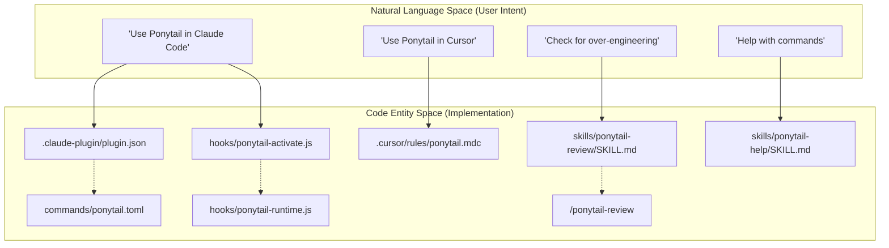

# 개요

<details>
<summary>관련 소스 파일</summary>

다음 파일들은 이 위키 페이지를 생성할 때 참고 자료로 사용되었습니다:

- [AGENTS.md](AGENTS.md)
- [LICENSE](LICENSE)
- [README.md](README.md)
- [assets/logo-dark.png](assets/logo-dark.png)
- [assets/logo-dark.svg](assets/logo-dark.svg)
- [assets/logo.png](assets/logo.png)
- [docs/agent-portability.md](docs/agent-portability.md)
- [skills/ponytail-help/SKILL.md](skills/ponytail-help/SKILL.md)

</details>


Ponytail은 AI 에이전트를 위한 미니멀한 "lazy senior developer" 규칙셋으로, 과도한 설계와 코드 비대를 막도록 설계되었습니다. 문제를 올바르게 해결하는 데 필요한 최소한만 수행하는 철학을 강제하며, 새 의존성이나 커스텀 구현보다 기존 해결책(표준 라이브러리, 네이티브 플랫폼 기능)을 우선합니다.

이러한 제약을 적용하면 Ponytail은 일반적으로 훨씬 작은 코드베이스를 만들고, 개발 속도는 더 빠르며 실행 비용은 더 낮아집니다. 최근 에이전트 벤치마크에서는 이 스킬이 없는 에이전트와 비교해 **코드 줄 수(LOC) 54% 감소**와 **비용 20% 감소**를 보였습니다 [README.md:57-62]().

### 핵심 로직: 사다리
코드를 한 줄도 쓰기 전에, 에이전트는 요구사항을 만족하는 "사다리"의 가장 첫 번째 단계에서 멈추도록 지시받습니다:
1.  **YAGNI**: 이 기능이 정말 필요한가? (아니면 건너뜁니다).
2.  **표준 라이브러리**: 언어의 stdlib로 해결되는가?
3.  **네이티브 플랫폼**: 브라우저나 OS에 내장 기능이 있는가?
4.  **설치된 의존성**: 프로젝트 안에 이미 이 일을 하는 도구가 있는가?
5.  **한 줄**: 로직을 한 줄로 끝낼 수 있는가?
6.  **최소 실행 가능**: 그때서야, 동작하는 절대 최소 코드를 작성합니다.

출처: [README.md:80-91](), [AGENTS.md:5-12]()

---

## Ponytail 철학
이 프로젝트는 "가장 좋은 코드는 쓰이지 않은 코드"라는 믿음을 바탕으로 만들어졌습니다 [AGENTS.md:3-3](). 이 철학은 방임을 뜻하지 않습니다. 보안, 데이터 손실 방지, 신뢰 경계에서의 입력 검증, 접근성에는 명확한 경계를 유지합니다 [README.md:93-93](), [AGENTS.md:24-24]().

의사결정 계층, `ponytail:` 주석 규칙, 그리고 세 가지 강도 수준(**lite**, **full**, **ultra**)에 대한 자세한 내용은 **[Ponytail 철학](#1.1)**을 참조하세요.

---

## 시스템 아키텍처 및 이식성
Ponytail은 이식 가능한 규칙셋으로 배포됩니다. Claude Code, Codex, OpenCode 같은 고급 에이전트용 네이티브 플러그인으로 동작하는 동시에, IDE 기반 에이전트를 위한 정적 규칙 파일도 제공합니다.

### 코드-에이전트 매핑
다음 다이어그램은 개념적인 "지원 호스트"를 코드베이스의 구체적인 설정 엔터티와 파일에 연결해 보여줍니다.

**Diagram: Adapter & Command Mapping**

출처: [docs/agent-portability.md:9-25](), [README.md:101-155](), [skills/ponytail-help/SKILL.md:24-35]()

### 배포 모델
Ponytail은 허브 앤 스포크 모델을 사용하며, `AGENTS.md`는 압축된 상시 지침 세트 역할을 합니다 [docs/agent-portability.md:41-41](). 호스트별 어댑터는 `skills/`와 `hooks/`의 공유 로직을 가리켜 14개 이상의 지원 에이전트 전반에서 이식 가능한 동작을 보장합니다 [README.md:17-17](), [docs/agent-portability.md:27-32]().

| 호스트 | 주요 통합 파일 |
| :--- | :--- |
| **Claude Code** | `.claude-plugin/`, `commands/*.toml`, `hooks/` |
| **Codex** | `.codex-plugin/plugin.json`, `hooks/claude-codex-hooks.json` |
| **OpenCode** | `.opencode/plugins/ponytail.mjs`, `.opencode/command/` |
| **Pi Agent** | `pi-extension/`, `skills/` |

어댑터가 어떻게 얇게 유지되는지, 그리고 어떻게 설치하는지에 대한 자세한 내용은 **[에이전트 이식성 및 지원 호스트](#1.2)**를 참조하세요.

---

## 저장소 구성
이 저장소는 핵심 로직(`skills`)과 플랫폼별 접착 코드로 분리되도록 구조화되어 있습니다.

**Diagram: Repository Structure**
```mermaid
graph LR
    subgraph "Core Rules"
        "skills/ponytail/" -- "Main Logic" --> "SKILL.md"
        "skills/ponytail-review/" -- "Review Logic" --> "SKILL.md_rev"
        "AGENTS.md" -- "Compact Rule" --> "AGENTS.md_file"
    end

    subgraph "Platform Adapters"
        "hooks/" -- "Lifecycle Logic" --> "ponytail-runtime.js"
        "commands/" -- "CLI Interface" --> "ponytail.toml"
        "pi-extension/" -- "Pi Harness" --> "extension.js"
        ".opencode/" -- "OpenCode Plugin" --> "ponytail.mjs"
    end

    subgraph "Validation & Assets"
        "benchmarks/" -- "Harness & Results" --> "agentic/"
        "tests/" -- "Logic Tests" --> "hooks.test.js"
        "assets/" -- "Branding" --> "logo.png"
    end
```
출처: [docs/agent-portability.md:33-42](), [README.md:95-155]()

---

## 빠른 시작
지원되는 환경에서 Ponytail을 활성화하려면:

*   **Claude Code**: `/plugin marketplace add DietrichGebert/ponytail` 다음 `/plugin install ponytail@ponytail` [README.md:103-105]().
*   **Codex**: `/plugins` 마켓플레이스를 통해 추가하고 `/hooks`의 라이프사이클 훅을 신뢰합니다 [README.md:112-118]().
*   **Pi Agent**: `pi install git:github.com/DietrichGebert/ponytail` [README.md:146-146]().
*   **IDE 규칙**: 관련 규칙 파일(예: `.cursor/rules/ponytail.mdc` 또는 `.clinerules/ponytail.md`)을 프로젝트 루트에 복사합니다 [docs/agent-portability.md:16-18]().

더 자세한 명령 참조와 스킬 트리거는 **[스킬 및 명령](2.-Skills-&-Commands)**을 참조하세요.
