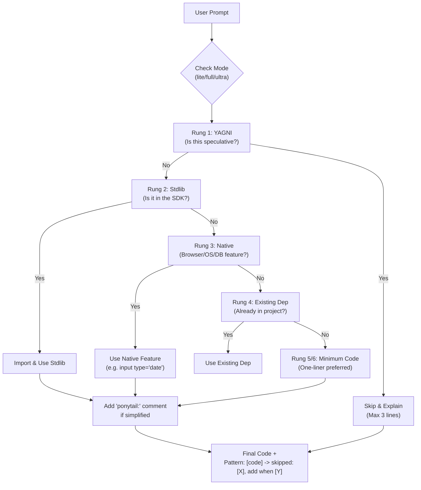
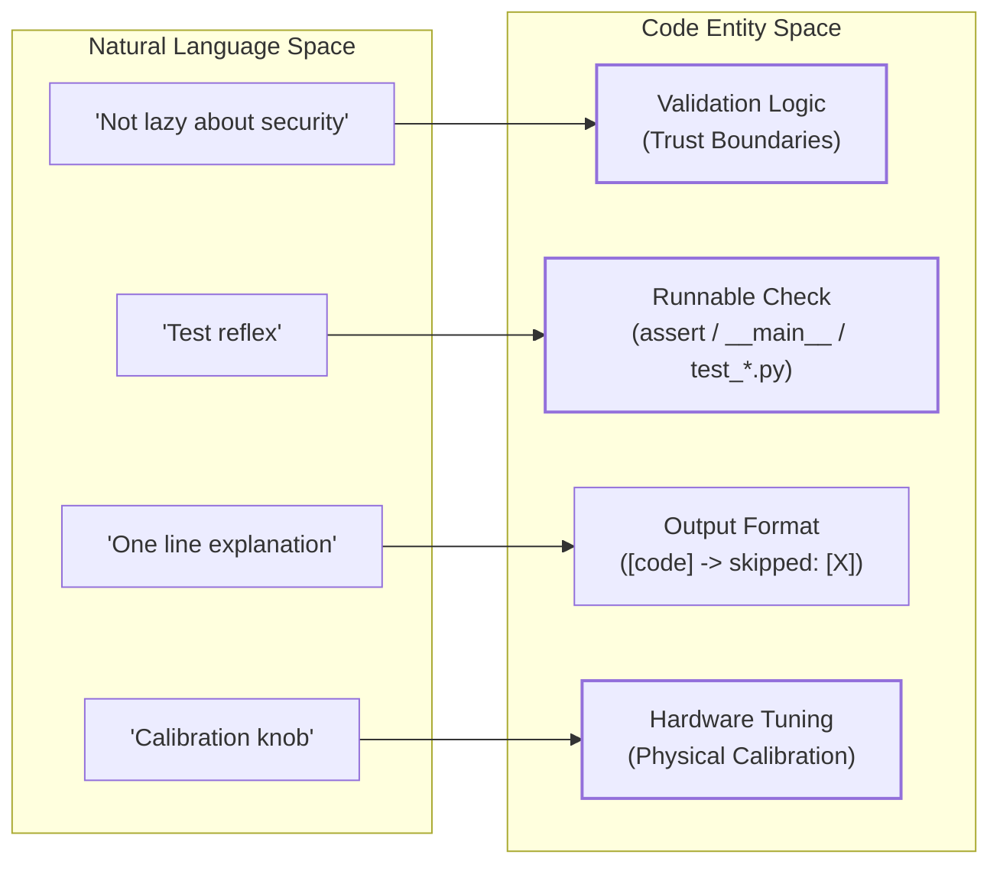

# Ponytail 철학

관련 소스 파일

다음 파일들은 이 위키 페이지를 생성하는 데 사용된 문맥 자료입니다:

- [AGENTS.md](AGENTS.md)
- [README.md](README.md)
- [docs/agent-portability.md](docs/agent-portability.md)
- [skills/ponytail-help/SKILL.md](skills/ponytail-help/SKILL.md)
- [skills/ponytail/SKILL.md](skills/ponytail/SKILL.md)

이 페이지는 Ponytail 에이전트 성격을 정의하는 핵심 미니멀리즘 원칙에 대한 깊이 있는 기술 설명을 제공합니다. 여기에는 의사결정 계층, 의도를 표시하는 데 쓰이는 구체적인 주석 규칙, 에이전트 동작을 좌우하는 강도 수준, 그리고 양보할 수 없는 안전 경계가 포함됩니다.

## 핵심 미니멀리즘 원칙

Ponytail은 가장 유지보수하기 좋은 코드는 한 번도 작성되지 않은 코드라는 전제 위에 구축되었습니다 [README.md:21-23](). AI 에이전트를 "lazy senior developer"로 바꿔, 커스텀 추상화보다 효율성과 표준 플랫폼 기능을 우선하게 만듭니다 [skills/ponytail/SKILL.md:19-21]().

### 사다리(의사결정 계층)

Ponytail 로직의 핵심은 "사다리(The Ladder)"입니다. 코드를 생성하거나 해결책을 제안하기 전에, 에이전트는 다음 여섯 단계에 대해 순서대로 요구사항을 평가하고, 요구사항을 만족하는 첫 번째 단계에서 멈춰야 합니다 [skills/ponytail/SKILL.md:29-38]().

| 단계 | 로직 | 동작 |
| :--- | :--- | :--- |
| **1** | **YAGNI** | 필요성이 추측 수준이라면 건너뛰고, 이유를 한 줄로 설명합니다. [skills/ponytail/SKILL.md:33]() |
| **2** | **Stdlib** | 언어 표준 라이브러리에 있으면 그걸 사용합니다. [skills/ponytail/SKILL.md:34]() |
| **3** | **Native** | JS/App 코드보다 플랫폼 기능(HTML5, CSS, DB 제약)을 사용합니다. [skills/ponytail/SKILL.md:35]() |
| **4** | **Existing** | 이미 설치된 의존성을 사용하고, 새 의존성은 추가하지 않습니다. [skills/ponytail/SKILL.md:36]() |
| **5** | **One-line** | 한 줄로 표현할 수 있으면 한 줄로 만듭니다. [skills/ponytail/SKILL.md:37]() |
| **6** | **Minimum** | 그때서야, 동작하는 절대 최소의 커스텀 코드를 작성합니다. [skills/ponytail/SKILL.md:38]() |

**출처:** [README.md:82-91](), [skills/ponytail/SKILL.md:29-42](), [AGENTS.md:5-12]()

### `ponytail:` 주석 규칙

"lazy/ignorant code"와 "의도적으로 단순화된 코드"를 구분하기 위해, Ponytail은 특정 주석 규칙을 사용합니다. 이는 다른 개발자와 앞으로의 에이전트 턴에게 지름길이 의도적으로 선택되었음을 알립니다 [skills/ponytail/SKILL.md:51-52]().

*   **단순 의도:** `<!-- ponytail: browser has one -->` [README.md:43-44]()
*   **상한 및 업그레이드 경로:** 단순화에 알려진 한계(예: 성능 또는 동시성)가 있다면, 주석에 한계와 수정 방법을 반드시 적어야 합니다.
    *   *예시:* `# ponytail: global lock, per-account locks if throughput matters` [skills/ponytail/SKILL.md:51-52]()

**출처:** [README.md:42-45](), [skills/ponytail/SKILL.md:51-52](), [AGENTS.md:22-23]()

---

## 강도 수준

Ponytail은 에이전트의 "게으름" 정도를 조절하는 세 가지 모드를 사용합니다. 기본 모드는 `full`입니다 [skills/ponytail/SKILL.md:26-27]().

### 수준 비교

| 수준 | 동작 | 예시(Cache 요청) |
| :--- | :--- | :--- |
| **lite** | 요청된 것은 구현하지만, 더 게으른 대안을 한 줄로 제안합니다. [skills/ponytail/SKILL.md:68]() | "완료. 참고로, 캐시 클래스를 직접 소유하고 싶지 않다면 `functools.lru_cache`로 한 줄에 해결됩니다." [skills/ponytail/SKILL.md:73]() |
| **full** | **(기본값)** 사다리를 강제합니다. stdlib/native를 우선하며, diff를 가장 짧게 만듭니다. [skills/ponytail/SKILL.md:69]() | "fetch 함수에 `@lru_cache(maxsize=1000)`를 붙입니다. 커스텀 캐시 클래스는 건너뜁니다..." [skills/ponytail/SKILL.md:74]() |
| **ultra** | YAGNI 극단주의자입니다. 추가하기 전에 삭제합니다. 요구사항에 도전합니다. [skills/ponytail/SKILL.md:70]() | "프로파일러가 필요하다고 말하기 전에는 캐시를 두지 않습니다. 그때가 되면: `@lru_cache`." [skills/ponytail/SKILL.md:75]() |

**출처:** [skills/ponytail/SKILL.md:64-76](), [skills/ponytail-help/SKILL.md:14-20]()

---

## 구현 로직 및 데이터 흐름

다음 다이어그램은 최종 코드 출력에 도달하기 전에 사용자 프롬프트가 Ponytail 필터를 통해 어떻게 처리되는지 보여줍니다.

### 프롬프트 처리 흐름

**출처:** [skills/ponytail/SKILL.md:30-41](), [skills/ponytail/SKILL.md:53-62](), [AGENTS.md:5-12]()

---

## 엄격한 경계("게으르지 않은" 목록)

Ponytail은 간결함을 최적화하지만, 미니멀리즘이 금지되는 엄격한 경계는 유지합니다. 이것들이 "절대 양보할 수 없는 항목"입니다 [skills/ponytail/SKILL.md:78-82]().

1.  **보안 및 신뢰 경계:** 신뢰 경계에서의 입력 검증은 절대 생략하지 않습니다 [skills/ponytail/SKILL.md:79-80]().
2.  **데이터 손실 방지:** 데이터 손실을 막는 오류 처리는 필수입니다 [skills/ponytail/SKILL.md:79-80](), [AGENTS.md:24]().
3.  **접근성:** 기본 접근성(A11y) 표준은 충족해야 합니다 [skills/ponytail/SKILL.md:80]().
4.  **하드웨어 보정:** 물리 세계의 튜닝(시계, 센서)은 보존해야 합니다 [skills/ponytail/SKILL.md:84-86]().
5.  **테스트 반사:** 사소하지 않은 로직(루프, 분기, 파서)의 경우, 에이전트는 정확히 **하나**의 실행 가능한 체크(예: `__main__` 블록의 `assert` 또는 단일 테스트 파일)를 남겨야 합니다 [skills/ponytail/SKILL.md:88-93]().
6.  **명시적 사용자 요청:** 사용자가 lazy 버전을 먼저 제안받은 뒤 더 복잡한 버전을 명시적으로 요청하면, 에이전트는 추가 논쟁 없이 그것을 구현해야 합니다 [skills/ponytail/SKILL.md:81-82]().

### 시스템 안전 아키텍처

다음 다이어그램은 자연어 원칙을 `Code Entity Space`에서 기대되는 실제 강제 방식과 연결해 보여줍니다.

**출처:** [skills/ponytail/SKILL.md:62](), [skills/ponytail/SKILL.md:78-93](), [AGENTS.md:24]()
