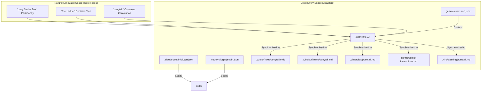
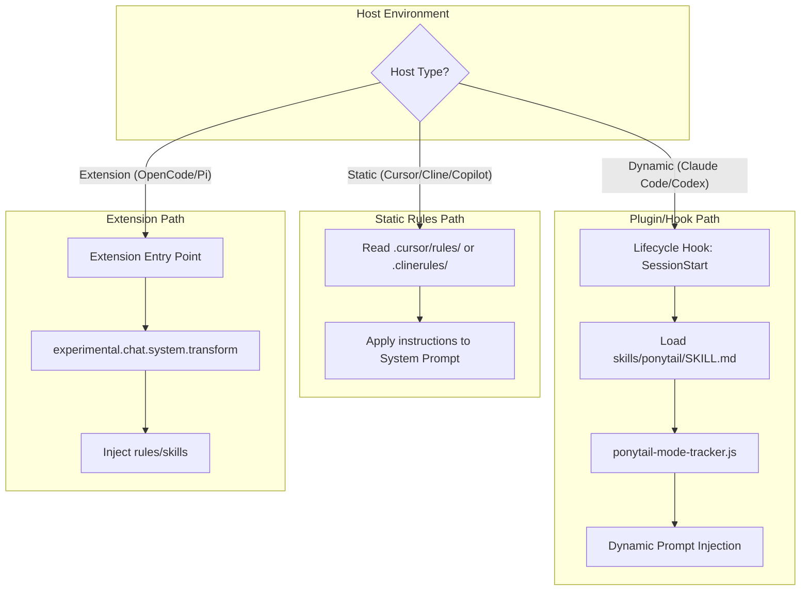

# 에이전트 이식성 및 지원 호스트

관련 소스 파일

다음 파일들은 이 위키 페이지를 생성할 때 문맥 자료로 사용되었습니다:

- [.claude-plugin/plugin.json](.claude-plugin/plugin.json)
- [.clinerules/ponytail.md](.clinerules/ponytail.md)
- [.codex-plugin/plugin.json](.codex-plugin/plugin.json)
- [.cursor/rules/ponytail.mdc](.cursor/rules/ponytail.mdc)
- [.github/copilot-instructions.md](.github/copilot-instructions.md)
- [.windsurf/rules/ponytail.md](.windsurf/rules/ponytail.md)
- [README.es.md](README.es.md)
- [README.md](README.md)
- [docs/agent-portability.md](docs/agent-portability.md)
- [gemini-extension.json](gemini-extension.json)
- [skills/ponytail-help/SKILL.md](skills/ponytail-help/SKILL.md)

Ponytail은 에이전트 이식 가능한 스킬 배포 방식으로 설계되었습니다. 미니멀리즘과 "사다리(The Ladder)" 의사결정 계층이라는 핵심 철학은 중앙 규칙 세트에 구현되어 있으며, 이후 얇은 어댑터를 통해 다양한 AI 에이전트 환경에 배포됩니다 [docs/agent-portability.md:3-5](). 이 아키텍처는 Claude Code 같은 CLI 기반 에이전트를 사용하든, Cursor 같은 IDE 통합 에이전트를 사용하든, "Lazy Senior Dev" 동작이 일관되게 유지되도록 보장합니다.

## 배포 아키텍처

이 저장소는 규칙 배포에 허브 앤 스포크 모델을 따릅니다. "허브"는 `skills/` 디렉터리와 `AGENTS.md` 파일에 있는 핵심 동작 정의로 구성됩니다 [docs/agent-portability.md:27-32](). "스포크"는 이러한 지침을 불러오거나 감싸는 호스트별 어댑터입니다.

### 핵심 동작 구성 요소
| 구성 요소 | 역할 | 파일 |
| :--- | :--- | :--- |
| **Lazy Senior Dev** | 미니멀리즘 코딩을 위한 기본 지침 세트입니다. | [skills/ponytail/SKILL.md]() |
| **과도 설계 검토** | 불필요한 코드를 식별하고 삭제하는 스킬입니다. | [skills/ponytail-review/SKILL.md]() |
| **빠른 참조** | 에이전트가 자신의 모드를 설명하는 데 쓰는 도움말 문서입니다. | [skills/ponytail-help/SKILL.md]() |
| **압축된 규칙셋** | 범용 에이전트를 위한 지침의 통합 버전입니다. | [AGENTS.md]() |

출처: [docs/agent-portability.md:33-42]()

### 이식성 데이터 흐름
다음 다이어그램은 중앙 규칙셋이 특정 어댑터 파일을 통해 저장소에서 다양한 호스트 환경으로 어떻게 흐르는지 보여줍니다.

**자연어 공간에서 코드 엔터티 공간으로: 규칙 배포**

출처: [docs/agent-portability.md:1-25](), [README.md:80-91](), [gemini-extension.json:1-7]()

## 지원 호스트 및 어댑터

Ponytail은 호스트 에이전트의 기능에 따라 여러 수준의 통합을 지원합니다:

1.  **완전 플러그인 통합**: 라이프사이클 훅, 세션 활성화, 동적 모드 추적을 지원합니다(Claude Code, Codex).
2.  **네이티브 에이전트 확장**: 특정 하니스 시스템을 통해 통합됩니다(Pi Agent, OpenCode, Gemini CLI).
3.  **프로젝트/스티어링 규칙**: 에이전트가 초기화 시 읽는 정적 지침 파일입니다(Cursor, Windsurf, Cline, Copilot, Kiro).

### 어댑터 매핑 표

| 호스트 | 어댑터 파일 | 통합 수준 |
| :--- | :--- | :--- |
| **Claude Code** | `.claude-plugin/plugin.json`, `commands/`, `hooks/` | 완전 플러그인 [docs/agent-portability.md:11]() |
| **Codex** | `.codex-plugin/plugin.json`, `hooks/claude-codex-hooks.json` | 완전 플러그인 [docs/agent-portability.md:12]() |
| **OpenCode** | `.opencode/plugins/ponytail.mjs`, `.opencode/command/` | 서버 플러그인 [docs/agent-portability.md:13]() |
| **Pi Agent** | `pi-extension/` | 패키지 확장 [docs/agent-portability.md:14]() |
| **Gemini CLI** | `gemini-extension.json`, `AGENTS.md` | 확장 [docs/agent-portability.md:15]() |
| **Cursor** | `.cursor/rules/ponytail.mdc` | 프로젝트 규칙 [docs/agent-portability.md:16]() |
| **Windsurf** | `.windsurf/rules/ponytail.md` | 프로젝트 규칙 [docs/agent-portability.md:17]() |
| **Cline** | `.clinerules/ponytail.md` | 프로젝트 규칙 [docs/agent-portability.md:18]() |
| **GitHub Copilot** | `.github/copilot-instructions.md` | 지침 파일 [docs/agent-portability.md:19]() |
| **GitHub Copilot CLI** | `.github/plugin/`, `AGENTS.md` | 플러그인 [docs/agent-portability.md:20]() |
| **Kiro** | `.kiro/steering/ponytail.md` | 스티어링 규칙 [docs/agent-portability.md:24]() |

출처: [docs/agent-portability.md:9-25](), [README.md:101-155]()

## 어댑터 규칙

시스템의 이식성을 유지하기 위해, 이 프로젝트는 엄격한 "어댑터 규칙"을 강제합니다: **어댑터는 얇게 유지하라** [docs/agent-portability.md:29]().

- **훅을 지원하는 호스트의 경우**: 어댑터는 로직을 복제하지 말고 `skills/`와 `hooks/`의 기존 파일을 가리켜야 합니다 [docs/agent-portability.md:29-30]().
- **정적 규칙 호스트의 경우**: 규칙 텍스트는 정식 `AGENTS.md` 파일과 계속 정렬되어 있어야 합니다 [docs/agent-portability.md:30-31]().

### 호스트별 구현 로직
다음 다이어그램은 서로 다른 호스트 유형이 Ponytail 규칙셋을 처리하는 논리 흐름을 매핑합니다.

**로직 흐름: 호스트 유형별 어댑터 실행**

출처: [docs/agent-portability.md:7-25](), [README.md:82-91](), [.cursor/rules/ponytail.mdc:1-5]()

## 규칙 내용 일관성

지원되는 모든 호스트에서 핵심 지침 세트는 동일하게 유지되어 "Lazy Senior Dev" 페르소나가 보존됩니다. 모든 어댑터 파일(예: `.clinerules/ponytail.md`, `.cursor/rules/ponytail.mdc`, `.github/copilot-instructions.md`)에는 같은 여섯 단계 사다리가 포함됩니다 [README.md:82-91]():

1.  **YAGNI**: 이것이 정말 존재해야 하는가? [.clinerules/ponytail.md:7]()
2.  **Stdlib**: 표준 라이브러리가 이 일을 하는가? [.clinerules/ponytail.md:8]()
3.  **Native**: 네이티브 플랫폼 기능인가? [.clinerules/ponytail.md:9]()
4.  **Dependencies**: 설치된 의존성인가? [.clinerules/ponytail.md:10]()
5.  **One-liner**: 한 줄로 가능한가? [.clinerules/ponytail.md:11]()
6.  **Minimum**: 그때서야, 동작하는 최소한의 구현. [.clinerules/ponytail.md:12]()

이 일관성은 에이전트 호스트가 무엇이든 성능 벤치마크(예: 약 54% 적은 코드)가 재현 가능하도록 보장합니다 [README.md:59]().

출처: [.clinerules/ponytail.md:1-25](), [.cursor/rules/ponytail.mdc:1-31](), [.github/copilot-instructions.md:1-25](), [.windsurf/rules/ponytail.md:1-25]()
