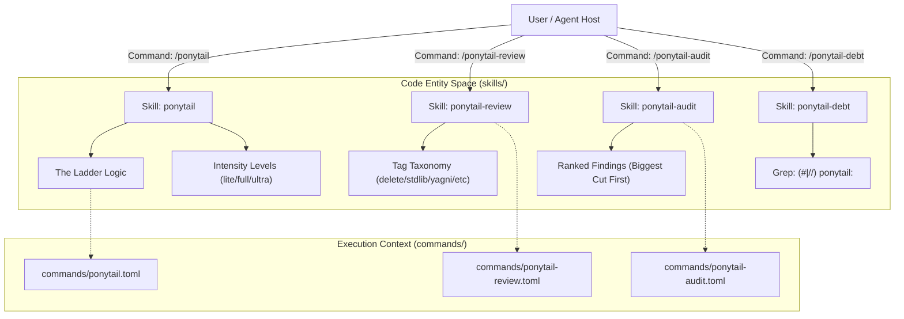
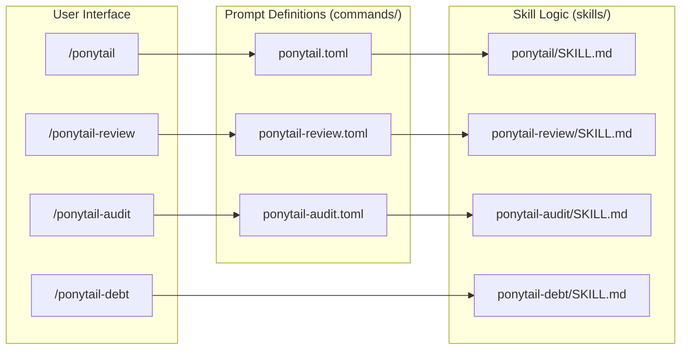

# 스킬 및 명령

관련 소스 파일

다음 파일들은 이 위키 페이지를 생성하는 데 문맥 자료로 사용되었습니다:

- [.opencode/command/ponytail-audit.md](.opencode/command/ponytail-audit.md)
- [.opencode/command/ponytail-debt.md](.opencode/command/ponytail-debt.md)
- [.opencode/command/ponytail-help.md](.opencode/command/ponytail-help.md)
- [commands/ponytail-audit.toml](commands/ponytail-audit.toml)
- [commands/ponytail-help.toml](commands/ponytail-help.toml)
- [commands/ponytail-review.toml](commands/ponytail-review.toml)
- [commands/ponytail.toml](commands/ponytail.toml)
- [skills/ponytail-audit/SKILL.md](skills/ponytail-audit/SKILL.md)
- [skills/ponytail-debt/SKILL.md](skills/ponytail-debt/SKILL.md)
- [skills/ponytail-review/SKILL.md](skills/ponytail-review/SKILL.md)
- [skills/ponytail/SKILL.md](skills/ponytail/SKILL.md)
- [tests/commands.test.js](tests/commands.test.js)

Ponytail 규칙셋은 에이전트의 동작과 제약을 정의하는 여섯 개의 서로 다른 "스킬"로 구성됩니다. 이 스킬들은 자연어 트리거와 구조화된 슬래시 명령을 통해 사용자와 에이전트에게 노출됩니다. 이 아키텍처는 다양한 AI 호스트 환경 전반에서 "Lazy Senior Dev" 페르소나가 지속적이고, 측정 가능하며, 쉽게 전환 가능하도록 보장합니다.

### 핵심 아키텍처 개요

Ponytail은 **사다리(The Ladder)**로 알려진 구체적인 의사결정 계층을 강제함으로써, 고수준의 엔지니어링 철학과 구체적인 코드 구현 사이의 간극을 메웁니다.

| 스킬 | 주요 기능 | 명령 / 트리거 |
|:---|:---|:---|
| **`ponytail`** | 핵심 "Lazy Mode" 동작을 강제합니다. | `/ponytail [lite\|full\|ultra]` |
| **`ponytail-review`** | 과도 설계에 특화된 코드 리뷰입니다. | `/ponytail-review` |
| **`ponytail-audit`** | 전체 저장소의 과도 설계 스캔입니다. | `/ponytail-audit` |
| **`ponytail-debt`** | `ponytail:` 주석을 원장으로 수집합니다. | `/ponytail-debt` |
| **`ponytail-gain`** | 측정된 영향의 벤치마크 점수판입니다. | `/ponytail-gain` |
| **`ponytail-help`** | 한 번에 보는 참고 자료와 설정 가이드입니다. | `/ponytail-help` |

#### 자연어에서 코드 엔터티로의 매핑

다음 다이어그램은 사용자 의도와 명령이 코드베이스에 정의된 핵심 로직 엔터티로 어떻게 흘러가는지 보여줍니다.

**의도 흐름 및 스킬 매핑**

출처: [skills/ponytail/SKILL.md:2-12](), [skills/ponytail-review/SKILL.md:2-10](), [skills/ponytail-audit/SKILL.md:3-9](), [skills/ponytail-debt/SKILL.md:3-8](), [commands/ponytail.toml:1-3](), [commands/ponytail-review.toml:1-3]()

---

## 2.1 ponytail 스킬 (Lazy Senior Dev 모드)

핵심 `ponytail` 스킬은 에이전트를 기능 누적보다 효율성과 코드 삭제를 우선하는 "Lazy Senior Developer"로 바꿉니다 [skills/ponytail/SKILL.md:18-20](). 이 스킬은 복잡성을 최소화하기 위한 여섯 단계 반사 규칙인 **사다리(The Ladder)**로 운영됩니다:

1.  **YAGNI**: 이것이 정말 필요해서 존재해야 하는가? [skills/ponytail/SKILL.md:33]()
2.  **Stdlib**: 표준 라이브러리가 이 일을 하는가? [skills/ponytail/SKILL.md:34]()
3.  **Native**: 네이티브 플랫폼 기능이 있는가? [skills/ponytail/SKILL.md:35]()
4.  **Existing Deps**: 이미 설치된 것을 사용합니다. [skills/ponytail/SKILL.md:36]()
5.  **One Line**: 한 줄로 만들 수 있는가? [skills/ponytail/SKILL.md:37]()
6.  **Minimum Code**: 다른 방법이 없을 때만, 가능한 가장 작은 로직을 작성합니다. [skills/ponytail/SKILL.md:38]()

이 스킬은 세 가지 강도 수준인 `lite`, `full`(기본값), `ultra`를 지원하며, 이 수준에 따라 에이전트가 사용자 요구사항을 얼마나 공격적으로 도전하는지가 결정됩니다 [skills/ponytail/SKILL.md:66-70]().

사다리와 강도 수준에 대한 자세한 내용은 [ponytail 스킬 (Lazy Senior Dev 모드)](#2.1)을 참조하세요.

**출처:** [skills/ponytail/SKILL.md:29-42](), [skills/ponytail/SKILL.md:64-76]()

---

## 2.2 ponytail-review 스킬

`ponytail-review` 스킬은 과도 설계를 식별하고 제거하는 데만 초점을 맞춘 특수 코드 리뷰 모드를 제공합니다 [skills/ponytail-review/SKILL.md:3-11](). 일반적인 리뷰와 달리, 이 모드는 정확성 버그나 보안 구멍을 찾지 않습니다. 복잡성을 사냥합니다 [skills/ponytail-review/SKILL.md:51-53]().

발견 사항은 `delete:`, `stdlib:`, `native:`, `yagni:`, `shrink:`를 포함하는 특정 태그 분류 체계를 사용해 엄격한 한 줄 형식으로 제시됩니다 [skills/ponytail-review/SKILL.md:21-27](). 리뷰는 `net: -<N> lines possible` 메트릭으로 끝납니다 [skills/ponytail-review/SKILL.md:46]().

태그 분류와 점수 체계에 대한 자세한 내용은 [ponytail-review 스킬](#2.2)을 참조하세요.

**출처:** [skills/ponytail-review/SKILL.md:16-28](), [skills/ponytail-review/SKILL.md:44-46](), [commands/ponytail-review.toml:2]()

---

## 2.3 ponytail-help 스킬 및 빠른 참조

`ponytail-help` 스킬은 지속되지 않는 일회성 유틸리티로, 사용 가능한 모든 모드와 명령에 대한 참고 카드를 표시합니다 [commands/ponytail-help.toml:2](). 이 스킬은 다음 방법을 설명합니다:
*   `/ponytail [level]`을 사용해 수준을 전환합니다.
*   `/ponytail-audit` 또는 `/ponytail-debt` 같은 특정 유틸리티 스킬을 호출합니다.
*   `"stop ponytail"` 또는 `"normal mode"`를 사용해 모드를 비활성화합니다.
*   `PONYTAIL_DEFAULT_MODE` 또는 `config.json`을 통해 기본 세션 모드를 설정합니다 [commands/ponytail-help.toml:2]().

설정과 참고 표에 대한 자세한 내용은 [ponytail-help 스킬 및 빠른 참조](#2.3)를 참조하세요.

**출처:** [commands/ponytail-help.toml:1-2](), [.opencode/command/ponytail-help.md:5]()

---

## 2.4 ponytail-audit, ponytail-debt 및 ponytail-gain 스킬

이 세 가지 유틸리티 스킬은 저장소 전체 분석과 추적 기능을 제공합니다:

*   **`ponytail-audit`**: 차이(diff)만 보지 않고 전체 트리를 훑어 과도 설계를 찾으며, 잠재적 절감 폭이 큰 순서대로 발견 사항을 정렬합니다 [skills/ponytail-audit/SKILL.md:12-13]().
*   **`ponytail-debt`**: 의도적으로 남긴 지름길을 표시하는 `ponytail:` 주석을 추적 원장에 수집하고, 업그레이드 경로가 명시되지 않은 "부패 위험(rot risk)"을 식별합니다 [skills/ponytail-debt/SKILL.md:11-14]().
*   **`ponytail-gain`**: 벤치마크 스위트에서 측정된 영향의 점수판을 보여줍니다(LOC, 비용, 속도).

이 유틸리티 스킬들에 대한 자세한 내용은 [ponytail-audit, ponytail-debt 및 ponytail-gain 스킬](#2.4)을 참조하세요.

**출처:** [skills/ponytail-audit/SKILL.md:3-9](), [skills/ponytail-debt/SKILL.md:25-38](), [.opencode/command/ponytail-debt.md:5]()

---

## 2.5 명령 배포 (TOML 및 OpenCode MD)

이식성을 보장하기 위해, 모든 스킬은 서로 다른 에이전트 호스트용 파일 기반 명령으로 노출됩니다. 여기에는 Claude Code와 Gemini CLI용 `commands/*.toml` 파일, 그리고 OpenCode용 `.opencode/command/*.md` 파일이 포함됩니다 [tests/commands.test.js:2-6](). 특수 테스트 스위트인 `commands.test.js`는 핵심 확장에 등록된 모든 명령에 대응하는 어댑터 파일이 있는지 확인해 "command drift"를 방지합니다 [tests/commands.test.js:23-39]().

배포 시스템에 대한 자세한 내용은 [명령 배포 (TOML 및 OpenCode MD)](#2.5)를 참조하세요.

**출처:** [tests/commands.test.js:15-18](), [commands/ponytail.toml:1-3](), [.opencode/command/ponytail-audit.md:1-6]()

---

### 명령 인터페이스 매핑

다음 다이어그램은 사용자에게 보이는 슬래시 명령이 내부 프롬프트 정의와 그것이 유발하는 로직에 어떻게 매핑되는지 보여줍니다.

**명령에서 구현으로의 매핑**

출처: [commands/ponytail.toml:1-3](), [commands/ponytail-review.toml:1-3](), [commands/ponytail-audit.toml:1-3](), [skills/ponytail/SKILL.md:1-14](), [skills/ponytail-review/SKILL.md:1-11](), [skills/ponytail-debt/SKILL.md:1-9]()
