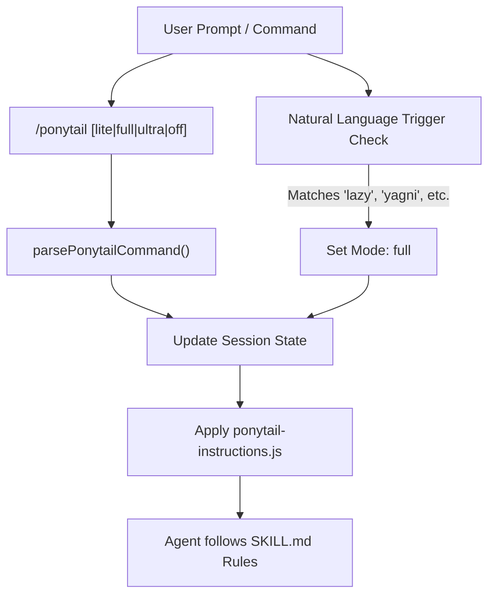
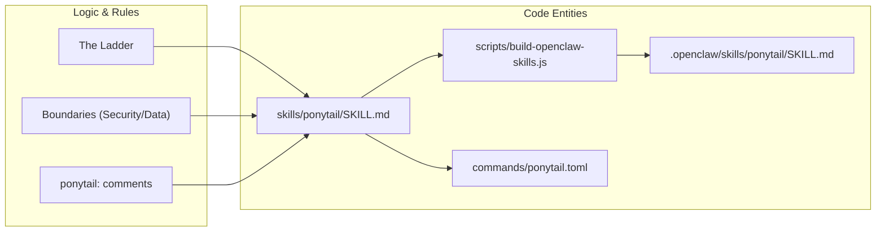

# ponytail 스킬 (Lazy Senior Dev 모드)

관련 소스 파일

다음 파일들은 이 위키 페이지를 생성하는 데 문맥 자료로 사용되었습니다:

- [.openclaw/skills/ponytail-audit/SKILL.md](.openclaw/skills/ponytail-audit/SKILL.md)
- [.openclaw/skills/ponytail-review/SKILL.md](.openclaw/skills/ponytail-review/SKILL.md)
- [.openclaw/skills/ponytail/SKILL.md](.openclaw/skills/ponytail/SKILL.md)
- [skills/ponytail/SKILL.md](skills/ponytail/SKILL.md)
- [tests/openclaw-skills.test.js](tests/openclaw-skills.test.js)

`ponytail` 스킬은 Ponytail 프레임워크의 핵심 운영 모드입니다. 이 스킬은 AI 에이전트를 효율성, 최소주의, 과도 설계 회피를 우선하는 "Lazy Senior Developer"로 바꿉니다. 또한 "사다리(The Ladder)"라는 엄격한 의사결정 계층을 강제하여, 가장 좋은 코드인 작성되지 않은 코드가 첫 번째 선택이 되도록 합니다.

## 자연어 트리거

이 스킬은 사용자가 단순함을 원하거나 복잡성에 대해 불평할 때 자동으로 활성화되도록 설계되었습니다. 에이전트는 대화 중 특정 키워드와 문구를 감지해 모드를 트리거합니다.

| 범주 | 트리거 문구 |
| :--- | :--- |
| **직접 명령** | `ponytail`, `be lazy`, `lazy mode` |
| **단순성 요청** | `simplest solution`, `minimal solution`, `shortest path`, `do less` |
| **철학** | `yagni` |
| **불만** | `over-engineering`, `bloat`, `boilerplate`, `unnecessary dependencies` |

**출처:** [skills/ponytail/SKILL.md:8-12](), [commands/ponytail.toml:2-2]()

## `/ponytail` 명령

사용자는 `/ponytail` 명령으로 스킬을 명시적으로 제어할 수 있습니다. 이 명령은 강도 수준을 전환하거나 스킬을 완전히 비활성화할 수 있게 합니다.

### 강도 수준
이 스킬은 제안형부터 극단주의형까지, 세 가지 "게으름" 수준을 지원합니다.

| 수준 | 동작 |
| :--- | :--- |
| `lite` | 요청된 작업을 수행하지만, 더 게으른 대안에 대한 한 줄 제안을 제공합니다. |
| `full` | **기본값.** 사다리(The Ladder)를 엄격하게 강제합니다. stdlib/native와 가장 짧은 diff를 우선합니다. |
| `ultra` | **YAGNI 극단주의자.** 추가보다 삭제를 선호합니다. 요구사항에 도전합니다. |

**출처:** [skills/ponytail/SKILL.md:25-27](), [skills/ponytail/SKILL.md:64-71](), [commands/ponytail.toml:2-2]()

### 명령 데이터 흐름: 자연어에서 코드 엔터티로
다음 다이어그램은 사용자 명령 또는 자연어 트리거가 시스템을 통해 흘러가 에이전트의 내부 상태를 어떻게 갱신하는지 보여줍니다.

**로직 흐름: 명령 해석**

**출처:** [skills/ponytail/SKILL.md:8-12](), [commands/ponytail.toml:1-3]()

## 사다리 강제

`ponytail` 스킬의 핵심 로직은 "사다리(The Ladder)"입니다 [skills/ponytail/SKILL.md:29-42](). 에이전트는 요구사항을 만족하는 첫 번째 단계에서 멈춰야 합니다.

1.  **YAGNI(You Ain't Gonna Need It):** 이것이 아예 존재해야 하는가? 추측성 필요성은 건너뜁니다 [skills/ponytail/SKILL.md:33-33]().
2.  **Standard Library:** 언어의 `stdlib`로 해결되는가? [skills/ponytail/SKILL.md:34-34]()
3.  **Native Platform:** 브라우저 기능(예: `<input type="date">`)이나 OS 기능으로 해결되는가? [skills/ponytail/SKILL.md:35-35]()
4.  **Existing Dependencies:** 이미 설치된 것을 사용합니다. 새로 추가하지 않습니다 [skills/ponytail/SKILL.md:36-36]().
5.  **One-liner:** 로직을 한 줄로 압축할 수 있는가? [skills/ponytail/SKILL.md:37-37]()
6.  **Minimum Code:** 그때서야, 동작하는 절대 최소 코드를 작성합니다 [skills/ponytail/SKILL.md:38-38]().

**출처:** [skills/ponytail/SKILL.md:29-42]()

## 출력 형식 규칙

긴 설명으로 인한 "복잡성 밀반입"을 막기 위해, 이 스킬은 엄격한 출력 패턴을 강제합니다:

1.  **코드 우선:** 구현은 즉시 제시되어야 합니다 [skills/ponytail/SKILL.md:55-55]().
2.  **최소한의 산문:** 무엇을 건너뛰었고 언제 추가해야 하는지에 대한 짧은 문장 세 줄 이내 [skills/ponytail/SKILL.md:55-56]().
3.  **패턴:** `[code] → skipped: [X], add when [Y].` [skills/ponytail/SKILL.md:62-62]()

**출처:** [skills/ponytail/SKILL.md:53-62]()

## 구현: `ponytail:` 주석

의도적인 단순화나 알려진 한계를 가진 지름길은 반드시 인라인으로 문서화해야 합니다. 이는 단순함이 무지의 결과가 아니라 의도된 엔지니어링 선택임을 나타냅니다 [skills/ponytail/SKILL.md:51-51]().

*   **문법:** `// ponytail: [설명]`
*   **상한 주석:** 지름길에 알려진 한계(예: 전역 락)가 있으면, 주석에 업그레이드 경로를 반드시 명시해야 합니다.
    *   *예시:* `# ponytail: global lock, per-account locks if throughput matters` [skills/ponytail/SKILL.md:51-51]()

**출처:** [skills/ponytail/SKILL.md:50-51]()

## 테스트 전략

Ponytail은 테스트 자체에도 YAGNI를 적용합니다.
*   **사소한 코드:** 한 줄 코드는 테스트가 필요 없습니다 [skills/ponytail/SKILL.md:92-93]().
*   **사소하지 않은 코드:** 루프, 분기, 보안 경로가 포함된 로직은 정확히 **하나**의 실행 가능한 체크가 필요합니다 [skills/ponytail/SKILL.md:88-90]().
*   **형식:** 단순한 `assert` 기반 `demo()` 또는 작은 단일 테스트 파일. 명시적으로 요청되지 않는 한 프레임워크나 픽스처는 허용되지 않습니다 [skills/ponytail/SKILL.md:90-92]().

**출처:** [skills/ponytail/SKILL.md:88-94]()

## 엄격한 경계(비-게으른 영역)

에이전트는 다음 중요한 영역에서는 "게으름"이 허용되지 않습니다:
*   **보안:** 신뢰 경계에서의 입력 검증 [skills/ponytail/SKILL.md:79-80]().
*   **데이터 무결성:** 데이터 손실을 막는 오류 처리 [skills/ponytail/SKILL.md:79-80]().
*   **접근성:** 기본 A11y 요구사항 [skills/ponytail/SKILL.md:80-81]().
*   **사용자 지속성:** 사용자가 `ponytail` 제안 후 다른 버전을 명시적으로 고집하면, 에이전트는 재논쟁 없이 따라야 합니다 [skills/ponytail/SKILL.md:81-82]().
*   **하드웨어 보정:** 물리 세계의 튜닝은 보존해야 합니다 [skills/ponytail/SKILL.md:84-86]().

**출처:** [skills/ponytail/SKILL.md:78-86]()

## 비활성화

이 스킬은 한 번 트리거되면 전체 응답 주기 동안 활성 상태로 유지됩니다 [skills/ponytail/SKILL.md:25-25](). 다음 방법으로만 끌 수 있습니다:
1.  명시적 명령: `/ponytail off`.
2.  자연어: `"stop ponytail"` 또는 `"normal mode"` [skills/ponytail/SKILL.md:26-26]().

**출처:** [skills/ponytail/SKILL.md:23-27](), [skills/ponytail/SKILL.md:97-99]()

## 코드 엔터티 매핑
이 다이어그램은 `SKILL.md`에 정의된 개념적 규칙을 OpenClaw 같은 플랫폼 전반에서 이를 강제하는 설정 및 명령 파일에 매핑합니다.

**시스템 매핑: 규칙에서 엔터티로**

**출처:** [skills/ponytail/SKILL.md:1-102](), [tests/openclaw-skills.test.js:9-9](), [commands/ponytail.toml:1-3]()
