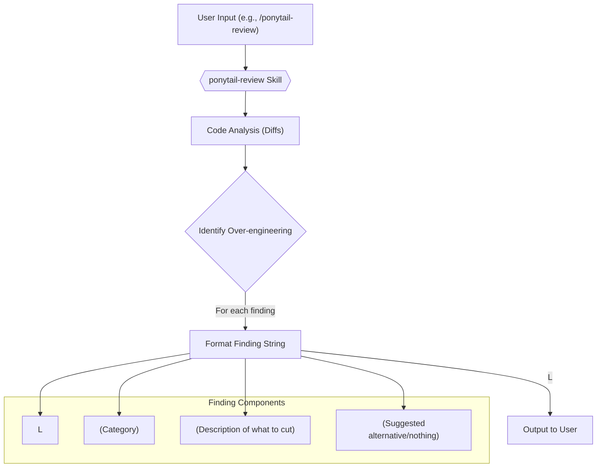
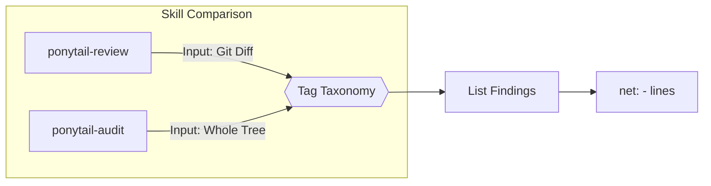

# ponytail-review 스킬

관련 소스 파일

다음 파일들은 이 위키 페이지를 생성하는 데 문맥 자료로 사용되었습니다:

- [.openclaw/skills/ponytail-audit/SKILL.md](.openclaw/skills/ponytail-audit/SKILL.md)
- [.openclaw/skills/ponytail-review/SKILL.md](.openclaw/skills/ponytail-review/SKILL.md)
- [.openclaw/skills/ponytail/SKILL.md](.openclaw/skills/ponytail/SKILL.md)
- [skills/ponytail-review/SKILL.md](skills/ponytail-review/SKILL.md)
- [tests/openclaw-skills.test.js](tests/openclaw-skills.test.js)

`ponytail-review` 스킬은 과도 설계를 식별하고 제거하는 데만 초점을 맞춘 특수 코드 리뷰를 수행하도록 설계되었습니다. 주요 목적은 불필요한 복잡성, 의존성, 추상화를 제거해 코드를 단순화할 기회를 찾는 것입니다. 이 스킬은 정확성 버그나 보안 취약점을 찾는 대신, 무엇을 삭제할 수 있는지에만 집중함으로써 전통적인 코드 리뷰를 보완합니다.

## 트리거 문구 및 명령

사용자는 자연어 문구나 전용 명령으로 `ponytail-review` 스킬을 호출할 수 있습니다.

**자연어 트리거:**
*   "review for over-engineering"
*   "what can we delete"
*   "is this over-engineered"
*   "simplify review" [skills/ponytail-review/SKILL.md:7-9]()

**명령:**
*   `/ponytail-review`

이 명령과 연결된 프롬프트는 에이전트에게 정확성이 아니라 과도 설계에 초점을 맞추고, 지정된 한 줄 발견 형식을 따르도록 명시적으로 지시합니다.

출처:
*   [skills/ponytail-review/SKILL.md:4-9]()
*   [.openclaw/skills/ponytail-review/SKILL.md:2-3]()

## 발견 형식

`ponytail-review` 스킬이 생성하는 각 발견 항목은 간결함과 명확성을 보장하기 위해 엄격한 한 줄 형식을 따릅니다.

`L<line>: <tag> <what>. <replacement>.` [skills/ponytail-review/SKILL.md:18]()

여러 파일 diff의 경우, 형식에는 파일명이 포함됩니다:

`<file>:L<line>: ...` [skills/ponytail-review/SKILL.md:18-19]()

이 형식은 식별된 각 과도 설계 사례의 위치를 정확히 나타내고, 분류하며, 제안된 해결책을 함께 제공합니다.

출처:
*   [skills/ponytail-review/SKILL.md:16-19]()

### 발견 형식 다이어그램

출처:
*   [skills/ponytail-review/SKILL.md:17-19]()

## 태그 분류 체계

`ponytail-review` 스킬은 과도 설계 발견 사항을 분류하기 위해 특정 태그 집합을 사용합니다. 각 태그는 서로 다른 유형의 불필요한 복잡성을 나타내며, 제안된 대체안을 안내합니다.

| 태그 | 설명 | 대체안 |
| :--- | :--- | :--- |
| `delete:` | 죽은 코드, 사용되지 않는 유연성, 또는 추측성 기능. | `nothing` |
| `stdlib:` | 표준 라이브러리에 이미 있는 수작업 로직. | 함수 이름을 적습니다. |
| `native:` | 플랫폼이 이미 하는 일을 의존성이나 커스텀 코드가 수행하는 경우. | 기능 이름을 적습니다. |
| `yagni:` | 구현이 하나뿐인 추상화, 또는 호출자가 하나뿐인 계층. | 인라인으로 합칩니다. |
| `shrink:` | 같은 로직이지만 훨씬 적은 줄로 구현 가능한 경우. | 더 짧은 형태. |

### `delete:`
이 태그는 현재 사용처가 없는 죽은 코드, 사용되지 않는 유연성, 또는 추측성 기능에 사용됩니다. 대체안은 명시적으로 "nothing"입니다 [skills/ponytail-review/SKILL.md:23]().
*   **예시:** `L52-71: delete: retry wrapper around an idempotent local call. Nothing replaces it.` [skills/ponytail-review/SKILL.md:40]()

### `stdlib:`
코드가 이미 표준 라이브러리가 제공하는 기능을 다시 구현하고 있음을 나타냅니다. 대체안에는 표준 라이브러리 함수를 이름으로 적어야 합니다 [skills/ponytail-review/SKILL.md:24]().
*   **예시:** `L12-38: stdlib: 27-line validator class. "@" in email, 1 line, real validation is the confirmation mail.` [skills/ponytail-review/SKILL.md:34]()

### `native:`
의존성이나 커스텀 코드가 기본 플랫폼(예: 브라우저의 `<input type="date">`)이 네이티브로 처리할 수 있는 작업을 수행할 때 사용됩니다 [skills/ponytail-review/SKILL.md:25]().
*   **예시:** `L4: native: moment.js imported for one format call. Intl.DateTimeFormat, 0 deps.` [skills/ponytail-review/SKILL.md:36]()

### `yagni:`
"You Ain't Gonna Need It"의 약자입니다. 구현이 하나뿐인 추상화나 아무도 설정하지 않는 설정에 적용됩니다 [skills/ponytail-review/SKILL.md:26]().
*   **예시:** `repo.py:L88: yagni: AbstractRepository with one implementation. Inline it until a second one exists.` [skills/ponytail-review/SKILL.md:38]()

### `shrink:`
같은 로직을 더 적은 코드 줄 수로 달성할 수 있는 기회를 식별합니다 [skills/ponytail-review/SKILL.md:27]().
*   **예시:** `L30-44: shrink: manual loop builds dict. dict(zip(keys, values)), 1 line.` [skills/ponytail-review/SKILL.md:42]()

출처:
*   [skills/ponytail-review/SKILL.md:21-27]()
*   [skills/ponytail-review/SKILL.md:34-43]()

## Net Lines 지표를 통한 점수화

`ponytail-review` 스킬의 궁극적인 지표는 코드 줄 수의 순감소입니다. 모든 발견 사항을 나열한 뒤, 이 스킬은 잠재적 절감 줄 수 요약으로 끝납니다:

`net: -<N> lines possible.` [skills/ponytail-review/SKILL.md:46]()

과도 설계가 발견되지 않으면, 이 스킬은 다음을 출력합니다:

`Lean already. Ship.` [skills/ponytail-review/SKILL.md:48]()

출처:
*   [skills/ponytail-review/SKILL.md:45-49]()

## 전체 저장소 감사(`ponytail-audit`)

`ponytail-review`가 diff에 초점을 맞추는 반면, `ponytail-audit` 스킬은 같은 로직과 태그 분류 체계를 저장소 전체에 적용합니다. 발견 사항을 순위화된 목록으로 생성하며, 가장 큰 잠재 절감부터 먼저 배치합니다 [ .openclaw/skills/ponytail-audit/SKILL.md:8-9]().

출처:
*   [.openclaw/skills/ponytail-audit/SKILL.md:8-11]()
*   [.openclaw/skills/ponytail-review/SKILL.md:8-12]()

## 경계

`ponytail-review` 스킬은 과도 설계에 집중하도록 엄격한 경계를 가집니다.

*   **범위:** 이 스킬은 복잡성만을 대상으로 합니다. 정확성 버그, 보안 구멍, 성능은 명시적으로 범위 밖입니다 [skills/ponytail-review/SKILL.md:52-53]().
*   **최소 코드:** 단일 스모크 테스트나 `assert` 기반 자체 검사는 "ponytail minimum"으로 간주되며 절대 삭제 대상으로 표시되지 않습니다 [skills/ponytail-review/SKILL.md:54-55]().
*   **동작:** 이 스킬은 발견 사항만 나열하며, 수정은 적용하지 않습니다 [skills/ponytail-review/SKILL.md:56]().
*   **비활성화:** "stop ponytail-review" 또는 "normal mode" 같은 문구로 비활성화할 수 있으며, 이 경우 장황한 리뷰 스타일로 돌아갑니다 [skills/ponytail-review/SKILL.md:57]().

출처:
*   [skills/ponytail-review/SKILL.md:50-58]()
