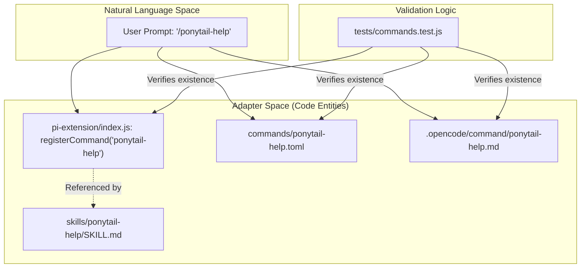
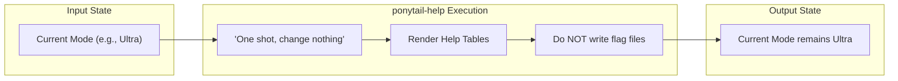

# ponytail-help 스킬 및 빠른 참조

관련 소스 파일

다음 파일들은 이 위키 페이지를 생성하는 데 문맥 자료로 사용되었습니다:

- [.opencode/command/ponytail-help.md](.opencode/command/ponytail-help.md)
- [README.md](README.md)
- [commands/ponytail-help.toml](commands/ponytail-help.toml)
- [docs/agent-portability.md](docs/agent-portability.md)
- [skills/ponytail-help/SKILL.md](skills/ponytail-help/SKILL.md)
- [tests/commands.test.js](tests/commands.test.js)

`ponytail-help` 스킬은 사용자와 에이전트를 위한 일회성 참고 카드를 제공합니다. 기본 `ponytail` 또는 `ponytail-review` 스킬과 달리, 이 스킬은 지속되지 않습니다. 현재 세션 상태를 바꾸거나 파일 시스템에 쓰지 않으면서, 사용 가능한 수준, 스킬, 명령의 요약을 표시합니다 [skills/ponytail-help/SKILL.md:9-13]().

## 트리거 문구 및 호출

이 스킬은 명시적인 슬래시 명령과 자연어 문의 모두로 트리거되도록 설계되었습니다. 참조 정보가 항상 उपलब्ध하도록 하기 위해 모든 주요 어댑터에 등록됩니다 [tests/commands.test.js:15-17]().

| 인터페이스 | 트리거 문구 |
| :--- | :--- |
| **슬래시 명령** | `/ponytail-help`, `@ponytail-help` (Codex) |
| **자연어** | "ponytail help", "what ponytail commands", "how do I use ponytail" |

**출처:** [skills/ponytail-help/SKILL.md:1-7](), [skills/ponytail-help/SKILL.md:33-35](), [tests/commands.test.js:2-6]()

## 참고 내용

트리거되면, 이 스킬은 사용자가 방향을 잡을 수 있도록 세 개의 주요 표를 출력합니다.

### 1. 수준 참조
이 표는 게으른 개발 모드의 강도 수준을 설명합니다. 이 수준들은 변경될 때까지 지속되고 "붙어" 있습니다 [skills/ponytail-help/SKILL.md:22-22]().

| 수준 | 트리거 | 동작 |
| :--- | :--- | :--- |
| **Lite** | `/ponytail lite` | 요청된 항목을 만듭니다. 더 게으른 대안을 한 줄로 언급합니다. |
| **Full** | `/ponytail` | **기본값.** "사다리(The Ladder)"를 강제합니다: YAGNI → stdlib → native → one line → minimum. |
| **Ultra** | `/ponytail ultra` | YAGNI 극단주의자입니다. 삭제를 우선하며, 만들기 전에 요구사항에 도전합니다. |

**출처:** [skills/ponytail-help/SKILL.md:16-20](), [commands/ponytail-help.toml:2-2]()

### 2. 스킬 참조
이 표는 Ponytail 시스템의 기능적 구성 요소를 문서화합니다. `ponytail-audit`, `ponytail-debt`, `ponytail-gain`은 특수 유틸리티 스킬입니다 [docs/agent-portability.md:36-40]().

| 스킬 | 트리거 | 설명 |
| :--- | :--- | :--- |
| **ponytail** | `/ponytail` | 활성 lazy 모드; 가장 단순하게 동작하는 해결책에 집중합니다. |
| **ponytail-review** | `/ponytail-review` | 수동적 리뷰 모드; 기존 코드의 과도 설계를 식별합니다. |
| **ponytail-audit** | `/ponytail-audit` | 저장소 전체 과도 설계 스캔입니다. |
| **ponytail-debt** | `/ponytail-debt` | `ponytail:` 주석을 추적 원장으로 수집합니다. |
| **ponytail-gain** | `/ponytail-gain` | 측정된 영향의 점수판(LOC, 비용, 속도)입니다. |
| **ponytail-help** | `/ponytail-help` | 이 참고 카드를 표시합니다(일회성). |

**출처:** [skills/ponytail-help/SKILL.md:26-31](), [commands/ponytail-help.toml:2-2](), [docs/agent-portability.md:34-40]()

### 3. 비활성화
이 스킬은 `"stop ponytail"`, `"normal mode"`, 또는 명령 `/ponytail off`를 사용해 Ponytail을 비활성화할 수 있다고 사용자에게 알립니다 [skills/ponytail-help/SKILL.md:37-40]().

## 설정 및 기본 모드

`ponytail-help` 스킬은 사용자가 세션 간에 시스템 동작을 어떻게 수정할 수 있는지 문서화합니다.

### 설정 해석 계층
시스템은 특정 우선순위 순서를 사용해 새 세션 시작 시 활성화되는 `defaultMode`를 결정합니다 [skills/ponytail-help/SKILL.md:59-59]().

1.  **환경 변수**: `PONYTAIL_DEFAULT_MODE` [skills/ponytail-help/SKILL.md:46-49]().
2.  **설정 파일**: `{"defaultMode": "..."}`를 포함하는 JSON 파일 [skills/ponytail-help/SKILL.md:51-53]().
3.  **하드코딩된 기본값**: `full` [skills/ponytail-help/SKILL.md:44-44]().

### 설정 위치
설정 파일 위치는 플랫폼에 따라 다릅니다:

| 플랫폼 | 경로 |
| :--- | :--- |
| **macOS / Linux** | `~/.config/ponytail/config.json` |
| **Windows** | `%APPDATA%\ponytail\config.json` |

**출처:** [skills/ponytail-help/SKILL.md:51-53](), [commands/ponytail-help.toml:2-2]()

## 구현 세부 정보

`ponytail-help` 스킬은 복잡한 로직 없이도 일관된 동작을 보장하기 위해, 서로 다른 호스트 형식 전반에 걸친 정적 지침 파일 집합으로 구현됩니다.

### 명령 배포 및 일관성
"rule drift"를 막기 위해, 이 저장소에는 `pi-extension`에 등록된 모든 명령이 `.toml`(Claude/Gemini) 및 `.md`(OpenCode) 명령 파일로도 존재하는지 확인하는 테스트 스위트가 포함되어 있습니다 [tests/commands.test.js:2-6]().

Title: Command Distribution Architecture

**출처:** [tests/commands.test.js:15-39](), [commands/ponytail-help.toml:1-3](), [.opencode/command/ponytail-help.md:1-5]()

### 일회성 제약 로직
구현은 LLM이 "one-shot" 동작을 유지하도록 명시적으로 지시하여, 사용자가 정보만 요청했을 때 에이전트가 실수로 모드를 바꾸는 일을 방지합니다.

Title: One-Shot Execution Flow

**출처:** [skills/ponytail-help/SKILL.md:11-12](), [commands/ponytail-help.toml:2-2](), [.opencode/command/ponytail-help.md:5-5]()

## 업데이트 메커니즘
도움말 카드는 Claude Code의 업데이트 절차도 문서화하며, 사용자가 `/plugin` 마켓플레이스 설정에서 `auto-update`를 활성화하거나 `/plugin marketplace update ponytail` 다음 `/reload-plugins`로 수동 업데이트를 트리거하도록 안내합니다 [skills/ponytail-help/SKILL.md:61-65]().

**출처:** [skills/ponytail-help/SKILL.md:61-66]()
