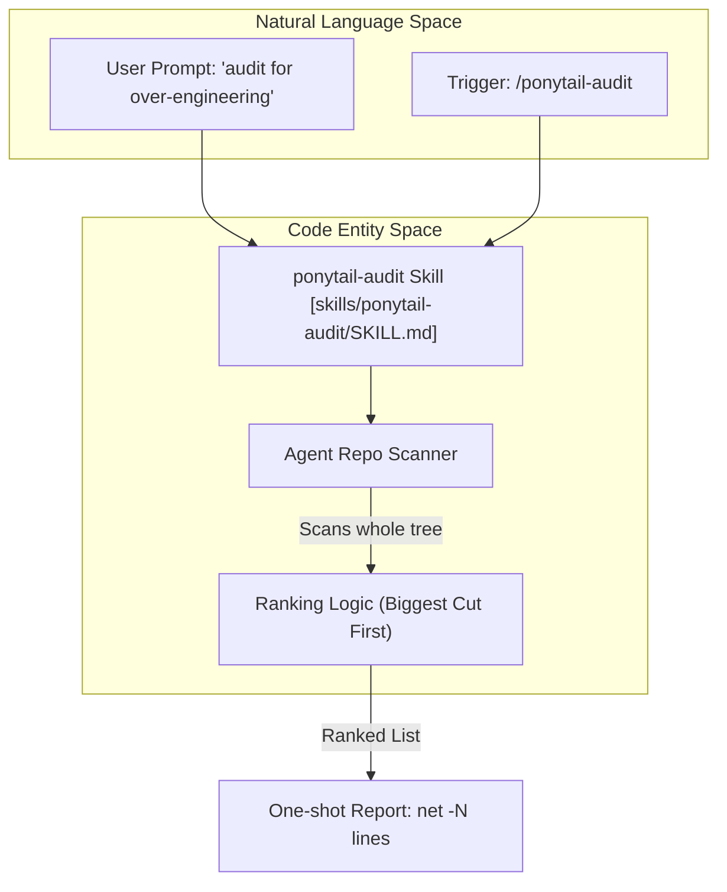
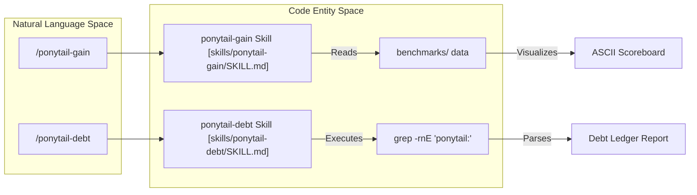

# ponytail-audit, ponytail-debt 및 ponytail-gain 스킬

관련 소스 파일

다음 파일들은 이 위키 페이지를 생성하는 데 문맥 자료로 사용되었습니다:

- [.openclaw/skills/ponytail-debt/SKILL.md](.openclaw/skills/ponytail-debt/SKILL.md)
- [.openclaw/skills/ponytail-gain/SKILL.md](.openclaw/skills/ponytail-gain/SKILL.md)
- [.openclaw/skills/ponytail-help/SKILL.md](.openclaw/skills/ponytail-help/SKILL.md)
- [.opencode/command/ponytail-audit.md](.opencode/command/ponytail-audit.md)
- [.opencode/command/ponytail-debt.md](.opencode/command/ponytail-debt.md)
- [.opencode/command/ponytail-gain.md](.opencode/command/ponytail-gain.md)
- [commands/ponytail-audit.toml](commands/ponytail-audit.toml)
- [commands/ponytail-debt.toml](commands/ponytail-debt.toml)
- [commands/ponytail-gain.toml](commands/ponytail-gain.toml)
- [scripts/build-openclaw-skills.js](scripts/build-openclaw-skills.js)
- [skills/ponytail-audit/SKILL.md](skills/ponytail-audit/SKILL.md)
- [skills/ponytail-debt/SKILL.md](skills/ponytail-debt/SKILL.md)
- [skills/ponytail-gain/SKILL.md](skills/ponytail-gain/SKILL.md)

이 페이지는 Ponytail 생태계의 세 가지 유틸리티 스킬인 `ponytail-audit`, `ponytail-debt`, `ponytail-gain`을 문서화합니다. 활성 개발 중 동작을 수정하는 핵심 `ponytail` 스킬과 달리, 이 유틸리티들은 코드베이스의 복잡성과 Ponytail 철학의 영향을 일회성으로 분석, 추적, 벤치마킹합니다.

## 1. `ponytail-audit`: 저장소 전체 복잡성 스캔

`ponytail-audit` 스킬은 `ponytail-review` 로직을 저장소 전체로 확장한 버전입니다. 특정 diff에만 집중하는 대신, 전체 트리를 스캔하여 기존의 과도 설계, 비대함, 중복 추상화를 식별합니다 [skills/ponytail-audit/SKILL.md:4-9]().

### 구현 로직
에이전트는 단일 구현 인터페이스, 제품이 하나뿐인 팩토리, 단순 위임만 하는 래퍼, 표준 라이브러리 함수를 손으로 다시 만든 버전 같은 특정 "비대함" 패턴을 찾도록 지시받습니다 [skills/ponytail-audit/SKILL.md:25-30](). 발견 사항은 영향도 순으로 정렬되며, 잠재적 코드 절감 폭이 가장 큰 항목이 먼저 나옵니다 [skills/ponytail-audit/SKILL.md:12-13]().

### 태그 분류 및 출력
발견 항목은 `<tag> <잘라낼 내용>. <대체안>. [path]` 형식의 엄격한 한 줄 형식을 따라야 합니다 [skills/ponytail-audit/SKILL.md:31-33]().

| 태그 | 대상 | 대체안 요구사항 |
| :--- | :--- | :--- |
| `delete:` | 죽은 코드 또는 추측성 기능 | 없음(완전히 제거) |
| `stdlib:` | 표준 라이브러리에 있는 로직 | 특정 stdlib 함수 이름 |
| `native:` | 플랫폼 기능으로 대체 가능한 의존성 | 네이티브 기능 이름(예: `<dialog>`) |
| `yagni:` | 불필요한 추상화/계층 | 단순화/인라인 구현 |
| `shrink:` | 장황한 로직 | 더 짧은 동등 형태 |

**출처:** [skills/ponytail-audit/SKILL.md:15-23](), [commands/ponytail-audit.toml:2-2]()

### 기술 데이터 흐름: 감사 프로세스

**출처:** [skills/ponytail-audit/SKILL.md:1-13](), [commands/ponytail-audit.toml:1-3]()

---

## 2. `ponytail-debt`: 지름길 원장

`ponytail-debt` 스킬은 코드베이스의 `ponytail:` 주석을 구조화된 원장으로 수집합니다. 이를 통해 "Lite" 또는 "Full" 모드에서 의도적으로 취한 지름길이 잊히는 것을 막습니다 [skills/ponytail-debt/SKILL.md:4-8]().

### 구현 및 스캔 메커니즘
이 스킬은 표준화된 주석 규칙인 `ponytail: <상한>, <업그레이드 경로>`에 의존합니다. `grep`을 사용해 이러한 마커를 찾되, `node_modules`, `.git`, 빌드 산출물 같은 비소스 디렉터리는 명시적으로 제외합니다 [skills/ponytail-debt/SKILL.md:14-20]().

*   **명령:** `grep -rnE '(#|//) ?ponytail:' .` [skills/ponytail-debt/SKILL.md:17-17]()
*   **부패 탐지:** 명확한 업그레이드 경로 또는 트리거가 없는 주석은 `no-trigger`로 태그되어, "조용한 부패(silent rot)" 위험이 높음을 드러냅니다 [skills/ponytail-debt/SKILL.md:32-34]().

### 출력 형식
원장은 파일별로 다음 형식을 사용해 그룹화됩니다:
`<file>:<line>, <무엇이 단순화되었는지>. ceiling: <limit>. upgrade: <trigger>.` [skills/ponytail-debt/SKILL.md:25-29]().

**출처:** [skills/ponytail-debt/SKILL.md:1-44](), [.opencode/command/ponytail-debt.md:1-6]()

---

## 3. `ponytail-gain`: 영향 점수판

`ponytail-gain` 스킬은 공개된 벤치마크 중앙값을 바탕으로 Ponytail 철학의 측정된 영향을 보여주는 일회성 ASCII 점수판을 제공합니다 [skills/ponytail-gain/SKILL.md:3-8]().

### 정직 경계
이 스킬의 핵심 제약은 "정직 경계(Honesty Boundary)"입니다. 에이전트는 repo별 절감 수치를 절대 만들어내면 안 됩니다. 현재 저장소의 "작성되지 않은"(과도 설계된) 버전은 실제로 작성된 적이 없기 때문에 비교할 기준선이 없습니다. 대신 `benchmarks/` 디렉터리의 중앙값을 표시합니다 [skills/ponytail-gain/SKILL.md:38-45]().

### 점수판 데이터(벤치마크 중앙값)
점수판은 다섯 가지 작업(email, debounce, csv-sum, countdown, rate-limit)과 세 가지 모델(Haiku, Sonnet, Opus) 전반의 성능을 시각화합니다 [skills/ponytail-gain/SKILL.md:16-19]().

| 지표 | 기준선 | Ponytail 성능 |
| :--- | :--- | :--- |
| **코드 줄 수** | 100% | 6–20% (▼ 80–94%) |
| **비용** | 100% | 23–53% (▼ 47–77%) |
| **속도** | 1x | 3–6× 더 빠름 |

**출처:** [skills/ponytail-gain/SKILL.md:21-34](), [commands/ponytail-gain.toml:2-2]()

### 기술 데이터 흐름: Gain 및 Debt 관계

**출처:** [skills/ponytail-gain/SKILL.md:1-51](), [skills/ponytail-debt/SKILL.md:1-44](), [commands/ponytail-gain.toml:1-3]()

---

## 4. 크로스 플랫폼 명령 배포

이 스킬들은 일관된 동작을 보장하기 위해 특정 매니페스트 형식을 사용해 여러 플랫폼에 배포됩니다.

*   **Claude Code / Gemini CLI:** `commands/` 디렉터리의 `.toml` 파일을 사용합니다 [commands/ponytail-audit.toml:1-3]().
*   **OpenCode:** `.opencode/command/`의 frontmatter가 있는 `.md` 파일을 사용합니다 [.opencode/command/ponytail-debt.md:1-6]().
*   **OpenClaw:** `scripts/build-openclaw-skills.js`가 생성하는 `SKILL.md` 파일을 사용하며, 마켓플레이스 호환성을 위해 160자 설명 길이 제한을 강제합니다 [scripts/build-openclaw-skills.js:19-26]().

### 요약 표: 트리거 문구

| 스킬 | 주요 트리거 |
| :--- | :--- |
| **ponytail-audit** | `/ponytail-audit`, "audit this codebase", "find bloat" |
| **ponytail-debt** | `/ponytail-debt`, "what did ponytail defer", "ponytail ledger" |
| **ponytail-gain** | `/ponytail-gain`, "ponytail scoreboard", "what does ponytail save" |

**출처:** [skills/ponytail-audit/SKILL.md:4-9](), [skills/ponytail-debt/SKILL.md:6-8](), [skills/ponytail-gain/SKILL.md:6-8]()
