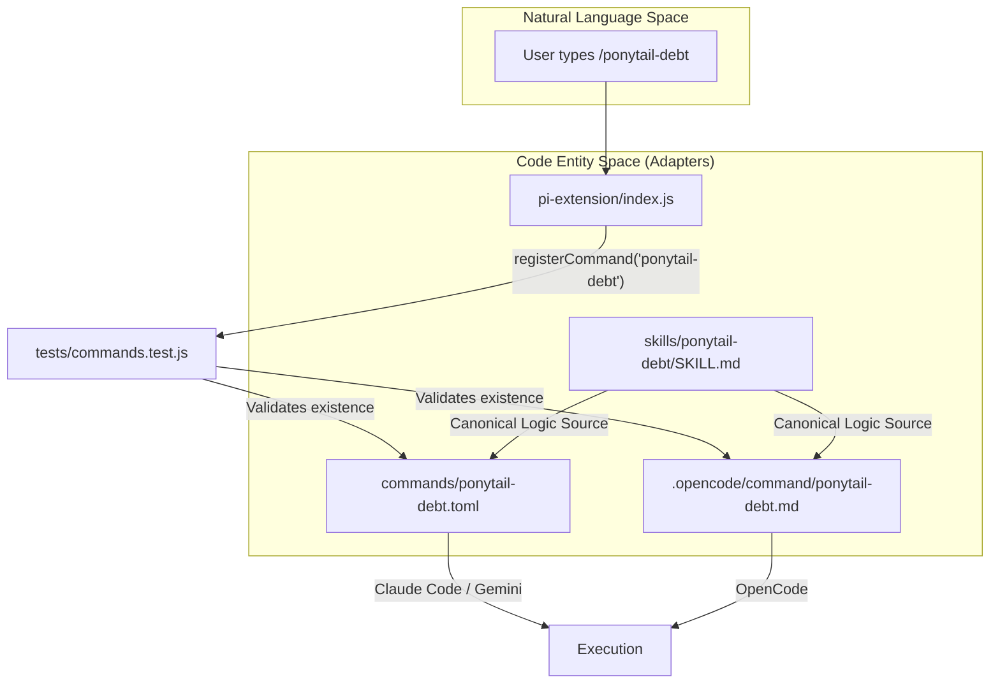
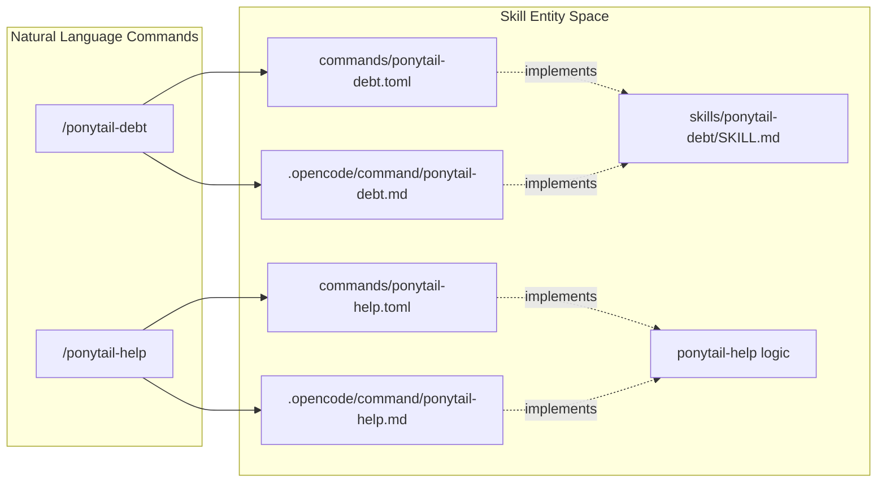

# 명령 배포 (TOML 및 OpenCode MD)

<details>
<summary>관련 소스 파일</summary>

다음 파일들은 이 위키 페이지를 생성하는 데 문맥 자료로 사용되었습니다:

- [.opencode/command/ponytail-debt.md](.opencode/command/ponytail-debt.md)
- [.opencode/command/ponytail-help.md](.opencode/command/ponytail-help.md)
- [.opencode/command/ponytail-review.md](.opencode/command/ponytail-review.md)
- [.opencode/command/ponytail.md](.opencode/command/ponytail.md)
- [commands/ponytail-debt.toml](commands/ponytail-debt.toml)
- [commands/ponytail-gain.toml](commands/ponytail-gain.toml)
- [commands/ponytail-help.toml](commands/ponytail-help.toml)
- [commands/ponytail-review.toml](commands/ponytail-review.toml)
- [commands/ponytail.toml](commands/ponytail.toml)
- [skills/ponytail-debt/SKILL.md](skills/ponytail-debt/SKILL.md)
- [tests/commands.test.js](tests/commands.test.js)

</details>


이 페이지는 파일 기반 명령 인터페이스 전반에서 Ponytail 스킬셋을 배포하는 메커니즘을 설명합니다. 일부 호스트는 프로그래밍 방식 확장을 사용하지만, **Claude Code**, **Gemini CLI**, **OpenCode** 같은 다른 호스트는 슬래시 명령을 등록하기 위해 정적 파일 정의가 필요합니다. Ponytail은 모든 AI 에이전트 환경에서 일관된 경험을 보장하기 위해 이러한 파일들의 동기화된 집합을 유지합니다.

## 배포 형식 개요

Ponytail 스킬은 서로 다른 에이전트 호스트 요구사항을 수용하기 위해 두 가지 주요 파일 형식으로 노출됩니다:

1.  **TOML (`commands/*.toml`)**: **Claude Code**와 **Gemini CLI**가 사용합니다. 이 파일들은 명령 설명과, 명령이 호출될 때 에이전트가 따라야 할 시스템 프롬프트(지시문)를 정의합니다.
2.  **Markdown (`.opencode/command/*.md`)**: **OpenCode**가 사용합니다. 이 파일들은 메타데이터를 위한 YAML frontmatter와, 명령의 핵심 로직을 담은 Markdown 본문을 사용합니다.

### 명령 매핑 표

| 명령 | 목적 | Claude/Gemini 파일 | OpenCode 파일 |
| :--- | :--- | :--- | :--- |
| `/ponytail` | 강도 수준 전환 | `commands/ponytail.toml` | `.opencode/command/ponytail.md` |
| `/ponytail-review` | 과도 설계 리뷰 | `commands/ponytail-review.toml` | `.opencode/command/ponytail-review.md` |
| `/ponytail-help` | 빠른 참조 카드 | `commands/ponytail-help.toml` | `.opencode/command/ponytail-help.md` |
| `/ponytail-debt` | `ponytail:` 주석 수집 | `commands/ponytail-debt.toml` | `.opencode/command/ponytail-debt.md` |
| `/ponytail-audit` | 저장소 전체 감사 | `commands/ponytail-audit.toml` | `.opencode/command/ponytail-audit.md` |
| `/ponytail-gain` | 측정된 영향 점수판 | `commands/ponytail-gain.toml` | `.opencode/command/ponytail-gain.md` |

**출처:**
- [tests/commands.test.js:2-6]()
- [commands/ponytail.toml:1-2]()
- [.opencode/command/ponytail.md:1-5]()

---

## 구현 세부 정보

### Claude Code 및 Gemini CLI (TOML)
`commands/*.toml` 형식에서 `prompt` 필드는 에이전트를 위한 구체적인 지시를 담습니다. 메인 `/ponytail` 명령의 경우, `{{args}}` 플레이스홀더를 통해 동적 인자를 지원합니다.

**예시: `commands/ponytail.toml`**
```toml
description = "Switch ponytail intensity level (lite/full/ultra/off)"
prompt = "Switch to ponytail {{args}} mode. If no level specified, use full. ..."
```
**출처:**
- [commands/ponytail.toml:1-2]()
- [commands/ponytail-help.toml:1-2]()

### OpenCode (Markdown)
OpenCode는 설명을 YAML frontmatter에 저장하고 실행 지시를 본문에 넣는 `.md` 파일 구조를 사용합니다. 매개변수 전달에는 `$ARGUMENTS`를 사용합니다.

**예시: `.opencode/command/ponytail.md`**
```markdown
---
description: Switch ponytail intensity level (lite/full/ultra/off)
---

Switch to ponytail $ARGUMENTS mode. ...
```
**출처:**
- [.opencode/command/ponytail.md:1-5]()
- [.opencode/command/ponytail-debt.md:1-5]()

---

## 데이터 흐름: 명령 등록에서 파일 실행까지

다음 다이어그램은 "Natural Language Space"(사용자 의도)에서 정의된 명령이 서로 다른 호스트 환경 전반에서 "Code Entity Space"(구체적인 어댑터 파일)로 어떻게 매핑되는지 보여줍니다.

**명령 배포 흐름**

**출처:**
- [tests/commands.test.js:15-17]()
- [pi-extension/index.js:1-100]() (referenced via [tests/commands.test.js:16]())
- [skills/ponytail-debt/SKILL.md:1-9]()

---

## 드리프트 가드: `commands.test.js`

"command drift"를 방지하기 위해, 즉 프로그램 방식 `pi-extension`에는 등록되어 있지만 대응하는 파일 기반 어댑터가 빠진 명령이 생기지 않도록 하기 위해, Ponytail은 `tests/commands.test.js`에 필수 테스트 스위트를 둡니다.

### 핵심 함수와 로직
1.  **명령 추출**: 테스트는 `pi-extension/index.js`를 읽고 정규식을 사용해 모든 `registerCommand` 인스턴스를 찾습니다.
2.  **검증 루프**: 찾은 각 명령 이름에 대해 다음을 검증합니다:
    *   `commands/` 디렉터리에 `.toml` 파일이 존재해야 합니다.
    *   `.opencode/command/` 디렉터리에 `.md` 파일이 존재해야 합니다.

**`tests/commands.test.js`의 구현**:
```javascript
const piSource = fs.readFileSync(path.join(root, 'pi-extension', 'index.js'), 'utf8');
const commands = [...piSource.matchAll(/registerCommand\(["']([\w-]+)["']/g)].map((m) => m[1]);

test('every registered command ships a Claude commands/*.toml', () => {
  for (const name of commands) {
    assert.ok(fs.existsSync(path.join(root, 'commands', `${name}.toml`)));
  }
});
```

**출처:**
- [tests/commands.test.js:15-18]()
- [tests/commands.test.js:23-30]()
- [tests/commands.test.js:32-39]()

---

## 스킬 로직 동기화

어댑터 파일이 호스트의 진입점을 제공하더라도, 핵심 로직은 정식 `skills/` 디렉터리에서 파생됩니다.

**로직 매핑: 자연어에서 스킬 엔터티로**


### 예시: `ponytail-debt` 로직 배포
debt를 수집하는 로직은 `ponytail:` 마커를 grep하는 방식입니다. 이 로직은 `skills/ponytail-debt/SKILL.md`에 정의되어 있으며, 배포 파일들에도 복제됩니다.

*   **로직 소스**: `grep -rnE '(#|//) ?ponytail:' .` [skills/ponytail-debt/SKILL.md:20]()
*   **Claude 어댑터**: `prompt = "Harvest every ponytail: comment... Grep the whole tree..."` [commands/ponytail-debt.toml:2]()
*   **OpenCode 어댑터**: `Grep the whole tree for comment markers...` [.opencode/command/ponytail-debt.md:5]()

**출처:**
- [skills/ponytail-debt/SKILL.md:15-23]()
- [commands/ponytail-debt.toml:1-3]()
- [.opencode/command/ponytail-debt.md:1-6]()
