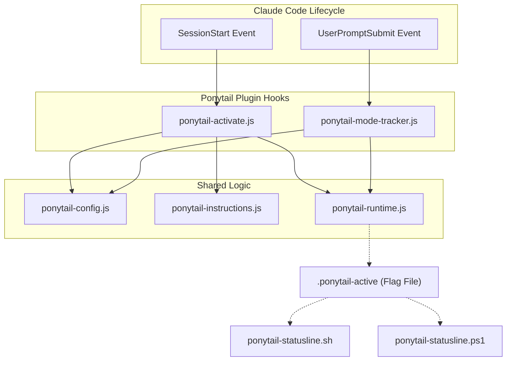
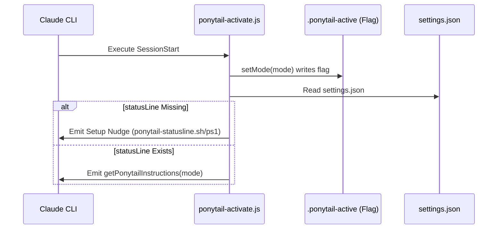

# Claude Code 플러그인

관련 소스 파일

다음 파일들은 이 위키 페이지를 생성하는 데 문맥 자료로 사용되었습니다:

- [.agents/plugins/marketplace.json](.agents/plugins/marketplace.json)
- [.claude-plugin/plugin.json](.claude-plugin/plugin.json)
- [.codex-plugin/plugin.json](.codex-plugin/plugin.json)
- [gemini-extension.json](gemini-extension.json)
- [hooks/ponytail-activate.js](hooks/ponytail-activate.js)
- [hooks/ponytail-config.js](hooks/ponytail-config.js)
- [hooks/ponytail-mode-tracker.js](hooks/ponytail-mode-tracker.js)
- [hooks/ponytail-statusline.ps1](hooks/ponytail-statusline.ps1)
- [hooks/ponytail-statusline.sh](hooks/ponytail-statusline.sh)
- [tests/hooks.test.js](tests/hooks.test.js)

Claude Code 플러그인 통합은 Ponytail이 Claude Code CLI 환경 안에서 일급 확장처럼 동작하도록 해줍니다. 라이프사이클 훅을 활용해 Ponytail 규칙셋을 주입하고, 턴 전반에 걸쳐 활성 모드를 추적하며, 상태라인 배지를 통해 시각적 피드백을 제공합니다.

이 플러그인은 가볍게 설계되어 있으며, 개발자 경험이 매끄럽게 유지되도록 엄격한 실행 제약을 따릅니다.

### 플러그인 아키텍처 개요

이 통합은 세션 이벤트를 가로채 사용자 자연어 프롬프트와 기반 Ponytail 규칙셋 사이의 간극을 메웁니다.

출처: [.claude-plugin/plugin.json:1-10](), [hooks/ponytail-activate.js:1-19](), [hooks/ponytail-mode-tracker.js:1-6]()

---

### 3.1 플러그인 매니페스트 및 라이프사이클 훅

플러그인의 동작은 `.claude-plugin/plugin.json`(및 Codex/marketplace 대응 파일들)에 정의됩니다. 이 매니페스트들은 Node.js 스크립트를 특정 라이프사이클 이벤트에 등록합니다:

*   **SessionStart**: `ponytail-activate.js`를 트리거합니다. 이 훅은 초기 상태 설정, 활성 모드 플래그 기록, 그리고 `getPonytailInstructions`를 통해 Ponytail 지침을 세션 컨텍스트에 주입하는 역할을 합니다. [hooks/ponytail-activate.js:42-42]()
*   **UserPromptSubmit**: `ponytail-mode-tracker.js`를 트리거합니다. 이 훅은 `/ponytail off`나 `/ponytail ultra` 같은 명령이 있는지 사용자 입력을 모니터링하고, `setMode`를 호출해 세션의 강도 수준을 동적으로 업데이트합니다. [hooks/ponytail-mode-tracker.js:35-35]()

이 플러그인은 더 넓은 에이전트 배포를 위한 `marketplace.json` 형식도 지원합니다. [.agents/plugins/marketplace.json:1-21]()

자세한 내용은 [플러그인 매니페스트 및 라이프사이클 훅](#3.1) (하위 페이지)을 참조하세요.

출처: [.claude-plugin/plugin.json:1-10](), [hooks/ponytail-activate.js:1-7](), [hooks/ponytail-mode-tracker.js:1-4]()

---

### 3.2 훅 내부: 런타임, 설정 및 지침

훅을 구동하는 로직은 세 가지 핵심 구성 요소로 모듈화되어 있습니다:

| 모듈 | 책임 |
| :--- | :--- |
| `ponytail-runtime.js` | 상태 파일(`.ponytail-active`)의 I/O를 관리하고 환경 탐지(`isCodex`, `isCopilot` 등)를 처리합니다. [hooks/ponytail-activate.js:13-19]() |
| `ponytail-config.js` | `PONYTAIL_DEFAULT_MODE` 또는 설정 파일을 기반으로 활성 모드(`lite`, `full`, `ultra` 등)를 해석합니다. [hooks/ponytail-config.js:4-10]() |
| `ponytail-instructions.js` | 활성 모드에 대응하는 특정 Markdown 규칙셋을 필터링해 반환합니다. [hooks/ponytail-activate.js:12-12]() |

이 모듈들은 "Natural Language Space"(사용자 명령)가 "Code Entity Space"(상태 파일과 필터링된 지침 문자열)로 올바르게 매핑되도록 보장합니다.

자세한 내용은 [훅 내부: 런타임, 설정 및 지침](#3.2) (하위 페이지)을 참조하세요.

출처: [hooks/ponytail-config.js:1-122](), [hooks/ponytail-activate.js:11-19](), [hooks/ponytail-activate.js:41-42]()

---

### 3.3 상태라인 통합

Ponytail이 활성 상태인지 즉시 피드백을 제공하기 위해, 이 플러그인은 커스텀 상태라인 배지를 지원합니다.

1.  **플래그 파일**: `ponytail-activate.js` 스크립트는 `setMode(mode)`를 호출해 `$CLAUDE_CONFIG_DIR/.ponytail-active`에 숨김 플래그 파일을 기록합니다(기본값은 `~/.claude/.ponytail-active`). [hooks/ponytail-activate.js:34-39]()
2.  **상태라인 스크립트**: 플랫폼별 스크립트(Unix용 `ponytail-statusline.sh`, Windows용 `ponytail-statusline.ps1`)는 이 플래그 파일을 읽고 ANSI 색상의 배지를 출력합니다. [hooks/ponytail-statusline.sh:1-13](), [hooks/ponytail-statusline.ps1:1-21]()
3.  **설정 안내**: `settings.json`에 `statusLine`이 설정되어 있지 않으면, `ponytail-activate.js`는 이를 감지하고 `isShellSafe`를 사용해 경로가 셸 삽입에 안전한지 확인한 뒤 에이전트 지침에 설정 안내를 덧붙입니다. [hooks/ponytail-activate.js:45-82]()

자세한 내용은 [상태라인 통합](#3.3) (하위 페이지)을 참조하세요.

출처: [hooks/ponytail-activate.js:33-82](), [hooks/ponytail-statusline.sh:3-4](), [hooks/ponytail-statusline.ps1:2-3](), [hooks/ponytail-config.js:50-52]()
