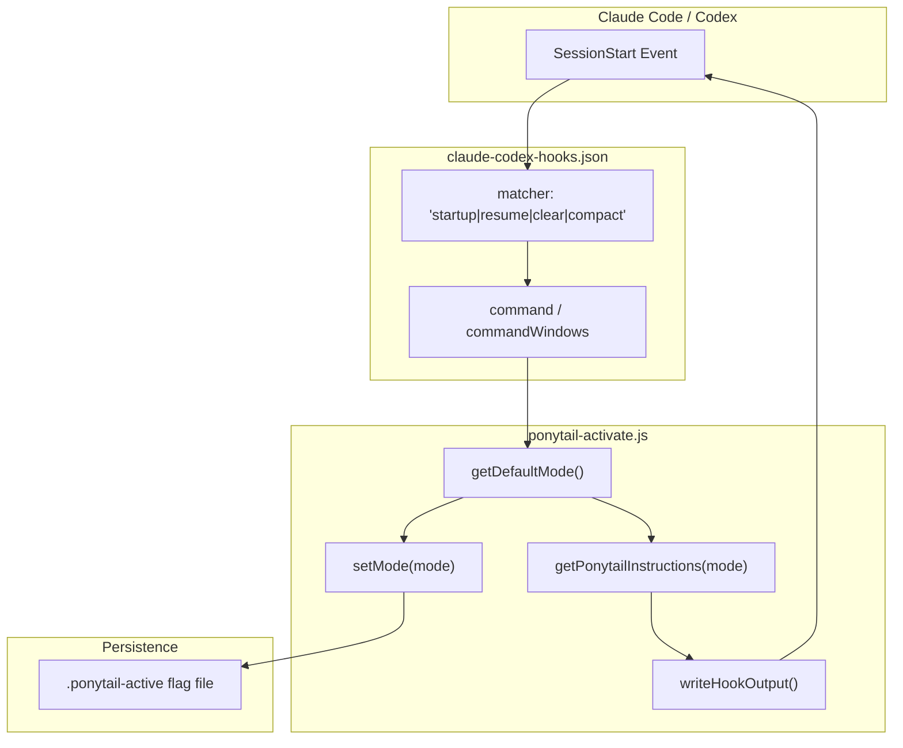
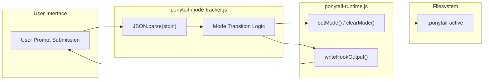

# 플러그인 매니페스트 및 라이프사이클 훅

관련 소스 파일

다음 파일들은 이 위키 페이지를 생성하는 데 문맥 자료로 사용되었습니다:

- [.claude-plugin/marketplace.json](.claude-plugin/marketplace.json)
- [.claude-plugin/plugin.json](.claude-plugin/plugin.json)
- [.codex-plugin/plugin.json](.codex-plugin/plugin.json)
- [gemini-extension.json](gemini-extension.json)
- [hooks/claude-codex-hooks.json](hooks/claude-codex-hooks.json)
- [tests/gemini-extension.test.js](tests/gemini-extension.test.js)
- [tests/hooks-windows.test.js](tests/hooks-windows.test.js)

이 페이지는 플러그인 매니페스트와 라이프사이클 훅을 통해 Ponytail을 Claude Code와 Codex에 통합하는 방식을 자세히 설명합니다. 플러그인이 어떻게 초기화되는지, 사용자 프롬프트 전반에서 모드 변화를 추적하는지, 그리고 호스트 에이전트에 피드백을 제공하는지 다룹니다.

## 플러그인 매니페스트

Claude Code 통합의 핵심은 `.claude-plugin/plugin.json`에 정의되어 있습니다. 이 파일은 플러그인의 정체성을 등록하고, Claude Code 환경 내 특정 라이프사이클 이벤트에 Node.js 스크립트를 연결합니다.

### 매니페스트 구조
매니페스트는 `SessionStart`와 `UserPromptSubmit`이라는 두 가지 주요 훅 지점을 정의합니다. 각 훅은 `command` 타입으로 설정되며, 엄격한 5초 타임아웃 내에서 Node.js 스크립트를 실행합니다.

| 속성 | 설명 | 값/제약 |
| :--- | :--- | :--- |
| `name` | 플러그인 식별자 | `ponytail` [ .claude-plugin/plugin.json:2-2 ]() |
| `version` | 고정된 시맨틱 버전 | `4.7.0` [ .claude-plugin/plugin.json:3-3 ]() |
| `hooks` | 훅 설정 경로 | `./hooks/claude-codex-hooks.json` [ .claude-plugin/plugin.json:9-9 ]() |

### 공유 훅 설정(`claude-codex-hooks.json`)
Claude Code와 Codex 환경에서 Ponytail은 공유 `hooks/claude-codex-hooks.json` 파일을 사용합니다. 이 매니페스트에는 크로스 플랫폼 명령 경로와 특정 세션 매처(예: `startup`, `resume`, `clear`, `compact`)가 포함되어 있어, 활성화 훅이 서로 다른 세션 상태 전반에서 안정적으로 실행되도록 보장합니다.

| 훅 이벤트 | 매처 | 스크립트 |
| :--- | :--- | :--- |
| `SessionStart` | `startup\|resume\|clear\|compact` | `ponytail-activate.js` [ hooks/claude-codex-hooks.json:3-15 ]() |
| `UserPromptSubmit` | N/A | `ponytail-mode-tracker.js` [ hooks/claude-codex-hooks.json:17-29 ]() |

**출처:**
- [ .claude-plugin/plugin.json:1-10 ]()
- [ hooks/claude-codex-hooks.json:1-31 ]()
- [ .codex-plugin/plugin.json:1-32 ]()

---

## SessionStart 훅 (`ponytail-activate.js`)

`ponytail-activate.js` 스크립트는 플러그인의 진입점입니다. 주요 책임은 새 세션이 시작될 때 Ponytail 환경을 부트스트랩하는 것입니다.

### 구현 세부 정보
1.  **플랫폼 호환성**: 훅 설정은 셸 로직을 사용해 `node` 가용성과 `CLAUDE_PLUGIN_ROOT`(Unix) 또는 `$env:CLAUDE_PLUGIN_ROOT`(Windows/PowerShell) 같은 환경 변수를 감지해 스크립트 위치를 찾습니다 [ hooks/claude-codex-hooks.json:9-10 ]().
2.  **모드 해석**: 초기 강도 수준(lite, full, ultra, off)을 결정합니다.
3.  **상태 초기화**: 활성 상태라면 플래그 파일을 통해 전역 상태를 갱신합니다.
4.  **지침 주입**: 관련 규칙셋을 가져와 숨은 컨텍스트로 호스트 에이전트에 출력합니다.
5.  **상태라인 안내**: `~/.claude/settings.json`에 `statusLine` 설정이 있는지 확인합니다. 없으면 상태라인 배지를 구성하도록 사용자를 돕기 위해 에이전트에 안내를 띄웁니다.

### 다이어그램: 세션 활성화 흐름
이 다이어그램은 자연어의 "Session Start" 이벤트가 플러그인을 부트스트랩하는 데 관여하는 구체적인 코드 엔터티로 어떻게 매핑되는지 보여줍니다.

**출처:**
- [ hooks/claude-codex-hooks.json:3-15 ]()
- [ tests/hooks-windows.test.js:33-41 ]()

---

## UserPromptSubmit 훅 (`ponytail-mode-tracker.js`)

`ponytail-mode-tracker.js` 스크립트는 사용자가 보내는 모든 메시지의 관찰자 역할을 합니다. LLM이 프롬프트를 처리하기 전에 입력을 가로채 모드 전환 명령을 감지합니다.

### 로직 및 실행
*   **트리거 감지**: 트래커는 `/ponytail` 또는 강도 수준 같은 명령이 있는지 사용자 입력을 검사합니다.
*   **타임아웃 제약**: 다른 훅과 마찬가지로 5초 이내에 완료되어야 합니다 [ hooks/claude-codex-hooks.json:24-24 ]().
*   **플랫폼 처리**: Windows에서는 PowerShell을 통해 호출되며, 경로 해석 실패를 방지하기 위해 환경 변수에 `$env:` 구문이 필요합니다 [ tests/hooks-windows.test.js:2-6 ]().

### 다이어그램: 모드 추적 및 상태 업데이트
이 다이어그램은 사용자 입력이 트래커를 거쳐 영구 상태를 갱신하는 흐름을 보여줍니다.

**출처:**
- [ hooks/claude-codex-hooks.json:17-30 ]()
- [ tests/hooks-windows.test.js:33-41 ]()

---

## 다중 플랫폼 매니페스트

Ponytail은 핵심 로직을 재사용하면서도 서로 다른 에이전트 호스트를 지원하기 위해 여러 매니페스트를 유지합니다.

### Gemini 확장(`gemini-extension.json`)
Gemini 어댑터는 `AGENTS.md`를 컨텍스트로, `commands/*.toml`을 스킬 등록에 재사용하는 얇은 매니페스트입니다 [ tests/gemini-extension.test.js:2-7 ]().
*   **고정 버전**: 공급망 문제를 막기 위해 `.claude-plugin/plugin.json` 같은 다른 매니페스트와 버전이 일치해야 합니다 [ tests/gemini-extension.test.js:17-24 ]().
*   **컨텍스트 주입**: `contextFileName: "AGENTS.md"`를 사용해 매 세션마다 규칙이 로드되도록 합니다 [ gemini-extension.json:5-5 ]().

### Codex 플러그인(`.codex-plugin/plugin.json`)
Codex 매니페스트는 마켓플레이스 인터페이스용 메타데이터를 포함해 더 설명적입니다:
*   **기능**: `Instructions`와 `Lifecycle hooks`를 명시적으로 나열합니다 [ .codex-plugin/plugin.json:21-21 ]().
*   **스킬 경로**: 검색을 위해 `./skills/` 디렉터리를 가리킵니다 [ .codex-plugin/plugin.json:13-13 ]().
*   **훅 리디렉션**: Claude Code처럼 `hooks/claude-codex-hooks.json`을 가리킵니다 [ .codex-plugin/plugin.json:14-14 ]().

**출처:**
- [ gemini-extension.json:1-6 ]()
- [ .codex-plugin/plugin.json:1-32 ]()
- [ tests/gemini-extension.test.js:58-68 ]()

---

## 신뢰성 및 제약

### Windows 회귀 가드
Windows에서의 회귀(Issue #19)를 막기 위해, 훅 매니페스트의 모든 `commandWindows` 항목은 `cmd.exe`의 `%VAR%` 구문이 아니라 PowerShell `$env:VAR` 구문을 사용해야 합니다 [ tests/hooks-windows.test.js:33-41 ]().

### 버전 정렬
스모크 테스트는 `.claude-plugin/plugin.json`, `.codex-plugin/plugin.json`, `.github/plugin/plugin.json`, `gemini-extension.json` 전반의 버전이 계속 동기화되도록 보장합니다 [ tests/gemini-extension.test.js:58-68 ]().

**출처:**
- [ tests/hooks-windows.test.js:1-12 ]()
- [ tests/gemini-extension.test.js:19-24 ]()
