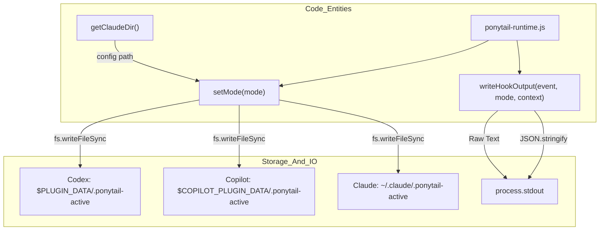
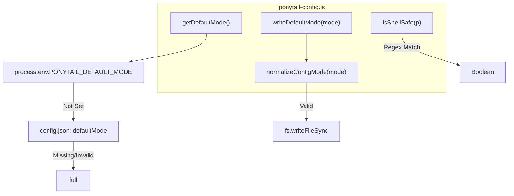
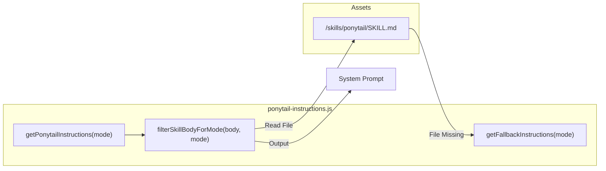

# 훅 내부: 런타임, 설정 및 지침

관련 소스 파일

다음 파일들은 이 위키 페이지를 생성하는 데 문맥 자료로 사용되었습니다:

- [.agents/plugins/marketplace.json](.agents/plugins/marketplace.json)
- [.github/plugin/marketplace.json](.github/plugin/marketplace.json)
- [hooks/copilot-hooks.json](hooks/copilot-hooks.json)
- [hooks/ponytail-config.js](hooks/ponytail-config.js)
- [hooks/ponytail-instructions.js](hooks/ponytail-instructions.js)
- [hooks/ponytail-mode-tracker.js](hooks/ponytail-mode-tracker.js)
- [hooks/ponytail-runtime.js](hooks/ponytail-runtime.js)
- [pi-extension/package.json](pi-extension/package.json)
- [pi-extension/test/helpers.test.js](pi-extension/test/helpers.test.js)
- [tests/copilot-plugin.test.js](tests/copilot-plugin.test.js)
- [tests/hooks.test.js](tests/hooks.test.js)

이 페이지는 Ponytail 훅 시스템을 구동하는 Node.js 모듈에 대한 심층 기술 설명을 제공합니다. 이 모듈들은 상태 영속성, 크로스 플랫폼 설정 해석, 그리고 활성 강도 수준에 따른 지침의 동적 필터링을 처리합니다.

## 런타임 상태 및 환경 감지

`ponytail-runtime.js` 모듈은 훅의 실행 계층 역할을 하며, Ponytail이 호스트 환경(Claude Code, Codex, Copilot)을 어떻게 감지하는지, 그리고 활성 세션 모드를 어떻게 영속화하는지를 관리합니다.

### 환경 감지
Ponytail은 특정 환경 변수를 확인해 표준 환경, Codex, Copilot을 구분합니다 [[hooks/ponytail-runtime.js:6-7]](). 이 감지는 상태 파일이 어디에 저장되는지와 출력이 어떻게 호스트로 다시 전달되는지를 결정합니다.

### 상태 영속성
활성 모드는 `.ponytail-active`라는 파일에 저장됩니다. 위치는 호스트에 따라 다릅니다:
*   **Codex**: `PLUGIN_DATA`로 지정된 디렉터리 안에 위치합니다 [[hooks/ponytail-runtime.js:10-10]]().
*   **Copilot**: `COPILOT_PLUGIN_DATA`로 지정된 디렉터리 안에 위치합니다 [[hooks/ponytail-runtime.js:11-11]]().
*   **Claude Code**: `getClaudeDir()`가 반환하는 디렉터리에 위치하며, 이는 `CLAUDE_CONFIG_DIR`을 존중하거나 기본값으로 `~/.claude`를 사용합니다 [[hooks/ponytail-config.js:71-74]]().

`setMode` 함수는 이 파일에 모드 문자열을 쓰기 전에 부모 디렉터리가 존재하는지 보장합니다 [[hooks/ponytail-runtime.js:15-18]]().

### 훅 출력 프로토콜
호스트 에이전트와의 통신은 `stdout`을 통해 이루어집니다. `writeHookOutput` 함수는 프로토콜 차이를 추상화합니다 [[hooks/ponytail-runtime.js:24-43]]():

| 호스트 | 출력 형식 | 메커니즘 |
| :--- | :--- | :--- |
| **Claude Code** | 일반 텍스트 | 원시 컨텍스트 문자열을 `stdout`에 직접 씁니다. |
| **Codex** | JSON | `systemMessage`와 `hookSpecificOutput`을 포함한 JSON 객체를 씁니다. |
| **Copilot** | JSON | `SessionStart`에서 `additionalContext`를 쓰고, 다른 이벤트는 무시합니다. |

### 데이터 흐름: 런타임 상태 관리

출처: [[hooks/ponytail-runtime.js:1-51]](), [[hooks/ponytail-config.js:71-74]]()

## 설정 해석 계층

`ponytail-config.js` 모듈은 기본 모드의 해석을 관리하고, 사용자 설정을 위한 크로스 플랫폼 경로 처리도 담당합니다.

### 모드 정의
시스템은 모드를 두 집합으로 분류합니다:
*   `VALID_MODES`: 모든 기능 모드와 `review`를 포함합니다 [[hooks/ponytail-config.js:17-17]]().
*   `RUNTIME_MODES`: 강도 수준만 포함합니다(`off`, `lite`, `full`, `ultra`) [[hooks/ponytail-config.js:18-18]]().

### 해석 순서
`defaultMode`를 결정할 때 `getDefaultMode()` 함수는 엄격한 계층을 따릅니다 [[hooks/ponytail-config.js:76-96]]():
1.  **환경 변수**: `PONYTAIL_DEFAULT_MODE`.
2.  **설정 파일**: 플랫폼별 `config.json`의 `defaultMode` 필드.
3.  **하드코딩된 대체값**: 기본값은 `full`입니다 [[hooks/ponytail-config.js:16-16]]().

### 크로스 플랫폼 설정 경로
Ponytail은 `getConfigDir()`을 통해 사용자 설정 저장에 대한 플랫폼 표준을 따릅니다 [[hooks/ponytail-config.js:54-65]]():

| 플랫폼 | 경로 |
| :--- | :--- |
| **XDG Override** | `$XDG_CONFIG_HOME/ponytail/` |
| **Windows** | `%APPDATA%\ponytail\` |
| **Linux / macOS** | `~/.config/ponytail/` |

### 보안: 셸 안전성
`isShellSafe` 함수는 상태라인 스크립트에 경로를 삽입할 때 셸 인젝션을 막기 위해 허용 목록 정규식을 사용합니다 [[hooks/ponytail-config.js:50-52]](). 이는 악의적인 경로 패턴에 대한 포괄적인 테스트로 검증됩니다 [[tests/hooks.test.js:14-19]]().

### 설정 로직 흐름

출처: [[hooks/ponytail-config.js:1-122]](), [[tests/hooks.test.js:14-19]]()

## 지침 필터링 및 주입

`ponytail-instructions.js` 모듈은 에이전트에 전달되는 시스템 프롬프트 지침을 구성하는 책임을 맡습니다. 활성 모드에 따라 핵심 `SKILL.md` 내용을 동적으로 조정합니다.

### 동적 필터링
`filterSkillBodyForMode` 함수는 핵심 스킬의 Markdown 내용을 파싱합니다. 정규식을 사용해 강도 수준 표의 행과 모드 이름(`lite`, `full`, `ultra`)으로 표시된 예시를 식별합니다 [[hooks/ponytail-instructions.js:21-35]](). 현재 `effectiveMode`와 일치하지 않는 행은 제거됩니다. 콜론을 포함하지만 모드 전용은 아닌 규칙(예: "No unrequested abstractions:")은 원문 그대로 보존됩니다 [[pi-extension/test/helpers.test.js:70-75]]().

### 지침 조회
주요 진입점은 `getPonytailInstructions(mode)`입니다 [[hooks/ponytail-instructions.js:71-86]]():
1.  **정규화**: `normalizePersistedMode`를 사용해 모드를 해석합니다.
2.  **독립 모드**: 모드가 `review`이면, 리뷰 스킬로 가는 짧은 포인터를 반환합니다 [[hooks/ponytail-instructions.js:74-76]]().
3.  **스킬 로드**: `skills/ponytail/SKILL.md` 읽기를 시도합니다 [[hooks/ponytail-instructions.js:80-82]]().
4.  **대체 경로**: 스킬 파일이 없으면 `getFallbackInstructions()`를 호출해 "Lazy Senior Dev" 페르소나와 "The Ladder"의 하드코딩 버전을 제공합니다 [[hooks/ponytail-instructions.js:39-69]]().

### 지침 조립 파이프라인

출처: [[hooks/ponytail-instructions.js:1-92]](), [[pi-extension/test/helpers.test.js:57-85]]()
