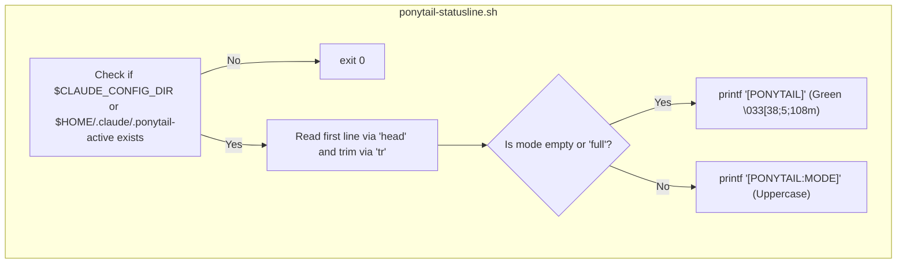
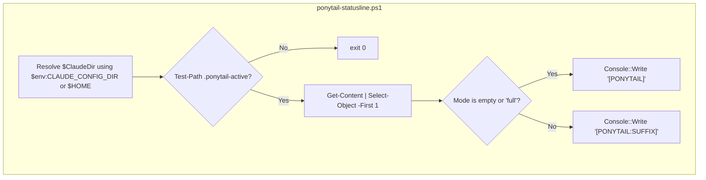

# 상태라인 통합

<details>
<summary>관련 소스 파일</summary>

다음 파일들은 이 위키 페이지를 생성하는 데 문맥 자료로 사용되었습니다:

- [.agents/plugins/marketplace.json](.agents/plugins/marketplace.json)
- [hooks/ponytail-activate.js](hooks/ponytail-activate.js)
- [hooks/ponytail-config.js](hooks/ponytail-config.js)
- [hooks/ponytail-mode-tracker.js](hooks/ponytail-mode-tracker.js)
- [hooks/ponytail-statusline.ps1](hooks/ponytail-statusline.ps1)
- [hooks/ponytail-statusline.sh](hooks/ponytail-statusline.sh)
- [tests/hooks.test.js](tests/hooks.test.js)

</details>


상태라인 통합은 터미널 안에서 실시간 시각 피드백을 제공해 Ponytail이 활성화되어 있는지, 그리고 현재 어떤 강도 모드가 적용 중인지 보여줍니다. 이는 파일 시스템 플래그, 플랫폼별 셸 스크립트, 그리고 Claude Code 라이프사이클 내부의 설정 안내 메커니즘으로 분리된 아키텍처를 통해 구현됩니다.

## 아키텍처 개요

이 통합은 Node.js 플러그인 런타임과 셸 환경 사이의 상태 통신을 위해 "플래그 파일" 패턴에 의존합니다. Claude Code의 상태라인은 별도의 셸 명령으로 실행되기 때문에 플러그인의 메모리 공간에 직접 접근할 수 없습니다.

### 데이터 흐름: 활성화에서 표시까지

1.  **활성화**: Claude 세션이 시작되면 `ponytail-activate.js`가 `getDefaultMode()`를 통해 활성 모드를 결정합니다 [hooks/ponytail-activate.js:24]().
2.  **영속화**: `ponytail-runtime.js`의 `setMode` 함수가 모드 문자열을 `.ponytail-active`라는 숨김 파일에 씁니다 [hooks/ponytail-activate.js:34-36]().
3.  **실행**: Claude 터미널 UI는 `~/.claude/settings.json`의 `statusLine` 설정에 정의된 명령을 주기적으로 실행합니다.
4.  **감지**: 스크립트(`ponytail-statusline.sh` 또는 `ponytail-statusline.ps1`)가 플래그 파일 존재 여부를 확인합니다 [hooks/ponytail-statusline.sh:4]()[hooks/ponytail-statusline.ps1:4-6]().
5.  **렌더링**: 파일이 있으면 스크립트가 모드를 읽어 색이 입혀진 ANSI 배지(예: `[PONYTAIL:ULTRA]`)를 출력합니다 [hooks/ponytail-statusline.sh:11]()[hooks/ponytail-statusline.ps1:20]().

### 구성 요소 맵

| 구성 요소 | 코드 엔터티 | 역할 |
| :--- | :--- | :--- |
| **플래그 파일** | `.ponytail-active` | 현재 세션 모드의 기준 소스이며, Claude 설정 디렉터리에 위치합니다 [hooks/ponytail-activate.js:5](). |
| **활성화기** | `ponytail-activate.js` | `SessionStart` 동안 플래그의 생성과 초기 상태를 관리합니다 [hooks/ponytail-activate.js:1-7](). |
| **모드 트래커** | `ponytail-mode-tracker.js` | 사용자가 `/ponytail` 명령으로 모드를 바꿀 때 플래그 파일을 갱신합니다 [hooks/ponytail-mode-tracker.js:34-45](). |
| **Unix 스크립트** | `ponytail-statusline.sh` | macOS/Linux 상태라인 렌더링용 Bash 스크립트입니다 [hooks/ponytail-statusline.sh:1](). |
| **Windows 스크립트** | `ponytail-statusline.ps1` | Windows 상태라인 렌더링용 PowerShell 스크립트입니다 [hooks/ponytail-statusline.ps1:1](). |
| **안내 로직** | `ponytail-activate.js` | 설정 누락을 감지하고 사용자에게 안내합니다 [hooks/ponytail-activate.js:44-45](). |

**출처:**
- [hooks/ponytail-activate.js:1-36]()
- [hooks/ponytail-mode-tracker.js:34-45]()
- [hooks/ponytail-statusline.sh:1-12]()
- [hooks/ponytail-statusline.ps1:1-21]()

## 플래그 파일 메커니즘

플래그 파일은 AI 에이전트의 내부 상태와 사용자의 터미널 인터페이스를 잇는 다리입니다.

### 상태 전이

`.ponytail-active` 파일의 수명 주기는 `ponytail-activate.js`와 `ponytail-runtime.js`가 관리합니다.

- **생성**: `SessionStart`에서 모드가 `off`가 아니면 `setMode(mode)`가 호출됩니다 [hooks/ponytail-activate.js:34-36]().
- **내용**: 파일에는 모드를 나타내는 단일 문자열(예: `lite`, `full`, `ultra`)이 들어 있습니다.
- **경로 해석**: 위치는 `getClaudeDir()`가 결정하며, 이 함수는 `CLAUDE_CONFIG_DIR` 환경 변수를 존중합니다 [hooks/ponytail-config.js:71-74]().
- **정리**: 모드가 `off`이면 `clearMode()`가 호출되어 플래그 파일을 제거합니다 [hooks/ponytail-activate.js:27-28]()[hooks/ponytail-mode-tracker.js:42-44]().

### 시각적 피드백 로직
상태라인 스크립트는 플래그 파일 내용에 따라 특정 형식을 적용합니다:
- **기본/Full**: 모드가 `full`이거나 비어 있으면 배지를 `[PONYTAIL]`로 단순화합니다 [hooks/ponytail-statusline.sh:8-9]()[hooks/ponytail-statusline.ps1:16-17]().
- **특정 모드**: 다른 모드의 경우 배지에 접미사를 붙입니다(예: `[PONYTAIL:LITE]`) [hooks/ponytail-statusline.sh:11]()[hooks/ponytail-statusline.ps1:20]().
- **색상**: 두 스크립트 모두 ANSI 이스케이프 코드 `38;5;108m`(무채도 녹색 계열)을 사용해 배지를 스타일링합니다 [hooks/ponytail-statusline.sh:9]()[hooks/ponytail-statusline.ps1:17]().

**출처:**
- [hooks/ponytail-activate.js:24-39]()
- [hooks/ponytail-config.js:71-74]()
- [hooks/ponytail-statusline.sh:5-12]()
- [hooks/ponytail-statusline.ps1:14-21]()

## 상태라인 스크립트

### Unix(Bash) 구현
Bash 스크립트는 표준 유틸리티(`head`, `tr`)를 사용해 모드 문자열을 읽고 정리합니다. 플래그 조회 시 `CLAUDE_CONFIG_DIR`을 존중합니다 [hooks/ponytail-statusline.sh:3]().


**출처:**
- [hooks/ponytail-statusline.sh:1-13]()

### Windows(PowerShell) 구현
PowerShell 스크립트는 `Get-Content`와 `.ToUpperInvariant()`를 사용해 동일한 로직을 수행합니다.


**출처:**
- [hooks/ponytail-statusline.ps1:1-21]()

## 설정 안내 메커니즘

Claude Code는 상태라인을 활성화하려면 `settings.json`에 수동 항목이 필요하므로, Ponytail은 사용자가 설정할 수 있도록 자동화된 "nudge"를 포함합니다.

### 설정 감지
`SessionStart` 동안 `ponytail-activate.js`는 사용자의 Claude 설정 파일을 검사합니다:
1.  `getClaudeDir()`를 통해 `settings.json` 위치를 찾습니다 [hooks/ponytail-activate.js:21-22]().
2.  JSON을 파싱하고(있다면 UTF-8 BOM을 제거한 뒤) `statusLine` 키가 있는지 확인합니다 [hooks/ponytail-activate.js:46-53]().

### 경로 안전성 및 안내 프롬프트
`statusLine`이 없으면 스크립트가 설정 지침을 생성합니다. 셸 인젝션 취약점을 막기 위해 `isShellSafe()`가 경고 문자열에 경로를 삽입하기 전에 플러그인 설치 경로의 안전성을 검증합니다 [hooks/ponytail-activate.js:60]()[hooks/ponytail-config.js:50-52]().

- **안전한 경로**: 스크립트는 플랫폼별 실행 명령을 포함한 바로 복사 가능한 JSON 조각을 제공합니다 [hooks/ponytail-activate.js:64-71]().
- **안전하지 않은 경로**: 경로에 메타문자(예: `;`, `&`, `$`)가 있으면, 보안상 사용자가 수동으로 경로를 설정하도록 안내합니다 [hooks/ponytail-activate.js:75-81]().

| 플랫폼 | 명령 구성 |
| :--- | :--- |
| **Windows** | `powershell -ExecutionPolicy Bypass -File "..."` [hooks/ponytail-activate.js:61-62]() |
| **Unix** | `bash "..."` [hooks/ponytail-activate.js:63]() |

**출처:**
- [hooks/ponytail-activate.js:44-82]()
- [hooks/ponytail-config.js:50-52]()
- [tests/hooks.test.js:11-20]()

## 설정 구성

통합을 수동으로 활성화하려면 Claude 설정 파일(`~/.claude/settings.json`)에 다음 구조가 있어야 합니다:

```json
{
  "statusLine": {
    "type": "command",
    "command": "bash \"/path/to/ponytail/hooks/ponytail-statusline.sh\""
  }
}
```

`ponytail-activate.js` 스크립트는 안내를 생성할 때 절대 경로 해석과 이스케이프를 자동으로 처리합니다 [hooks/ponytail-activate.js:64-65]().

**출처:**
- [hooks/ponytail-activate.js:64-65]()
