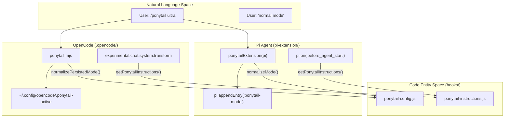

# Pi Agent 및 OpenCode 확장

관련 소스 파일

다음 파일들은 이 위키 페이지를 생성하는 데 문맥 자료로 사용되었습니다:

- [.opencode/plugins/ponytail.mjs](.opencode/plugins/ponytail.mjs)
- [opencode.json](opencode.json)
- [pi-extension/index.js](pi-extension/index.js)
- [pi-extension/test/extension.test.js](pi-extension/test/extension.test.js)
- [tests/opencode-plugin.test.js](tests/opencode-plugin.test.js)

이 섹션은 Ponytail을 **Pi Agent**와 **OpenCode** 환경에 통합하는 방식을 다룹니다. 두 통합 모두 `hooks/` 디렉터리의 공유 로직을 활용해 서로 다른 호스트 아키텍처 전반에서 일관된 "Lazy Senior Developer" 경험을 제공합니다. Pi 확장은 구조화된 이벤트 기반 API 안에서 동작하는 반면, OpenCode 플러그인은 훅 기반 변환 시스템을 사용해 규칙을 주입하고 상태를 관리합니다.

### 시스템 통합 개요

이 통합들은 호스트별 API를 공유 Ponytail 핵심과 연결합니다. 이들은 두 가지 핵심 책임을 처리합니다:
1.  **지침 주입**: Ponytail 규칙셋을 시스템 프롬프트에 덧붙입니다.
2.  **모드 영속성**: 채팅 턴 또는 세션 전반에서 에이전트가 `lite`, `full`, `ultra`, `off` 모드 중 어느 상태인지 추적합니다.

**크로스 플랫폼 통합 아키텍처**

출처: [pi-extension/index.js:56-157](), [.opencode/plugins/ponytail.mjs:43-79](), [hooks/ponytail-config.js:1-15](), [hooks/ponytail-instructions.js:1-20]()

---

### Pi Agent 확장

Pi Agent 확장(`pi-extension/`에 위치)은 Pi 에이전트 환경을 위한 네이티브 통합을 제공합니다. `pi.registerCommand`를 사용해 Ponytail 인터페이스를 노출하고, `pi.on`을 사용해 세션 라이프사이클에 훅을 겁니다.

*   **명령 등록**: `/ponytail`, `/ponytail-review`, `/ponytail-help`, `/ponytail-audit`, `/ponytail-debt`, `/ponytail-gain`을 등록합니다.
*   **세션 영속성**: `customType: "ponytail-mode"`와 함께 `pi.appendEntry`를 사용해 활성 모드를 대화 브랜치에 직접 저장합니다.
*   **라이프사이클 훅**:
    *   `session_start`: `resolveSessionMode`를 사용해 대화 기록에서 모드를 복원합니다.
    *   `before_agent_start`: 시스템 프롬프트 지침을 주입합니다.
    *   `input`: `isDeactivationCommand`를 통해 "normal mode" 같은 비활성화 문구를 감시합니다.

자세한 내용은 [Pi Extension API 및 명령 등록](#4.1)과 [Pi Extension 테스트](#4.2)를 참조하세요.
출처: [pi-extension/index.js:82-157](), [pi-extension/test/extension.test.js:57-113]()

---

### OpenCode 플러그인

OpenCode 플러그인(`.opencode/plugins/ponytail.mjs`에 위치)은 Ponytail을 OpenCode 개발 환경에 통합하는 ESM 기반 서버 플러그인입니다.

*   **지침 주입**: `experimental.chat.system.transform` 훅을 사용해 모든 채팅 턴의 시스템 프롬프트에 규칙셋을 덧붙입니다.
*   **상태 관리**: OpenCode에는 Pi처럼 기본 제공 세션 메타데이터 저장소가 없으므로, 플러그인은 활성 모드를 `~/.config/opencode/.ponytail-active`의 로컬 파일에 저장합니다.
*   **스킬 검색**: `config` 훅은 `skills/` 디렉터리를 등록해 OpenCode가 Ponytail 스킬을 찾아 실행할 수 있게 합니다.
*   **명령 가로채기**: `command.execute.before`를 사용해 `/ponytail <mode>` 호출을 포착하고, 다음 채팅 턴 전에 상태 파일을 갱신합니다.

자세한 내용은 [OpenCode 플러그인](#4.3)을 참조하세요.
출처: [.opencode/plugins/ponytail.mjs:51-78](), [opencode.json:1-4](), [tests/opencode-plugin.test.js:32-55]()

---

### Model Context Protocol(MCP) 서버

`ponytail-mcp/` 디렉터리에는 Model Context Protocol 서버가 들어 있습니다. 이를 통해 Claude Desktop이나 Kiro 같은 MCP 호환 호스트가 Ponytail 지침을 도구나 프롬프트로 접근할 수 있습니다.

*   **도구**: 요청된 모드의 구조화된 규칙셋을 반환하는 읽기 전용 도구 `ponytail_instructions`를 제공합니다.
*   **프롬프트**: 사용자가 세션을 Ponytail의 제약 안에 넣는 데 사용할 수 있는 `ponytail` 프롬프트를 제공합니다.
*   **공유 로직**: 모드 해석에 `ponytail-config.js`를 재사용해, MCP로 호스팅되는 에이전트도 네이티브 플러그인과 동일한 계층을 따르도록 보장합니다.

자세한 내용은 [MCP 서버(ponytail-mcp)](#4.4)를 참조하세요.
출처: [pi-extension/index.js:13-14]() (공유 훅 사용 패턴)

---

## 하위 페이지
*   [Pi Extension API 및 명령 등록](#4.1) — `ponytailExtension(pi)` 기본 export: `registerCommand` 호출, `parsePonytailCommand` 및 `resolveSessionMode` 헬퍼, 그리고 `before_agent_start` 프롬프트 주입을 설명합니다.
*   [Pi Extension 테스트](#4.2) — Pi 확장(`pi-extension/test/`)의 테스트 스위트와, 명령 위임 및 세션 복원을 어떻게 검증하는지 다룹니다.
*   [OpenCode 플러그인](#4.3) — OpenCode 플러그인 훅, `~/.config/opencode/.ponytail-active`에 저장되는 모드 상태, 그리고 `opencode-plugin.test.js` 스위트를 문서화합니다.
*   [MCP 서버(ponytail-mcp)](#4.4) — Model Context Protocol 서버, `ponytail_instructions` 도구, 그리고 MCP와 네이티브 어댑터 중 언제 무엇을 사용할지 설명합니다.
