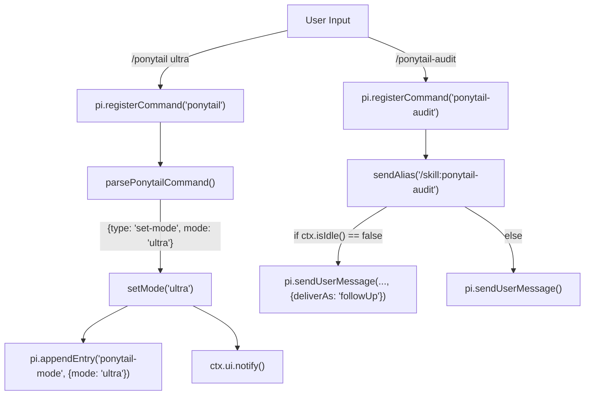
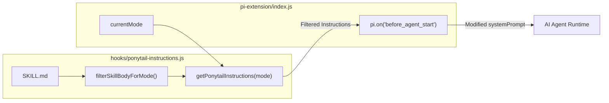

# Pi 확장 API 및 명령 등록

관련 소스 파일

다음 파일들은 이 위키 페이지를 생성하는 데 문맥 자료로 사용되었습니다:

- [hooks/ponytail-instructions.js](hooks/ponytail-instructions.js)
- [pi-extension/index.js](pi-extension/index.js)
- [pi-extension/package.json](pi-extension/package.json)
- [pi-extension/test/extension.test.js](pi-extension/test/extension.test.js)
- [pi-extension/test/helpers.test.js](pi-extension/test/helpers.test.js)

이 페이지는 Ponytail용 Pi 에이전트 확장의 구현을 자세히 설명합니다. 이 확장은 슬래시 명령을 등록하고, 세션별 상태를 관리하며, 시스템 프롬프트 주입을 수행해 Pi 환경 안에서 Ponytail 철학을 강제하는 네이티브 통합 계층을 제공합니다.

## Pi 확장 개요

Pi 확장은 `pi-extension/index.js`에 정의되어 있으며, Pi 에이전트의 라이프사이클 이벤트와 공유 Ponytail 로직 사이의 다리 역할을 합니다. 이 확장은 Pi Extension API와 상호작용하는 기본 export 함수 `ponytailExtension(pi)`를 사용해 명령과 리스너를 등록합니다.

### 핵심 책임
- **명령 등록**: `/ponytail`, `/ponytail-review`, `/ponytail-help`, `/ponytail-audit`, `/ponytail-debt`, `/ponytail-gain`을 노출합니다 [pi-extension/index.js:82-136]().
- **세션 관리**: `resolveSessionMode`를 사용해 대화 전반의 활성 모드를 추적합니다 [pi-extension/index.js:18-31]().
- **지침 주입**: `before_agent_start` 이벤트 동안 에이전트의 시스템 프롬프트에 지침을 주입합니다 [pi-extension/index.js:153-156]().
- **자연어 비활성화**: "normal mode" 같은 비활성화 문구를 감지하기 위해 사용자 입력을 감시합니다 [pi-extension/index.js:138-145]().

**출처:**
- [pi-extension/index.js:56-157]()

---

## 명령 등록 및 파싱

이 확장은 `pi.registerCommand`를 사용해 명령을 등록합니다. `/ponytail`에 전달된 인자를 해석하는 로직은 `parsePonytailCommand`에 캡슐화되어 있습니다.

### `/ponytail` 명령
이 명령을 통해 사용자는 현재 세션 모드를 바꾸거나, 전역 기본 모드를 갱신하거나, 현재 상태를 확인할 수 있습니다.

| 인자 | 동작 | 구현 세부 정보 |
| :--- | :--- | :--- |
| *없음* | 모드 전환 | 현재가 `off`이면 `full`로 설정하고, 그렇지 않으면 `fallback`을 사용합니다 [pi-extension/index.js:37-39](). |
| `status` | 상태 보고 | `ctx.ui.notify`를 통해 현재 모드와 기본 모드를 표시합니다 [pi-extension/index.js:87-90](). |
| `default <mode>` | 설정 업데이트 | `writeDefaultMode`를 호출해 새 전역 기본값을 영속화합니다 [pi-extension/index.js:92-102](). |
| `<mode>` | 세션 변경 | `currentMode`를 갱신하고 `ponytail-mode` 항목을 추가합니다 [pi-extension/index.js:104-107](). |

### 유틸리티 스킬(별칭)
`/ponytail-review`, `/ponytail-audit`, `/ponytail-debt`, `/ponytail-gain`, `/ponytail-help` 명령은 별칭으로 등록됩니다. 이들은 `sendAlias`를 사용해 에이전트에게 `/skill:<name>` 메시지를 전달합니다 [pi-extension/index.js:69-80]().

### 헬퍼 함수

#### `parsePonytailCommand(text, defaultMode)`
입력 텍스트를 정규화하고 명령 객체(`type`과 `mode`)를 반환합니다. `normalizeMode`와 `normalizeConfigMode`를 통해 사용자 문자열을 검증된 모드로 매핑하는 로직을 처리합니다 [pi-extension/index.js:33-52]().

#### `resolveSessionMode(entries, fallbackMode)`
세션 기록(entries)을 최신 항목부터 오래된 항목 순으로 순회해 마지막으로 기록된 `ponytail-mode` 항목을 찾습니다. 이를 통해 세션이 재개될 때 에이전트가 사용자의 마지막 설정을 기억하게 됩니다 [pi-extension/index.js:18-31]().

### 명령 매핑 다이어그램

다음 다이어그램은 사용자가 입력한 자연어 명령이 내부 처리 로직으로 어떻게 연결되는지 보여줍니다.

**명령 로직 흐름**

**출처:**
- [pi-extension/index.js:18-52]()
- [pi-extension/index.js:60-136]()

---

## 시스템 프롬프트 주입

이 확장은 에이전트의 시작 시퀀스를 가로채 "Lazy Senior Dev" 페르소나를 강제합니다. `before_agent_start` 이벤트가 발생하면, 확장은 `currentMode`를 기반으로 관련 지침을 가져옵니다.

### 프롬프트 조립 로직
1.  **활성화 확인**: `currentMode`가 `off`이면, 훅은 아무 수정 없이 즉시 반환합니다 [pi-extension/index.js:154-154]().
2.  **지침 가져오기**: 공유 지침 모듈에서 `getPonytailInstructions(currentMode)`를 호출합니다 [pi-extension/index.js:155-155]().
3.  **시스템에 덧붙이기**: 기존 시스템 프롬프트에 Ponytail 전용 규칙셋을 이어 붙입니다 [pi-extension/index.js:155-155]().

### 지침 필터링
`getPonytailInstructions` 함수는 정식 `SKILL.md`를 읽고, 현재 강도 수준(`lite`, `full`, `ultra`)에 적용되지 않는 규칙과 예시를 제거하기 위해 `filterSkillBodyForMode`를 사용합니다 [hooks/ponytail-instructions.js:11-37]().

**프롬프트 주입 데이터 흐름**

**출처:**
- [pi-extension/index.js:153-156]()
- [hooks/ponytail-instructions.js:11-37]()
- [hooks/ponytail-instructions.js:71-86]()

---

## 라이프사이클 및 이벤트 리스너

이 확장은 Pi API가 제공하는 특정 이벤트 리스너를 통해 상태 전이를 관리합니다.

### 세션 시작
세션이 시작되면 확장은 구성을 초기화합니다. `getDefaultMode()`를 사용해 `configuredDefaultMode`를 해석한 뒤, `resolveSessionMode`를 통해 세션 기록을 스캔해 `currentMode`를 설정합니다 [pi-extension/index.js:147-151]().

### 입력 모니터링(비활성화)
확장은 자연어 비활성화를 허용하기 위해 `input` 이벤트를 감시합니다. 사용자가 `isDeactivationCommand`가 인식하는 명령(예: "normal mode")을 입력하면 확장은 자동으로 모드를 `off`로 설정합니다 [pi-extension/index.js:138-145](). 무한 루프를 피하기 위해 소스가 "extension"인 입력은 무시합니다 [pi-extension/index.js:139-139]().

**출처:**
- [pi-extension/index.js:138-151]()
- [pi-extension/test/extension.test.js:115-125]()
