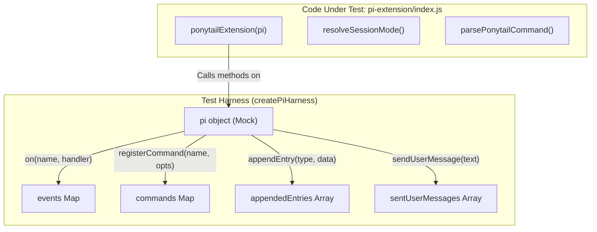
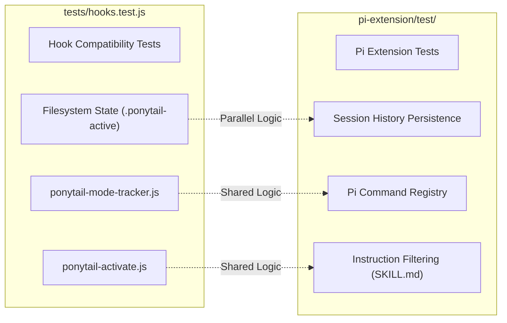

# Pi 확장 테스트

관련 소스 파일

다음 파일들은 이 위키 페이지를 생성하는 데 문맥 자료로 사용되었습니다:

- [hooks/ponytail-instructions.js](hooks/ponytail-instructions.js)
- [pi-extension/index.js](pi-extension/index.js)
- [pi-extension/package.json](pi-extension/package.json)
- [pi-extension/test/extension.test.js](pi-extension/test/extension.test.js)
- [pi-extension/test/helpers.test.js](pi-extension/test/helpers.test.js)

Pi 확장 테스트 스위트는 Pi 에이전트 환경 안에서 Ponytail이 견고하게 통합되도록 보장합니다. 이 스위트는 명령 등록, 세션 라이프사이클 관리, 세션 기록을 통한 상태 영속성, 그리고 활성 강도 수준에 따른 지침 필터링이 올바르게 동작하는지 검증합니다.

## 테스트 스위트 아키텍처

테스트 스위트는 `pi-extension/test/` 안의 두 개 주요 파일로 나뉩니다: `extension.test.js`는 Pi 환경을 모킹해 확장의 통합 로직을 테스트하고, `helpers.test.js`는 순수 유틸리티 함수와 상태 관리에 집중합니다.

### 데이터 흐름 및 모킹 전략

이 스위트는 Pi 확장 호스트를 시뮬레이션하는 하니스를 사용합니다. 이를 통해 이벤트 등록 여부와, 확장이 세션 관리자 및 UI와 올바르게 상호작용하는지 검증할 수 있습니다.

**Pi 하니스 구성 요소:**
| 구성 요소 | 설명 |
| :--- | :--- |
| `events` | 등록된 이벤트 핸들러(`session_start`, `before_agent_start` 등)를 저장하는 `Map`입니다. |
| `commands` | 등록된 슬래시 명령(`/ponytail` 등)을 저장하는 `Map`입니다. |
| `appendedEntries` | 세션 영속성을 위해 `pi.appendEntry`로 전달된 데이터를 캡처하는 배열입니다. |
| `sentUserMessages` | `pi.sendUserMessage`로 전송된 메시지를 캡처하는 배열입니다. |

**Pi 확장 테스트 하니스 구조**

출처: [pi-extension/test/extension.test.js:9-32](), [pi-extension/index.js:56-157]()

## 통합 테스트(`extension.test.js`)

이 파일은 Pi 에이전트 라이프사이클과 상호작용할 때 확장의 고수준 동작을 검증합니다.

### 명령 등록
테스트는 확장 초기화 시 Ponytail 명령 전체 세트가 등록되는지 검증합니다: `/ponytail`, `/ponytail-audit`, `/ponytail-debt`, `/ponytail-gain`, `/ponytail-help`, `/ponytail-review` [pi-extension/test/extension.test.js:57-61]().

### 세션 라이프사이클 및 영속성
Pi용 Ponytail은 `sessionManager`를 사용해 세션 재개 전반에서 활성 모드를 영속화합니다.
*   **모드 업데이트:** `/ponytail <mode>`가 호출되면, 확장은 `ponytail-mode` 타입의 커스텀 엔트리를 세션 기록에 추가합니다 [pi-extension/test/extension.test.js:63-74]().
*   **복원:** `session_start`(reason `resume`) 시, 확장은 엔트리를 가져와 `resolveSessionMode`를 사용해 마지막 활성 강도 수준을 복원합니다 [pi-extension/test/extension.test.js:80-94]().

### 스킬 위임
이 스위트는 `/ponytail-review` 같은 스킬 별칭 명령이 `/skill:<name>` 형식의 사용자 메시지를 보내 내부 Pi 스킬 시스템에 올바르게 위임되는지 검증합니다 [pi-extension/test/extension.test.js:96-113]().

### 지침 주입
`before_agent_start` 이벤트는 모드가 활성화되어 있을 때 적절한 시스템 지침(강도 수준 포함)이 에이전트의 프롬프트에 주입되는지 확인하도록 테스트됩니다 [pi-extension/test/extension.test.js:75-78]().

### 비활성화 로직
이 스위트는 특정 사용자 입력(예: "normal mode")이 Ponytail 비활성화를 트리거해, 이후의 에이전트 시작에서 지침이 주입되지 않도록 하는지 검증합니다 [pi-extension/test/extension.test.js:115-125](). 또한 "add a normal mode toggle"처럼 대화 맥락에서 언급된 "normal mode"는 실수로 비활성화를 트리거하지 않는다는 점도 확인합니다 [pi-extension/test/extension.test.js:127-137]().

출처: [pi-extension/test/extension.test.js:1-138](), [pi-extension/index.js:138-156]()

## 헬퍼 테스트(`helpers.test.js`)

이 파일은 Pi 확장이 내보내는 로직 중심 유틸리티 함수들을 대상으로 합니다.

### 명령 파싱
`parsePonytailCommand`는 여러 입력 시나리오에 대해 테스트됩니다:
*   **기본 호출:** 현재 기본값이 `off`이면 `full`로 기본 설정됩니다 [pi-extension/test/helpers.test.js:15-17]().
*   **서브명령:** `status`와 `set-default`(예: `default lite`)를 올바르게 식별합니다 [pi-extension/test/helpers.test.js:19-23]().

### 설정 관리
`readDefaultMode`와 `writeDefaultMode`에 대한 테스트는 `XDG_CONFIG_HOME` 로직을 사용해 전역 기본값이 파일 시스템에 올바르게 영속화되는지 보장합니다 [pi-extension/test/helpers.test.js:34-55]().

### 지침 필터링
`filterSkillBodyForMode`는 활성 모드와 관련된 내용만 남기도록 Ponytail 지침을 걸러내는 핵심 함수입니다. 테스트는 다음을 검증합니다:
*   다른 강도 수준과 일치하는 표의 행이 제거됩니다 [pi-extension/test/helpers.test.js:57-68]().
*   다른 모드로 태그된 예시 블록이 제거됩니다 [pi-extension/test/helpers.test.js:65-66]().
*   **회귀 가드:** 콜론이 포함된 규칙 불릿(예: "No unrequested abstractions:")은 모드 레이블로 잘못 해석되지 않고 보존됩니다 [pi-extension/test/helpers.test.js:70-85]().

출처: [pi-extension/test/helpers.test.js:1-86](), [hooks/ponytail-instructions.js:11-37]()

## 공유 훅 테스트와의 관계

Pi 확장 테스트가 Pi 전용 API와 세션 영속성에 초점을 맞추는 반면, 이는 `tests/hooks.test.js`의 전역 훅 테스트와도 연관됩니다.

**테스트 범위 비교**

`tests/hooks.test.js` 스위트(7.2절에 문서화됨)는 Claude Code와 Codex가 사용하는 Node.js 스크립트를 검증합니다. Pi 확장 테스트는 Pi Extension API의 고유한 제약(세션 로컬 상태를 순수하게 파일 시스템이 아니라 인메모리 세션 관리자와 `appendEntry` 호출에 의존함) 안에서 동일한 로직(모드 해석과 지침 필터링)이 동작하는지 보장함으로써 이를 보완합니다.

출처: [pi-extension/test/extension.test.js:1-138](), [pi-extension/index.js:1-157]()
